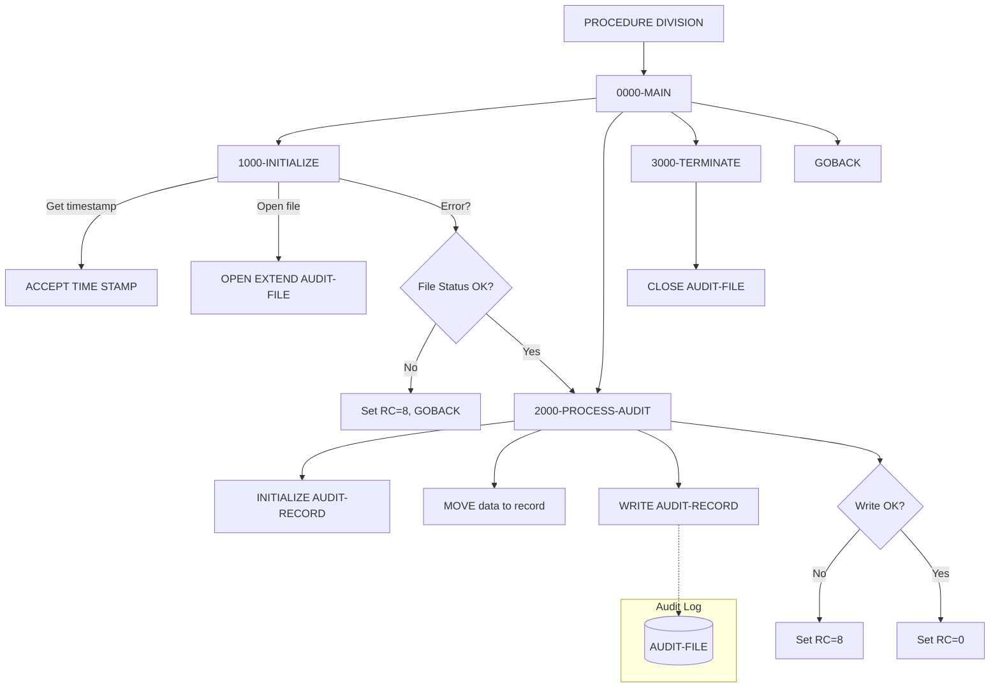

## Overview

AUDPROC is a common subroutine that provides centralized audit trail logging services for the application system. It accepts audit information from calling programs via a standardized linkage section interface and writes formatted audit records to a sequential audit log file.

The program is designed to be called by any program that needs to record auditable events, ensuring consistent audit trail formatting across the entire system. It captures comprehensive information including timestamps, system identification, user details, action types, before/after images of data changes, and descriptive messages.

By centralizing audit logging in a single subroutine, AUDPROC promotes code reuse, ensures audit consistency, and simplifies maintenance of audit trail functionality. The audit records it produces can be read by reporting programs like RPTAUD00 to generate compliance and security reports.

## Program Structure



## Data Structures

### Working Storage

| Level | Name | Picture | Description |
|-------|------|---------|-------------|
| 01 | WS-FILE-STATUS | X(2) | File status code for AUDIT-FILE operations |
| 01 | WS-FORMATTED-TIME | X(26) | Timestamp obtained from system via ACCEPT TIME STAMP |

### Linkage Section - LS-AUDIT-REQUEST

The input parameter structure passed by calling programs:

#### System Information (LS-SYSTEM-INFO)

| Level | Name | Picture | Description |
|-------|------|---------|-------------|
| 10 | LS-SYSTEM-ID | X(8) | System identifier (e.g., production, test) |
| 10 | LS-USER-ID | X(8) | User ID performing the action |
| 10 | LS-PROGRAM | X(8) | Name of calling program |
| 10 | LS-TERMINAL | X(8) | Terminal ID (for online transactions) |

#### Event Classification

| Level | Name | Picture | Description |
|-------|------|---------|-------------|
| 05 | LS-TYPE | X(4) | Event type code |
| 05 | LS-ACTION | X(8) | Action being performed |
| 05 | LS-STATUS | X(4) | Result status of the action |

#### Entity Identification (LS-KEY-INFO)

| Level | Name | Picture | Description |
|-------|------|---------|-------------|
| 10 | LS-PORT-ID | X(8) | Portfolio ID (if applicable) |
| 10 | LS-ACCT-NO | X(10) | Account number (if applicable) |

#### Audit Data

| Level | Name | Picture | Description |
|-------|------|---------|-------------|
| 05 | LS-BEFORE-IMAGE | X(100) | Data values before the change |
| 05 | LS-AFTER-IMAGE | X(100) | Data values after the change |
| 05 | LS-MESSAGE | X(100) | Descriptive message about the event |

#### Return Information

| Level | Name | Picture | Description |
|-------|------|---------|-------------|
| 05 | LS-RETURN-CODE | S9(4) COMP | Return code (0=success, 8=error) |

### File Section - AUDIT-RECORD (from AUDITLOG copybook)

The audit record structure written to the file:

| Level | Name | Picture | Description |
|-------|------|---------|-------------|
| 01 | AUDIT-RECORD | | Complete audit trail record |
| 05 | AUD-HEADER | | Header group containing identification |
| 10 | AUD-TIMESTAMP | X(26) | Event timestamp (from system) |
| 10 | AUD-SYSTEM-ID | X(8) | System identifier |
| 10 | AUD-USER-ID | X(8) | User who performed the action |
| 10 | AUD-PROGRAM | X(8) | Program name |
| 10 | AUD-TERMINAL | X(8) | Terminal identifier |
| 05 | AUD-TYPE | X(4) | Event type |
| 05 | AUD-ACTION | X(8) | Action performed |
| 05 | AUD-STATUS | X(4) | Result status |
| 05 | AUD-KEY-INFO | | Entity key information |
| 10 | AUD-PORTFOLIO-ID | X(8) | Portfolio ID |
| 10 | AUD-ACCOUNT-NO | X(10) | Account number |
| 05 | AUD-BEFORE-IMAGE | X(100) | Data before change |
| 05 | AUD-AFTER-IMAGE | X(100) | Data after change |
| 05 | AUD-MESSAGE | X(100) | Descriptive message |

**AUD-TYPE Values (88-level conditions):**
- `TRAN` - Transaction event (AUD-TRANSACTION)
- `USER` - User action (AUD-USER-ACTION)
- `SYST` - System event (AUD-SYSTEM-EVENT)

**AUD-ACTION Values (88-level conditions):**
- `CREATE` - Record created (AUD-CREATE)
- `UPDATE` - Record updated (AUD-UPDATE)
- `DELETE` - Record deleted (AUD-DELETE)
- `INQUIRE` - Record inquiry (AUD-INQUIRE)
- `LOGIN` - User login (AUD-LOGIN)
- `LOGOUT` - User logout (AUD-LOGOUT)
- `STARTUP` - System startup (AUD-STARTUP)
- `SHUTDOWN` - System shutdown (AUD-SHUTDOWN)

**AUD-STATUS Values (88-level conditions):**
- `SUCC` - Success (AUD-SUCCESS)
- `FAIL` - Failure (AUD-FAILURE)
- `WARN` - Warning (AUD-WARNING)

## File I/O

### AUDIT-FILE

| Property | Value |
|----------|-------|
| Logical Name | AUDIT-FILE |
| Physical Assignment | AUDFILE |
| Organization | Sequential |
| Recording Mode | Fixed (F) |
| Access Mode | Extend (append) |
| File Status | WS-FILE-STATUS |

The file is opened in EXTEND mode, meaning new audit records are appended to the end of the existing file. This preserves all previous audit entries and allows the audit trail to grow over time.

## Control Flow

### Main Processing (0000-MAIN)

The program executes three sequential paragraphs then returns to the caller:

1. **1000-INITIALIZE** - Set up for processing
2. **2000-PROCESS-AUDIT** - Write the audit record
3. **3000-TERMINATE** - Clean up resources
4. **GOBACK** - Return to calling program

### Initialization (1000-INITIALIZE)

1. **Get Timestamp**: Uses `ACCEPT WS-FORMATTED-TIME FROM TIME STAMP` to capture the current system timestamp in a 26-character format
2. **Open File**: Opens AUDIT-FILE in EXTEND mode to append records
3. **Error Check**: If the file fails to open:
   - Displays error message with file status code
   - Sets LS-RETURN-CODE to 8
   - Performs 3000-TERMINATE to close any open resources
   - Returns immediately to caller via GOBACK

### Process Audit (2000-PROCESS-AUDIT)

1. **Initialize Record**: Clears AUDIT-RECORD to spaces/zeros
2. **Populate Record**: Moves data from linkage section to audit record:
   - System timestamp from working storage
   - System info (maps to AUD-HEADER: system-id, user-id, program, terminal)
   - Event type, action, and status
   - Key information (portfolio ID, account number)
   - Before and after images
   - Descriptive message
3. **Write Record**: Writes AUDIT-RECORD to the file
4. **Set Return Code**: 
   - If write successful: LS-RETURN-CODE = 0
   - If write failed: LS-RETURN-CODE = 8, displays error message

### Terminate (3000-TERMINATE)

Closes the AUDIT-FILE to release system resources.

## Dependencies

### Copybooks
- AUDITLOG - Audit trail record structure definitions

### Called Programs
None - AUDPROC is a leaf subroutine that does not call other programs.

### Related Programs

**Programs that use the same AUDITLOG copybook:**
- RPTAUD00 - Audit report generator (reads audit records)
- PORTTRAN - Portfolio transaction processing (likely calls AUDPROC)

## Usage Example

Calling programs should prepare the LS-AUDIT-REQUEST structure and call AUDPROC:

```cobol
WORKING-STORAGE SECTION.
01  WS-AUDIT-REQUEST.
    05  WS-SYSTEM-INFO.
        10  WS-SYSTEM-ID    PIC X(8).
        10  WS-USER-ID      PIC X(8).
        10  WS-PROGRAM      PIC X(8).
        10  WS-TERMINAL     PIC X(8).
    05  WS-TYPE            PIC X(4).
    05  WS-ACTION          PIC X(8).
    05  WS-STATUS          PIC X(4).
    05  WS-KEY-INFO.
        10  WS-PORT-ID     PIC X(8).
        10  WS-ACCT-NO     PIC X(10).
    05  WS-BEFORE-IMAGE    PIC X(100).
    05  WS-AFTER-IMAGE     PIC X(100).
    05  WS-MESSAGE         PIC X(100).
    05  WS-RETURN-CODE     PIC S9(4) COMP.

PROCEDURE DIVISION.
    ...
    MOVE 'PRODSYS'  TO WS-SYSTEM-ID
    MOVE 'USER001'  TO WS-USER-ID
    MOVE 'PORTUPDT' TO WS-PROGRAM
    MOVE 'TERM01'   TO WS-TERMINAL
    MOVE 'TRAN'     TO WS-TYPE
    MOVE 'UPDATE'   TO WS-ACTION
    MOVE 'SUCC'     TO WS-STATUS
    MOVE 'PORT001'  TO WS-PORT-ID
    MOVE '1234567890' TO WS-ACCT-NO
    MOVE OLD-DATA   TO WS-BEFORE-IMAGE
    MOVE NEW-DATA   TO WS-AFTER-IMAGE
    MOVE 'Portfolio value updated' TO WS-MESSAGE
    
    CALL 'AUDPROC' USING WS-AUDIT-REQUEST
    
    IF WS-RETURN-CODE NOT = 0
        DISPLAY 'Audit logging failed'
    END-IF
    ...
```

## JCL Requirements

The calling program's JCL must include the AUDFILE DD statement:

```jcl
//AUDFILE  DD DSN=your.audit.file,DISP=MOD
```

Note: Use `DISP=MOD` to allow appending to the existing audit file, which matches the program's OPEN EXTEND behavior.

## Return Codes

| Code | Meaning |
|------|---------|
| 0 | Successful - audit record written |
| 8 | Error - file open or write failure |

## Technical Notes

### ACCEPT TIME STAMP

The program uses `ACCEPT WS-FORMATTED-TIME FROM TIME STAMP` to obtain a 26-character timestamp. This is an IBM COBOL extension that returns the current date and time in ISO format (YYYY-MM-DD-HH.MM.SS.ffffff).

### OPEN EXTEND

Opening the file in EXTEND mode positions the file pointer at the end, so all WRITE operations append records. This is essential for audit trail integrity—existing records are never overwritten.

### Record Layout Mapping

The linkage section structure (LS-AUDIT-REQUEST) is designed to map directly to portions of the AUDIT-RECORD structure, simplifying the data movement in 2000-PROCESS-AUDIT. The LS-SYSTEM-INFO group moves directly to AUD-HEADER (excluding the timestamp which is populated separately).
