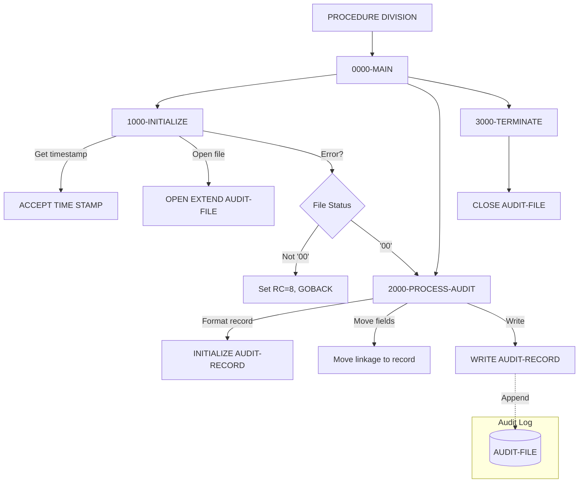

## Overview

AUDPROC is a reusable subroutine that provides centralized audit trail processing for the portfolio management system. The program accepts audit information through a linkage section parameter, formats it into a standard audit record structure, and writes it to a sequential audit log file.

This program serves as the core audit logging mechanism, called by other programs whenever an auditable event occurs—such as user logins, data modifications, system events, or transaction processing. By centralizing audit trail creation in a single subroutine, the system ensures consistent audit record formatting and simplifies maintenance.

Key capabilities include:
- **Timestamp Capture**: Automatically captures the current system timestamp for each audit record
- **Flexible Audit Types**: Supports transaction, user action, and system event audit types
- **Before/After Images**: Records data state before and after changes for change tracking
- **Return Code Feedback**: Returns success/failure status to calling programs

## Program Structure



## Data Structures

### Working Storage

| Level | Name | Picture | Description |
|-------|------|---------|-------------|
| 01 | WS-FILE-STATUS | X(2) | File status code for AUDIT-FILE |
| 01 | WS-FORMATTED-TIME | X(26) | System timestamp in formatted form |

### Linkage Section

The program receives audit information through a single parameter structure:

#### LS-AUDIT-REQUEST

| Level | Name | Picture | Description |
|-------|------|---------|-------------|
| 01 | LS-AUDIT-REQUEST | - | Main audit request structure |
| 05 | LS-SYSTEM-INFO | - | System identification group |
| 10 | LS-SYSTEM-ID | X(8) | System identifier |
| 10 | LS-USER-ID | X(8) | User who performed action |
| 10 | LS-PROGRAM | X(8) | Calling program name |
| 10 | LS-TERMINAL | X(8) | Terminal identifier |
| 05 | LS-TYPE | X(4) | Audit type code |
| 05 | LS-ACTION | X(8) | Action being audited |
| 05 | LS-STATUS | X(4) | Result status of action |
| 05 | LS-KEY-INFO | - | Key information group |
| 10 | LS-PORT-ID | X(8) | Portfolio identifier |
| 10 | LS-ACCT-NO | X(10) | Account number |
| 05 | LS-BEFORE-IMAGE | X(100) | Data before change |
| 05 | LS-AFTER-IMAGE | X(100) | Data after change |
| 05 | LS-MESSAGE | X(100) | Audit message text |
| 05 | LS-RETURN-CODE | S9(4) COMP | Return code (output) |

### File Section (from AUDITLOG copybook)

#### AUDIT-RECORD

| Level | Name | Picture | Description |
|-------|------|---------|-------------|
| 01 | AUDIT-RECORD | - | Complete audit trail record |
| 05 | AUD-HEADER | - | Audit record header |
| 10 | AUD-TIMESTAMP | X(26) | Event timestamp |
| 10 | AUD-SYSTEM-ID | X(8) | System identifier |
| 10 | AUD-USER-ID | X(8) | User identifier |
| 10 | AUD-PROGRAM | X(8) | Program name |
| 10 | AUD-TERMINAL | X(8) | Terminal ID |
| 05 | AUD-TYPE | X(4) | Audit type code |
| 05 | AUD-ACTION | X(8) | Action performed |
| 05 | AUD-STATUS | X(4) | Result status |
| 05 | AUD-KEY-INFO | - | Key information group |
| 10 | AUD-PORTFOLIO-ID | X(8) | Portfolio identifier |
| 10 | AUD-ACCOUNT-NO | X(10) | Account number |
| 05 | AUD-BEFORE-IMAGE | X(100) | Data before change |
| 05 | AUD-AFTER-IMAGE | X(100) | Data after change |
| 05 | AUD-MESSAGE | X(100) | Audit message |

**Audit Type Values:**

| Value | Description |
|-------|-------------|
| 'TRAN' | Transaction audit |
| 'USER' | User action audit |
| 'SYST' | System event audit |

**Audit Action Values:**

| Value | Description |
|-------|-------------|
| 'CREATE' | Record creation |
| 'UPDATE' | Record update |
| 'DELETE' | Record deletion |
| 'INQUIRE' | Record inquiry |
| 'LOGIN' | User login |
| 'LOGOUT' | User logout |
| 'STARTUP' | System startup |
| 'SHUTDOWN' | System shutdown |

**Audit Status Values:**

| Value | Description |
|-------|-------------|
| 'SUCC' | Success |
| 'FAIL' | Failure |
| 'WARN' | Warning |

## File I/O

### AUDIT-FILE

| Property | Value |
|----------|-------|
| Assign To | AUDFILE |
| Organization | Sequential |
| Recording Mode | Fixed (F) |
| Block Contains | 0 (system-determined) |
| Access Mode | Sequential |
| Open Mode | EXTEND (append) |
| File Status | WS-FILE-STATUS |

The audit file is opened in EXTEND mode, which positions the file pointer at the end and allows new records to be appended without overwriting existing audit trail data. This ensures that audit history is preserved across multiple program invocations.

### I/O Operations Summary

| Paragraph | Operation | Description |
|-----------|-----------|-------------|
| 1000-INITIALIZE | OPEN EXTEND | Opens file for appending |
| 2000-PROCESS-AUDIT | WRITE AUDIT-RECORD | Writes formatted audit record |
| 3000-TERMINATE | CLOSE | Closes the audit file |

## Control Flow

### 0000-MAIN

Entry point that orchestrates the three processing phases in sequence:
1. Initialize (open file, get timestamp)
2. Process (format and write audit record)
3. Terminate (close file)

Returns to the calling program via GOBACK after processing completes.

### 1000-INITIALIZE

1. **Capture Timestamp**: Uses `ACCEPT WS-FORMATTED-TIME FROM TIME STAMP` to get the current system timestamp in a 26-character format suitable for audit trail chronological ordering.

2. **Open Audit File**: Opens AUDIT-FILE in EXTEND mode to append new records.

3. **Error Handling**: If the file open fails (status ≠ '00'):
   - Displays an error message with the file status code
   - Sets the return code to 8 (error)
   - Performs terminate and exits immediately via GOBACK

### 2000-PROCESS-AUDIT

1. **Initialize Record**: Clears the AUDIT-RECORD structure using INITIALIZE.

2. **Format Record**: Maps linkage section fields to the audit record:
   - WS-FORMATTED-TIME → AUD-TIMESTAMP
   - LS-SYSTEM-INFO → AUD-HEADER
   - LS-TYPE → AUD-TYPE
   - LS-ACTION → AUD-ACTION
   - LS-STATUS → AUD-STATUS
   - LS-KEY-INFO → AUD-KEY-INFO
   - LS-BEFORE-IMAGE → AUD-BEFORE-IMAGE
   - LS-AFTER-IMAGE → AUD-AFTER-IMAGE
   - LS-MESSAGE → AUD-MESSAGE

3. **Write Record**: Writes the formatted AUDIT-RECORD to the file.

4. **Set Return Code**: 
   - Sets LS-RETURN-CODE to 0 on success
   - Sets LS-RETURN-CODE to 8 if write fails

### 3000-TERMINATE

Closes the AUDIT-FILE. This paragraph is performed both in normal processing flow and when early termination is required due to errors.

## Dependencies

### Copybooks

- [AUDITLOG](/docs/copybooks/AUDITLOG) - Defines the AUDIT-RECORD structure with all audit trail fields and 88-level condition names

### Called Programs

This program does not call any external programs.

### Calling Programs

AUDPROC is designed to be called as a subroutine by any program requiring audit trail logging:

```cobol
CALL 'AUDPROC' USING LS-AUDIT-REQUEST
```

### Related Programs

Programs that share the AUDITLOG copybook:
- [RPTAUD00](/docs/programs/RPTAUD00) - Audit report generator (reads audit records)
- [PORTTRAN](/docs/programs/PORTTRAN) - Portfolio transaction processing (creates audit records)

## Return Codes

| Code | Description |
|------|-------------|
| 0 | Success - audit record written |
| 8 | Error - file open or write failure |

## Usage Example

```cobol
       WORKING-STORAGE SECTION.
       01  WS-AUDIT-REQUEST.
           05  WS-SYSTEM-INFO.
               10  WS-SYSTEM-ID    PIC X(8)  VALUE 'PRODSYS'.
               10  WS-USER-ID      PIC X(8).
               10  WS-PROGRAM      PIC X(8)  VALUE 'MYPROGRAM'.
               10  WS-TERMINAL     PIC X(8).
           05  WS-TYPE            PIC X(4).
           05  WS-ACTION          PIC X(8).
           05  WS-STATUS          PIC X(4).
           05  WS-KEY-INFO.
               10  WS-PORT-ID     PIC X(8).
               10  WS-ACCT-NO     PIC X(10).
           05  WS-BEFORE-IMAGE    PIC X(100).
           05  WS-AFTER-IMAGE     PIC X(100).
           05  WS-MESSAGE         PIC X(100).
           05  WS-RETURN-CODE     PIC S9(4) COMP.
       
       PROCEDURE DIVISION.
           * Log a successful update action
           MOVE 'JOHN    '       TO WS-USER-ID
           MOVE 'TERM001 '       TO WS-TERMINAL
           MOVE 'TRAN'           TO WS-TYPE
           MOVE 'UPDATE  '       TO WS-ACTION
           MOVE 'SUCC'           TO WS-STATUS
           MOVE 'PORT001 '       TO WS-PORT-ID
           MOVE '1234567890'     TO WS-ACCT-NO
           MOVE OLD-RECORD       TO WS-BEFORE-IMAGE
           MOVE NEW-RECORD       TO WS-AFTER-IMAGE
           MOVE 'Portfolio balance updated' TO WS-MESSAGE
           
           CALL 'AUDPROC' USING WS-AUDIT-REQUEST
           
           IF WS-RETURN-CODE NOT = 0
               DISPLAY 'Audit logging failed'
           END-IF.
```

## Technical Notes

### ACCEPT FROM TIME STAMP

The `ACCEPT FROM TIME STAMP` statement retrieves the current system date and time in a 26-character format (typically `YYYY-MM-DD-HH.MM.SS.NNNNNN`). This provides microsecond precision for audit trail ordering and forensic analysis.

### OPEN EXTEND Mode

Opening a sequential file in EXTEND mode positions the file at the end for writing, preserving all existing records. This is essential for audit trail integrity, ensuring that:
- New audit records are always appended
- Historical audit data is never overwritten
- Multiple program invocations can write to the same audit file
