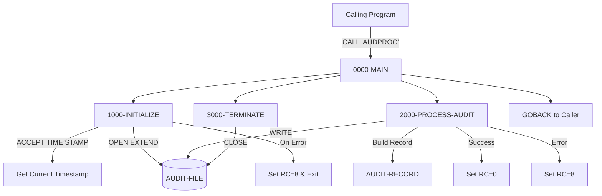
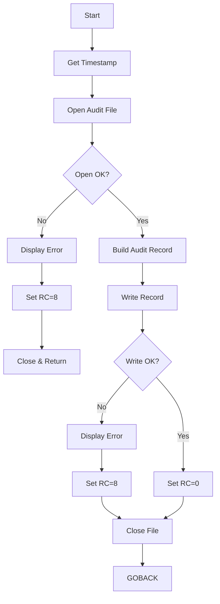

## Overview

AUDPROC is a reusable subroutine that provides centralized audit trail logging services for the application. It accepts audit information from calling programs via a linkage section parameter and writes formatted audit records to a sequential audit log file.

The program serves as the standard mechanism for recording system activity, including user actions, transaction events, and system operations. By centralizing audit logging in this subroutine, the application ensures consistent audit record formatting, timestamp generation, and file handling across all programs that need to log auditable events.

AUDPROC is designed to be called from both batch and online programs, providing a unified approach to audit trail management that supports compliance requirements and operational monitoring.

## Program Structure



## Data Structures

### Working Storage

| Level | Name | Picture | Description |
|-------|------|---------|-------------|
| 01 | WS-FILE-STATUS | X(2) | File status for audit file operations |
| 01 | WS-FORMATTED-TIME | X(26) | Timestamp obtained from system |

### Linkage Section - Input/Output Parameter

The calling program passes a single structure containing all audit information:

#### LS-AUDIT-REQUEST

| Level | Name | Picture | Description |
|-------|------|---------|-------------|
| 01 | LS-AUDIT-REQUEST | - | Complete audit request structure |
| 05 | LS-SYSTEM-INFO | - | System context information |
| 10 | LS-SYSTEM-ID | X(8) | System identifier |
| 10 | LS-USER-ID | X(8) | User performing the action |
| 10 | LS-PROGRAM | X(8) | Calling program name |
| 10 | LS-TERMINAL | X(8) | Terminal ID (for online) |
| 05 | LS-TYPE | X(4) | Audit event type |
| 05 | LS-ACTION | X(8) | Action being performed |
| 05 | LS-STATUS | X(4) | Result status |
| 05 | LS-KEY-INFO | - | Business key information |
| 10 | LS-PORT-ID | X(8) | Portfolio identifier |
| 10 | LS-ACCT-NO | X(10) | Account number |
| 05 | LS-BEFORE-IMAGE | X(100) | Data value before change |
| 05 | LS-AFTER-IMAGE | X(100) | Data value after change |
| 05 | LS-MESSAGE | X(100) | Descriptive audit message |
| 05 | LS-RETURN-CODE | S9(4) COMP | Return code (output) |

**Valid Type Values:**
- `TRAN` - Transaction event
- `USER` - User action
- `SYST` - System event

**Valid Action Values:**
- `CREATE` - Record creation
- `UPDATE` - Record modification
- `DELETE` - Record deletion
- `INQUIRE` - Record inquiry
- `LOGIN` - User login
- `LOGOUT` - User logout
- `STARTUP` - System startup
- `SHUTDOWN` - System shutdown

**Valid Status Values:**
- `SUCC` - Successful completion
- `FAIL` - Failed operation
- `WARN` - Warning condition

### File Section - Audit Record

The audit record structure is defined by the AUDITLOG copybook:

| Level | Name | Picture | Description |
|-------|------|---------|-------------|
| 01 | AUDIT-RECORD | - | Complete audit file record |
| 05 | AUD-HEADER | - | Header section |
| 10 | AUD-TIMESTAMP | X(26) | Event timestamp |
| 10 | AUD-SYSTEM-ID | X(8) | System identifier |
| 10 | AUD-USER-ID | X(8) | User identifier |
| 10 | AUD-PROGRAM | X(8) | Program name |
| 10 | AUD-TERMINAL | X(8) | Terminal identifier |
| 05 | AUD-TYPE | X(4) | Event type code |
| 05 | AUD-ACTION | X(8) | Action code |
| 05 | AUD-STATUS | X(4) | Status code |
| 05 | AUD-KEY-INFO | - | Business key group |
| 10 | AUD-PORTFOLIO-ID | X(8) | Portfolio ID |
| 10 | AUD-ACCOUNT-NO | X(10) | Account number |
| 05 | AUD-BEFORE-IMAGE | X(100) | Before image data |
| 05 | AUD-AFTER-IMAGE | X(100) | After image data |
| 05 | AUD-MESSAGE | X(100) | Audit message text |

## File I/O

### AUDIT-FILE

| Attribute | Value |
|-----------|-------|
| Logical Name | AUDIT-FILE |
| DD Name | AUDFILE |
| Organization | Sequential |
| Access Mode | Sequential |
| Open Mode | Extend |
| Recording Mode | Fixed (F) |
| File Status | WS-FILE-STATUS |

The file is opened in **EXTEND** mode, which appends new records to the end of the existing file. This ensures that audit records accumulate over time without overwriting previous entries.

### File Operations

| Operation | Paragraph | Description |
|-----------|-----------|-------------|
| OPEN EXTEND | 1000-INITIALIZE | Opens file for appending |
| WRITE | 2000-PROCESS-AUDIT | Writes the audit record |
| CLOSE | 3000-TERMINATE | Closes the audit file |

## Control Flow

### Processing Logic

1. **1000-INITIALIZE**
   - Accepts the current timestamp using `ACCEPT WS-FORMATTED-TIME FROM TIME STAMP`
   - Opens the audit file in EXTEND mode
   - If open fails, sets return code to 8, closes file, and returns to caller

2. **2000-PROCESS-AUDIT**
   - Initializes the audit record to spaces
   - Moves data from linkage section to audit record fields:
     - Timestamp from working storage
     - System information (system ID, user ID, program, terminal)
     - Event details (type, action, status)
     - Business keys (portfolio ID, account number)
     - Change images (before and after)
     - Message text
   - Writes the audit record
   - Sets return code to 0 on success, 8 on failure

3. **3000-TERMINATE**
   - Closes the audit file
   - Control returns to caller via GOBACK

### Error Handling

The program uses a simple but effective error handling approach:
- File status is checked after OPEN and WRITE operations
- Errors are displayed to SYSOUT for diagnostic purposes
- Return code 8 indicates an error condition
- Return code 0 indicates successful completion



## Dependencies

### Copybooks

- **AUDITLOG** - Defines the AUDIT-RECORD structure with all audit trail fields including header, type codes, action codes, status, and data images

### Called Programs

This program does not call any other programs. It is designed to be called by other programs.

### Related Programs

**Programs that use AUDITLOG copybook (potential callers or related):**
- RPTAUD00 - Audit Report Generator (reads audit records)
- PORTTRAN - Portfolio Transaction Processing

## Technical Notes

### COBOL Concepts Used

- **ACCEPT FROM TIME STAMP**: This statement retrieves the current system timestamp in a format that includes date and time information. The exact format depends on the system but typically provides a 26-character timestamp suitable for audit purposes.

- **OPEN EXTEND**: Opens the file for output, positioning at the end of existing data. New records are appended rather than overwriting. This is essential for audit logs where historical data must be preserved.

- **Linkage Section and USING Clause**: The `PROCEDURE DIVISION USING LS-AUDIT-REQUEST` establishes the parameter interface. The calling program must pass a data area matching the LS-AUDIT-REQUEST structure.

- **RECORDING MODE F**: Fixed-length records ensure consistent record sizes for the audit file.

### Calling Convention

To call AUDPROC from another COBOL program:

```cobol
WORKING-STORAGE SECTION.
01  WS-AUDIT-REQUEST.
    05  WS-SYSTEM-INFO.
        10  WS-SYSTEM-ID    PIC X(8).
        10  WS-USER-ID      PIC X(8).
        10  WS-PROGRAM      PIC X(8).
        10  WS-TERMINAL     PIC X(8).
    05  WS-TYPE            PIC X(4).
    05  WS-ACTION          PIC X(8).
    05  WS-STATUS          PIC X(4).
    05  WS-KEY-INFO.
        10  WS-PORT-ID     PIC X(8).
        10  WS-ACCT-NO     PIC X(10).
    05  WS-BEFORE-IMAGE    PIC X(100).
    05  WS-AFTER-IMAGE     PIC X(100).
    05  WS-MESSAGE         PIC X(100).
    05  WS-RETURN-CODE     PIC S9(4) COMP.

PROCEDURE DIVISION.
    MOVE 'SYSTEM01' TO WS-SYSTEM-ID
    MOVE 'USER001'  TO WS-USER-ID
    MOVE 'MYPROG'   TO WS-PROGRAM
    MOVE 'TERM01'   TO WS-TERMINAL
    MOVE 'TRAN'     TO WS-TYPE
    MOVE 'UPDATE'   TO WS-ACTION
    MOVE 'SUCC'     TO WS-STATUS
    MOVE 'PORT001'  TO WS-PORT-ID
    MOVE '1234567890' TO WS-ACCT-NO
    MOVE old-value  TO WS-BEFORE-IMAGE
    MOVE new-value  TO WS-AFTER-IMAGE
    MOVE 'Record updated successfully' TO WS-MESSAGE
    
    CALL 'AUDPROC' USING WS-AUDIT-REQUEST
    
    IF WS-RETURN-CODE NOT = 0
        DISPLAY 'Audit logging failed'
    END-IF
```

### Return Codes

| Code | Meaning |
|------|---------|
| 0 | Audit record written successfully |
| 8 | Error occurred (file open or write failure) |

### JCL Considerations

The calling job must include a DD statement for the audit file:

```jcl
//AUDFILE  DD DSN=your.audit.file,DISP=MOD
```

Using `DISP=MOD` complements the OPEN EXTEND in the program, ensuring records are appended to the existing file.
