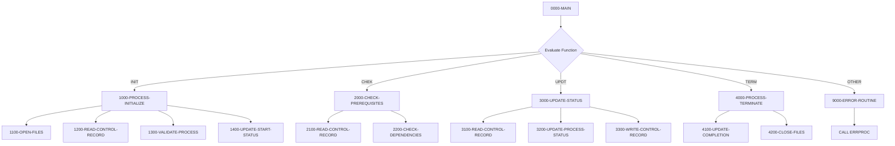

## Overview

BCHCTL00 is a batch control processor that manages job-level control operations and process sequencing in the batch environment. It provides a central mechanism for coordinating batch job execution, including initialization, prerequisite checking, status updates, and termination.

The program operates as a called subprogram that receives control requests through its linkage section. It supports four primary functions: initializing a batch process, checking job prerequisites and dependencies, updating process status during execution, and terminating/finalizing completed processes. This design allows calling programs to manage their batch control lifecycle through a standardized interface.

BCHCTL00 uses an indexed VSAM file (BATCH-CONTROL-FILE) to store and retrieve control records. Each record tracks job status, dependencies on other jobs, timing information, and return codes. This enables sophisticated batch job scheduling with dependency management.

## Program Structure



## Data Structures

### Working Storage

| Level | Name | Picture | Description |
|-------|------|---------|-------------|
| 01 | WS-FILE-STATUS | - | File status group |
| 05 | WS-BCT-STATUS | X(2) | VSAM file status code |
| 01 | WS-WORK-AREAS | - | Working area group |
| 05 | WS-CURRENT-TIME | X(26) | Current timestamp |
| 05 | WS-PREREQ-MET | X(1) | Prerequisite status flag (Y/N) |
| 05 | WS-PROCESS-MODE | X(1) | Current processing mode (I/C/U/F) |

#### WS-PREREQ-MET Condition Names

| Condition | Value | Description |
|-----------|-------|-------------|
| PREREQS-SATISFIED | 'Y' | All prerequisites have completed |
| PREREQS-PENDING | 'N' | Prerequisites still pending |

#### WS-PROCESS-MODE Condition Names

| Condition | Value | Description |
|-----------|-------|-------------|
| MODE-INITIALIZE | 'I' | Initialization mode |
| MODE-CHECK-PREREQ | 'C' | Prerequisite check mode |
| MODE-UPDATE-STATUS | 'U' | Status update mode |
| MODE-FINALIZE | 'F' | Finalization mode |

### Linkage Section

| Level | Name | Picture | Description |
|-------|------|---------|-------------|
| 01 | LS-CONTROL-REQUEST | - | Control request from caller |
| 05 | LS-FUNCTION | X(4) | Function code (INIT/CHEK/UPDT/TERM) |
| 05 | LS-JOB-NAME | X(8) | Job name to process |
| 05 | LS-PROCESS-DATE | X(8) | Processing date |
| 05 | LS-SEQUENCE-NO | 9(4) | Job sequence number |
| 05 | LS-RETURN-CODE | S9(4) COMP | Return code from operation |

#### LS-FUNCTION Condition Names

| Condition | Value | Description |
|-----------|-------|-------------|
| FUNC-INIT | 'INIT' | Initialize batch process |
| FUNC-CHEK | 'CHEK' | Check prerequisites |
| FUNC-UPDT | 'UPDT' | Update process status |
| FUNC-TERM | 'TERM' | Terminate/finalize process |

### Batch Control Record (from BCHCTL copybook)

| Level | Name | Picture | Description |
|-------|------|---------|-------------|
| 01 | BATCH-CONTROL-RECORD | - | Control record layout |
| 05 | BCT-KEY | - | Composite key |
| 10 | BCT-JOB-NAME | X(8) | Job name |
| 10 | BCT-PROCESS-DATE | X(8) | Process date |
| 10 | BCT-SEQUENCE-NO | 9(4) | Sequence number |
| 05 | BCT-STATUS | X(1) | Process status (R/A/W/D/E) |
| 10 | BCT-STEP-NAME | X(8) | Current step name |
| 10 | BCT-PROGRAM-NAME | X(8) | Currently executing program |
| 10 | BCT-START-TIME | X(8) | Process start time |
| 10 | BCT-END-TIME | X(8) | Process end time |
| 15 | BCT-PREREQ-COUNT | 9(2) COMP | Number of prerequisites |
| 15 | BCT-PREREQ-JOBS | OCCURS 10 | Array of prerequisite jobs |
| 10 | BCT-RETURN-CODE | S9(4) COMP | Final return code |
| 10 | BCT-ERROR-DESC | X(80) | Error description |

#### BCT-STATUS Values

| Status | Value | Description |
|--------|-------|-------------|
| BCT-STATUS-READY | 'R' | Ready to execute |
| BCT-STATUS-ACTIVE | 'A' | Currently executing |
| BCT-STATUS-WAITING | 'W' | Waiting for prerequisites |
| BCT-STATUS-DONE | 'D' | Completed successfully |
| BCT-STATUS-ERROR | 'E' | Completed with error |

## File I/O

### BATCH-CONTROL-FILE

| Attribute | Value |
|-----------|-------|
| DD Name | BCHCTL |
| Organization | INDEXED (VSAM KSDS) |
| Access Mode | DYNAMIC |
| Record Key | BCT-KEY (Job Name + Process Date + Sequence No) |
| File Status | WS-BCT-STATUS |

The batch control file is accessed dynamically, allowing both sequential and random access. Records are keyed by a composite key consisting of job name, process date, and sequence number, enabling tracking of multiple executions of the same job.

## Control Flow

### Main Processing Logic (0000-MAIN)

The main entry point evaluates the function code passed in the linkage section and dispatches to the appropriate processing routine:

1. **INIT** - Calls 1000-PROCESS-INITIALIZE to set up a new batch process
2. **CHEK** - Calls 2000-CHECK-PREREQUISITES to verify job dependencies
3. **UPDT** - Calls 3000-UPDATE-STATUS to update process status during execution
4. **TERM** - Calls 4000-PROCESS-TERMINATE to finalize a completed process
5. **Other** - Routes to 9000-ERROR-ROUTINE for invalid function codes

### Initialize Process (1000-PROCESS-INITIALIZE)

Handles batch job initialization:
1. Opens the batch control file
2. Reads the control record for the requested job
3. Validates the process can be started
4. Updates the status to indicate the job has started

### Check Prerequisites (2000-CHECK-PREREQUISITES)

Verifies job dependencies before execution:
1. Reads the control record
2. Checks all prerequisite jobs defined in BCT-PREREQ-JOBS
3. Sets return code based on whether all prerequisites are satisfied:
   - `BCT-RC-SUCCESS` (0) - All prerequisites complete
   - `BCT-RC-WARNING` (4) - Prerequisites still pending

### Update Status (3000-UPDATE-STATUS)

Updates process status during execution:
1. Reads current control record
2. Updates process status fields
3. Writes the updated record back to the file

### Terminate Process (4000-PROCESS-TERMINATE)

Finalizes a completed batch job:
1. Updates completion information (timestamps, return codes)
2. Closes the batch control file

### Error Handling (9000-ERROR-ROUTINE)

Handles error conditions by:
1. Setting the program name to 'BCHCTL00' in the error message structure
2. Setting return code to `BCT-RC-ERROR` (8)
3. Calling the external error processor (ERRPROC)

## Return Codes

| Code | Constant | Description |
|------|----------|-------------|
| 0 | BCT-RC-SUCCESS | Operation completed successfully |
| 4 | BCT-RC-WARNING | Warning condition (e.g., prerequisites pending) |
| 8 | BCT-RC-ERROR | Error occurred during processing |
| 12 | BCT-RC-SEVERE | Severe error condition |
| 16 | BCT-RC-CRITICAL | Critical/terminal error |

## Dependencies

### Copybooks

- **BCHCTL** - Batch control file record layout defining the FD structure
- **BCHCON** - Batch control constants including status values, return codes, and process types
- **ERRHAND** - Standard error handling definitions and message structures

### Called Programs

- **ERRPROC** - External error processing routine for error logging and handling

### Related Programs

Programs that work with batch control processing and share the BCHCTL/BCHCON copybooks for job scheduling and dependency management.

## Usage Example

A typical calling program would interact with BCHCTL00 as follows:

```cobol
*  Initialize the batch process
   MOVE 'INIT' TO LS-FUNCTION
   MOVE 'MYJOB001' TO LS-JOB-NAME
   MOVE '20240115' TO LS-PROCESS-DATE
   MOVE 1 TO LS-SEQUENCE-NO
   CALL 'BCHCTL00' USING LS-CONTROL-REQUEST
   IF LS-RETURN-CODE NOT = ZERO
       STOP RUN
   END-IF

*  ... perform batch processing ...

*  Terminate and record completion
   MOVE 'TERM' TO LS-FUNCTION
   CALL 'BCHCTL00' USING LS-CONTROL-REQUEST
```

## Technical Notes

- The program uses `GOBACK` for return, which properly returns control to the calling program
- The RETURN-CODE special register is set from LS-RETURN-CODE before returning
- Dynamic file access mode allows both keyed reads and sequential processing
- The prerequisite checking mechanism supports up to 10 dependent jobs per process (BCT-MAX-PREREQ)
- Maximum restart attempts are limited to 3 (BCT-MAX-RESTARTS)
