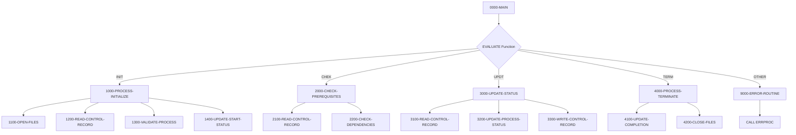

## Overview

BCHCTL00 is a Batch Control Processor that provides centralized job-level control and process sequencing for batch operations. It manages the lifecycle of batch processes from initialization through completion, including prerequisite checking and status updates.

The program serves as a callable subprogram that other batch jobs invoke to coordinate their execution. It uses a VSAM indexed file (BATCH-CONTROL-FILE) to maintain control records that track job status, dependencies, and execution statistics. This enables sophisticated job dependency management where processes can wait for prerequisites to complete before executing.

BCHCTL00 supports four main functions: initialization (`INIT`), prerequisite checking (`CHEK`), status update (`UPDT`), and termination (`TERM`). This design allows calling programs to interact with the batch control system at various points during their execution.

## Program Structure



## Data Structures

### Linkage Section

The program receives control requests via the linkage section:

| Level | Name | Picture | Description |
|-------|------|---------|-------------|
| 01 | LS-CONTROL-REQUEST | | Control request structure |
| 05 | LS-FUNCTION | X(4) | Function code: `INIT`, `CHEK`, `UPDT`, or `TERM` |
| 05 | LS-JOB-NAME | X(8) | Name of the batch job |
| 05 | LS-PROCESS-DATE | X(8) | Processing date |
| 05 | LS-SEQUENCE-NO | 9(4) | Sequence number for job ordering |
| 05 | LS-RETURN-CODE | S9(4) COMP | Return code from operation |

### Working Storage

| Level | Name | Picture | Description |
|-------|------|---------|-------------|
| 05 | WS-BCT-STATUS | X(2) | File status for BATCH-CONTROL-FILE |
| 05 | WS-CURRENT-TIME | X(26) | Current timestamp |
| 05 | WS-PREREQ-MET | X(1) | Prerequisite status flag (`Y`/`N`) |
| 05 | WS-PROCESS-MODE | X(1) | Current processing mode (`I`, `C`, `U`, `F`) |

### Batch Control Record (from BCHCTL copybook)

The BATCH-CONTROL-FILE contains indexed records with the following structure:

| Level | Name | Picture | Description |
|-------|------|---------|-------------|
| 05 | BCT-KEY | | Composite key for the record |
| 10 | BCT-JOB-NAME | X(8) | Job name |
| 10 | BCT-PROCESS-DATE | X(8) | Processing date |
| 10 | BCT-SEQUENCE-NO | 9(4) | Sequence number |
| 10 | BCT-STATUS | X(1) | Status: `R`=Ready, `A`=Active, `W`=Waiting, `D`=Done, `E`=Error |
| 15 | BCT-STEP-NAME | X(8) | Current step name |
| 15 | BCT-PROGRAM-NAME | X(8) | Executing program name |
| 15 | BCT-START-TIME | X(8) | Execution start time |
| 15 | BCT-END-TIME | X(8) | Execution end time |
| 15 | BCT-PREREQ-COUNT | 9(2) COMP | Number of prerequisites |
| 15 | BCT-PREREQ-JOBS | OCCURS 10 | Array of prerequisite jobs |
| 15 | BCT-RETURN-CODE | S9(4) COMP | Final return code |
| 15 | BCT-ERROR-DESC | X(80) | Error description |

### Return Code Constants (from BCHCON copybook)

| Name | Value | Description |
|------|-------|-------------|
| BCT-RC-SUCCESS | 0 | Successful completion |
| BCT-RC-WARNING | 4 | Warning condition |
| BCT-RC-ERROR | 8 | Error condition |
| BCT-RC-SEVERE | 12 | Severe error |
| BCT-RC-CRITICAL | 16 | Critical failure |

## File I/O

### BATCH-CONTROL-FILE

| Attribute | Value |
|-----------|-------|
| DD Name | BCHCTL |
| Organization | Indexed (VSAM KSDS) |
| Access Mode | Dynamic |
| Record Key | BCT-KEY (JOB-NAME + PROCESS-DATE + SEQUENCE-NO) |

The file supports both sequential and random access, allowing the program to read specific control records by key or process records sequentially when checking dependencies.

## Control Flow

### Function: INIT (Initialize)

1. Opens the BATCH-CONTROL-FILE
2. Reads the control record for the specified job/date/sequence
3. Validates that the process can start (not already active/complete)
4. Updates the record status to Active and records the start time

### Function: CHEK (Check Prerequisites)

1. Reads the control record for the job
2. Iterates through BCT-PREREQ-JOBS array to verify all prerequisite jobs have completed successfully
3. Returns BCT-RC-SUCCESS if all prerequisites are satisfied
4. Returns BCT-RC-WARNING if prerequisites are still pending

### Function: UPDT (Update Status)

1. Reads the current control record
2. Updates process status and any relevant statistics
3. Writes the updated control record back to the file

### Function: TERM (Terminate)

1. Updates the record with completion timestamp and final return code
2. Sets status to Done (or Error if applicable)
3. Closes the BATCH-CONTROL-FILE

### Error Handling

Invalid function codes trigger the 9000-ERROR-ROUTINE which:
- Sets error text to "Invalid function code"
- Sets the program name in ERR-PROGRAM
- Sets return code to BCT-RC-ERROR (8)
- Calls ERRPROC for centralized error logging

## Dependencies

### Copybooks

- **BCHCTL** - Batch control file record definition with job status, dependencies, and statistics
- **BCHCON** - Batch control constants including status values, return codes, and process types
- **ERRHAND** - Standard error handling definitions with error message structure and VSAM status codes

### Called Programs

- **ERRPROC** - Error processing routine for centralized error logging

### Related Programs

Programs that share copybooks with BCHCTL00:

| Program | Shared Copybooks | Relationship |
|---------|-----------------|--------------|
| HISTLD00 | BCHCTL, BCHCON, ERRHAND | Uses batch control for history loading |
| PRCSEQ00 | BCHCTL, BCHCON, ERRHAND | Process sequencing coordination |
| RCVPRC00 | BCHCTL, BCHCON, ERRHAND | Recovery processing |
| RPTSTA00 | BCHCTL, ERRHAND | Status reporting |

## Usage Example

A typical calling sequence from a batch program:

```cobol
* Initialize batch control at job start
MOVE 'INIT' TO LS-FUNCTION
MOVE 'MYJOB001' TO LS-JOB-NAME
MOVE '20240115' TO LS-PROCESS-DATE
MOVE 1 TO LS-SEQUENCE-NO
CALL 'BCHCTL00' USING LS-CONTROL-REQUEST

* Check prerequisites before processing
MOVE 'CHEK' TO LS-FUNCTION
CALL 'BCHCTL00' USING LS-CONTROL-REQUEST
IF LS-RETURN-CODE = BCT-RC-WARNING
    DISPLAY 'Prerequisites not met - waiting'
    STOP RUN
END-IF

* ... perform main processing ...

* Update status during processing
MOVE 'UPDT' TO LS-FUNCTION
CALL 'BCHCTL00' USING LS-CONTROL-REQUEST

* Terminate at job completion
MOVE 'TERM' TO LS-FUNCTION
CALL 'BCHCTL00' USING LS-CONTROL-REQUEST
```
