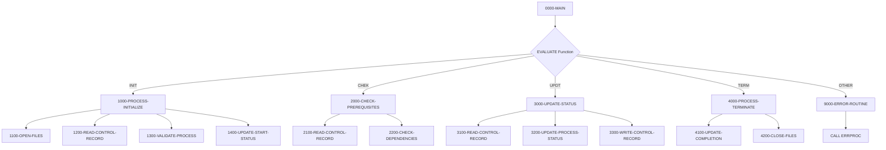

## Overview

BCHCTL00 is a batch control processor program that provides centralized management of batch job sequencing and execution control. The program handles four primary functions: initializing batch processes, checking job prerequisites, updating process status, and finalizing completed jobs.

This program serves as the core batch control mechanism in the system, maintaining job execution state in an indexed VSAM file (BATCH-CONTROL-FILE). It works in conjunction with other batch programs like HISTLD00, PRCSEQ00, RCVPRC00, and RPTSTA00 that share its control structures. The program is called as a subprogram by batch job steps, receiving control requests through a linkage section parameter.

The program supports a prerequisite dependency model where jobs can specify up to 10 prerequisite jobs that must complete successfully before execution can proceed. This enables complex batch workflows with parallel and sequential job dependencies.

## Program Structure

## Data Structures

### Linkage Section (Control Request)

The program receives control requests via the linkage section:

| Level | Name | Picture | Description |
|-------|------|---------|-------------|
| 01 | LS-CONTROL-REQUEST | - | Control request parameter |
| 05 | LS-FUNCTION | X(4) | Function code: INIT, CHEK, UPDT, TERM |
| 05 | LS-JOB-NAME | X(8) | Batch job name |
| 05 | LS-PROCESS-DATE | X(8) | Processing date |
| 05 | LS-SEQUENCE-NO | 9(4) | Job sequence number |
| 05 | LS-RETURN-CODE | S9(4) COMP | Return code passed back to caller |

### Working Storage

| Level | Name | Picture | Description |
|-------|------|---------|-------------|
| 05 | WS-BCT-STATUS | X(2) | VSAM file status code |
| 05 | WS-CURRENT-TIME | X(26) | Current timestamp |
| 05 | WS-PREREQ-MET | X(1) | Prerequisites status flag ('Y'/'N') |
| 05 | WS-PROCESS-MODE | X(1) | Current processing mode indicator |

### Batch Control Record (BCHCTL Copybook)

The batch control file record structure:

| Level | Name | Picture | Description |
|-------|------|---------|-------------|
| 01 | BATCH-CONTROL-RECORD | - | Control file record |
| 10 | BCT-JOB-NAME | X(8) | Job name (part of key) |
| 10 | BCT-PROCESS-DATE | X(8) | Process date (part of key) |
| 10 | BCT-SEQUENCE-NO | 9(4) | Sequence number (part of key) |
| 10 | BCT-STATUS | X(1) | Job status: R=Ready, A=Active, W=Waiting, D=Done, E=Error |
| 15 | BCT-STEP-NAME | X(8) | Current step name |
| 15 | BCT-PROGRAM-NAME | X(8) | Executing program name |
| 15 | BCT-START-TIME | X(8) | Process start time |
| 15 | BCT-END-TIME | X(8) | Process end time |
| 15 | BCT-PREREQ-COUNT | 9(2) COMP | Number of prerequisites |
| 20 | BCT-PREREQ-NAME | X(8) | Prerequisite job name (occurs 10 times) |
| 20 | BCT-PREREQ-SEQ | 9(4) | Prerequisite sequence number |
| 20 | BCT-PREREQ-RC | S9(4) COMP | Prerequisite return code |
| 15 | BCT-RETURN-CODE | S9(4) COMP | Job return code |
| 15 | BCT-ERROR-DESC | X(80) | Error description |
| 10 | BCT-RESTART-COUNT | 9(2) COMP | Number of restart attempts |
| 10 | BCT-ATTEMPT-TS | X(26) | Last attempt timestamp |
| 10 | BCT-COMPLETE-TS | X(26) | Completion timestamp |

## File I/O

### BATCH-CONTROL-FILE

| Attribute | Value |
|-----------|-------|
| Logical Name | BATCH-CONTROL-FILE |
| DD Name | BCHCTL |
| Organization | INDEXED (VSAM KSDS) |
| Access Mode | DYNAMIC |
| Record Key | BCT-KEY (BCT-JOB-NAME + BCT-PROCESS-DATE + BCT-SEQUENCE-NO) |
| File Status | WS-BCT-STATUS |

The file uses dynamic access mode allowing both sequential and random access based on the composite key. The record key is 20 bytes consisting of job name (8), process date (8), and sequence number (4).

## Control Flow

### Initialization (FUNC-INIT)

1. Opens the batch control file
2. Reads the control record for the specified job
3. Validates the process can be started
4. Updates status to Active and records start time

### Prerequisite Check (FUNC-CHEK)

1. Reads the current control record
2. Iterates through BCT-PREREQ-JOBS (up to BCT-PREREQ-COUNT entries)
3. Verifies each prerequisite job has completed (BCT-STATUS-DONE)
4. Returns BCT-RC-SUCCESS (0) if all prerequisites are satisfied
5. Returns BCT-RC-WARNING (4) if prerequisites are still pending

### Status Update (FUNC-UPDT)

1. Reads the current control record
2. Updates process status fields
3. Rewrites the control record to the file

### Termination (FUNC-TERM)

1. Updates completion timestamp and final status
2. Closes the batch control file

### Error Handling

Invalid function codes or processing errors invoke `9000-ERROR-ROUTINE` which:
- Sets ERR-PROGRAM to 'BCHCTL00'
- Sets return code to BCT-RC-ERROR (8)
- Calls the ERRPROC program to log the error

## Return Codes

| Code | Constant | Description |
|------|----------|-------------|
| 0 | BCT-RC-SUCCESS | Successful completion |
| 4 | BCT-RC-WARNING | Warning (e.g., prerequisites pending) |
| 8 | BCT-RC-ERROR | Error during processing |
| 12 | BCT-RC-SEVERE | Severe error |
| 16 | BCT-RC-CRITICAL | Critical failure |

## Dependencies

### Copybooks

- **BCHCTL** - Batch control file record definition
- **BCHCON** - Batch control constants (status values, return codes, thresholds)
- **ERRHAND** - Standard error handling definitions

### Called Programs

- **ERRPROC** - Error processing and logging routine

### Related Programs

Programs that share the BCHCTL copybook and interact with the batch control system:

- **HISTLD00** - History load program
- **PRCSEQ00** - Process sequence manager
- **RCVPRC00** - Recovery processing
- **RPTSTA00** - Status reporting

## Technical Notes

1. **COBOL-88 Levels**: The program uses level-88 condition names extensively for readable status checking (e.g., `FUNC-INIT`, `PREREQS-SATISFIED`).

2. **EVALUATE Statement**: The main paragraph uses EVALUATE TRUE to dispatch based on function codes, a cleaner alternative to nested IF statements.

3. **COMP Fields**: Binary fields (`S9(4) COMP`) are used for return codes and counters for efficient storage and processing.

4. **Dynamic File Access**: The indexed file with DYNAMIC access allows the program to read records by key or sequentially as needed.

5. **Stub Procedures**: The source indicates several detailed procedures (1100-OPEN-FILES, 1200-READ-CONTROL-RECORD, etc.) are to be implemented, suggesting this is a framework or template program.
