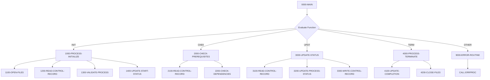

## Overview

BCHCTL00 is a batch control processor that provides centralized management of batch job execution within the system. It operates as a callable subprogram, receiving control requests through its linkage section and performing various job management functions.

The program manages the lifecycle of batch jobs by handling four primary operations: initializing job execution, checking prerequisites before processing, updating job status during execution, and finalizing jobs upon completion. It interacts with an indexed VSAM control file to track job states, dependencies, and return codes.

This is a foundational utility used by the batch processing infrastructure to ensure proper job sequencing, dependency management, and execution tracking across the batch environment.

## Program Structure



## Data Structures

### Linkage Section (Input/Output Parameters)

The program receives a control request structure through the linkage section:

| Level | Name | Picture | Description |
|-------|------|---------|-------------|
| 01 | LS-CONTROL-REQUEST | - | Main request structure |
| 05 | LS-FUNCTION | X(4) | Function code: `INIT`, `CHEK`, `UPDT`, `TERM` |
| 05 | LS-JOB-NAME | X(8) | Name of the batch job |
| 05 | LS-PROCESS-DATE | X(8) | Processing date (YYYYMMDD format) |
| 05 | LS-SEQUENCE-NO | 9(4) | Job sequence number |
| 05 | LS-RETURN-CODE | S9(4) COMP | Return code from operation |

### Working Storage

| Level | Name | Picture | Description |
|-------|------|---------|-------------|
| 05 | WS-BCT-STATUS | X(2) | VSAM file status code |
| 05 | WS-CURRENT-TIME | X(26) | Current timestamp |
| 05 | WS-PREREQ-MET | X(1) | Prerequisites status flag (`Y`/`N`) |
| 05 | WS-PROCESS-MODE | X(1) | Current processing mode |

#### Process Mode Values (88-level conditions)

| Condition | Value | Description |
|-----------|-------|-------------|
| MODE-INITIALIZE | `I` | Initialization mode |
| MODE-CHECK-PREREQ | `C` | Prerequisite checking mode |
| MODE-UPDATE-STATUS | `U` | Status update mode |
| MODE-FINALIZE | `F` | Finalization mode |

## File I/O

### BATCH-CONTROL-FILE

An indexed VSAM file that stores batch control records for job management.

| Property | Value |
|----------|-------|
| Logical Name | BATCH-CONTROL-FILE |
| DD Name | BCHCTL |
| Organization | INDEXED |
| Access Mode | DYNAMIC |
| Record Key | BCT-KEY (composite: job name + date + sequence) |
| File Status | WS-BCT-STATUS |

The control file record (defined in BCHCTL copybook) contains:
- **Key fields**: Job name, process date, and sequence number
- **Status tracking**: Current status (Ready/Active/Waiting/Done/Error)
- **Process control**: Step name, program name, start/end times
- **Dependencies**: Up to 10 prerequisite jobs with their expected return codes
- **Statistics**: Restart count, attempt timestamp, completion timestamp

## Control Flow

### Main Routing (0000-MAIN)

The program uses an `EVALUATE TRUE` statement to dispatch requests based on the function code:

1. **FUNC-INIT** → Routes to initialization processing
2. **FUNC-CHEK** → Routes to prerequisite checking
3. **FUNC-UPDT** → Routes to status update processing
4. **FUNC-TERM** → Routes to termination processing
5. **Other** → Invokes error handling for invalid function codes

After processing, the return code is set and the program returns control via `GOBACK`.

### Initialize Processing (1000-PROCESS-INITIALIZE)

Prepares a batch job for execution:
1. Opens the batch control file
2. Reads the control record for the specified job
3. Validates the process is ready to run
4. Updates the record to indicate the job has started

### Prerequisite Checking (2000-CHECK-PREREQUISITES)

Validates that all dependent jobs have completed successfully:
1. Reads the control record to get dependency information
2. Checks each prerequisite job's completion status
3. Returns `BCT-RC-SUCCESS` (0) if all prerequisites are satisfied
4. Returns `BCT-RC-WARNING` (4) if prerequisites are still pending

### Status Update (3000-UPDATE-STATUS)

Updates the job's progress during execution:
1. Reads the current control record
2. Modifies the process status fields
3. Writes the updated record back to the file

### Termination Processing (4000-PROCESS-TERMINATE)

Finalizes job execution:
1. Updates completion information (timestamp, final status)
2. Closes the batch control file

### Error Handling (9000-ERROR-ROUTINE)

Handles errors by:
1. Setting the program name in the error structure
2. Setting return code to `BCT-RC-ERROR` (8)
3. Calling the ERRPROC program to process and log the error

## Return Codes

| Code | Constant | Description |
|------|----------|-------------|
| 0 | BCT-RC-SUCCESS | Operation completed successfully |
| 4 | BCT-RC-WARNING | Warning condition (e.g., prerequisites pending) |
| 8 | BCT-RC-ERROR | Error occurred during processing |
| 12 | BCT-RC-SEVERE | Severe error condition |
| 16 | BCT-RC-CRITICAL | Critical failure |

## Dependencies

### Copybooks

- **BCHCTL** - Batch control file record definition (FD level)
- **BCHCON** - Batch control constants (status values, return codes, messages)
- **ERRHAND** - Standard error handling definitions

### Called Programs

- **ERRPROC** - Error processing routine for logging and handling errors

### Related Programs

Programs that share the BCHCTL copybook (batch control integration):
- HISTLD00 - History load processing
- PRCSEQ00 - Process sequencing
- RCVPRC00 - Receive processing
- RPTSTA00 - Status reporting

Programs that share the BCHCON copybook (use batch control constants):
- HISTLD00
- PRCSEQ00
- RCVPRC00

## Usage Example

To call BCHCTL00 for job initialization:

```cobol
MOVE 'INIT'     TO LS-FUNCTION
MOVE 'MYJOB001' TO LS-JOB-NAME
MOVE '20240115' TO LS-PROCESS-DATE
MOVE 1          TO LS-SEQUENCE-NO
CALL 'BCHCTL00' USING LS-CONTROL-REQUEST
IF LS-RETURN-CODE = 0
    CONTINUE WITH PROCESSING
ELSE
    HANDLE ERROR CONDITION
END-IF
```

## Technical Notes

- The program uses **DYNAMIC** access mode for the VSAM file, allowing both sequential and random access to control records
- The **GOBACK** statement is used instead of STOP RUN, allowing the calling program to continue execution
- The `EVALUATE TRUE` pattern with 88-level conditions provides clean, readable dispatch logic
- All processing modes are tracked via 88-level conditions for clear state management
