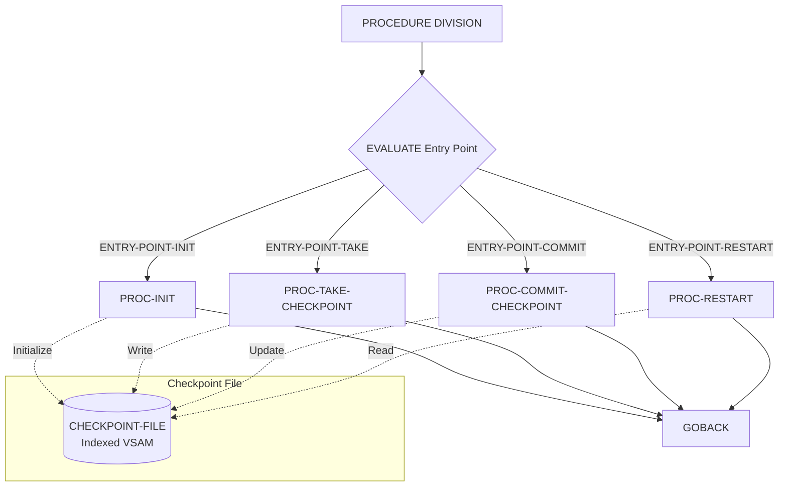

## Overview

CKPRST is a batch checkpoint/restart utility program that provides essential job recovery capabilities for long-running batch processes. It enables batch programs to record their processing state at regular intervals, allowing jobs to be restarted from the last successful checkpoint rather than from the beginning after a failure.

The program acts as a service module that other batch programs call to manage checkpoint operations. It supports four main operations: initialization, taking checkpoints, committing checkpoints, and restart processing. The checkpoint data is persisted in an indexed VSAM file, keyed by program ID and run date, ensuring that each program run maintains its own checkpoint record.

This utility is critical for batch processing reliability, especially for jobs that process large volumes of data where a complete restart would be costly in terms of time and resources.

## Program Structure



## Data Structures

### Working Storage

| Level | Name | Picture | Description |
|-------|------|---------|-------------|
| 01 | WS-FILE-STATUS | X(2) | File status for checkpoint file operations |

### Linkage Section

The program receives two structures via the USING clause:

#### CHECKPOINT-CONTROL (from CKPRST copybook)

| Level | Name | Picture | Description |
|-------|------|---------|-------------|
| 01 | CHECKPOINT-CONTROL | - | Main checkpoint control structure |
| 05 | CK-HEADER | - | Header information group |
| 10 | CK-PROGRAM-ID | X(8) | Program identifier |
| 10 | CK-RUN-DATE | X(8) | Run date (YYYYMMDD) |
| 10 | CK-RUN-TIME | X(6) | Run time (HHMMSS) |
| 10 | CK-STATUS | X(1) | Processing status code |
| 05 | CK-COUNTERS | - | Processing counters group |
| 10 | CK-RECORDS-READ | 9(9) COMP | Total records read |
| 10 | CK-RECORDS-PROC | 9(9) COMP | Total records processed |
| 10 | CK-RECORDS-ERROR | 9(9) COMP | Total error records |
| 10 | CK-RESTART-COUNT | 9(2) COMP | Number of restarts |
| 05 | CK-POSITION | - | Position tracking group |
| 10 | CK-LAST-KEY | X(50) | Last processed key value |
| 10 | CK-LAST-TIME | X(26) | Timestamp of last checkpoint |
| 10 | CK-PHASE | X(2) | Current processing phase |
| 05 | CK-RESOURCES | - | File resources group |
| 10 | CK-FILE-STATUS | OCCURS 5 | Status for up to 5 files |
| 05 | CK-CONTROL-INFO | - | Control parameters group |
| 10 | CK-COMMIT-FREQ | 9(5) COMP | Commit frequency (default 1000) |
| 10 | CK-MAX-ERRORS | 9(3) COMP | Max errors allowed (default 100) |
| 10 | CK-MAX-RESTARTS | 9(2) COMP | Max restart attempts (default 3) |
| 10 | CK-RESTART-MODE | X(1) | Restart mode indicator |

**Status Values (CK-STATUS):**
- `I` - Initial state
- `A` - Active processing
- `C` - Complete
- `F` - Failed
- `R` - Restarted

**Processing Phases (CK-PHASE):**
- `00` - Initialization
- `10` - Reading
- `20` - Processing
- `30` - Updating
- `40` - Termination

**Restart Modes (CK-RESTART-MODE):**
- `N` - Normal processing
- `R` - Restart from checkpoint
- `C` - Recovery mode

#### RETURN-STATUS (from RETHND copybook)

| Level | Name | Picture | Description |
|-------|------|---------|-------------|
| 10 | RETURN-CODE | S9(4) COMP | Return code value |
| 10 | REASON-CODE | S9(4) COMP | Detailed reason code |
| 10 | MODULE-ID | X(8) | Calling module identifier |
| 10 | FUNCTION-ID | X(8) | Function being performed |

**Standard Return Codes:**
- `0` - Success
- `4` - Warning
- `8` - Error
- `12` - Severe error
- `16` - Critical failure

## File I/O

### Checkpoint File Definition

| Attribute | Value |
|-----------|-------|
| Logical Name | CHECKPOINT-FILE |
| Physical Name | CKPTFILE |
| Organization | Indexed |
| Access Mode | Dynamic |
| Record Key | CKR-KEY (Program ID + Run Date) |
| File Status | WS-FILE-STATUS |

### Checkpoint Record Layout

| Field | Picture | Description |
|-------|---------|-------------|
| CKR-KEY | - | Composite key |
| CKR-PROGRAM-ID | X(8) | Program identifier |
| CKR-RUN-DATE | X(8) | Run date |
| CKR-DATA | X(400) | Serialized checkpoint data |

## Control Flow

The program uses the COBOL `EVALUATE TRUE` statement (similar to a switch/case in other languages) to dispatch to the appropriate paragraph based on entry point flags set by the caller.

### Entry Points

1. **PROC-INIT** - Initialize checkpoint processing
   - Called at the start of batch job execution
   - Opens the checkpoint file
   - Checks for existing checkpoint records
   - Determines if this is a new run or restart

2. **PROC-TAKE-CHECKPOINT** - Record a checkpoint
   - Called periodically during processing (typically every N records)
   - Captures current processing state
   - Writes/updates the checkpoint record
   - Should be called at transaction boundaries

3. **PROC-COMMIT-CHECKPOINT** - Commit the checkpoint
   - Confirms the checkpoint is complete
   - Updates the checkpoint status
   - Typically called after successful completion of a processing unit

4. **PROC-RESTART** - Handle restart processing
   - Called when a job is being restarted after failure
   - Reads the last checkpoint record
   - Restores processing state
   - Positions files to continue from checkpoint

### Typical Usage Pattern

```
1. CALL CKPRST with ENTRY-POINT-INIT
2. Loop:
   a. Process records
   b. Every N records: CALL CKPRST with ENTRY-POINT-TAKE
   c. After commit: CALL CKPRST with ENTRY-POINT-COMMIT
3. On restart: CALL CKPRST with ENTRY-POINT-RESTART
```

## Dependencies

### Copybooks

- **CKPRST** - Checkpoint control structure and record definitions
- **RETHND** - Return code handling and error reporting definitions

### Called Programs

This program does not call other programs. It is designed to be called by batch processing programs.

### Related Programs

Programs that use checkpoint/restart functionality will call this module. Look for programs that include the CKPRST copybook in their linkage section.

## Technical Notes

### COBOL Concepts Used

- **88-Level Condition Names**: The copybooks define condition names (88 levels) for status values, allowing code to use meaningful names like `CK-ACTIVE` instead of literal values like `'A'`.

- **COMP (Computational) Fields**: Counter fields use `COMP` (binary) format for efficient arithmetic operations.

- **Dynamic Access Mode**: The checkpoint file uses dynamic access, allowing both sequential and random access operations depending on the processing needs.

- **Indexed File Organization**: The checkpoint file is organized as an indexed VSAM file, providing efficient keyed access to checkpoint records.

### Implementation Considerations

- The checkpoint frequency (CK-COMMIT-FREQ) defaults to 1000 records but can be adjusted based on transaction volume and recovery requirements.
- Maximum of 3 restart attempts is allowed before requiring manual intervention.
- Up to 5 related files can have their positions tracked in a single checkpoint.
