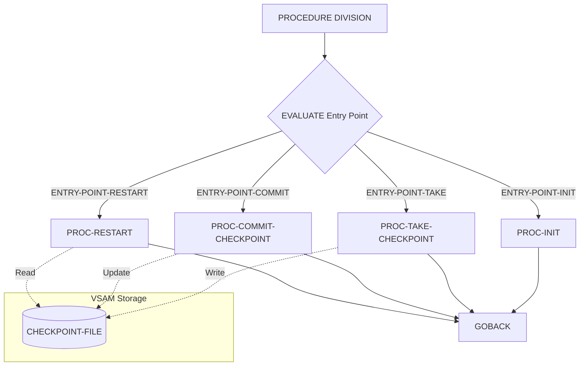

## Overview

CKPRST is a checkpoint/restart utility program that provides essential recovery services for long-running batch processes. The program enables batch jobs to save their processing state at regular intervals, allowing them to resume from the last successful checkpoint rather than starting over if a failure occurs.

The program operates as a callable service module, accepting a control structure through the LINKAGE SECTION that specifies which operation to perform: initialization, taking a checkpoint, committing a checkpoint, or handling restart processing. This modular design allows any batch program to integrate checkpoint/restart capabilities by calling CKPRST at appropriate points during processing.

Checkpoint data is persisted to an indexed VSAM file (CHECKPOINT-FILE), which stores the program state including record counts, processing position, and file status information for up to five concurrent files. This enables recovery scenarios where batch jobs can restart from the exact position where they left off.

## Program Structure



## Data Structures

### Working Storage

| Level | Name | Picture | Description |
|-------|------|---------|-------------|
| 01 | WS-FILE-STATUS | X(2) | VSAM file status code for CHECKPOINT-FILE |

### Linkage Section

The program receives two control structures through the LINKAGE SECTION:

#### CHECKPOINT-CONTROL (from CKPRST copybook)

| Level | Name | Picture | Description |
|-------|------|---------|-------------|
| 01 | CHECKPOINT-CONTROL | - | Main checkpoint control structure |
| 05 | CK-HEADER | - | Header information group |
| 10 | CK-PROGRAM-ID | X(8) | ID of the program being checkpointed |
| 10 | CK-RUN-DATE | X(8) | Date of the batch run |
| 10 | CK-RUN-TIME | X(6) | Time of the batch run |
| 10 | CK-STATUS | X(1) | Current checkpoint status |
| 05 | CK-COUNTERS | - | Processing counters group |
| 10 | CK-RECORDS-READ | 9(9) COMP | Count of records read |
| 10 | CK-RECORDS-PROC | 9(9) COMP | Count of records processed |
| 10 | CK-RECORDS-ERROR | 9(9) COMP | Count of error records |
| 10 | CK-RESTART-COUNT | 9(2) COMP | Number of restarts performed |
| 05 | CK-POSITION | - | Processing position tracking |
| 10 | CK-LAST-KEY | X(50) | Last processed key value |
| 10 | CK-LAST-TIME | X(26) | Timestamp of last checkpoint |
| 10 | CK-PHASE | X(2) | Current processing phase |
| 05 | CK-RESOURCES | - | File resource tracking |
| 10 | CK-FILE-STATUS | (occurs 5) | Array for up to 5 files |
| 15 | CK-FILE-NAME | X(8) | File name |
| 15 | CK-FILE-POS | X(50) | File position |
| 15 | CK-FILE-STATUS | X(2) | File status code |
| 05 | CK-CONTROL-INFO | - | Control parameters |
| 10 | CK-COMMIT-FREQ | 9(5) COMP | Checkpoint frequency (default 1000) |
| 10 | CK-MAX-ERRORS | 9(3) COMP | Maximum errors allowed (default 100) |
| 10 | CK-MAX-RESTARTS | 9(2) COMP | Maximum restart attempts (default 3) |
| 10 | CK-RESTART-MODE | X(1) | Restart mode flag |

#### Checkpoint Status Values (88-levels)

| Condition Name | Value | Description |
|---------------|-------|-------------|
| CK-INITIAL | 'I' | Initial state |
| CK-ACTIVE | 'A' | Checkpoint active |
| CK-COMPLETE | 'C' | Processing complete |
| CK-FAILED | 'F' | Processing failed |
| CK-RESTARTED | 'R' | Restarted from checkpoint |

#### Processing Phase Values (88-levels)

| Condition Name | Value | Description |
|---------------|-------|-------------|
| CK-PHASE-INIT | '00' | Initialization phase |
| CK-PHASE-READ | '10' | Reading phase |
| CK-PHASE-PROC | '20' | Processing phase |
| CK-PHASE-UPDT | '30' | Update phase |
| CK-PHASE-TERM | '40' | Termination phase |

#### Restart Mode Values (88-levels)

| Condition Name | Value | Description |
|---------------|-------|-------------|
| CK-MODE-NORMAL | 'N' | Normal processing mode |
| CK-MODE-RESTART | 'R' | Restart mode |
| CK-MODE-RECOVER | 'C' | Recovery mode |

#### RETURN-STATUS (from RETHND copybook)

| Level | Name | Picture | Description |
|-------|------|---------|-------------|
| 10 | RETURN-CODE | S9(4) COMP | Return code value |
| 10 | REASON-CODE | S9(4) COMP | Additional reason code |
| 10 | MODULE-ID | X(8) | Module identifier |
| 10 | FUNCTION-ID | X(8) | Function identifier |

## File I/O

### CHECKPOINT-FILE

| Property | Value |
|----------|-------|
| Assign To | CKPTFILE |
| Organization | Indexed (VSAM KSDS) |
| Access Mode | Dynamic |
| Record Key | CKR-KEY |
| File Status | WS-FILE-STATUS |

The checkpoint file uses a composite key structure:

| Field | Picture | Description |
|-------|---------|-------------|
| CKR-PROGRAM-ID | X(8) | Program identifier |
| CKR-RUN-DATE | X(8) | Run date |
| CKR-DATA | X(400) | Checkpoint data payload |

## Control Flow

The program uses an `EVALUATE TRUE` statement to route processing based on entry point flags set in the CHECKPOINT-CONTROL structure:

1. **PROC-INIT** - Called when `ENTRY-POINT-INIT` is true
   - Initializes checkpoint processing for a batch run
   - Opens the checkpoint file and prepares control structures

2. **PROC-TAKE-CHECKPOINT** - Called when `ENTRY-POINT-TAKE` is true
   - Captures the current processing state
   - Records position, counters, and file statuses

3. **PROC-COMMIT-CHECKPOINT** - Called when `ENTRY-POINT-COMMIT` is true
   - Writes the checkpoint to the VSAM file
   - Makes the checkpoint permanent and recoverable

4. **PROC-RESTART** - Called when `ENTRY-POINT-RESTART` is true
   - Reads the last checkpoint from the VSAM file
   - Restores processing state for restart

:::note
The current implementation contains placeholder paragraph bodies. The actual checkpoint logic would need to be implemented to perform file I/O operations.
:::

## Dependencies

### Copybooks

- [CKPRST](/docs/copybooks/CKPRST) - Checkpoint/restart control structures and record layout
- [RETHND](/docs/copybooks/RETHND) - Return code handling definitions

### Called Programs

This program does not call any external programs.

### Related Programs

Programs that share copybooks or have caller/callee relationships with this program:
- Batch programs that require checkpoint/restart capabilities can call CKPRST

## Usage Example

```cobol
       WORKING-STORAGE SECTION.
       COPY CKPRST.
       COPY RETHND.
       
       PROCEDURE DIVISION.
           * Initialize checkpoint at start of job
           SET ENTRY-POINT-INIT TO TRUE
           CALL 'CKPRST' USING CHECKPOINT-CONTROL
                               RETURN-STATUS
           
           * Main processing loop
           PERFORM UNTIL END-OF-FILE
               READ INPUT-FILE
               PROCESS-RECORD
               ADD 1 TO CK-RECORDS-PROC
               
               * Take checkpoint every 1000 records
               IF CK-RECORDS-PROC MOD CK-COMMIT-FREQ = 0
                   SET ENTRY-POINT-TAKE TO TRUE
                   CALL 'CKPRST' USING CHECKPOINT-CONTROL
                                       RETURN-STATUS
                   SET ENTRY-POINT-COMMIT TO TRUE
                   CALL 'CKPRST' USING CHECKPOINT-CONTROL
                                       RETURN-STATUS
               END-IF
           END-PERFORM.
```
