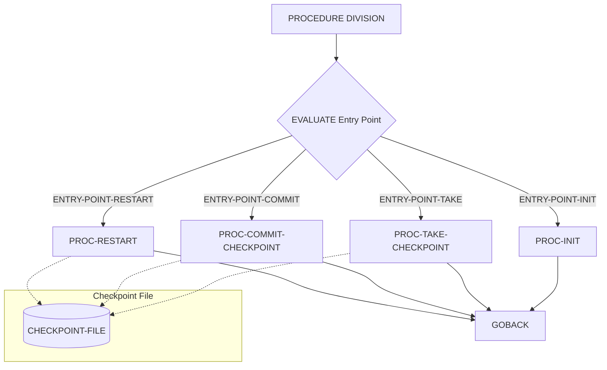

## Overview

CKPRST is a checkpoint/restart utility program designed to provide fault-tolerant batch processing capabilities. It enables long-running batch jobs to save their processing state at regular intervals, allowing them to resume from the last checkpoint rather than restarting from the beginning after a failure.

The program acts as a centralized checkpoint manager that can be called by other batch programs. It provides four main entry points: initialization, taking checkpoints, committing checkpoints, and handling restarts. This architecture ensures consistent checkpoint handling across all batch programs in the system.

CKPRST maintains checkpoint data in an indexed VSAM file, storing program state including record counts, processing position, and file statuses. The checkpoint frequency and error thresholds are configurable, allowing fine-tuned control over the balance between performance and recoverability.

## Program Structure



## Data Structures

### Working Storage

| Level | Name | Picture | Description |
|-------|------|---------|-------------|
| 01 | WS-FILE-STATUS | X(2) | File status code for CHECKPOINT-FILE operations |

### Linkage Section - CHECKPOINT-CONTROL

The main control structure passed from calling programs, defined in the CKPRST copybook:

#### Header Information

| Level | Name | Picture | Description |
|-------|------|---------|-------------|
| 10 | CK-PROGRAM-ID | X(8) | Identifier of the calling batch program |
| 10 | CK-RUN-DATE | X(8) | Date of the batch run |
| 10 | CK-RUN-TIME | X(6) | Time of the batch run |
| 10 | CK-STATUS | X(1) | Current checkpoint status |

**CK-STATUS Values (88-level conditions):**
- `I` - Initial state (CK-INITIAL)
- `A` - Active processing (CK-ACTIVE)
- `C` - Processing complete (CK-COMPLETE)
- `F` - Processing failed (CK-FAILED)
- `R` - Restarted from checkpoint (CK-RESTARTED)

#### Processing Counters

| Level | Name | Picture | Description |
|-------|------|---------|-------------|
| 10 | CK-RECORDS-READ | 9(9) COMP | Count of records read from input |
| 10 | CK-RECORDS-PROC | 9(9) COMP | Count of records successfully processed |
| 10 | CK-RECORDS-ERROR | 9(9) COMP | Count of records with errors |
| 10 | CK-RESTART-COUNT | 9(2) COMP | Number of restart attempts |

#### Position Tracking

| Level | Name | Picture | Description |
|-------|------|---------|-------------|
| 10 | CK-LAST-KEY | X(50) | Last record key processed |
| 10 | CK-LAST-TIME | X(26) | Timestamp of last checkpoint |
| 10 | CK-PHASE | X(2) | Current processing phase |

**CK-PHASE Values:**
- `00` - Initialization phase (CK-PHASE-INIT)
- `10` - Read phase (CK-PHASE-READ)
- `20` - Processing phase (CK-PHASE-PROC)
- `30` - Update phase (CK-PHASE-UPDT)
- `40` - Termination phase (CK-PHASE-TERM)

#### Resource Tracking

The structure tracks up to 5 files with their positions:

| Level | Name | Picture | Description |
|-------|------|---------|-------------|
| 15 | CK-FILE-NAME | X(8) | Logical file name |
| 15 | CK-FILE-POS | X(50) | Current file position/key |
| 15 | CK-FILE-STATUS | X(2) | File status code |

#### Control Parameters

| Level | Name | Picture | Default | Description |
|-------|------|---------|---------|-------------|
| 10 | CK-COMMIT-FREQ | 9(5) COMP | 1000 | Records between checkpoints |
| 10 | CK-MAX-ERRORS | 9(3) COMP | 100 | Maximum errors before abort |
| 10 | CK-MAX-RESTARTS | 9(2) COMP | 3 | Maximum restart attempts |
| 10 | CK-RESTART-MODE | X(1) | - | Current restart mode |

**CK-RESTART-MODE Values:**
- `N` - Normal processing (CK-MODE-NORMAL)
- `R` - Restart from checkpoint (CK-MODE-RESTART)
- `C` - Recovery mode (CK-MODE-RECOVER)

### Linkage Section - RETURN-STATUS

Return code handling structure from the RETHND copybook:

| Level | Name | Picture | Description |
|-------|------|---------|-------------|
| 10 | RETURN-CODE | S9(4) COMP | Standard return code |
| 10 | REASON-CODE | S9(4) COMP | Detailed reason code |
| 10 | MODULE-ID | X(8) | Module identifier |
| 10 | FUNCTION-ID | X(8) | Function identifier |

**RETURN-CODE Values:**
- `0` - Success (RC-SUCCESS)
- `4` - Warning (RC-WARNING)
- `8` - Error (RC-ERROR)
- `12` - Severe error (RC-SEVERE)
- `16` - Critical error (RC-CRITICAL)

## File I/O

### CHECKPOINT-FILE

| Property | Value |
|----------|-------|
| Logical Name | CHECKPOINT-FILE |
| Physical Assignment | CKPTFILE |
| Organization | Indexed (VSAM KSDS) |
| Access Mode | Dynamic |
| Record Key | CKR-KEY |
| File Status | WS-FILE-STATUS |

#### Record Layout (CHECKPOINT-RECORD)

| Level | Name | Picture | Description |
|-------|------|---------|-------------|
| 05 | CKR-KEY | | Composite key |
| 10 | CKR-PROGRAM-ID | X(8) | Program identifier (part of key) |
| 10 | CKR-RUN-DATE | X(8) | Run date (part of key) |
| 05 | CKR-DATA | X(400) | Serialized checkpoint data |

## Control Flow

### Entry Point Dispatch

The program uses an `EVALUATE TRUE` statement to dispatch control to the appropriate paragraph based on entry point flags set in the CHECKPOINT-CONTROL structure:

1. **PROC-INIT** - Called when `ENTRY-POINT-INIT` is true
   - Initializes checkpoint processing for a new batch run
   - Opens the checkpoint file
   - Sets initial status and counters

2. **PROC-TAKE-CHECKPOINT** - Called when `ENTRY-POINT-TAKE` is true
   - Saves current processing state to the checkpoint file
   - Updates position tracking information
   - Records all file positions for potential restart

3. **PROC-COMMIT-CHECKPOINT** - Called when `ENTRY-POINT-COMMIT` is true
   - Commits the checkpoint to make it permanent
   - Called after successful processing of a batch of records
   - Ensures data integrity across system boundaries

4. **PROC-RESTART** - Called when `ENTRY-POINT-RESTART` is true
   - Reads the last committed checkpoint
   - Restores processing state from saved data
   - Positions all tracked files for resumption

### Typical Calling Pattern

```
CALL 'CKPRST' USING CHECKPOINT-CONTROL RETURN-STATUS
```

Calling programs should:
1. Initialize checkpoint processing at job start
2. Take checkpoints at regular intervals (controlled by CK-COMMIT-FREQ)
3. Commit checkpoints after successful processing
4. Use restart logic when recovering from failures

## Dependencies

### Copybooks
- CKPRST - Checkpoint control structures and record layouts
- RETHND - Return code and error handling definitions

### Called Programs
None - This program is called by other batch programs as a utility.

### Related Programs
Programs that use checkpoint/restart functionality will call CKPRST for state management. Any batch program processing large volumes of data should integrate with this checkpoint service for fault tolerance.

## Usage Notes

### Checkpoint Frequency

The `CK-COMMIT-FREQ` field controls how often checkpoints are taken. The default value of 1000 records provides a balance between performance overhead and recovery granularity. For very long-running jobs, consider increasing this value; for critical processing, consider decreasing it.

### Error Handling

If `CK-RECORDS-ERROR` exceeds `CK-MAX-ERRORS`, the calling program should abort processing. Similarly, if `CK-RESTART-COUNT` exceeds `CK-MAX-RESTARTS`, the job should be investigated manually rather than automatically restarted.

### JCL Requirements

The CKPTFILE DD statement must point to a VSAM KSDS dataset. Example:
```jcl
//CKPTFILE DD DSN=YOUR.CHECKPOINT.FILE,DISP=SHR
```
