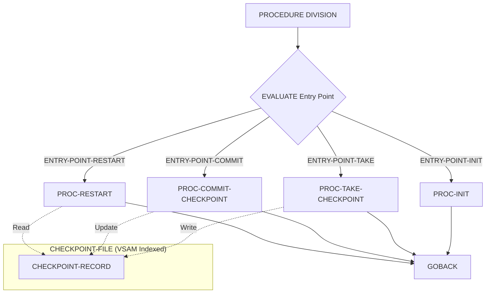

## Overview

CKPRST is a reusable checkpoint/restart service module that provides batch job recovery capabilities. It manages the persistence of processing state to enable jobs to restart from the point of failure rather than reprocessing from the beginning.

The program implements a standard checkpoint/restart pattern commonly used in mainframe batch processing. It maintains checkpoint records in an indexed VSAM file, tracking program execution state including record counts, processing phases, and file positions. This enables efficient recovery after job failures, system outages, or planned restarts.

CKPRST is designed to be called by other batch programs through a parameterized interface using the linkage section. The calling program provides a checkpoint control structure, and CKPRST handles the persistence and retrieval of checkpoint data.

## Program Structure



## Data Structures

### Working Storage

| Level | Name | Picture | Description |
|-------|------|---------|-------------|
| 01 | WS-FILE-STATUS | X(2) | VSAM file status code for CHECKPOINT-FILE |

### Linkage Section (CKPRST Copybook)

The `CHECKPOINT-CONTROL` structure is passed by calling programs:

| Level | Name | Picture | Description |
|-------|------|---------|-------------|
| 01 | CHECKPOINT-CONTROL | - | Main control structure |
| 05 | CK-HEADER | - | Header information |
| 10 | CK-PROGRAM-ID | X(8) | Calling program identifier |
| 10 | CK-RUN-DATE | X(8) | Current run date |
| 10 | CK-RUN-TIME | X(6) | Current run time |
| 10 | CK-STATUS | X(1) | Checkpoint status flag |
| 05 | CK-COUNTERS | - | Processing counters |
| 10 | CK-RECORDS-READ | 9(9) COMP | Total records read |
| 10 | CK-RECORDS-PROC | 9(9) COMP | Records processed successfully |
| 10 | CK-RECORDS-ERROR | 9(9) COMP | Records with errors |
| 10 | CK-RESTART-COUNT | 9(2) COMP | Number of restart attempts |
| 05 | CK-POSITION | - | Processing position data |
| 10 | CK-LAST-KEY | X(50) | Last processed record key |
| 10 | CK-LAST-TIME | X(26) | Timestamp of last checkpoint |
| 10 | CK-PHASE | X(2) | Current processing phase |
| 05 | CK-RESOURCES | - | File position tracking |
| 10 | CK-FILE-STATUS | OCCURS 5 | Status array for up to 5 files |
| 15 | CK-FILE-NAME | X(8) | File name |
| 15 | CK-FILE-POS | X(50) | File position/key |
| 15 | CK-FILE-STATUS | X(2) | File status code |
| 05 | CK-CONTROL-INFO | - | Control parameters |
| 10 | CK-COMMIT-FREQ | 9(5) COMP | Commit frequency (default 1000) |
| 10 | CK-MAX-ERRORS | 9(3) COMP | Maximum errors allowed (default 100) |
| 10 | CK-MAX-RESTARTS | 9(2) COMP | Maximum restart attempts (default 3) |
| 10 | CK-RESTART-MODE | X(1) | Restart mode flag |

#### Checkpoint Status Values (CK-STATUS)

| Value | 88-Level Name | Meaning |
|-------|---------------|---------|
| `'I'` | CK-INITIAL | Initial state |
| `'A'` | CK-ACTIVE | Checkpoint active/in progress |
| `'C'` | CK-COMPLETE | Processing completed successfully |
| `'F'` | CK-FAILED | Processing failed |
| `'R'` | CK-RESTARTED | Processing restarted from checkpoint |

#### Processing Phase Values (CK-PHASE)

| Value | 88-Level Name | Meaning |
|-------|---------------|---------|
| `'00'` | CK-PHASE-INIT | Initialization phase |
| `'10'` | CK-PHASE-READ | Read/input phase |
| `'20'` | CK-PHASE-PROC | Processing phase |
| `'30'` | CK-PHASE-UPDT | Update phase |
| `'40'` | CK-PHASE-TERM | Termination phase |

#### Restart Mode Values (CK-RESTART-MODE)

| Value | 88-Level Name | Meaning |
|-------|---------------|---------|
| `'N'` | CK-MODE-NORMAL | Normal processing mode |
| `'R'` | CK-MODE-RESTART | Restart from last checkpoint |
| `'C'` | CK-MODE-RECOVER | Recovery mode |

### Linkage Section (RETHND Copybook)

The `RETURN-STATUS` structure returns operation results:

| Level | Name | Picture | Description |
|-------|------|---------|-------------|
| 01 | RETURN-HANDLING | - | Return code handling structure |
| 05 | RETURN-STATUS | - | Status information |
| 10 | RETURN-CODE | S9(4) COMP | Return code (0=success, 4=warning, 8=error, 12=severe, 16=critical) |
| 10 | REASON-CODE | S9(4) COMP | Detailed reason code |
| 10 | MODULE-ID | X(8) | Module identifier |
| 10 | FUNCTION-ID | X(8) | Function identifier |

## File I/O

### CHECKPOINT-FILE

| Property | Value |
|----------|-------|
| Assign To | CKPTFILE |
| Organization | INDEXED |
| Access Mode | DYNAMIC |
| Record Key | CKR-KEY (CKR-PROGRAM-ID + CKR-RUN-DATE) |
| File Status | WS-FILE-STATUS |

The checkpoint file stores recovery information for batch jobs. Each record is keyed by program ID and run date, allowing multiple checkpoints per program (one per run).

### Checkpoint Record Structure

| Level | Name | Picture | Description |
|-------|------|---------|-------------|
| 01 | CHECKPOINT-RECORD | - | VSAM record structure |
| 05 | CKR-KEY | - | Composite primary key |
| 10 | CKR-PROGRAM-ID | X(8) | Program identifier |
| 10 | CKR-RUN-DATE | X(8) | Run date |
| 05 | CKR-DATA | X(400) | Checkpoint data payload |

## Control Flow

### Entry Point Dispatch

The program uses an `EVALUATE TRUE` statement to dispatch to the appropriate processing paragraph based on condition flags set in the `CHECKPOINT-CONTROL` structure. This is a common COBOL pattern for implementing multi-function service routines.

```cobol
EVALUATE TRUE
    WHEN ENTRY-POINT-INIT
        PERFORM PROC-INIT
    WHEN ENTRY-POINT-TAKE
        PERFORM PROC-TAKE-CHECKPOINT
    WHEN ENTRY-POINT-COMMIT
        PERFORM PROC-COMMIT-CHECKPOINT
    WHEN ENTRY-POINT-RESTART
        PERFORM PROC-RESTART
END-EVALUATE
```

### PROC-INIT

Initializes checkpoint processing for a new batch run. This should be called at the start of the batch job to set up the checkpoint environment.

### PROC-TAKE-CHECKPOINT

Takes a checkpoint by writing the current processing state to the checkpoint file. Calling programs should invoke this at regular intervals (controlled by `CK-COMMIT-FREQ`) to minimize reprocessing in case of failure.

### PROC-COMMIT-CHECKPOINT

Commits the checkpoint, finalizing the recorded state. This ensures the checkpoint is durably stored before continuing processing.

### PROC-RESTART

Handles restart processing by reading the last checkpoint record and restoring the processing state. The calling program should invoke this at startup to determine if a restart is needed and where to resume processing.

## Usage Pattern

Calling programs should use CKPRST as follows:

```cobol
* At job start - check for restart
MOVE 'R' TO CK-RESTART-MODE
CALL 'CKPRST' USING CHECKPOINT-CONTROL RETURN-STATUS

* During processing - take periodic checkpoints
IF RECORDS-PROCESSED >= CK-COMMIT-FREQ
    MOVE 'T' TO ENTRY-POINT-FLAG  
    CALL 'CKPRST' USING CHECKPOINT-CONTROL RETURN-STATUS
    MOVE 'C' TO ENTRY-POINT-FLAG
    CALL 'CKPRST' USING CHECKPOINT-CONTROL RETURN-STATUS
END-IF

* At job end - mark complete
MOVE 'C' TO CK-STATUS
CALL 'CKPRST' USING CHECKPOINT-CONTROL RETURN-STATUS
```

## Dependencies

### Copybooks

- **CKPRST** - Checkpoint/restart control structure and record layout
- **RETHND** - Return code handling and error reporting structures

### Called Programs

None - CKPRST is a service module that is called by other programs.

### Related Programs

Programs that utilize checkpoint/restart functionality will call CKPRST for recovery support. The copybook documentation for CKPRST.cpy lists the standard entry point routines:
- CKPINIT - Initialize checkpoint
- CKPTAKE - Take checkpoint  
- CKPCMIT - Commit checkpoint
- CKPRSTR - Restart from checkpoint

## Technical Notes

### COBOL Constructs Used

- **EVALUATE TRUE**: A COBOL pattern that evaluates multiple 88-level conditions to determine which paragraph to execute. This is similar to a switch/case statement in other languages.

- **Level 88 Conditions**: Boolean condition names that test specific values. For example, `CK-INITIAL` is true when `CK-STATUS` equals `'I'`.

- **INDEXED File Organization**: VSAM KSDS (Key-Sequenced Data Set) file with dynamic access mode, allowing both sequential and random access by key.

- **COMP Fields**: Binary numeric fields for efficient storage of counters and codes.

- **GOBACK**: Returns control to the calling program while preserving the run unit, appropriate for subprograms.
