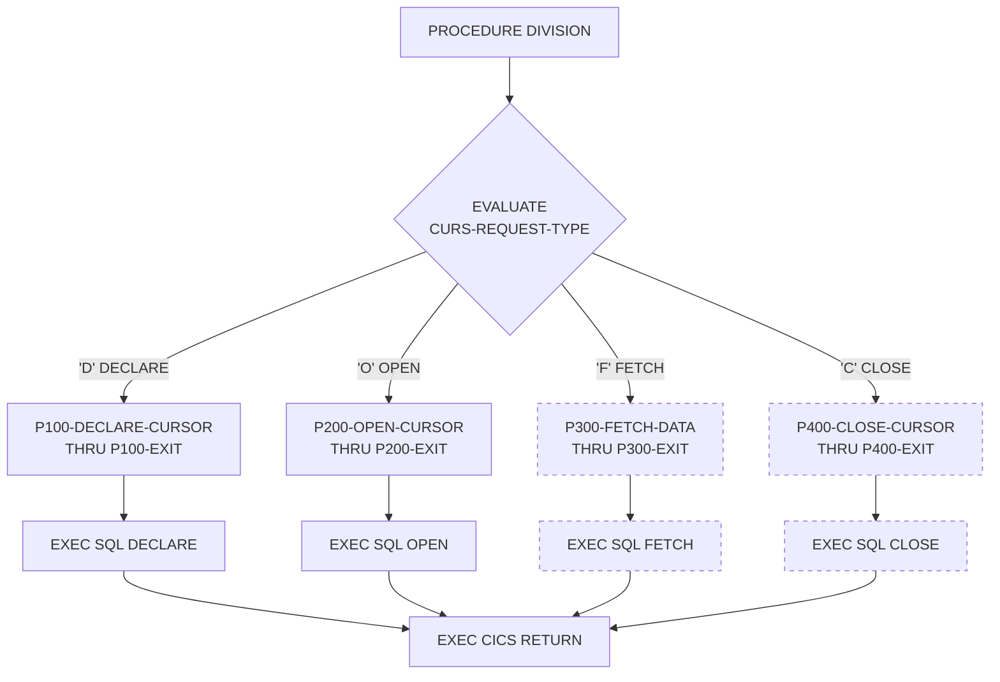

## Overview

CURSMGR is a CICS-based service program that provides centralized DB2 cursor management for online applications. It abstracts the complexity of cursor handling away from application programs, providing a consistent interface for cursor operations while implementing performance optimizations like array fetching.

The program supports four cursor operations:
- **Declare (D)** - Declare a cursor with optional array fetch support
- **Open (O)** - Open a cursor and reset statistics
- **Fetch (F)** - Fetch data from the cursor (single row or array)
- **Close (C)** - Close the cursor and release resources

Key features include:
- Dynamic cursor management using host variables for cursor names and SQL statements
- Array fetching capability for improved performance when retrieving multiple rows
- Cursor statistics tracking (fetch count, rows fetched, fetch time)
- CICS integration with proper transaction handling

:::note Source Status
The source file for this program appears to be incomplete. The P300-FETCH-DATA and P400-CLOSE-CURSOR paragraphs referenced in the EVALUATE statement are not present in the available source. This documentation describes the implemented functionality and the intended design based on program comments and structure.
:::

## Program Structure



*Note: Dashed boxes indicate paragraphs not present in available source*

## Data Structures

### Working Storage

| Level | Name | Picture | Description |
|-------|------|---------|-------------|
| 01 | WS-DB2-AREA | - | DB2 communication area (includes SQLCA) |
| 01 | WS-CURSOR-STATS | - | Cursor performance statistics |
| 05 | WS-FETCH-COUNT | PIC S9(8) COMP | Number of FETCH operations executed |
| 05 | WS-ROWS-FETCHED | PIC S9(8) COMP | Total rows retrieved |
| 05 | WS-FETCH-TIME | PIC S9(8) COMP | Cumulative fetch time |
| 01 | WS-ARRAY-AREA | - | Array fetch configuration |
| 05 | WS-MAX-ROWS | PIC S9(4) COMP | Maximum rows per array fetch (default: 20) |
| 05 | WS-ARRAY-SIZE | PIC S9(4) COMP | Current array size in use |

### Linkage Section (Interface)

| Level | Name | Picture | Description |
|-------|------|---------|-------------|
| 01 | CURSOR-REQUEST-AREA | - | Main interface structure |
| 05 | CURS-REQUEST-TYPE | PIC X | Request type code (see values below) |
| 05 | CURS-NAME | PIC X(18) | Cursor name (up to 18 characters) |
| 05 | CURS-STMT | PIC X(240) | SQL SELECT statement for cursor |
| 05 | CURS-ARRAY-FETCH | PIC X | Array fetch flag (`Y`/`N`, default `N`) |
| 05 | CURS-RESPONSE-CODE | PIC S9(8) COMP | Response code (0=success, else SQLCODE) |
| 05 | CURS-DATA-AREA | PIC X(3000) | Data buffer for fetched rows |
| 05 | CURS-DATA-LENGTH | PIC S9(4) COMP | Length of data returned |

### Request Type Codes (88-Level Conditions)

| Condition Name | Value | Description |
|----------------|-------|-------------|
| CURS-DECLARE | `D` | Declare cursor |
| CURS-OPEN | `O` | Open cursor |
| CURS-FETCH | `F` | Fetch from cursor |
| CURS-CLOSE | `C` | Close cursor |

### Array Fetch Flags (88-Level Conditions)

| Condition Name | Value | Description |
|----------------|-------|-------------|
| USE-ARRAY-FETCH | `Y` | Enable array fetching (multiple rows per fetch) |
| NO-ARRAY-FETCH | `N` | Single row fetching (default) |

## File I/O

This program does not perform any file I/O operations. It exclusively manages DB2 cursors through embedded SQL statements within a CICS environment.

## Control Flow

### Main Dispatch Logic

The procedure division uses an `EVALUATE TRUE` statement to dispatch to the appropriate paragraph based on the request type. Each paragraph is performed with a `THRU` clause to its corresponding exit paragraph, which is a common COBOL pattern for structured exits.

### P100-DECLARE-CURSOR (Declare)

Declares a DB2 cursor for subsequent operations:

1. Initializes `CURS-RESPONSE-CODE` to 0
2. Sets array size based on `CURS-ARRAY-FETCH` flag:
   - If `USE-ARRAY-FETCH`: sets `WS-ARRAY-SIZE` to `WS-MAX-ROWS` (20)
   - Otherwise: sets `WS-ARRAY-SIZE` to 1 (single row mode)
3. Executes `EXEC SQL DECLARE` using host variables:
   - `:CURS-NAME` - Dynamic cursor name
   - `:CURS-STMT` - SQL SELECT statement
4. If SQLCODE is non-zero, copies it to `CURS-RESPONSE-CODE`

**Dynamic Cursor Declaration**: The use of host variables (`:CURS-NAME` and `:CURS-STMT`) allows the calling program to specify both the cursor name and the SQL statement at runtime, providing flexibility for different query patterns.

### P200-OPEN-CURSOR (Open)

Opens a previously declared cursor:

1. Resets statistics counters:
   - `WS-FETCH-COUNT` = 0
   - `WS-ROWS-FETCHED` = 0
2. Executes `EXEC SQL OPEN :CURS-NAME`
3. Sets `CURS-RESPONSE-CODE` based on SQLCODE

### P300-FETCH-DATA (Fetch) - *Not Implemented*

This paragraph would fetch data from the open cursor. Based on the program design, it would likely:
- Support both single-row and array (multi-row) fetching
- Return data in `CURS-DATA-AREA` (3000-byte buffer)
- Set `CURS-DATA-LENGTH` to indicate returned data size
- Increment `WS-FETCH-COUNT` and `WS-ROWS-FETCHED` statistics
- Handle end-of-data (SQLCODE +100)

### P400-CLOSE-CURSOR (Close) - *Not Implemented*

This paragraph would close the cursor. Based on the program design, it would likely:
- Execute `EXEC SQL CLOSE :CURS-NAME`
- Release cursor resources
- Set appropriate response code

### CICS Integration

The program terminates with `EXEC CICS RETURN`, returning control to CICS after each operation. This is a pseudo-conversational pattern where:
- The calling transaction invokes CURSMGR for each cursor operation
- CURSMGR performs the requested operation and returns
- No CICS resources are held between calls (except the DB2 cursor itself)

## Array Fetching Optimization

Array fetching (also called multi-row fetch or rowset fetch) is a DB2 performance optimization that retrieves multiple rows in a single fetch operation, reducing the number of round-trips between the application and the database.

When `CURS-ARRAY-FETCH` is set to `'Y'`:
- The program configures for batch retrieval of up to 20 rows per fetch
- This is particularly beneficial for:
  - Scrollable list displays in online transactions
  - Bulk data retrieval operations
  - Reducing network overhead in distributed environments

The default single-row mode (`'N'`) is appropriate for:
- Operations expecting only one row
- Situations where row-by-row processing logic is required

## Dependencies

### Copybooks

This program uses inline SQL INCLUDE rather than separate copybooks:
- **SQLCA** - SQL Communication Area (included via `EXEC SQL INCLUDE SQLCA`)

### Called Programs

This program does not call other programs. It is designed to be called by other CICS transactions.

### Related Programs

Other online programs in the same directory that may use CURSMGR:
- INQPORT - Portfolio inquiry (likely uses cursors for position lists)
- INQHIST - History inquiry (likely uses cursors for transaction history)
- INQONLN - Online inquiry handler
- DB2ONLN - DB2 online operations

## Usage Example

To use CURSMGR from a calling CICS program:

```cobol
WORKING-STORAGE SECTION.
01  WS-CURSOR-REQUEST.
    05 WS-REQUEST-TYPE      PIC X.
    05 WS-CURSOR-NAME       PIC X(18) VALUE 'PORT_CURSOR'.
    05 WS-SQL-STMT          PIC X(240).
    05 WS-ARRAY-FLAG        PIC X VALUE 'Y'.
    05 WS-RESPONSE          PIC S9(8) COMP.
    05 WS-DATA-BUFFER       PIC X(3000).
    05 WS-DATA-LEN          PIC S9(4) COMP.

PROCEDURE DIVISION.
    * Build SQL statement
    STRING 'SELECT PORTFOLIO_ID, VALUE FROM POSITIONS '
           'WHERE ACCOUNT = '''
           WS-ACCOUNT-ID
           ''' ORDER BY PORTFOLIO_ID'
           DELIMITED SIZE
           INTO WS-SQL-STMT
    END-STRING
    
    * Declare cursor
    MOVE 'D' TO WS-REQUEST-TYPE
    EXEC CICS LINK PROGRAM('CURSMGR')
              COMMAREA(WS-CURSOR-REQUEST)
    END-EXEC
    
    * Open cursor  
    MOVE 'O' TO WS-REQUEST-TYPE
    EXEC CICS LINK PROGRAM('CURSMGR')
              COMMAREA(WS-CURSOR-REQUEST)
    END-EXEC
    
    * Fetch rows (array fetch enabled)
    MOVE 'F' TO WS-REQUEST-TYPE
    EXEC CICS LINK PROGRAM('CURSMGR')
              COMMAREA(WS-CURSOR-REQUEST)
    END-EXEC
    
    * Close cursor when done
    MOVE 'C' TO WS-REQUEST-TYPE
    EXEC CICS LINK PROGRAM('CURSMGR')
              COMMAREA(WS-CURSOR-REQUEST)
    END-EXEC
```

## Technical Notes

### Dynamic SQL Considerations

The use of host variables for cursor name and SQL statement in the DECLARE statement is an advanced DB2 technique. In standard DB2/COBOL, cursor names are typically static identifiers. The approach shown here suggests the program may be using:
- DB2 dynamic SQL features
- A cursor pooling mechanism where predefined cursors are mapped to logical names
- A preprocessor or framework that resolves the dynamic references

### CICS Transaction Design

This program follows CICS service program patterns:
- Stateless operation (each call is independent)
- Communication via COMMAREA (linkage section)
- Returns immediately after each operation
- Cursor state is maintained by DB2, not by the program
