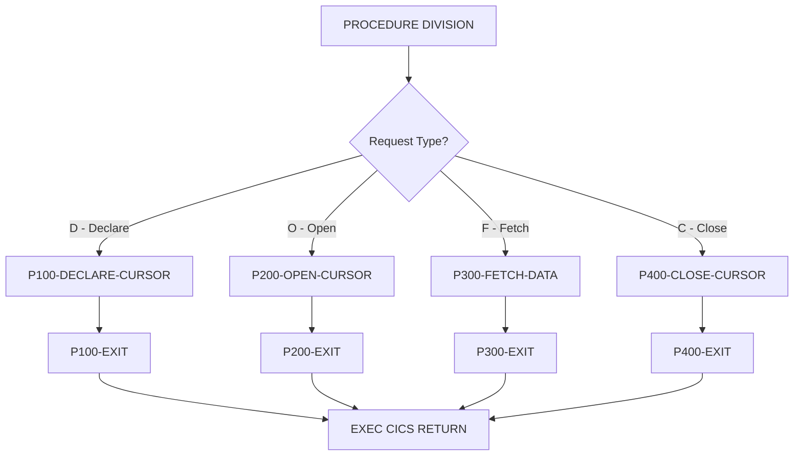

## Overview

CURSMGR is a CICS-based COBOL subprogram that provides centralized DB2 cursor management services for online programs. It abstracts the complexity of cursor operations and provides a consistent interface for declaring, opening, fetching from, and closing DB2 cursors.

Key features of this cursor manager include:

- **Cursor Lifecycle Management**: Handles the complete lifecycle of DB2 cursors (declare, open, fetch, close)
- **Array Fetching**: Supports fetching multiple rows in a single operation for improved performance (up to 20 rows per fetch)
- **Performance Statistics**: Tracks fetch counts, rows fetched, and fetch timing
- **Standardized Interface**: Provides a uniform calling convention for all cursor operations

This module is designed to be called by other CICS online programs that need to execute DB2 queries, providing a layer of abstraction that simplifies cursor handling and enables consistent error handling across the application.

## Program Structure



## Data Structures

### Working Storage

| Level | Name | Picture | Description |
|-------|------|---------|-------------|
| 01 | WS-DB2-AREA | - | DB2 communication area |
| - | SQLCA | (included) | SQL Communication Area via EXEC SQL INCLUDE |
| 01 | WS-CURSOR-STATS | - | Cursor statistics group |
| 05 | WS-FETCH-COUNT | S9(8) COMP | Number of fetch operations performed |
| 05 | WS-ROWS-FETCHED | S9(8) COMP | Total rows fetched |
| 05 | WS-FETCH-TIME | S9(8) COMP | Cumulative fetch time |
| 01 | WS-ARRAY-AREA | - | Array fetch configuration |
| 05 | WS-MAX-ROWS | S9(4) COMP | Maximum rows per fetch (default: 20) |
| 05 | WS-ARRAY-SIZE | S9(4) COMP | Current array size in use |

### Linkage Section (Calling Interface)

The program receives parameters through the CURSOR-REQUEST-AREA structure:

| Level | Name | Picture | Description |
|-------|------|---------|-------------|
| 01 | CURSOR-REQUEST-AREA | - | Main parameter structure |
| 05 | CURS-REQUEST-TYPE | X | Request type code (see table below) |
| 05 | CURS-NAME | X(18) | Cursor name identifier |
| 05 | CURS-STMT | X(240) | SQL SELECT statement for cursor |
| 05 | CURS-ARRAY-FETCH | X | Array fetch flag (`Y`/`N`) |
| 05 | CURS-RESPONSE-CODE | S9(8) COMP | Response/SQLCODE on return |
| 05 | CURS-DATA-AREA | X(3000) | Data buffer for fetched rows |
| 05 | CURS-DATA-LENGTH | S9(4) COMP | Length of data in buffer |

### Request Type Codes

| Code | 88-Level Name | Description |
|------|---------------|-------------|
| `D` | CURS-DECLARE | Declare a new cursor |
| `O` | CURS-OPEN | Open a declared cursor |
| `F` | CURS-FETCH | Fetch data from cursor |
| `C` | CURS-CLOSE | Close the cursor |

### Array Fetch Flag

| Value | 88-Level Name | Description |
|-------|---------------|-------------|
| `Y` | USE-ARRAY-FETCH | Enable multi-row fetch (up to 20 rows) |
| `N` | NO-ARRAY-FETCH | Single-row fetch mode |

## File I/O

This program does not use traditional file I/O. All data access is through DB2 SQL cursor operations via the linkage section interface.

## Control Flow

### Main Entry Point

The program uses an EVALUATE statement to dispatch to the appropriate paragraph based on CURS-REQUEST-TYPE. After processing, the program returns to CICS via `EXEC CICS RETURN`.

### Declare Cursor (P100-DECLARE-CURSOR)

Declares a DB2 cursor for the specified SQL statement:

1. Initializes CURS-RESPONSE-CODE to 0
2. Sets array size based on CURS-ARRAY-FETCH flag:
   - If `Y`: Uses WS-MAX-ROWS (20 rows)
   - If `N`: Uses 1 row
3. Executes `EXEC SQL DECLARE` with the cursor name and SQL statement
4. If SQLCODE is non-zero, returns the SQLCODE in CURS-RESPONSE-CODE

```sql
DECLARE :CURS-NAME CURSOR FOR :CURS-STMT
```

### Open Cursor (P200-OPEN-CURSOR)

Opens a previously declared cursor for fetching:

1. Resets fetch statistics (WS-FETCH-COUNT, WS-ROWS-FETCHED)
2. Executes `EXEC SQL OPEN` for the named cursor
3. Returns SQLCODE in CURS-RESPONSE-CODE (0 on success)

```sql
OPEN :CURS-NAME
```

### Fetch Data (P300-FETCH-DATA)

Fetches data from an open cursor into the CURS-DATA-AREA buffer. The fetch operation:

- Retrieves single or multiple rows based on the array fetch setting
- Updates WS-FETCH-COUNT and WS-ROWS-FETCHED statistics
- Returns fetched data in CURS-DATA-AREA with length in CURS-DATA-LENGTH
- Returns SQLCODE in CURS-RESPONSE-CODE (100 indicates end of data)

### Close Cursor (P400-CLOSE-CURSOR)

Closes an open cursor to release resources:

1. Executes `EXEC SQL CLOSE` for the named cursor
2. Returns SQLCODE in CURS-RESPONSE-CODE

```sql
CLOSE :CURS-NAME
```

## Dependencies

### Copybooks

This program uses inline SQL INCLUDE rather than traditional copybooks:

- **SQLCA** - SQL Communication Area (included via `EXEC SQL INCLUDE SQLCA END-EXEC`)

### Called Programs

This program does not call other programs. It is designed to be called by other CICS programs.

### Related Programs

Programs in the online subsystem that may use CURSMGR for cursor operations:

| Program | Description |
|---------|-------------|
| DB2ONLN | DB2 online processing |
| DB2RECV | DB2 recovery processing |
| INQHIST | History inquiry |
| INQONLN | Online inquiry |
| INQPORT | Portfolio inquiry |

## Technical Notes

### Array Fetch Optimization

Array fetching (also known as multi-row fetch) is a DB2 performance optimization technique that retrieves multiple rows in a single fetch operation, reducing the number of round trips between the application and the database.

When USE-ARRAY-FETCH is enabled:
- Up to 20 rows are fetched per operation (WS-MAX-ROWS)
- The CURS-DATA-AREA (3000 bytes) receives multiple row images
- CURS-DATA-LENGTH indicates the total bytes of data returned

This is particularly beneficial for:
- Batch-style processing within online transactions
- Populating scrollable lists or tables
- Reducing network overhead in distributed environments

### CICS Integration

The program is designed for the CICS transaction processing environment:
- Uses `EXEC CICS RETURN` to return control to CICS
- Can be invoked via `EXEC CICS LINK` from other CICS programs
- Maintains cursor state across CICS pseudo-conversational transactions when used with appropriate techniques

### Calling Convention

To call CURSMGR from another CICS COBOL program:

```cobol
WORKING-STORAGE SECTION.
01  WS-CURSOR-REQUEST.
    05  WS-REQUEST-TYPE      PIC X.
    05  WS-CURSOR-NAME       PIC X(18).
    05  WS-SQL-STMT          PIC X(240).
    05  WS-ARRAY-FLAG        PIC X.
    05  WS-RESPONSE          PIC S9(8) COMP.
    05  WS-DATA-AREA         PIC X(3000).
    05  WS-DATA-LEN          PIC S9(4) COMP.

PROCEDURE DIVISION.
* Declare cursor
    MOVE 'D' TO WS-REQUEST-TYPE
    MOVE 'PORTFOLIO-CURSOR' TO WS-CURSOR-NAME
    MOVE 'SELECT * FROM PORTFOLIO WHERE STATUS = ''A'''
      TO WS-SQL-STMT
    MOVE 'Y' TO WS-ARRAY-FLAG
    EXEC CICS LINK PROGRAM('CURSMGR')
         COMMAREA(WS-CURSOR-REQUEST)
    END-EXEC
    
* Open cursor
    MOVE 'O' TO WS-REQUEST-TYPE
    EXEC CICS LINK PROGRAM('CURSMGR')
         COMMAREA(WS-CURSOR-REQUEST)
    END-EXEC
    
* Fetch loop
    PERFORM UNTIL WS-RESPONSE = 100
        MOVE 'F' TO WS-REQUEST-TYPE
        EXEC CICS LINK PROGRAM('CURSMGR')
             COMMAREA(WS-CURSOR-REQUEST)
        END-EXEC
        IF WS-RESPONSE = 0
            ... process WS-DATA-AREA ...
        END-IF
    END-PERFORM
    
* Close cursor
    MOVE 'C' TO WS-REQUEST-TYPE
    EXEC CICS LINK PROGRAM('CURSMGR')
         COMMAREA(WS-CURSOR-REQUEST)
    END-EXEC
```

### Response Codes

| Code | Meaning |
|------|---------|
| 0 | Success |
| 100 | End of data (no more rows to fetch) |
| Other | DB2 SQLCODE indicating error condition |

### Dynamic SQL Considerations

The cursor uses dynamic SQL via host variables for both the cursor name and SQL statement. This provides flexibility but requires:
- Proper SQL statement formatting in CURS-STMT
- Valid cursor names (up to 18 characters)
- Appropriate authorization for the SQL being executed
