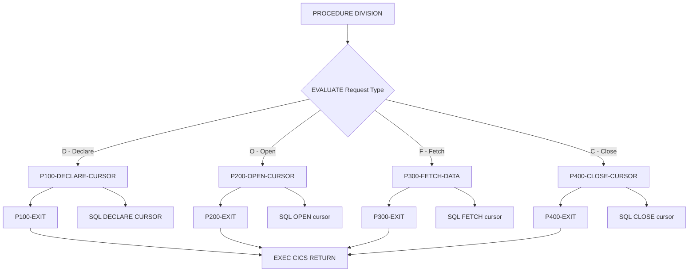

## Overview

CURSMGR is a CICS-based subprogram that provides centralized cursor management services for online programs. It encapsulates DB2 cursor operations including declaration, opening, fetching, and closing, while implementing performance optimization techniques such as array fetching.

The program serves as a reusable component that standardizes cursor handling across online applications, providing:
- **Cursor lifecycle management** - Declare, open, fetch, and close operations
- **Array fetching support** - Batch retrieval of multiple rows for improved performance
- **Cursor statistics tracking** - Monitoring fetch counts and rows retrieved
- **Unified response handling** - Consistent SQLCODE-based error reporting

By centralizing cursor operations, CURSMGR promotes consistent coding practices, simplifies maintenance, and enables performance tuning at a single point.

## Program Structure



## Data Structures

### Working Storage

| Level | Name | Picture | Description |
|-------|------|---------|-------------|
| 01 | WS-DB2-AREA | | DB2 communication area |
| - | SQLCA | (INCLUDE) | SQL Communication Area (included via EXEC SQL) |
| 01 | WS-CURSOR-STATS | | Cursor statistics tracking |
| 05 | WS-FETCH-COUNT | S9(8) COMP | Number of fetch operations performed |
| 05 | WS-ROWS-FETCHED | S9(8) COMP | Total rows retrieved |
| 05 | WS-FETCH-TIME | S9(8) COMP | Cumulative fetch time |
| 01 | WS-ARRAY-AREA | | Array fetch configuration |
| 05 | WS-MAX-ROWS | S9(4) COMP | Maximum rows per fetch (default 20) |
| 05 | WS-ARRAY-SIZE | S9(4) COMP | Current array size setting |

### Linkage Section (Calling Interface)

| Level | Name | Picture | Description |
|-------|------|---------|-------------|
| 01 | CURSOR-REQUEST-AREA | | Main request structure |
| 05 | CURS-REQUEST-TYPE | X | Operation code (see table below) |
| 05 | CURS-NAME | X(18) | Cursor name |
| 05 | CURS-STMT | X(240) | SQL SELECT statement for cursor |
| 05 | CURS-ARRAY-FETCH | X | Array fetch flag ('Y'/'N') |
| 05 | CURS-RESPONSE-CODE | S9(8) COMP | Response code (SQLCODE) |
| 05 | CURS-DATA-AREA | X(3000) | Data buffer for fetched rows |
| 05 | CURS-DATA-LENGTH | S9(4) COMP | Length of data in buffer |

### Request Type Codes

| Code | 88-Level Name | Description |
|------|---------------|-------------|
| D | CURS-DECLARE | Declare a new cursor |
| O | CURS-OPEN | Open an existing cursor |
| F | CURS-FETCH | Fetch data from cursor |
| C | CURS-CLOSE | Close the cursor |

### Array Fetch Flag

| Value | 88-Level Name | Description |
|-------|---------------|-------------|
| Y | USE-ARRAY-FETCH | Enable array fetching (up to 20 rows) |
| N | NO-ARRAY-FETCH | Single-row fetch mode |

## Calling Interface

### COBOL Call Example (from CICS program)

```cobol
       01  WS-CURSOR-REQUEST.
           05 WS-REQUEST-TYPE       PIC X.
           05 WS-CURSOR-NAME        PIC X(18).
           05 WS-SQL-STMT           PIC X(240).
           05 WS-ARRAY-FLAG         PIC X.
           05 WS-RESPONSE           PIC S9(8) COMP.
           05 WS-DATA-BUFFER        PIC X(3000).
           05 WS-DATA-LEN           PIC S9(4) COMP.
       
       * Declare cursor
           MOVE 'D' TO WS-REQUEST-TYPE
           MOVE 'POSITION-CURSOR' TO WS-CURSOR-NAME
           MOVE 'SELECT * FROM POSITIONS WHERE ACCT = :HV-ACCT'
             TO WS-SQL-STMT
           MOVE 'Y' TO WS-ARRAY-FLAG
           EXEC CICS LINK
               PROGRAM('CURSMGR')
               COMMAREA(WS-CURSOR-REQUEST)
               LENGTH(LENGTH OF WS-CURSOR-REQUEST)
           END-EXEC
       
       * Open cursor
           MOVE 'O' TO WS-REQUEST-TYPE
           EXEC CICS LINK
               PROGRAM('CURSMGR')
               COMMAREA(WS-CURSOR-REQUEST)
               LENGTH(LENGTH OF WS-CURSOR-REQUEST)
           END-EXEC
       
       * Fetch data
           MOVE 'F' TO WS-REQUEST-TYPE
           EXEC CICS LINK
               PROGRAM('CURSMGR')
               COMMAREA(WS-CURSOR-REQUEST)
               LENGTH(LENGTH OF WS-CURSOR-REQUEST)
           END-EXEC
       
       * Close cursor
           MOVE 'C' TO WS-REQUEST-TYPE
           EXEC CICS LINK
               PROGRAM('CURSMGR')
               COMMAREA(WS-CURSOR-REQUEST)
               LENGTH(LENGTH OF WS-CURSOR-REQUEST)
           END-EXEC
```

## Control Flow

### Declare Cursor (P100-DECLARE-CURSOR)

Declares a new DB2 cursor with the specified SQL statement:

1. Initializes response code to 0
2. Sets array size based on `CURS-ARRAY-FETCH` flag:
   - If 'Y': Sets `WS-ARRAY-SIZE` to `WS-MAX-ROWS` (20)
   - If 'N': Sets `WS-ARRAY-SIZE` to 1
3. Executes `EXEC SQL DECLARE :CURS-NAME CURSOR FOR :CURS-STMT END-EXEC`
4. If SQLCODE ≠ 0, moves SQLCODE to response code

### Open Cursor (P200-OPEN-CURSOR)

Opens a previously declared cursor for fetching:

1. Resets statistics counters:
   - `WS-FETCH-COUNT` = 0
   - `WS-ROWS-FETCHED` = 0
2. Executes `EXEC SQL OPEN :CURS-NAME END-EXEC`
3. Sets response code to SQLCODE (0 for success)

### Fetch Data (P300-FETCH-DATA)

Fetches data from an open cursor into the data area. When array fetching is enabled, retrieves multiple rows in a single operation for improved performance.

*Note: This paragraph's implementation is not present in the available source.*

### Close Cursor (P400-CLOSE-CURSOR)

Closes the cursor and releases associated resources.

*Note: This paragraph's implementation is not present in the available source.*

### Program Termination

After completing the requested operation, the program returns control to CICS:
```cobol
EXEC CICS RETURN END-EXEC
```

## File I/O

This program does not perform any file I/O operations. All data exchange occurs through:
- The linkage section parameter (CURSOR-REQUEST-AREA) passed via CICS COMMAREA
- Embedded SQL statements to DB2

## SQL Operations

| Operation | SQL Statement | Purpose |
|-----------|---------------|---------|
| Declare | `DECLARE :name CURSOR FOR :stmt` | Define cursor with SQL statement |
| Open | `OPEN :name` | Open cursor for fetching |
| Fetch | `FETCH :name INTO :data-area` | Retrieve row(s) from cursor |
| Close | `CLOSE :name` | Close cursor and release resources |

## Dependencies

### Copybooks

- **SQLCA** - SQL Communication Area (included via `EXEC SQL INCLUDE SQLCA END-EXEC`)

### Called Programs

None - this program does not call other programs.

### Calling Programs

This program is designed to be called by any CICS online program that requires DB2 cursor operations. Potential callers include:
- Portfolio inquiry programs
- Position display programs
- Transaction history browsers
- Any program requiring scrollable result sets

## Technical Notes

### Array Fetching

Array fetching (also known as multi-row fetch) retrieves multiple rows in a single database call, significantly reducing network round-trips and improving performance for large result sets. When enabled:

- Up to 20 rows are fetched per operation (`WS-MAX-ROWS`)
- The `CURS-DATA-AREA` buffer (3000 bytes) holds the fetched rows
- `CURS-DATA-LENGTH` indicates the amount of data returned

This is particularly beneficial in CICS environments where minimizing DB2 calls improves response time.

### Dynamic Cursor Declaration

The program uses host variables for both cursor name (`:CURS-NAME`) and SQL statement (`:CURS-STMT`), enabling dynamic cursor creation. This allows calling programs to:
- Define different cursors at runtime
- Use different SQL statements for different queries
- Reuse the cursor manager for various data access patterns

### CICS Considerations

- The program uses `EXEC CICS RETURN` to return control to the calling program
- Data is passed via the COMMAREA (CURSOR-REQUEST-AREA)
- Each CICS task has its own working storage, ensuring thread safety
- Cursor state must be managed carefully across pseudo-conversational transactions

### Response Codes

The `CURS-RESPONSE-CODE` field contains the DB2 SQLCODE:

| SQLCODE | Meaning |
|---------|---------|
| 0 | Successful operation |
| +100 | No more rows (end of cursor) |
| -501 | Cursor not open |
| -502 | Cursor already open |
| -504 | Cursor not declared |
| Other | DB2 error (see DB2 SQL Reference) |

### Source Code Note

:::caution Incomplete Source
The available source code for this program appears to be incomplete. The P300-FETCH-DATA and P400-CLOSE-CURSOR paragraphs referenced in the EVALUATE statement are not present in the source file. The documentation above describes the intended functionality based on the program comments and available code structure.
:::
