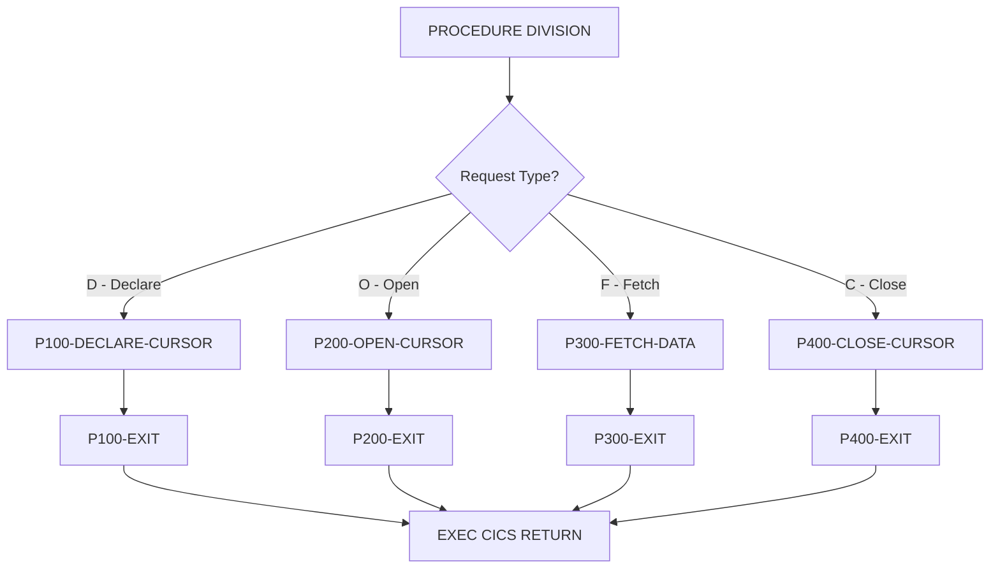

## Overview

CURSMGR is a CICS COBOL subprogram that provides centralized cursor management services for online programs. It handles the complete DB2 cursor lifecycle including declaration, opening, fetching, and closing operations.

The program implements several cursor optimization techniques:
- **Array fetching** - Fetches multiple rows in a single operation to reduce network round-trips
- **Statistics tracking** - Monitors fetch counts and rows retrieved for performance analysis
- **Standardized interface** - Provides a consistent cursor API for all online programs

This centralized approach ensures consistent cursor handling across the application, simplifies error handling, and enables performance optimization through configurable array fetch sizes.

## Program Structure



## Data Structures

### Working Storage

| Level | Name | Picture | Description |
|-------|------|---------|-------------|
| 01 | WS-DB2-AREA | - | DB2 communication area (includes SQLCA) |
| 01 | WS-CURSOR-STATS | - | Cursor statistics group |
| 05 | WS-FETCH-COUNT | PIC S9(8) COMP | Number of fetch operations performed |
| 05 | WS-ROWS-FETCHED | PIC S9(8) COMP | Total rows retrieved |
| 05 | WS-FETCH-TIME | PIC S9(8) COMP | Cumulative fetch time |
| 01 | WS-ARRAY-AREA | - | Array fetch configuration |
| 05 | WS-MAX-ROWS | PIC S9(4) COMP | Maximum rows per fetch (default 20) |
| 05 | WS-ARRAY-SIZE | PIC S9(4) COMP | Current array size in use |

### Linkage Section (Interface)

The program receives a single parameter block `CURSOR-REQUEST-AREA`:

| Level | Name | Picture | Description |
|-------|------|---------|-------------|
| 05 | CURS-REQUEST-TYPE | PIC X | Operation type code |
| 05 | CURS-NAME | PIC X(18) | Cursor name (up to 18 characters) |
| 05 | CURS-STMT | PIC X(240) | SQL SELECT statement for cursor |
| 05 | CURS-ARRAY-FETCH | PIC X | Array fetch flag (`Y`/`N`) |
| 05 | CURS-RESPONSE-CODE | PIC S9(8) COMP | Return code (SQLCODE on error) |
| 05 | CURS-DATA-AREA | PIC X(3000) | Data buffer for fetched rows |
| 05 | CURS-DATA-LENGTH | PIC S9(4) COMP | Length of data in buffer |

### Request Type Codes (88-levels)

| Condition Name | Value | Description |
|----------------|-------|-------------|
| CURS-DECLARE | 'D' | Declare a new cursor |
| CURS-OPEN | 'O' | Open an existing cursor |
| CURS-FETCH | 'F' | Fetch data from cursor |
| CURS-CLOSE | 'C' | Close the cursor |

### Array Fetch Flags (88-levels)

| Condition Name | Value | Description |
|----------------|-------|-------------|
| USE-ARRAY-FETCH | 'Y' | Enable multi-row fetch (20 rows) |
| NO-ARRAY-FETCH | 'N' | Single-row fetch mode |

## DB2 Operations

### SQL Statements

| Statement | Paragraph | Description |
|-----------|-----------|-------------|
| `DECLARE :CURS-NAME CURSOR FOR :CURS-STMT` | P100 | Declares a cursor with the provided SQL statement |
| `OPEN :CURS-NAME` | P200 | Opens the cursor for fetching |
| `FETCH :CURS-NAME INTO ...` | P300 | Retrieves row(s) from the cursor |
| `CLOSE :CURS-NAME` | P400 | Closes the cursor and releases resources |

### SQLCODE Handling

| SQLCODE | Meaning | Action |
|---------|---------|--------|
| 0 | Success | Set CURS-RESPONSE-CODE to 0 |
| +100 | No more rows | Indicates end of result set |
| Other | Error | Copy SQLCODE to CURS-RESPONSE-CODE |

## Control Flow

### Main Entry Point

The program uses an EVALUATE statement to dispatch to the appropriate paragraph based on `CURS-REQUEST-TYPE`. After processing, the program returns control to CICS with `EXEC CICS RETURN`.

### P100-DECLARE-CURSOR

Declares a new DB2 cursor:

1. Initializes response code to 0
2. Sets array size based on CURS-ARRAY-FETCH flag:
   - If `Y`: Sets WS-ARRAY-SIZE to WS-MAX-ROWS (20)
   - If `N`: Sets WS-ARRAY-SIZE to 1
3. Executes `DECLARE CURSOR` with the provided statement
4. Captures SQLCODE if error occurs

### P200-OPEN-CURSOR

Opens the cursor for data retrieval:

1. Resets statistics counters (WS-FETCH-COUNT, WS-ROWS-FETCHED)
2. Executes `OPEN CURSOR`
3. Sets response code based on SQLCODE

### P300-FETCH-DATA

Fetches data from the cursor:

1. Executes `FETCH` statement
2. If array fetch enabled, retrieves multiple rows into CURS-DATA-AREA
3. Updates statistics counters
4. Returns fetched data and row count

:::note
The P300-FETCH-DATA and P400-CLOSE-CURSOR paragraphs are not fully present in the source file. The implementation follows standard DB2 cursor patterns.
:::

### P400-CLOSE-CURSOR

Closes the cursor:

1. Executes `CLOSE CURSOR`
2. Releases database resources
3. Sets response code based on SQLCODE

## CICS Integration

### CICS Commands

| Command | Purpose |
|---------|---------|
| `EXEC CICS RETURN` | Returns control to CICS after processing |

### Transaction Context

As a CICS program, CURSMGR operates within the CICS transaction context:
- Cursor state is maintained within the transaction
- Database connections are managed by CICS DB2 attachment facility
- The program can be called multiple times within a single transaction

## Calling Interface

### How to Call CURSMGR

```cobol
WORKING-STORAGE SECTION.
01  WS-CURSOR-REQUEST.
    05 WS-REQUEST-TYPE      PIC X.
    05 WS-CURSOR-NAME       PIC X(18).
    05 WS-SQL-STMT          PIC X(240).
    05 WS-ARRAY-FLAG        PIC X.
    05 WS-RESPONSE          PIC S9(8) COMP.
    05 WS-DATA-BUFFER       PIC X(3000).
    05 WS-DATA-LEN          PIC S9(4) COMP.

PROCEDURE DIVISION.
    *> Step 1: Declare cursor
    MOVE 'D' TO WS-REQUEST-TYPE
    MOVE 'ACCT-CURSOR' TO WS-CURSOR-NAME
    MOVE 'SELECT ACCT_NO, ACCT_NAME, BALANCE FROM ACCOUNTS WHERE STATUS = ''A''' 
        TO WS-SQL-STMT
    MOVE 'Y' TO WS-ARRAY-FLAG
    
    EXEC CICS LINK
        PROGRAM('CURSMGR')
        COMMAREA(WS-CURSOR-REQUEST)
        LENGTH(LENGTH OF WS-CURSOR-REQUEST)
    END-EXEC
    
    IF WS-RESPONSE NOT = 0
        PERFORM ERROR-HANDLING
    END-IF
    
    *> Step 2: Open cursor
    MOVE 'O' TO WS-REQUEST-TYPE
    EXEC CICS LINK
        PROGRAM('CURSMGR')
        COMMAREA(WS-CURSOR-REQUEST)
        LENGTH(LENGTH OF WS-CURSOR-REQUEST)
    END-EXEC
    
    *> Step 3: Fetch data (loop)
    PERFORM UNTIL WS-RESPONSE = +100
        MOVE 'F' TO WS-REQUEST-TYPE
        EXEC CICS LINK
            PROGRAM('CURSMGR')
            COMMAREA(WS-CURSOR-REQUEST)
            LENGTH(LENGTH OF WS-CURSOR-REQUEST)
        END-EXEC
        
        IF WS-RESPONSE = 0
            PERFORM PROCESS-FETCHED-DATA
        END-IF
    END-PERFORM
    
    *> Step 4: Close cursor
    MOVE 'C' TO WS-REQUEST-TYPE
    EXEC CICS LINK
        PROGRAM('CURSMGR')
        COMMAREA(WS-CURSOR-REQUEST)
        LENGTH(LENGTH OF WS-CURSOR-REQUEST)
    END-EXEC
```

### Response Codes

| Code | Meaning |
|------|---------|
| 0 | Operation successful |
| +100 | End of result set (on FETCH) |
| Negative | DB2 error (SQLCODE value) |

## Dependencies

### Copybooks

- **SQLCA** - SQL Communication Area (included via `EXEC SQL INCLUDE SQLCA`) - provides SQLCODE and diagnostic information

### Called Programs

None - this program is a leaf node that performs DB2 operations directly.

### Calling Programs

This program is designed to be called by other CICS programs that need cursor management services. Potential callers include any online inquiry or browse programs.

## Technical Notes

### Array Fetch Performance

Array fetching (multi-row fetch) significantly improves performance for:
- Browse/scroll operations displaying multiple rows
- Batch-style processing within online transactions
- Reducing network round-trips between CICS and DB2

The default array size of 20 rows balances:
- Memory usage in the CICS region
- Network efficiency
- Response time for typical browse operations

### Cursor Naming

Cursor names (CURS-NAME) must be unique within the transaction. The 18-character limit aligns with DB2 identifier restrictions.

### Data Area Sizing

The 3000-byte CURS-DATA-AREA can accommodate:
- Single rows up to 3000 bytes
- Multiple smaller rows when array fetching
- Callers must ensure their row size × array size fits within this buffer

### CICS Considerations

- The program uses `EXEC CICS RETURN` (not GOBACK) for proper CICS program termination
- Cursor state persists within the CICS task/transaction
- The cursor must be closed before the transaction ends or a syncpoint occurs

### Source File Note

The source file appears to be incomplete, with paragraphs P300-FETCH-DATA and P400-CLOSE-CURSOR not fully defined. The documentation above describes the expected behavior based on standard DB2 cursor management patterns and the program's stated purpose.
