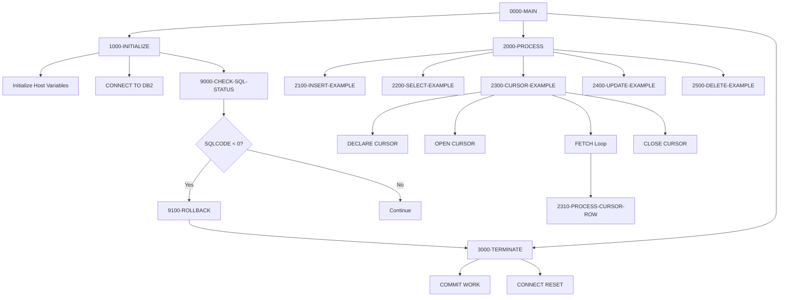

:::info Template Program
This is a **template program** intended to serve as a reference implementation and starting point for developers creating new DB2 programs. It demonstrates standard patterns for database operations in COBOL/DB2.
:::

## Overview

DB2-HANDLING (internally named DB2HNDL) is a template program that demonstrates best practices for DB2 database interactions in COBOL. It provides working examples of all standard SQL operations that developers can copy and adapt for their specific needs.

**The template demonstrates:**
- **Connection management**: Connecting to and disconnecting from DB2
- **CRUD operations**: INSERT, SELECT, UPDATE, and DELETE statements
- **Cursor processing**: Declaring, opening, fetching, and closing cursors
- **Host variables**: Proper declaration and usage with null indicators
- **Error handling**: Checking SQLCODE and handling errors with rollback
- **Transaction control**: COMMIT and ROLLBACK operations

This template follows the project's coding standards and can be used as a foundation for new DB2 programs.

## Program Structure



## Data Structures

### SQL Communication Area (SQLCA)

The SQLCA is included via `EXEC SQL INCLUDE SQLCA END-EXEC` and provides:

| Field | Description |
|-------|-------------|
| SQLCODE | Return code from SQL operations |
| SQLERRMC | Error message text |
| SQLERRD | Array of diagnostic information |
| SQLWARN | Warning flags |
| SQLSTATE | SQL state code (5 characters) |

### Table Declaration

The template includes a DECLARE TABLE statement documenting the PORTFOLIO table structure:

```sql
DECLARE PORTFOLIO TABLE
( PORTFOLIO_ID        CHAR(10)      NOT NULL,
  PORTFOLIO_NAME      VARCHAR(50)   NOT NULL,
  CREATION_DATE       DATE          NOT NULL,
  LAST_UPDATE_TS      TIMESTAMP     NOT NULL,
  TOTAL_VALUE         DECIMAL(15,2) NOT NULL,
  STATUS              CHAR(1)       NOT NULL
)
```

### Host Variables (HV-PORTFOLIO)

Host variables are COBOL data items used to exchange data with DB2:

| Level | Name | Picture | DB2 Column | Description |
|-------|------|---------|------------|-------------|
| 01 | HV-PORTFOLIO | Group | | Host variable group |
| 05 | HV-PORTFOLIO-ID | X(10) | PORTFOLIO_ID | Portfolio identifier |
| 05 | HV-PORTFOLIO-NAME | X(50) | PORTFOLIO_NAME | Portfolio name |
| 05 | HV-CREATION-DATE | X(10) | CREATION_DATE | Creation date (YYYY-MM-DD) |
| 05 | HV-LAST-UPDATE-TS | X(26) | LAST_UPDATE_TS | Last update timestamp |
| 05 | HV-TOTAL-VALUE | S9(13)V99 COMP-3 | TOTAL_VALUE | Total portfolio value |
| 05 | HV-STATUS | X(1) | STATUS | Portfolio status |

### Null Indicators (HV-NULL-INDS)

Null indicators track whether DB2 columns contain NULL values:

| Level | Name | Picture | Description |
|-------|------|---------|-------------|
| 01 | HV-NULL-INDS | Group | Null indicator group |
| 05 | NI-PORTFOLIO-ID | S9(4) COMP | Null indicator for PORTFOLIO_ID |
| 05 | NI-PORTFOLIO-NAME | S9(4) COMP | Null indicator for PORTFOLIO_NAME |
| 05 | NI-CREATION-DATE | S9(4) COMP | Null indicator for CREATION_DATE |
| 05 | NI-LAST-UPDATE-TS | S9(4) COMP | Null indicator for LAST_UPDATE_TS |
| 05 | NI-TOTAL-VALUE | S9(4) COMP | Null indicator for TOTAL_VALUE |
| 05 | NI-STATUS | S9(4) COMP | Null indicator for STATUS |

**Null Indicator Values:**
- `< 0`: Column value is NULL
- `= 0`: Column value is not NULL
- `> 0`: Column value was truncated (for strings)

### Error Message Area

| Level | Name | Picture | Value | Description |
|-------|------|---------|-------|-------------|
| 01 | WS-DB2-ERROR-MSG | Group | | Formatted error message |
| 05 | FILLER | X(20) | 'DB2 ERROR - SQLCODE: ' | Message prefix |
| 05 | WS-SQLCODE-DISP | -999 | | SQLCODE display field |
| 05 | FILLER | X(20) | ', SQLERRM: ' | Message separator |
| 05 | WS-SQLERRM | X(70) | | Error message text |

## SQL Operations

### Connection Management

#### Connect to DB2 (1000-INITIALIZE)

```cobol
EXEC SQL
    CONNECT TO sample
END-EXEC
```

#### Disconnect from DB2 (3000-TERMINATE)

```cobol
EXEC SQL
    COMMIT WORK
END-EXEC

EXEC SQL
    CONNECT RESET
END-EXEC
```

### INSERT Operation (2100-INSERT-EXAMPLE)

Demonstrates inserting a new row with host variables and null indicators:

```cobol
EXEC SQL
    INSERT INTO PORTFOLIO
    (PORTFOLIO_ID, PORTFOLIO_NAME, 
     CREATION_DATE, LAST_UPDATE_TS,
     TOTAL_VALUE, STATUS)
    VALUES
    (:HV-PORTFOLIO-ID   :NI-PORTFOLIO-ID,
     :HV-PORTFOLIO-NAME :NI-PORTFOLIO-NAME,
     CURRENT DATE,
     CURRENT TIMESTAMP,
     0,
     'A')
END-EXEC
```

**Key Points:**
- Host variables are prefixed with colon (`:`)
- Null indicators follow their host variable
- DB2 special registers (`CURRENT DATE`, `CURRENT TIMESTAMP`) can be used directly

### SELECT Operation (2200-SELECT-EXAMPLE)

Demonstrates retrieving a single row by primary key:

```cobol
EXEC SQL
    SELECT PORTFOLIO_ID,
           PORTFOLIO_NAME,
           CREATION_DATE,
           LAST_UPDATE_TS,
           TOTAL_VALUE,
           STATUS
    INTO  :HV-PORTFOLIO-ID   :NI-PORTFOLIO-ID,
          :HV-PORTFOLIO-NAME :NI-PORTFOLIO-NAME,
          :HV-CREATION-DATE  :NI-CREATION-DATE,
          :HV-LAST-UPDATE-TS :NI-LAST-UPDATE-TS,
          :HV-TOTAL-VALUE    :NI-TOTAL-VALUE,
          :HV-STATUS         :NI-STATUS
    FROM  PORTFOLIO
    WHERE PORTFOLIO_ID = :HV-PORTFOLIO-ID
END-EXEC
```

**Key Points:**
- `INTO` clause maps columns to host variables
- Each host variable has a corresponding null indicator
- Single-row SELECT requires exactly one row to match (or SQLCODE +100)

### Cursor Processing (2300-CURSOR-EXAMPLE)

Demonstrates the full cursor lifecycle for multi-row result sets:

#### 1. Declare Cursor

```cobol
EXEC SQL
    DECLARE PORTFOLIO_CURSOR CURSOR FOR
    SELECT PORTFOLIO_ID,
           PORTFOLIO_NAME,
           STATUS
    FROM   PORTFOLIO
    WHERE  STATUS = 'A'
    FOR    FETCH ONLY
END-EXEC
```

**Key Points:**
- `FOR FETCH ONLY` optimizes read-only cursors
- Cursor declaration is not executable (processed at precompile time)

#### 2. Open Cursor

```cobol
EXEC SQL
    OPEN PORTFOLIO_CURSOR
END-EXEC
```

#### 3. Fetch Loop

```cobol
PERFORM UNTIL SQLCODE = +100
    EXEC SQL
        FETCH PORTFOLIO_CURSOR
        INTO :HV-PORTFOLIO-ID   :NI-PORTFOLIO-ID,
             :HV-PORTFOLIO-NAME :NI-PORTFOLIO-NAME,
             :HV-STATUS         :NI-STATUS
    END-EXEC
    
    IF SQLCODE = +0
        PERFORM 2310-PROCESS-CURSOR-ROW
    END-IF
END-PERFORM
```

**Key Points:**
- SQLCODE +100 indicates end of result set
- Check SQLCODE before processing each row
- Process row data in a separate paragraph

#### 4. Close Cursor

```cobol
EXEC SQL
    CLOSE PORTFOLIO_CURSOR
END-EXEC
```

### UPDATE Operation (2400-UPDATE-EXAMPLE)

Demonstrates updating existing rows:

```cobol
EXEC SQL
    UPDATE PORTFOLIO
    SET    STATUS = 'I',
           LAST_UPDATE_TS = CURRENT TIMESTAMP
    WHERE  PORTFOLIO_ID = :HV-PORTFOLIO-ID
END-EXEC
```

### DELETE Operation (2500-DELETE-EXAMPLE)

Demonstrates deleting rows:

```cobol
EXEC SQL
    DELETE FROM PORTFOLIO
    WHERE  PORTFOLIO_ID = :HV-PORTFOLIO-ID
END-EXEC
```

## Error Handling

### SQL Status Check (9000-CHECK-SQL-STATUS)

The template implements a reusable error checking pattern:

```cobol
IF SQLCODE NOT = 0
    MOVE SQLCODE TO WS-SQLCODE-DISP
    MOVE SQLERRMC TO WS-SQLERRM
    DISPLAY WS-DB2-ERROR-MSG
    IF SQLCODE < 0
        PERFORM 9100-ROLLBACK
        MOVE 8 TO RETURN-CODE
        PERFORM 3000-TERMINATE
        GOBACK
    END-IF
END-IF
```

**Error Handling Strategy:**
1. Check if SQLCODE is non-zero (any SQL condition)
2. Format and display error message
3. If negative SQLCODE (error), rollback and terminate
4. Positive SQLCODE (warning) is logged but processing continues

### SQLCODE Categories

| SQLCODE Range | Meaning | Action |
|---------------|---------|--------|
| = 0 | Success | Continue |
| > 0 | Warning | Log and continue |
| = +100 | Not found / End of data | Handle as appropriate |
| < 0 | Error | Rollback and terminate |

### Rollback (9100-ROLLBACK)

```cobol
EXEC SQL
    ROLLBACK WORK
END-EXEC
```

Reverses all uncommitted changes since the last COMMIT.

## Control Flow

### Main Processing (0000-MAIN)

1. Initialize: Connect to DB2, initialize host variables
2. Process: Execute all example operations
3. Terminate: Commit work and disconnect

### Processing Examples (2000-PROCESS)

The template executes each SQL operation type in sequence:
1. INSERT - Create a test record
2. SELECT - Read the record back
3. CURSOR - Iterate through active portfolios
4. UPDATE - Modify the record
5. DELETE - Remove the record

## Dependencies

### Copybooks

| Copybook | Source | Description |
|----------|--------|-------------|
| SQLCA | DB2 System | SQL Communication Area (included via EXEC SQL INCLUDE) |

### Called Programs

*None* - This is a standalone template.

### Related Templates

| Template | Description |
|----------|-------------|
| (error templates) | Error handling templates in `/templates/error/` |

## Return Codes

| Code | Meaning |
|------|---------|
| 0 | Successful completion |
| 8 | SQL error occurred (negative SQLCODE) |

## Usage Guidelines

### Creating a New DB2 Program

1. **Copy the template** to your program directory
2. **Rename** the PROGRAM-ID to your program name
3. **Modify the DECLARE TABLE** to match your table(s)
4. **Update host variables** to match your column definitions
5. **Add null indicators** for each nullable column
6. **Customize the SQL statements** for your requirements
7. **Keep the error handling pattern** - it's proven and reliable

### Best Practices from This Template

1. **Always check SQLCODE** after every SQL statement
2. **Use null indicators** for all host variables that map to nullable columns
3. **Initialize host variables** before use
4. **Use `FOR FETCH ONLY`** for read-only cursors (improves performance)
5. **COMMIT before disconnect** to ensure data is saved
6. **ROLLBACK on errors** to maintain data integrity
7. **Close cursors** when done to release resources

### Customization Points

| Section | What to Modify |
|---------|---------------|
| DECLARE TABLE | Replace with your table definition |
| HV-* variables | Match your table columns |
| NI-* indicators | One per nullable column |
| 2100-INSERT | Your INSERT logic |
| 2200-SELECT | Your SELECT logic |
| 2300-CURSOR | Your cursor query and processing |
| 2400-UPDATE | Your UPDATE logic |
| 2500-DELETE | Your DELETE logic |
| 2310-PROCESS-CURSOR-ROW | Add your row processing logic |

## Technical Notes

### COMP-3 for Decimal Values

The template uses `PIC S9(13)V99 COMP-3` for the TOTAL_VALUE column, which:
- Maps to DB2 `DECIMAL(15,2)`
- Stores data in packed decimal format (efficient storage)
- Supports values up to ±9,999,999,999,999.99

### Timestamp Format

DB2 timestamps are returned in ISO format: `YYYY-MM-DD-HH.MM.SS.NNNNNN` (26 characters).

### VARCHAR Handling

For VARCHAR columns, you may need to use a two-part host variable structure:
```cobol
01  HV-VARCHAR-EXAMPLE.
    49  HV-VARCHAR-LEN    PIC S9(4) COMP.
    49  HV-VARCHAR-DATA   PIC X(50).
```

This template uses fixed-length `PIC X(50)` for simplicity, which works when the VARCHAR is always fully populated.

### Missing Paragraph Note

The template references `2310-PROCESS-CURSOR-ROW` but does not implement it. When using this template, add your row processing logic:

```cobol
2310-PROCESS-CURSOR-ROW.
*----------------------------------------------------------------*
* Process each row from cursor
*----------------------------------------------------------------*
    DISPLAY 'Portfolio: ' HV-PORTFOLIO-ID
            ' Name: ' HV-PORTFOLIO-NAME
            ' Status: ' HV-STATUS
    .
```
