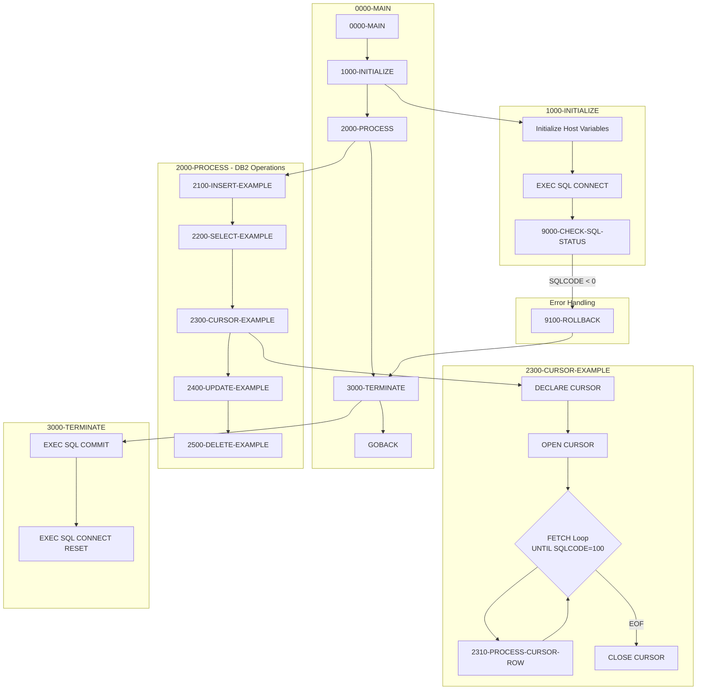
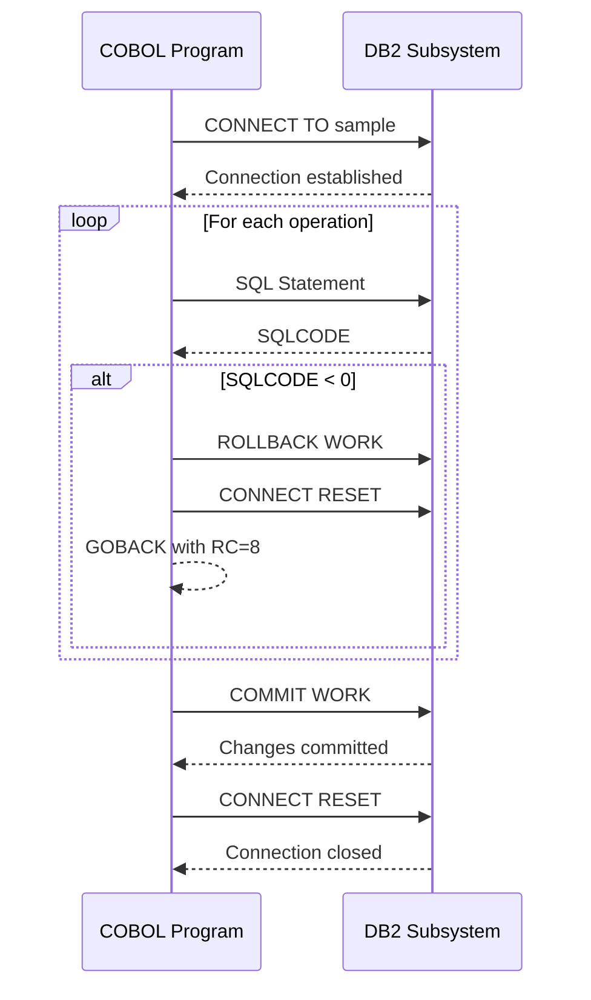

import Admonition from '@theme/Admonition';

<Admonition type="info" title="Template Program">
This is a template/reference program located in `/src/templates/database/`. It demonstrates DB2 database interaction patterns and is intended to be used as a coding reference rather than executed directly in production.
</Admonition>

## Overview

DB2HNDL (DB2-HANDLING) is a template program that provides comprehensive examples of DB2 database operations in COBOL. It serves as a reference implementation for developers working with DB2 in the Investment Portfolio Management System, demonstrating best practices for:

- Connecting to and disconnecting from DB2
- INSERT operations with host variables and null indicators
- SELECT operations with single-row retrieval
- Cursor-based processing for multi-row result sets
- UPDATE operations with timestamp tracking
- DELETE operations
- SQL error checking and handling
- Transaction management with COMMIT and ROLLBACK

This template uses a PORTFOLIO table as an example, but the patterns shown are applicable to any DB2 table interaction.

## Program Structure



## Data Structures

### SQL Communication Area (SQLCA)

The SQLCA is included via `EXEC SQL INCLUDE SQLCA` and provides:

| Field | Description |
|-------|-------------|
| SQLCODE | Return code from SQL operations |
| SQLERRMC | Error message text |
| SQLSTATE | 5-character SQL state code |
| SQLERRD | Array of diagnostic information |

### Host Variables (HV-PORTFOLIO)

Host variables are COBOL data items used to exchange data with DB2:

| Level | Name | Picture | DB2 Column | Description |
|-------|------|---------|------------|-------------|
| 01 | HV-PORTFOLIO | - | - | Host variable group |
| 05 | HV-PORTFOLIO-ID | X(10) | PORTFOLIO_ID | Portfolio identifier |
| 05 | HV-PORTFOLIO-NAME | X(50) | PORTFOLIO_NAME | Portfolio name |
| 05 | HV-CREATION-DATE | X(10) | CREATION_DATE | Creation date |
| 05 | HV-LAST-UPDATE-TS | X(26) | LAST_UPDATE_TS | Last update timestamp |
| 05 | HV-TOTAL-VALUE | S9(13)V99 COMP-3 | TOTAL_VALUE | Total portfolio value |
| 05 | HV-STATUS | X(01) | STATUS | Portfolio status |

### Null Indicators (HV-NULL-INDS)

Null indicators track whether DB2 columns contain NULL values:

| Level | Name | Picture | Description |
|-------|------|---------|-------------|
| 01 | HV-NULL-INDS | - | Null indicator group |
| 05 | NI-PORTFOLIO-ID | S9(4) COMP | Null indicator for ID |
| 05 | NI-PORTFOLIO-NAME | S9(4) COMP | Null indicator for name |
| 05 | NI-CREATION-DATE | S9(4) COMP | Null indicator for creation date |
| 05 | NI-LAST-UPDATE-TS | S9(4) COMP | Null indicator for timestamp |
| 05 | NI-TOTAL-VALUE | S9(4) COMP | Null indicator for value |
| 05 | NI-STATUS | S9(4) COMP | Null indicator for status |

**Null Indicator Values:**
- `< 0`: Column value is NULL
- `= 0`: Column value is NOT NULL
- `> 0`: Column was truncated (for character data)

### Error Message Area (WS-DB2-ERROR-MSG)

| Level | Name | Picture | Description |
|-------|------|---------|-------------|
| 01 | WS-DB2-ERROR-MSG | - | Error message group |
| 05 | FILLER | X(20) | 'DB2 ERROR - SQLCODE: ' |
| 05 | WS-SQLCODE-DISP | -999 | Formatted SQLCODE |
| 05 | FILLER | X(20) | ', SQLERRM: ' |
| 05 | WS-SQLERRM | X(70) | Error message text |

## Table Declaration

The template declares the PORTFOLIO table structure for documentation purposes:

```sql
EXEC SQL DECLARE PORTFOLIO TABLE
( PORTFOLIO_ID        CHAR(10)      NOT NULL,
  PORTFOLIO_NAME      VARCHAR(50)   NOT NULL,
  CREATION_DATE       DATE          NOT NULL,
  LAST_UPDATE_TS      TIMESTAMP     NOT NULL,
  TOTAL_VALUE         DECIMAL(15,2) NOT NULL,
  STATUS              CHAR(1)       NOT NULL
) END-EXEC
```

## DB2 Operations

### Connection Management

#### Connect to DB2 (1000-INITIALIZE)

```cobol
EXEC SQL
    CONNECT TO sample
END-EXEC
```

#### Disconnect from DB2 (3000-TERMINATE)

```cobol
EXEC SQL
    COMMIT WORK
END-EXEC

EXEC SQL
    CONNECT RESET
END-EXEC
```

### INSERT Operation (2100-INSERT-EXAMPLE)

Demonstrates inserting a new row with host variables:

```cobol
EXEC SQL
    INSERT INTO PORTFOLIO
    (PORTFOLIO_ID, PORTFOLIO_NAME, 
     CREATION_DATE, LAST_UPDATE_TS,
     TOTAL_VALUE, STATUS)
    VALUES
    (:HV-PORTFOLIO-ID   :NI-PORTFOLIO-ID,
     :HV-PORTFOLIO-NAME :NI-PORTFOLIO-NAME,
     CURRENT DATE,
     CURRENT TIMESTAMP,
     0,
     'A')
END-EXEC
```

**Key Points:**
- Host variables prefixed with `:` in SQL
- Null indicators follow host variables (`:HV-VAR :NI-VAR`)
- DB2 functions like `CURRENT DATE` and `CURRENT TIMESTAMP` used for system values

### SELECT Operation (2200-SELECT-EXAMPLE)

Demonstrates single-row retrieval:

```cobol
EXEC SQL
    SELECT PORTFOLIO_ID,
           PORTFOLIO_NAME,
           CREATION_DATE,
           LAST_UPDATE_TS,
           TOTAL_VALUE,
           STATUS
    INTO  :HV-PORTFOLIO-ID   :NI-PORTFOLIO-ID,
          :HV-PORTFOLIO-NAME :NI-PORTFOLIO-NAME,
          :HV-CREATION-DATE  :NI-CREATION-DATE,
          :HV-LAST-UPDATE-TS :NI-LAST-UPDATE-TS,
          :HV-TOTAL-VALUE    :NI-TOTAL-VALUE,
          :HV-STATUS         :NI-STATUS
    FROM  PORTFOLIO
    WHERE PORTFOLIO_ID = :HV-PORTFOLIO-ID
END-EXEC
```

**Key Points:**
- `INTO` clause maps columns to host variables
- Null indicators receive NULL status for each column
- WHERE clause uses host variable for key lookup

### Cursor Processing (2300-CURSOR-EXAMPLE)

Demonstrates multi-row processing with cursors:

#### 1. Declare Cursor

```cobol
EXEC SQL
    DECLARE PORTFOLIO_CURSOR CURSOR FOR
    SELECT PORTFOLIO_ID,
           PORTFOLIO_NAME,
           STATUS
    FROM   PORTFOLIO
    WHERE  STATUS = 'A'
    FOR    FETCH ONLY
END-EXEC
```

#### 2. Open Cursor

```cobol
EXEC SQL
    OPEN PORTFOLIO_CURSOR
END-EXEC
```

#### 3. Fetch Loop

```cobol
PERFORM UNTIL SQLCODE = +100
    EXEC SQL
        FETCH PORTFOLIO_CURSOR
        INTO :HV-PORTFOLIO-ID   :NI-PORTFOLIO-ID,
             :HV-PORTFOLIO-NAME :NI-PORTFOLIO-NAME,
             :HV-STATUS         :NI-STATUS
    END-EXEC
    
    IF SQLCODE = +0
        PERFORM 2310-PROCESS-CURSOR-ROW
    END-IF
END-PERFORM
```

#### 4. Close Cursor

```cobol
EXEC SQL
    CLOSE PORTFOLIO_CURSOR
END-EXEC
```

**Key Points:**
- `FOR FETCH ONLY` optimizes read-only cursors
- SQLCODE +100 indicates end of result set
- Always close cursors to release resources

### UPDATE Operation (2400-UPDATE-EXAMPLE)

Demonstrates updating existing rows:

```cobol
EXEC SQL
    UPDATE PORTFOLIO
    SET    STATUS = 'I',
           LAST_UPDATE_TS = CURRENT TIMESTAMP
    WHERE  PORTFOLIO_ID = :HV-PORTFOLIO-ID
END-EXEC
```

**Key Points:**
- SET clause specifies columns to update
- `CURRENT TIMESTAMP` maintains audit trail
- WHERE clause identifies target row(s)

### DELETE Operation (2500-DELETE-EXAMPLE)

Demonstrates deleting rows:

```cobol
EXEC SQL
    DELETE FROM PORTFOLIO
    WHERE  PORTFOLIO_ID = :HV-PORTFOLIO-ID
END-EXEC
```

## Error Handling

### SQL Status Check (9000-CHECK-SQL-STATUS)

Centralized error checking after each SQL operation:

```cobol
IF SQLCODE NOT = 0
    MOVE SQLCODE TO WS-SQLCODE-DISP
    MOVE SQLERRMC TO WS-SQLERRM
    DISPLAY WS-DB2-ERROR-MSG
    IF SQLCODE < 0
        PERFORM 9100-ROLLBACK
        MOVE 8 TO RETURN-CODE
        PERFORM 3000-TERMINATE
        GOBACK
    END-IF
END-IF
```

**Logic:**
- SQLCODE = 0: Success
- SQLCODE > 0: Warning (e.g., +100 = not found)
- SQLCODE < 0: Error - triggers rollback and termination

### Rollback (9100-ROLLBACK)

Undoes all changes since last commit:

```cobol
EXEC SQL
    ROLLBACK WORK
END-EXEC
```

## SQLCODE Reference

| SQLCODE | Meaning | Action |
|---------|---------|--------|
| 0 | Successful execution | Continue |
| +100 | No rows found / End of cursor | Handle condition |
| -803 | Duplicate key violation | Rollback |
| -811 | Multiple rows returned (SELECT INTO) | Rollback |
| -911 | Deadlock or timeout | Retry or rollback |
| -913 | Unsuccessful execution due to deadlock | Retry or rollback |

## Control Flow

### Main Processing (0000-MAIN)

```cobol
PERFORM 1000-INITIALIZE
PERFORM 2000-PROCESS
PERFORM 3000-TERMINATE
GOBACK
```

### Transaction Flow



## Dependencies

### DB2 Requirements

| Resource | Description |
|----------|-------------|
| DB2 Subsystem | Target DB2 subsystem (e.g., 'sample') |
| PORTFOLIO Table | Example table (or actual application table) |
| DB2 Plan | Bound plan for the program |
| DBRM | Database Request Module from precompile |

### Related Components

| Component | Relationship | Description |
|-----------|--------------|-------------|
| DB2CONN | Related | Production connection manager |
| DB2CMT | Related | Production commit controller |
| DB2ERR | Related | Production error handler |
| HISTLD00 | Consumer | Uses similar DB2 patterns for history loading |
| SQLCA | Copybook | SQL Communication Area |

## COBOL/DB2 Concepts

### Host Variables

Host variables are COBOL data items that exchange data with DB2. They must be:
- Declared in WORKING-STORAGE or LINKAGE SECTION
- Compatible with DB2 data types
- Prefixed with `:` when used in SQL statements

### Null Indicators

DB2 columns can contain NULL values. Null indicators:
- Are S9(4) COMP (halfword binary)
- Follow the host variable in SQL statements
- Negative value means column is NULL
- Zero means column has a value

### COMP-3 for DECIMAL

DB2 DECIMAL columns map to COMP-3 (packed decimal) in COBOL:
- DECIMAL(15,2) → PIC S9(13)V99 COMP-3
- Preserves decimal precision
- Efficient for arithmetic

### Cursor Processing

Cursors enable multi-row processing:
1. **DECLARE**: Define the SELECT statement
2. **OPEN**: Execute the query, position before first row
3. **FETCH**: Retrieve one row at a time
4. **CLOSE**: Release cursor resources

### Transaction Control

- **COMMIT**: Makes all changes permanent
- **ROLLBACK**: Undoes all changes since last commit
- DB2 uses implicit transaction boundaries

## Return Codes

| Code | Meaning | Condition |
|------|---------|-----------|
| 0 | Success | All operations completed successfully |
| 8 | Error | SQL error occurred (SQLCODE < 0) |

## Usage as Template

To use this template for a new DB2 program:

1. **Copy the template** to your program location
2. **Modify the table declaration** to match your table
3. **Update host variables** to match your columns
4. **Add null indicators** for nullable columns
5. **Implement business logic** in place of example operations
6. **Customize error handling** for your requirements

### Example Customization

```cobol
*----------------------------------------------------------------*
* Replace example table with your table
*----------------------------------------------------------------*
EXEC SQL DECLARE YOUR_TABLE TABLE
( KEY_FIELD    CHAR(10)   NOT NULL,
  DATA_FIELD   VARCHAR(100),
  ...
) END-EXEC

*----------------------------------------------------------------*
* Add your host variables
*----------------------------------------------------------------*
01  HV-YOUR-TABLE.
    05  HV-KEY-FIELD    PIC X(10).
    05  HV-DATA-FIELD   PIC X(100).
    ...
```

## Issues

<Admonition type="note" title="Template Limitations">

- The `2310-PROCESS-CURSOR-ROW` paragraph is referenced but not implemented - add your row processing logic
- The database name 'sample' is a placeholder - replace with actual subsystem name
- The PORTFOLIO table may not exist - create it or substitute your table
- No connection pooling shown - see DB2CONN for production patterns
- Minimal error recovery - enhance for production use

</Admonition>
