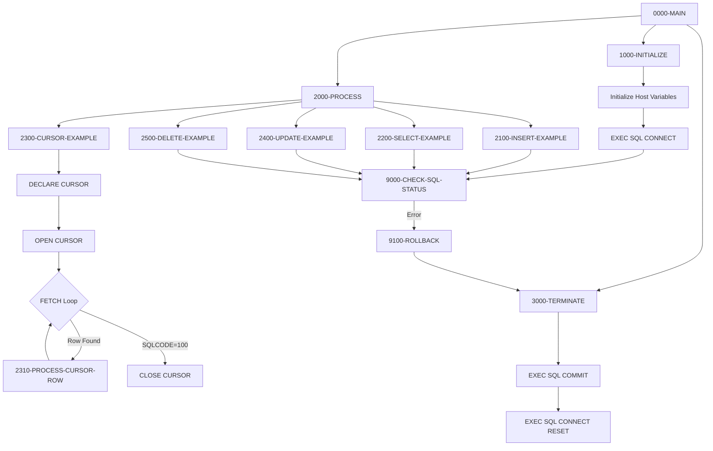
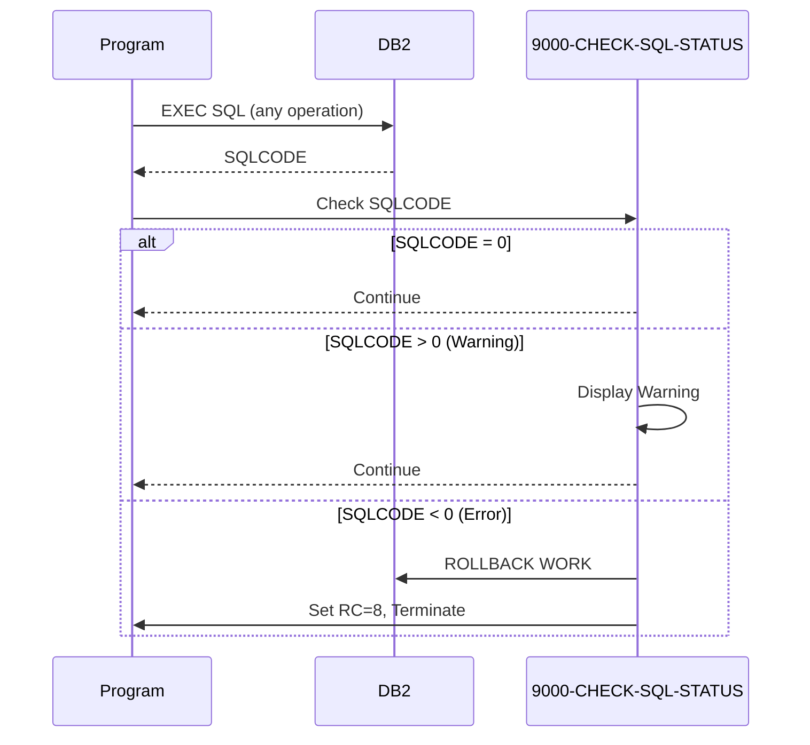

## Overview

DB2-HANDLING (program ID: DB2HNDL) is a template program that demonstrates standard patterns for DB2 database interactions in COBOL. It serves as a reference implementation showing best practices for:

- **Connection Management**: Establishing and terminating DB2 connections
- **CRUD Operations**: INSERT, SELECT, UPDATE, and DELETE examples
- **Cursor Processing**: Declaring, opening, fetching, and closing cursors
- **Host Variables**: Proper use of host variables with null indicators
- **Error Handling**: SQL status checking with rollback on errors

This template is located in the `/src/templates/database/` directory and is intended to be used as a starting point for developers creating new DB2-enabled programs.

## Program Structure



## Data Structures

### Host Variables (HV-PORTFOLIO)

Host variables are COBOL data items used to exchange data with DB2:

| Level | Name | Picture | Description |
|-------|------|---------|-------------|
| 01 | HV-PORTFOLIO | - | Portfolio host variable group |
| 05 | HV-PORTFOLIO-ID | X(10) | Portfolio identifier |
| 05 | HV-PORTFOLIO-NAME | X(50) | Portfolio name (VARCHAR) |
| 05 | HV-CREATION-DATE | X(10) | Creation date (DATE format) |
| 05 | HV-LAST-UPDATE-TS | X(26) | Last update timestamp |
| 05 | HV-TOTAL-VALUE | S9(13)V99 COMP-3 | Total value (DECIMAL) |
| 05 | HV-STATUS | X(01) | Status code |

### Null Indicators (HV-NULL-INDS)

Null indicators track whether DB2 columns contain NULL values:

| Level | Name | Picture | Description |
|-------|------|---------|-------------|
| 01 | HV-NULL-INDS | - | Null indicator group |
| 05 | NI-PORTFOLIO-ID | S9(4) COMP | Null indicator for ID |
| 05 | NI-PORTFOLIO-NAME | S9(4) COMP | Null indicator for name |
| 05 | NI-CREATION-DATE | S9(4) COMP | Null indicator for date |
| 05 | NI-LAST-UPDATE-TS | S9(4) COMP | Null indicator for timestamp |
| 05 | NI-TOTAL-VALUE | S9(4) COMP | Null indicator for value |
| 05 | NI-STATUS | S9(4) COMP | Null indicator for status |

**Null Indicator Values:**
- `0` = Column is not NULL
- `-1` = Column is NULL
- `> 0` = Data truncation occurred (value indicates original length)

### Error Message Area

| Level | Name | Picture | Description |
|-------|------|---------|-------------|
| 01 | WS-DB2-ERROR-MSG | - | Formatted error message |
| 05 | FILLER | X(20) | 'DB2 ERROR - SQLCODE: ' |
| 05 | WS-SQLCODE-DISP | -999 | Formatted SQLCODE |
| 05 | FILLER | X(20) | ', SQLERRM: ' |
| 05 | WS-SQLERRM | X(70) | Error message text |

## DB2 Table Declaration

The template includes a DECLARE TABLE statement documenting the PORTFOLIO table structure:

```sql
EXEC SQL DECLARE PORTFOLIO TABLE
( PORTFOLIO_ID        CHAR(10)      NOT NULL,
  PORTFOLIO_NAME      VARCHAR(50)   NOT NULL,
  CREATION_DATE       DATE          NOT NULL,
  LAST_UPDATE_TS      TIMESTAMP     NOT NULL,
  TOTAL_VALUE         DECIMAL(15,2) NOT NULL,
  STATUS              CHAR(1)       NOT NULL
) END-EXEC.
```

| Column | Data Type | Description |
|--------|-----------|-------------|
| PORTFOLIO_ID | CHAR(10) | Primary key identifier |
| PORTFOLIO_NAME | VARCHAR(50) | Portfolio description |
| CREATION_DATE | DATE | Record creation date |
| LAST_UPDATE_TS | TIMESTAMP | Last modification time |
| TOTAL_VALUE | DECIMAL(15,2) | Portfolio total value |
| STATUS | CHAR(1) | Status (A=Active, I=Inactive) |

## SQL Operations

### Connection Management

#### Connect to DB2 (1000-INITIALIZE)

```cobol
EXEC SQL
    CONNECT TO sample
END-EXEC
```

Establishes connection to the DB2 subsystem named `sample`.

#### Disconnect from DB2 (3000-TERMINATE)

```cobol
EXEC SQL
    COMMIT WORK
END-EXEC

EXEC SQL
    CONNECT RESET
END-EXEC
```

Commits pending changes and releases the DB2 connection.

### INSERT Operation (2100-INSERT-EXAMPLE)

```cobol
EXEC SQL
    INSERT INTO PORTFOLIO
    (PORTFOLIO_ID, PORTFOLIO_NAME, 
     CREATION_DATE, LAST_UPDATE_TS,
     TOTAL_VALUE, STATUS)
    VALUES
    (:HV-PORTFOLIO-ID   :NI-PORTFOLIO-ID,
     :HV-PORTFOLIO-NAME :NI-PORTFOLIO-NAME,
     CURRENT DATE,
     CURRENT TIMESTAMP,
     0,
     'A')
END-EXEC
```

**Key Points:**
- Uses host variables with null indicators
- Uses DB2 special registers (`CURRENT DATE`, `CURRENT TIMESTAMP`)
- Literal values can be mixed with host variables

### SELECT Operation (2200-SELECT-EXAMPLE)

```cobol
EXEC SQL
    SELECT PORTFOLIO_ID,
           PORTFOLIO_NAME,
           CREATION_DATE,
           LAST_UPDATE_TS,
           TOTAL_VALUE,
           STATUS
    INTO  :HV-PORTFOLIO-ID   :NI-PORTFOLIO-ID,
          :HV-PORTFOLIO-NAME :NI-PORTFOLIO-NAME,
          :HV-CREATION-DATE  :NI-CREATION-DATE,
          :HV-LAST-UPDATE-TS :NI-LAST-UPDATE-TS,
          :HV-TOTAL-VALUE    :NI-TOTAL-VALUE,
          :HV-STATUS         :NI-STATUS
    FROM  PORTFOLIO
    WHERE PORTFOLIO_ID = :HV-PORTFOLIO-ID
END-EXEC
```

**Key Points:**
- INTO clause maps columns to host variables
- Each host variable paired with null indicator
- WHERE clause uses host variable for key lookup

### Cursor Processing (2300-CURSOR-EXAMPLE)

#### Declare Cursor

```cobol
EXEC SQL
    DECLARE PORTFOLIO_CURSOR CURSOR FOR
    SELECT PORTFOLIO_ID,
           PORTFOLIO_NAME,
           STATUS
    FROM   PORTFOLIO
    WHERE  STATUS = 'A'
    FOR    FETCH ONLY
END-EXEC
```

**Key Points:**
- `DECLARE` is a compile-time statement (no SQLCODE check needed)
- `FOR FETCH ONLY` optimizes for read-only access
- Cursor name must be unique within the program

#### Open, Fetch, Close Pattern

```cobol
EXEC SQL
    OPEN PORTFOLIO_CURSOR
END-EXEC

PERFORM UNTIL SQLCODE = +100
    EXEC SQL
        FETCH PORTFOLIO_CURSOR
        INTO :HV-PORTFOLIO-ID   :NI-PORTFOLIO-ID,
             :HV-PORTFOLIO-NAME :NI-PORTFOLIO-NAME,
             :HV-STATUS         :NI-STATUS
    END-EXEC
    
    IF SQLCODE = +0
        PERFORM 2310-PROCESS-CURSOR-ROW
    END-IF
END-PERFORM

EXEC SQL
    CLOSE PORTFOLIO_CURSOR
END-EXEC
```

**Key Points:**
- SQLCODE +100 indicates end of result set
- Always close cursors to release resources
- Process each row inside the fetch loop

### UPDATE Operation (2400-UPDATE-EXAMPLE)

```cobol
EXEC SQL
    UPDATE PORTFOLIO
    SET    STATUS = 'I',
           LAST_UPDATE_TS = CURRENT TIMESTAMP
    WHERE  PORTFOLIO_ID = :HV-PORTFOLIO-ID
END-EXEC
```

**Key Points:**
- SET clause can use literals or host variables
- `CURRENT TIMESTAMP` captures exact modification time
- WHERE clause identifies rows to update

### DELETE Operation (2500-DELETE-EXAMPLE)

```cobol
EXEC SQL
    DELETE FROM PORTFOLIO
    WHERE  PORTFOLIO_ID = :HV-PORTFOLIO-ID
END-EXEC
```

**Key Points:**
- Always use WHERE clause to avoid deleting all rows
- Check SQLCODE after DELETE for success/failure

## Error Handling

### SQL Status Checking (9000-CHECK-SQL-STATUS)

```cobol
IF SQLCODE NOT = 0
    MOVE SQLCODE TO WS-SQLCODE-DISP
    MOVE SQLERRMC TO WS-SQLERRM
    DISPLAY WS-DB2-ERROR-MSG
    IF SQLCODE < 0
        PERFORM 9100-ROLLBACK
        MOVE 8 TO RETURN-CODE
        PERFORM 3000-TERMINATE
        GOBACK
    END-IF
END-IF
```

**SQLCODE Values:**
| Value | Meaning | Action |
|-------|---------|--------|
| 0 | Success | Continue processing |
| > 0 | Warning | Log and continue (typically) |
| +100 | Not found / End of cursor | Handle appropriately |
| < 0 | Error | Rollback and terminate |

### Rollback Processing (9100-ROLLBACK)

```cobol
EXEC SQL
    ROLLBACK WORK
END-EXEC
```

Reverses all uncommitted database changes in the current unit of work.

## Control Flow

### Main Processing (0000-MAIN)

1. **Initialize** (1000-INITIALIZE)
   - Clear host variables and null indicators
   - Connect to DB2 subsystem
   - Check connection status

2. **Process** (2000-PROCESS)
   - Execute example INSERT
   - Execute example SELECT
   - Execute cursor processing
   - Execute example UPDATE
   - Execute example DELETE

3. **Terminate** (3000-TERMINATE)
   - Commit all changes
   - Disconnect from DB2

### Error Recovery Flow



## Return Codes

| Code | Meaning | Description |
|------|---------|-------------|
| 0 | Success | All operations completed successfully |
| 8 | Error | DB2 error occurred, changes rolled back |

## Technical Notes

### SQLCA (SQL Communication Area)

The program includes SQLCA via:

```cobol
EXEC SQL INCLUDE SQLCA END-EXEC.
```

SQLCA provides:
- `SQLCODE` - Return code from last SQL statement
- `SQLERRMC` - Error message text
- `SQLERRD` - Diagnostic information array
- `SQLWARN` - Warning flags

### Host Variable Naming Convention

The template uses prefixes to distinguish variable types:
- `HV-` prefix for host variables
- `NI-` prefix for null indicators
- `WS-` prefix for working storage items

### COMP-3 for Decimal Values

`HV-TOTAL-VALUE` uses `S9(13)V99 COMP-3` (packed decimal) which maps to DB2 `DECIMAL(15,2)`:
- `S` = Signed
- `9(13)` = 13 integer digits
- `V99` = 2 decimal places (implied)
- `COMP-3` = Packed decimal storage

### VARCHAR Handling

DB2 VARCHAR columns map to fixed-length COBOL fields:
- `VARCHAR(50)` → `PIC X(50)`
- DB2 handles trailing spaces automatically
- For length-prefixed handling, use a two-part structure

### Date and Timestamp Formats

| DB2 Type | COBOL Picture | Format |
|----------|---------------|--------|
| DATE | X(10) | YYYY-MM-DD |
| TIMESTAMP | X(26) | YYYY-MM-DD-HH.MM.SS.NNNNNN |

## Usage as Template

To use this template for a new DB2 program:

1. **Copy the template** to your target location
2. **Rename** the program ID appropriately
3. **Modify table declaration** to match your table
4. **Update host variables** to match your data requirements
5. **Customize processing logic** in 2000-PROCESS
6. **Add additional cursors** as needed
7. **Enhance error handling** for production use

### Recommended Enhancements for Production

- Add logging/audit trail for SQL operations
- Implement retry logic for deadlocks (SQLCODE -911)
- Add commit frequency control for bulk operations
- Include performance statistics collection
- Use the DB2CONN, DB2CMT, and DB2ERR utility programs

## Related Programs

| Program | Description |
|---------|-------------|
| DB2CONN | DB2 Connection Manager |
| DB2CMT | DB2 Commit Controller |
| DB2ERR | DB2 Error Handler |
| DB2STAT | DB2 Statistics Collector |
| DB2ONLN | Online DB2 Connection Manager |
| HISTLD00 | History Loader (uses DB2) |

## Dependencies

### Required Includes

| Include | Purpose |
|---------|---------|
| SQLCA | SQL Communication Area |

### DB2 Precompiler

This program requires DB2 precompilation:
1. Precompile with DB2 precompiler (DBRM created)
2. Bind DBRM to DB2 plan
3. Compile COBOL source
4. Link-edit with DB2 interface module
