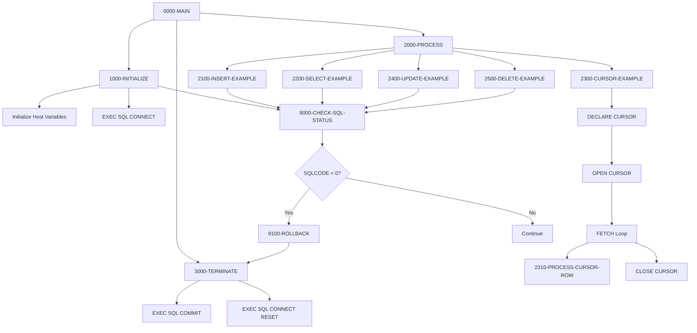

## Overview

DB2-HANDLING (program ID: DB2HNDL) is a template program that demonstrates standard patterns for DB2 database interactions in COBOL. It serves as a reference implementation and starting point for developers building DB2-enabled applications.

The template covers all fundamental DB2 operations:
- **Connection Management** - Connecting to and disconnecting from DB2
- **INSERT** - Adding new rows to a table
- **SELECT** - Retrieving single rows with INTO clause
- **Cursor Processing** - Iterating through multiple rows
- **UPDATE** - Modifying existing rows
- **DELETE** - Removing rows from a table
- **Error Handling** - Checking SQLCODE and handling errors
- **Transaction Control** - COMMIT and ROLLBACK operations

This template is located in the `/src/templates/database/` directory, indicating its purpose as a reusable code pattern rather than a production program.

## Program Structure



## Data Structures

### SQL Communication Area (SQLCA)

The SQLCA is included via `EXEC SQL INCLUDE SQLCA` and contains:

| Field | Description |
|-------|-------------|
| SQLCODE | Return code from SQL operations |
| SQLERRMC | Error message tokens |
| SQLERRD | Diagnostic information array |
| SQLWARN | Warning flags |
| SQLSTATE | SQL state code (5 characters) |

### Table Declaration

The template declares a PORTFOLIO table structure:

```sql
DECLARE PORTFOLIO TABLE
( PORTFOLIO_ID        CHAR(10)      NOT NULL,
  PORTFOLIO_NAME      VARCHAR(50)   NOT NULL,
  CREATION_DATE       DATE          NOT NULL,
  LAST_UPDATE_TS      TIMESTAMP     NOT NULL,
  TOTAL_VALUE         DECIMAL(15,2) NOT NULL,
  STATUS              CHAR(1)       NOT NULL
)
```

### Host Variables (HV-PORTFOLIO)

Host variables are COBOL fields used in SQL statements, prefixed with colons:

| Level | Name | Picture | DB2 Column | Description |
|-------|------|---------|------------|-------------|
| 01 | HV-PORTFOLIO | - | - | Host variable group |
| 05 | HV-PORTFOLIO-ID | X(10) | PORTFOLIO_ID | Portfolio identifier |
| 05 | HV-PORTFOLIO-NAME | X(50) | PORTFOLIO_NAME | Portfolio name |
| 05 | HV-CREATION-DATE | X(10) | CREATION_DATE | Creation date (YYYY-MM-DD) |
| 05 | HV-LAST-UPDATE-TS | X(26) | LAST_UPDATE_TS | Timestamp (YYYY-MM-DD-HH.MM.SS.FFFFFF) |
| 05 | HV-TOTAL-VALUE | S9(13)V99 COMP-3 | TOTAL_VALUE | Total value (packed decimal) |
| 05 | HV-STATUS | X(1) | STATUS | Status code |

### Null Indicators (HV-NULL-INDS)

Null indicators track whether corresponding host variables contain NULL values:

| Level | Name | Picture | Description |
|-------|------|---------|-------------|
| 01 | HV-NULL-INDS | - | Null indicator group |
| 05 | NI-PORTFOLIO-ID | S9(4) COMP | -1 if NULL, 0 otherwise |
| 05 | NI-PORTFOLIO-NAME | S9(4) COMP | -1 if NULL, 0 otherwise |
| 05 | NI-CREATION-DATE | S9(4) COMP | -1 if NULL, 0 otherwise |
| 05 | NI-LAST-UPDATE-TS | S9(4) COMP | -1 if NULL, 0 otherwise |
| 05 | NI-TOTAL-VALUE | S9(4) COMP | -1 if NULL, 0 otherwise |
| 05 | NI-STATUS | S9(4) COMP | -1 if NULL, 0 otherwise |

### Error Message Structure (WS-DB2-ERROR-MSG)

| Level | Name | Picture | Value | Description |
|-------|------|---------|-------|-------------|
| 01 | WS-DB2-ERROR-MSG | - | - | Formatted error message |
| 05 | FILLER | X(20) | 'DB2 ERROR - SQLCODE: ' | Label |
| 05 | WS-SQLCODE-DISP | -999 | - | Edited SQLCODE |
| 05 | FILLER | X(20) | ', SQLERRM: ' | Label |
| 05 | WS-SQLERRM | X(70) | - | Error message text |

## File I/O

This program does not use file I/O. All data access is through DB2 SQL statements.

## Control Flow

### Initialization (1000-INITIALIZE)

1. **Initialize Variables**
   ```cobol
   INITIALIZE HV-PORTFOLIO
              HV-NULL-INDS
   ```
   Clears host variables and null indicators.

2. **Connect to DB2**
   ```sql
   EXEC SQL
       CONNECT TO sample
   END-EXEC
   ```
   Establishes connection to the 'sample' database.

3. **Check Status**
   Calls 9000-CHECK-SQL-STATUS to verify connection succeeded.

### INSERT Operation (2100-INSERT-EXAMPLE)

Demonstrates inserting a new row:

```sql
INSERT INTO PORTFOLIO
(PORTFOLIO_ID, PORTFOLIO_NAME, 
 CREATION_DATE, LAST_UPDATE_TS,
 TOTAL_VALUE, STATUS)
VALUES
(:HV-PORTFOLIO-ID   :NI-PORTFOLIO-ID,
 :HV-PORTFOLIO-NAME :NI-PORTFOLIO-NAME,
 CURRENT DATE,
 CURRENT TIMESTAMP,
 0,
 'A')
```

**Key patterns:**
- Host variables prefixed with colon (`:HV-PORTFOLIO-ID`)
- Null indicator follows host variable (`:NI-PORTFOLIO-ID`)
- DB2 special registers (`CURRENT DATE`, `CURRENT TIMESTAMP`)
- Literal values for defaults

### SELECT Operation (2200-SELECT-EXAMPLE)

Demonstrates retrieving a single row:

```sql
SELECT PORTFOLIO_ID,
       PORTFOLIO_NAME,
       CREATION_DATE,
       LAST_UPDATE_TS,
       TOTAL_VALUE,
       STATUS
INTO  :HV-PORTFOLIO-ID   :NI-PORTFOLIO-ID,
      :HV-PORTFOLIO-NAME :NI-PORTFOLIO-NAME,
      :HV-CREATION-DATE  :NI-CREATION-DATE,
      :HV-LAST-UPDATE-TS :NI-LAST-UPDATE-TS,
      :HV-TOTAL-VALUE    :NI-TOTAL-VALUE,
      :HV-STATUS         :NI-STATUS
FROM  PORTFOLIO
WHERE PORTFOLIO_ID = :HV-PORTFOLIO-ID
```

**Key patterns:**
- INTO clause maps columns to host variables
- Each host variable paired with null indicator
- WHERE clause uses host variable for key lookup

### Cursor Processing (2300-CURSOR-EXAMPLE)

Demonstrates iterating through multiple rows:

1. **Declare Cursor**
   ```sql
   DECLARE PORTFOLIO_CURSOR CURSOR FOR
   SELECT PORTFOLIO_ID,
          PORTFOLIO_NAME,
          STATUS
   FROM   PORTFOLIO
   WHERE  STATUS = 'A'
   FOR    FETCH ONLY
   ```
   - `FOR FETCH ONLY` optimizes for read-only access

2. **Open Cursor**
   ```sql
   OPEN PORTFOLIO_CURSOR
   ```

3. **Fetch Loop**
   ```cobol
   PERFORM UNTIL SQLCODE = +100
       EXEC SQL
           FETCH PORTFOLIO_CURSOR
           INTO :HV-PORTFOLIO-ID   :NI-PORTFOLIO-ID,
                :HV-PORTFOLIO-NAME :NI-PORTFOLIO-NAME,
                :HV-STATUS         :NI-STATUS
       END-EXEC
       
       IF SQLCODE = +0
           PERFORM 2310-PROCESS-CURSOR-ROW
       END-IF
   END-PERFORM
   ```
   - SQLCODE +100 indicates end of data
   - SQLCODE 0 indicates successful fetch

4. **Close Cursor**
   ```sql
   CLOSE PORTFOLIO_CURSOR
   ```

### UPDATE Operation (2400-UPDATE-EXAMPLE)

Demonstrates modifying existing rows:

```sql
UPDATE PORTFOLIO
SET    STATUS = 'I',
       LAST_UPDATE_TS = CURRENT TIMESTAMP
WHERE  PORTFOLIO_ID = :HV-PORTFOLIO-ID
```

**Key patterns:**
- SET clause with literal and special register
- WHERE clause identifies target row

### DELETE Operation (2500-DELETE-EXAMPLE)

Demonstrates removing rows:

```sql
DELETE FROM PORTFOLIO
WHERE  PORTFOLIO_ID = :HV-PORTFOLIO-ID
```

### Termination (3000-TERMINATE)

1. **Commit Changes**
   ```sql
   COMMIT WORK
   ```
   Makes all changes permanent.

2. **Disconnect**
   ```sql
   CONNECT RESET
   ```
   Releases the database connection.

### Error Handling (9000-CHECK-SQL-STATUS)

```cobol
IF SQLCODE NOT = 0
    MOVE SQLCODE TO WS-SQLCODE-DISP
    MOVE SQLERRMC TO WS-SQLERRM
    DISPLAY WS-DB2-ERROR-MSG
    IF SQLCODE < 0
        PERFORM 9100-ROLLBACK
        MOVE 8 TO RETURN-CODE
        PERFORM 3000-TERMINATE
        GOBACK
    END-IF
END-IF
```

**Logic:**
- Non-zero SQLCODE indicates warning or error
- Display formatted error message
- Negative SQLCODE indicates error (vs. positive warning)
- On error: rollback, set RC=8, terminate

### Rollback (9100-ROLLBACK)

```sql
ROLLBACK WORK
```

Reverses all uncommitted changes since last COMMIT.

## Dependencies

### Copybooks

This template does not use external copybooks. The SQLCA is included via:
```cobol
EXEC SQL INCLUDE SQLCA END-EXEC
```

### Called Programs

This program does not call external programs.

### Related Programs

Other DB2-related programs in the system:
- **DB2CONN** - DB2 Connection Manager
- **DB2CMT** - DB2 Commit Handler
- **DB2ERR** - DB2 Error Handler
- **DB2STAT** - DB2 Statistics Collector

## SQL Statements Reference

| Statement | Paragraph | Purpose |
|-----------|-----------|---------|
| `INCLUDE SQLCA` | Working-Storage | Include SQL Communication Area |
| `DECLARE TABLE` | Working-Storage | Document table structure |
| `CONNECT TO` | 1000-INITIALIZE | Establish database connection |
| `INSERT INTO` | 2100-INSERT-EXAMPLE | Add new row |
| `SELECT INTO` | 2200-SELECT-EXAMPLE | Retrieve single row |
| `DECLARE CURSOR` | 2300-CURSOR-EXAMPLE | Define cursor for multi-row access |
| `OPEN CURSOR` | 2300-CURSOR-EXAMPLE | Activate cursor |
| `FETCH` | 2300-CURSOR-EXAMPLE | Retrieve next row |
| `CLOSE CURSOR` | 2300-CURSOR-EXAMPLE | Deactivate cursor |
| `UPDATE` | 2400-UPDATE-EXAMPLE | Modify existing rows |
| `DELETE FROM` | 2500-DELETE-EXAMPLE | Remove rows |
| `COMMIT WORK` | 3000-TERMINATE | Make changes permanent |
| `CONNECT RESET` | 3000-TERMINATE | Release connection |
| `ROLLBACK WORK` | 9100-ROLLBACK | Reverse uncommitted changes |

## SQLCODE Values

| Code | Meaning | Action |
|------|---------|--------|
| 0 | Success | Continue processing |
| +100 | No data found / End of cursor | Normal for cursor loops |
| -803 | Duplicate key | Handle as business error |
| -811 | Multiple rows returned | SELECT INTO expects one row |
| -904 | Resource unavailable | Retry or terminate |
| -911 | Deadlock or timeout | Rollback and retry |
| < 0 | Error | Rollback and terminate |

## Return Codes

| Code | Meaning |
|------|---------|
| 0 | Successful completion |
| 8 | DB2 error occurred |

## Technical Notes

### Host Variable Naming Convention
Host variables are prefixed with `HV-` to distinguish them from regular COBOL variables. This is a common convention that helps identify DB2-related fields during code review.

### Null Indicator Convention
Null indicators are prefixed with `NI-` and correspond one-to-one with host variables. In SQL statements, they immediately follow the host variable:
```sql
:HV-PORTFOLIO-ID :NI-PORTFOLIO-ID
```

### COMP-3 for Decimal Values
The `HV-TOTAL-VALUE` field uses `COMP-3` (packed decimal) which maps efficiently to DB2's `DECIMAL` type:
- `S9(13)V99 COMP-3` ↔ `DECIMAL(15,2)`

### Date/Time Formats
- **DATE**: `YYYY-MM-DD` (10 characters)
- **TIMESTAMP**: `YYYY-MM-DD-HH.MM.SS.FFFFFF` (26 characters)

### FOR FETCH ONLY
The cursor declaration includes `FOR FETCH ONLY` which:
- Optimizes performance by indicating read-only intent
- Prevents updates through the cursor
- Allows DB2 to use more efficient locking

### Cursor Lifecycle
Always follow the cursor lifecycle:
1. DECLARE (once, at compile time)
2. OPEN (before fetching)
3. FETCH (in a loop)
4. CLOSE (when done)

Failure to close cursors can cause resource leaks.

## Compilation Requirements

This program requires DB2 precompilation:

```jcl
//* DB2 Precompile and Bind
//STEP1   EXEC DSNHCOB2,MEM=DB2HNDL
//PC.DBRMLIB DD DSN=your.dbrm.library,DISP=SHR
//PC.SYSLIB DD DSN=your.copylib,DISP=SHR
//PC.SYSIN DD DSN=your.source(DB2HNDL),DISP=SHR
```

The resulting DBRM must be bound to a DB2 plan or package before execution.

## Usage as Template

To use this template for a new program:

1. Copy the file to your source directory
2. Rename the PROGRAM-ID
3. Replace the DECLARE TABLE with your table(s)
4. Modify host variables to match your columns
5. Update null indicators accordingly
6. Implement your specific business logic in the 2xxx paragraphs
7. Keep the error handling structure (9000, 9100 paragraphs)
