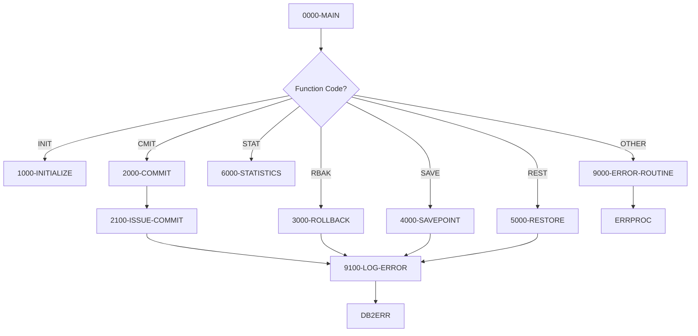

## Overview

DB2CMT is a reusable COBOL subprogram that provides centralized DB2 transaction management services for batch and online programs. It acts as a commit controller, offering a standardized interface for managing database transactions across the application portfolio.

The program supports six key functions:
- **INIT** - Initialize commit statistics and counters
- **CMIT** - Conditional or forced commit operations
- **RBAK** - Full transaction rollback
- **SAVE** - Create named savepoints for partial rollback capability
- **REST** - Restore to a named savepoint (partial rollback)
- **STAT** - Display commit/rollback statistics

This modular approach ensures consistent transaction handling throughout the system, simplifies error recovery, and provides centralized statistics tracking for commit and rollback operations. The program is designed to be called by other programs rather than executed standalone.

## Program Structure



## Data Structures

### Working Storage

| Level | Name | Picture | Description |
|-------|------|---------|-------------|
| 01 | WS-SAVEPOINT-ID | X(18) | Host variable for savepoint name (SQL DECLARE SECTION) |
| 01 | WS-COMMIT-STATS | - | Commit statistics group |
| 05 | WS-COMMIT-COUNT | S9(9) COMP | Number of commits issued |
| 05 | WS-ROLLBACK-COUNT | S9(9) COMP | Number of rollbacks issued |
| 05 | WS-SAVEPOINT-COUNT | S9(9) COMP | Number of savepoints created |
| 01 | WS-CURRENT-TIMESTAMP | X(26) | Current timestamp storage |

### Linkage Section (Calling Interface)

The program receives parameters through the LS-COMMIT-REQUEST structure:

| Level | Name | Picture | Description |
|-------|------|---------|-------------|
| 01 | LS-COMMIT-REQUEST | - | Main parameter structure |
| 05 | LS-FUNCTION | X(4) | Function code (see table below) |
| 05 | LS-SAVEPOINT-NAME | X(18) | Savepoint name for SAVE/REST functions |
| 05 | LS-COMMIT-PARMS | - | Commit parameters group |
| 10 | LS-RECORDS-PROC | S9(9) COMP | Records processed (for conditional commit) |
| 10 | LS-COMMIT-FREQ | S9(4) COMP | Commit frequency threshold |
| 10 | LS-FORCE-FLAG | X(1) | Force commit flag (`Y` = force) |
| 05 | LS-RETURN-CODE | S9(4) COMP | Return code (0=success, 8=error, 12=severe) |
| 05 | LS-ERROR-INFO | - | Error information group |
| 10 | LS-SQLCODE | S9(9) COMP | SQL return code on error |
| 10 | LS-ERROR-MSG | X(80) | Error message text |

### Function Codes

| Code | 88-Level Name | Description |
|------|---------------|-------------|
| `INIT` | FUNC-INIT | Initialize statistics counters |
| `CMIT` | FUNC-CMIT | Issue commit (conditional or forced) |
| `RBAK` | FUNC-RBACK | Issue rollback |
| `SAVE` | FUNC-SAVE | Create savepoint |
| `REST` | FUNC-REST | Restore to savepoint |
| `STAT` | FUNC-STAT | Display statistics |

### SQL Status Codes (from SQLCA copybook)

| Code | Name | Description |
|------|------|-------------|
| 00000 | SQL-SUCCESS | Successful execution |
| 02000 | SQL-NOT-FOUND | No data found |
| 23505 | SQL-DUP-KEY | Duplicate key violation |
| 40001 | SQL-DEADLOCK | Deadlock detected |
| 40003 | SQL-TIMEOUT | Timeout occurred |
| 08001 | SQL-CONNECTION-ERROR | Connection error |
| 58004 | SQL-DB-ERROR | Database error |

## File I/O

This program does not use any file I/O operations. All data interaction is through DB2 SQL statements and the linkage section parameter interface.

## Control Flow

### Main Entry Point (0000-MAIN)

The program uses an EVALUATE statement to dispatch to the appropriate function based on the LS-FUNCTION code. After processing, the program returns to the caller via GOBACK.

### Initialize (1000-INITIALIZE)

Resets all commit statistics counters to zero:
- WS-COMMIT-COUNT
- WS-ROLLBACK-COUNT
- WS-SAVEPOINT-COUNT

Sets LS-RETURN-CODE to 0.

### Commit (2000-COMMIT)

Performs a conditional commit based on two criteria:
1. **Threshold check**: If LS-RECORDS-PROC >= LS-COMMIT-FREQ
2. **Force flag**: If LS-FORCE-FLAG = `Y`

If either condition is met, calls 2100-ISSUE-COMMIT to execute the actual COMMIT WORK statement.

### Issue Commit (2100-ISSUE-COMMIT)

Executes the DB2 COMMIT WORK statement:
- On success (SQLCODE = 0): Increments WS-COMMIT-COUNT, sets return code to 0
- On failure: Captures SQLCODE, sets error message "Commit failed", sets return code to 8, logs the error

### Rollback (3000-ROLLBACK)

Executes the DB2 ROLLBACK WORK statement to undo all uncommitted changes:
- On success: Increments WS-ROLLBACK-COUNT, sets return code to 0
- On failure: Captures SQLCODE, sets error message "Rollback failed", sets return code to 8, logs the error

### Savepoint (4000-SAVEPOINT)

Creates a named savepoint using the DB2 SAVEPOINT statement with the `ON ROLLBACK RETAIN CURSORS` option. This allows partial rollback while keeping cursors open:

```sql
SAVEPOINT :WS-SAVEPOINT-ID ON ROLLBACK RETAIN CURSORS
```

- On success: Increments WS-SAVEPOINT-COUNT, sets return code to 0
- On failure: Sets error message "Savepoint creation failed", sets return code to 8

### Restore (5000-RESTORE)

Rolls back to a previously created savepoint using:

```sql
ROLLBACK TO SAVEPOINT :WS-SAVEPOINT-ID
```

This undoes changes made after the savepoint while preserving changes made before it:
- On success: Increments WS-ROLLBACK-COUNT, sets return code to 0
- On failure: Sets error message "Savepoint restore failed", sets return code to 8

### Statistics (6000-STATISTICS)

Displays commit controller statistics to SYSOUT:
```
DB2 Commit Controller Statistics:
  Commits:    nnnnnnnnn
  Rollbacks:  nnnnnnnnn
  Savepoints: nnnnnnnnn
```

### Error Routine (9000-ERROR-ROUTINE)

Handles invalid function codes:
1. Sets ERR-PROGRAM to 'DB2CMT'
2. Sets LS-RETURN-CODE to 12 (severe error)
3. Calls ERRPROC for error logging

### Log Error (9100-LOG-ERROR)

Calls the DB2ERR program to log DB2-specific errors, passing the LS-ERROR-INFO structure containing the SQLCODE and error message.

## Dependencies

### Copybooks

- **SQLCA** - SQL Communication Area for DB2 status and error information
- **DBPROC** - Standard DB2 procedures and error handling structures
- **ERRHAND** - Standard error handling definitions and message structures

### Called Programs

| Program | Purpose |
|---------|---------|
| ERRPROC | External error processing routine for logging |
| DB2ERR | DB2 error logging and handling |

### Related Programs

Programs that share copybooks with DB2CMT:

| Program | Shared Copybooks | Relationship |
|---------|------------------|--------------|
| HISTLD00 | SQLCA, DBPROC, ERRHAND | Position history loader (potential caller) |
| DB2CONN | SQLCA, DBPROC, ERRHAND | DB2 connection manager |
| DB2ERR | SQLCA, DBPROC, ERRHAND | DB2 error handler (called by DB2CMT) |
| DB2STAT | SQLCA, DBPROC, ERRHAND | DB2 status checker |

Other programs using ERRHAND copybook that may call DB2CMT:
- BCHCTL00, PRCSEQ00, RCVPRC00 (batch control)
- RPTAUD00, RPTPOS00, RPTSTA00 (reporting)
- PORTTRAN, PORTTEST (portfolio processing)
- UTLMNT00, UTLMON00, UTLVAL00 (utilities)

## Technical Notes

### Calling Convention

To call DB2CMT from another COBOL program:

```cobol
WORKING-STORAGE SECTION.
01  WS-COMMIT-REQUEST.
    05  WS-FUNCTION         PIC X(4).
    05  WS-SAVEPOINT-NAME   PIC X(18).
    05  WS-COMMIT-PARMS.
        10  WS-RECORDS-PROC PIC S9(9) COMP.
        10  WS-COMMIT-FREQ  PIC S9(4) COMP.
        10  WS-FORCE-FLAG   PIC X(1).
    05  WS-RETURN-CODE      PIC S9(4) COMP.
    05  WS-ERROR-INFO.
        10  WS-SQLCODE      PIC S9(9) COMP.
        10  WS-ERROR-MSG    PIC X(80).

PROCEDURE DIVISION.
    MOVE 'CMIT' TO WS-FUNCTION
    MOVE 1000 TO WS-RECORDS-PROC
    MOVE 500 TO WS-COMMIT-FREQ
    MOVE 'N' TO WS-FORCE-FLAG
    CALL 'DB2CMT' USING WS-COMMIT-REQUEST
    IF WS-RETURN-CODE NOT = 0
        ... handle error ...
    END-IF
```

### Savepoint Usage

Savepoints enable partial rollback within a transaction. Example workflow:

1. Process first batch of records
2. `CALL 'DB2CMT'` with FUNC-SAVE to create savepoint "BATCH1"
3. Process second batch of records
4. If error occurs, `CALL 'DB2CMT'` with FUNC-REST to rollback to "BATCH1"
5. Continue processing or commit

### Return Codes

| Code | Meaning |
|------|---------|
| 0 | Success |
| 8 | DB2 operation failed (check LS-SQLCODE for details) |
| 12 | Severe error (invalid function code) |

### Commit Frequency Strategy

The conditional commit feature (2000-COMMIT) supports flexible commit strategies:
- **Threshold-based**: Commit when record count reaches frequency threshold
- **Forced**: Immediate commit regardless of record count (e.g., at end of processing)
- **Combined**: Normal threshold commits with forced commit at critical points

This balances transaction recovery granularity against commit overhead.
