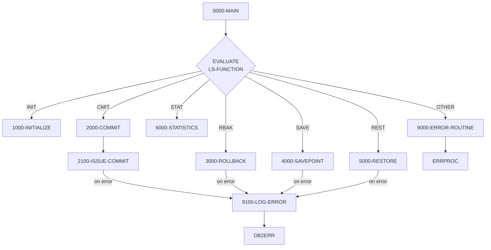

## Overview

DB2CMT is a common service program that provides centralized DB2 transaction management for the portfolio management system. It is designed to be called by other programs needing to manage database transactions, ensuring consistent commit/rollback behavior across the application.

The program implements a function-driven interface that supports six operations:
- **INIT** - Initialize commit controller statistics
- **CMIT** - Conditional or forced commit
- **RBAK** - Full rollback
- **SAVE** - Create a named savepoint
- **REST** - Restore to a named savepoint
- **STAT** - Display transaction statistics

This centralized approach provides several benefits: consistent error handling across all database operations, transaction statistics tracking for performance monitoring, and support for partial rollbacks using savepoints. The program follows a stateless design where it can be called multiple times within a unit of work.

## Program Structure



## Data Structures

### Working Storage

| Level | Name | Picture | Description |
|-------|------|---------|-------------|
| 01 | WS-SAVEPOINT-ID | PIC X(18) | Host variable for savepoint name (SQL DECLARE SECTION) |
| 01 | WS-COMMIT-STATS | - | Transaction statistics group |
| 05 | WS-COMMIT-COUNT | PIC S9(9) COMP | Number of commits issued |
| 05 | WS-ROLLBACK-COUNT | PIC S9(9) COMP | Number of rollbacks issued |
| 05 | WS-SAVEPOINT-COUNT | PIC S9(9) COMP | Number of savepoints created |
| 01 | WS-CURRENT-TIMESTAMP | PIC X(26) | Current timestamp storage |

### Linkage Section (Interface)

| Level | Name | Picture | Description |
|-------|------|---------|-------------|
| 01 | LS-COMMIT-REQUEST | - | Main interface structure |
| 05 | LS-FUNCTION | PIC X(4) | Function code (see values below) |
| 05 | LS-SAVEPOINT-NAME | PIC X(18) | Savepoint name for SAVE/REST functions |
| 05 | LS-COMMIT-PARMS | - | Commit parameters group |
| 10 | LS-RECORDS-PROC | PIC S9(9) COMP | Records processed (for conditional commit) |
| 10 | LS-COMMIT-FREQ | PIC S9(4) COMP | Commit frequency threshold |
| 10 | LS-FORCE-FLAG | PIC X(1) | Force commit flag (`Y` = force) |
| 05 | LS-RETURN-CODE | PIC S9(4) COMP | Return code (0=success, 8=error, 12=severe) |
| 05 | LS-ERROR-INFO | - | Error information group |
| 10 | LS-SQLCODE | PIC S9(9) COMP | DB2 SQLCODE from failed operation |
| 10 | LS-ERROR-MSG | PIC X(80) | Error message text |

### Function Codes (88-Level Conditions)

| Condition Name | Value | Description |
|----------------|-------|-------------|
| FUNC-INIT | `INIT` | Initialize statistics counters |
| FUNC-CMIT | `CMIT` | Issue conditional/forced commit |
| FUNC-RBACK | `RBAK` | Issue full rollback |
| FUNC-SAVE | `SAVE` | Create savepoint |
| FUNC-REST | `REST` | Restore to savepoint |
| FUNC-STAT | `STAT` | Display statistics |

### SQL Communication Area (from SQLCA copybook)

| Field | Description |
|-------|-------------|
| SQLCODE | SQL return code (0=success, negative=error, 100=not found) |
| SQLSTATE | 5-character SQL state code |
| SQLERRM | Error message text from DB2 |

### SQL Status Codes (from SQLCA copybook)

| Name | Value | Meaning |
|------|-------|---------|
| SQL-SUCCESS | `00000` | Successful completion |
| SQL-NOT-FOUND | `02000` | No data found |
| SQL-DUP-KEY | `23505` | Duplicate key violation |
| SQL-DEADLOCK | `40001` | Deadlock detected |
| SQL-TIMEOUT | `40003` | Timeout occurred |
| SQL-CONNECTION-ERROR | `08001` | Connection error |
| SQL-DB-ERROR | `58004` | Database system error |

## File I/O

This program does not perform any file I/O operations. It exclusively manages DB2 transactions through embedded SQL statements.

## Control Flow

### Function Dispatch (0000-MAIN)

The main paragraph uses an `EVALUATE TRUE` statement to dispatch to the appropriate function handler based on the 88-level condition names defined on `LS-FUNCTION`. This pattern is equivalent to a switch/case statement and provides clean, readable function routing.

### Initialize Function (1000-INITIALIZE)

Resets all transaction statistics counters to zero:
- `WS-COMMIT-COUNT`
- `WS-ROLLBACK-COUNT`
- `WS-SAVEPOINT-COUNT`

Sets return code to 0 (success).

### Commit Function (2000-COMMIT)

Implements conditional commit logic:

```
IF LS-RECORDS-PROC >= LS-COMMIT-FREQ
OR LS-FORCE-COMMIT
    PERFORM 2100-ISSUE-COMMIT
END-IF
```

The commit is issued only when:
1. The number of records processed meets or exceeds the commit frequency, OR
2. The force flag (`LS-FORCE-FLAG`) is set to `'Y'`

This allows calling programs to implement interval-based commits (e.g., every 1,000 records) while also supporting explicit commits at logical boundaries.

The actual `EXEC SQL COMMIT WORK` is issued in `2100-ISSUE-COMMIT`, which:
- Increments `WS-COMMIT-COUNT` on success
- Sets `LS-RETURN-CODE` to 0 on success, 8 on failure
- Logs errors via `9100-LOG-ERROR` on failure

### Rollback Function (3000-ROLLBACK)

Issues a full `EXEC SQL ROLLBACK WORK` to undo all changes since the last commit:
- Increments `WS-ROLLBACK-COUNT` on success
- Sets return code and logs errors on failure

### Savepoint Function (4000-SAVEPOINT)

Creates a named savepoint using the DB2 `SAVEPOINT` statement:

```sql
SAVEPOINT :WS-SAVEPOINT-ID ON ROLLBACK RETAIN CURSORS
```

Key features:
- The savepoint name is passed via `LS-SAVEPOINT-NAME`
- `ON ROLLBACK RETAIN CURSORS` preserves cursor positions if a rollback to this savepoint occurs
- Increments `WS-SAVEPOINT-COUNT` on success

Savepoints enable partial rollbacks, allowing a program to undo recent changes without losing all work since the last commit.

### Restore Function (5000-RESTORE)

Rolls back to a previously created savepoint:

```sql
ROLLBACK TO SAVEPOINT :WS-SAVEPOINT-ID
```

This undoes all changes made after the savepoint was created while preserving changes made before it. The rollback counter is incremented on success.

### Statistics Function (6000-STATISTICS)

Displays accumulated transaction statistics to SYSOUT:
```
DB2 Commit Controller Statistics:
  Commits:    nnnnnnnnn
  Rollbacks:  nnnnnnnnn
  Savepoints: nnnnnnnnn
```

### Error Handling

Two error routines handle different scenarios:

**9000-ERROR-ROUTINE** - For program-level errors (invalid function code):
- Sets `ERR-PROGRAM` to `'DB2CMT'`
- Sets return code to 12 (severe error)
- Calls `ERRPROC` for error logging

**9100-LOG-ERROR** - For DB2 operation failures:
- Calls `DB2ERR` with the error information structure
- The SQLCODE and error message are already populated by the calling paragraph

## Dependencies

### Copybooks

- **SQLCA** - SQL Communication Area containing SQLCODE, SQLSTATE, and error message fields; also defines common SQL status code constants
- **DBPROC** - DB2 standard procedures including error message formatting structure and common DB2 routines (CONNECT-TO-DB2, DB2-ERROR-ROUTINE)
- **ERRHAND** - Standard error handling definitions including ERR-MESSAGE structure, return code constants, and error categories

### Called Programs

- **ERRPROC** - Error processing routine for logging program errors
- **DB2ERR** - DB2-specific error logging routine

### Related Programs

Programs that share the same DB2 infrastructure (SQLCA, DBPROC):
- HISTLD00 - Position history DB2 loader
- DB2CONN - DB2 connection management
- DB2ERR - DB2 error handling
- DB2STAT - DB2 status utilities

Programs that may call DB2CMT for transaction management:
- Any batch program requiring controlled commit intervals
- Programs needing savepoint support for complex transactions

## Usage Example

To use DB2CMT from a calling program:

```cobol
WORKING-STORAGE SECTION.
01  WS-COMMIT-REQUEST.
    05  WS-FUNCTION         PIC X(4).
    05  WS-SAVEPOINT-NAME   PIC X(18).
    05  WS-COMMIT-PARMS.
        10  WS-RECORDS-PROC PIC S9(9) COMP.
        10  WS-COMMIT-FREQ  PIC S9(4) COMP VALUE 1000.
        10  WS-FORCE-FLAG   PIC X(1) VALUE 'N'.
    05  WS-RETURN-CODE      PIC S9(4) COMP.
    05  WS-ERROR-INFO.
        10  WS-SQLCODE      PIC S9(9) COMP.
        10  WS-ERROR-MSG    PIC X(80).

PROCEDURE DIVISION.
    * Initialize at start of job
    MOVE 'INIT' TO WS-FUNCTION
    CALL 'DB2CMT' USING WS-COMMIT-REQUEST
    
    * After processing each record
    ADD 1 TO WS-RECORDS-PROC
    MOVE 'CMIT' TO WS-FUNCTION
    CALL 'DB2CMT' USING WS-COMMIT-REQUEST
    
    * Force final commit
    MOVE 'Y' TO WS-FORCE-FLAG
    MOVE 'CMIT' TO WS-FUNCTION
    CALL 'DB2CMT' USING WS-COMMIT-REQUEST
```
