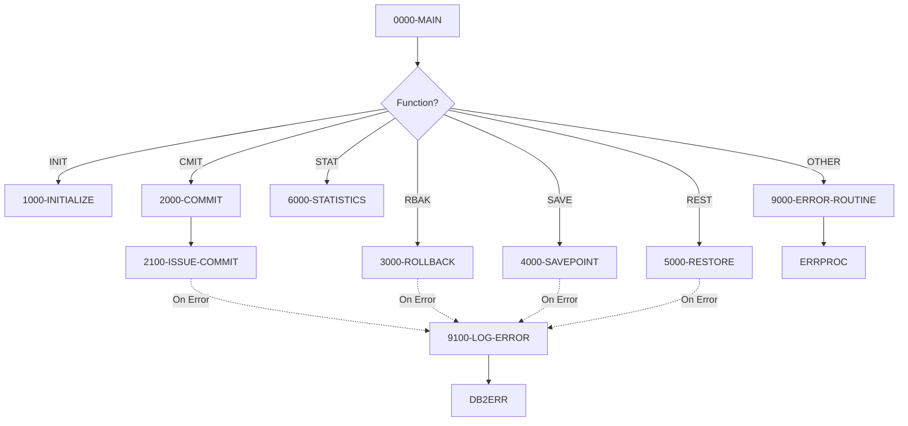

## Overview

DB2CMT is a reusable COBOL subprogram that provides centralized DB2 transaction management services. It acts as a commit controller, offering a standardized interface for commit, rollback, and savepoint operations across the application portfolio.

The program is designed to be called by other COBOL programs that need to manage database transactions. It supports six distinct functions:
- **INIT** - Initialize the commit controller
- **CMIT** - Commit work (conditional or forced)
- **RBAK** - Rollback work
- **SAVE** - Create a savepoint
- **REST** - Restore to a savepoint
- **STAT** - Display statistics

By centralizing transaction management, DB2CMT ensures consistent commit/rollback behavior, provides statistics tracking, and simplifies error handling across all database operations in the system.

## Program Structure



## Data Structures

### Working Storage

| Level | Name | Picture | Description |
|-------|------|---------|-------------|
| 01 | WS-SAVEPOINT-ID | PIC X(18) | Host variable for savepoint name (SQL DECLARE) |
| 01 | WS-COMMIT-STATS | - | Statistics counters group |
| 05 | WS-COMMIT-COUNT | PIC S9(9) COMP | Number of successful commits |
| 05 | WS-ROLLBACK-COUNT | PIC S9(9) COMP | Number of successful rollbacks |
| 05 | WS-SAVEPOINT-COUNT | PIC S9(9) COMP | Number of savepoints created |
| 01 | WS-CURRENT-TIMESTAMP | PIC X(26) | Timestamp field (26 chars for DB2 format) |

### Linkage Section (Interface)

The program receives a single parameter block `LS-COMMIT-REQUEST`:

| Level | Name | Picture | Description |
|-------|------|---------|-------------|
| 05 | LS-FUNCTION | PIC X(4) | Function code to execute |
| 05 | LS-SAVEPOINT-NAME | PIC X(18) | Savepoint name for SAVE/REST functions |
| 05 | LS-COMMIT-PARMS | - | Commit parameters group |
| 10 | LS-RECORDS-PROC | PIC S9(9) COMP | Records processed since last commit |
| 10 | LS-COMMIT-FREQ | PIC S9(4) COMP | Commit frequency threshold |
| 10 | LS-FORCE-FLAG | PIC X(1) | Force commit flag (`Y` = force) |
| 05 | LS-RETURN-CODE | PIC S9(4) COMP | Return code from operation |
| 05 | LS-ERROR-INFO | - | Error information group |
| 10 | LS-SQLCODE | PIC S9(9) COMP | SQL return code on error |
| 10 | LS-ERROR-MSG | PIC X(80) | Error message text |

### Function Codes (88-levels)

| Condition Name | Value | Description |
|----------------|-------|-------------|
| FUNC-INIT | 'INIT' | Initialize commit controller |
| FUNC-CMIT | 'CMIT' | Commit work |
| FUNC-RBACK | 'RBAK' | Rollback work |
| FUNC-SAVE | 'SAVE' | Create savepoint |
| FUNC-REST | 'REST' | Restore to savepoint |
| FUNC-STAT | 'STAT' | Display statistics |

### Force Commit Flag

| Condition Name | Value | Description |
|----------------|-------|-------------|
| LS-FORCE-COMMIT | 'Y' | Force immediate commit regardless of threshold |

## DB2 Operations

### SQL Statements

| Statement | Function | Description |
|-----------|----------|-------------|
| `COMMIT WORK` | CMIT | Commits all pending database changes |
| `ROLLBACK WORK` | RBAK | Rolls back all pending changes |
| `SAVEPOINT :name ON ROLLBACK RETAIN CURSORS` | SAVE | Creates a named savepoint preserving cursor positions |
| `ROLLBACK TO SAVEPOINT :name` | REST | Rolls back to a specific savepoint |

### SQLCODE Handling

| SQLCODE | Action |
|---------|--------|
| 0 | Success - increment appropriate counter, return code 0 |
| Other | Error - set LS-SQLCODE, LS-ERROR-MSG, return code 8, call DB2ERR |

## Control Flow

### Main Entry Point (0000-MAIN)

The program uses an EVALUATE statement to dispatch to the appropriate function based on LS-FUNCTION:

```cobol
EVALUATE TRUE
    WHEN FUNC-INIT  → 1000-INITIALIZE
    WHEN FUNC-CMIT  → 2000-COMMIT
    WHEN FUNC-RBACK → 3000-ROLLBACK
    WHEN FUNC-SAVE  → 4000-SAVEPOINT
    WHEN FUNC-REST  → 5000-RESTORE
    WHEN FUNC-STAT  → 6000-STATISTICS
    WHEN OTHER      → 9000-ERROR-ROUTINE
END-EVALUATE
```

### Function: INIT (1000-INITIALIZE)

Initializes the commit controller:
1. Resets all statistics counters to zero
2. Sets return code to 0

### Function: CMIT (2000-COMMIT)

Performs conditional or forced commit:
1. Checks if commit is needed:
   - `LS-RECORDS-PROC >= LS-COMMIT-FREQ` (threshold reached), OR
   - `LS-FORCE-FLAG = 'Y'` (force flag set)
2. If commit needed, calls 2100-ISSUE-COMMIT
3. Issues `EXEC SQL COMMIT WORK`
4. On success: increments commit count, return code 0
5. On failure: captures SQLCODE, sets error message, return code 8, logs error

### Function: RBAK (3000-ROLLBACK)

Performs unconditional rollback:
1. Issues `EXEC SQL ROLLBACK WORK`
2. On success: increments rollback count, return code 0
3. On failure: captures SQLCODE, sets error message, return code 8, logs error

### Function: SAVE (4000-SAVEPOINT)

Creates a named savepoint:
1. Copies `LS-SAVEPOINT-NAME` to host variable
2. Issues `EXEC SQL SAVEPOINT :WS-SAVEPOINT-ID ON ROLLBACK RETAIN CURSORS`
3. The `ON ROLLBACK RETAIN CURSORS` clause preserves cursor positions if rollback occurs
4. On success: increments savepoint count, return code 0
5. On failure: captures SQLCODE, sets error message, return code 8, logs error

### Function: REST (5000-RESTORE)

Restores to a named savepoint:
1. Copies `LS-SAVEPOINT-NAME` to host variable
2. Issues `EXEC SQL ROLLBACK TO SAVEPOINT :WS-SAVEPOINT-ID`
3. On success: increments rollback count, return code 0
4. On failure: captures SQLCODE, sets error message, return code 8, logs error

### Function: STAT (6000-STATISTICS)

Displays commit controller statistics to the job log:
```
DB2 Commit Controller Statistics:
  Commits:    nnnnnnnnn
  Rollbacks:  nnnnnnnnn
  Savepoints: nnnnnnnnn
```

### Error Handling

**9000-ERROR-ROUTINE**: Handles invalid function codes
1. Sets program name in error structure
2. Sets return code 12
3. Calls ERRPROC for logging

**9100-LOG-ERROR**: Handles DB2 operation failures
1. Calls DB2ERR with error information

## Calling Interface

### How to Call DB2CMT

```cobol
WORKING-STORAGE SECTION.
01  WS-COMMIT-REQUEST.
    05  WS-FUNCTION         PIC X(4).
    05  WS-SAVEPOINT-NAME   PIC X(18).
    05  WS-COMMIT-PARMS.
        10  WS-RECORDS-PROC PIC S9(9) COMP.
        10  WS-COMMIT-FREQ  PIC S9(4) COMP.
        10  WS-FORCE-FLAG   PIC X(1).
    05  WS-RETURN-CODE      PIC S9(4) COMP.
    05  WS-ERROR-INFO.
        10  WS-SQLCODE      PIC S9(9) COMP.
        10  WS-ERROR-MSG    PIC X(80).

PROCEDURE DIVISION.
    *> Initialize the commit controller
    MOVE 'INIT' TO WS-FUNCTION
    CALL 'DB2CMT' USING WS-COMMIT-REQUEST
    
    *> Conditional commit (every 1000 records)
    MOVE 'CMIT' TO WS-FUNCTION
    MOVE WS-REC-COUNT TO WS-RECORDS-PROC
    MOVE 1000 TO WS-COMMIT-FREQ
    MOVE 'N' TO WS-FORCE-FLAG
    CALL 'DB2CMT' USING WS-COMMIT-REQUEST
    
    *> Force commit at end of processing
    MOVE 'CMIT' TO WS-FUNCTION
    MOVE 'Y' TO WS-FORCE-FLAG
    CALL 'DB2CMT' USING WS-COMMIT-REQUEST
    
    *> Create a savepoint before risky operation
    MOVE 'SAVE' TO WS-FUNCTION
    MOVE 'BEFORE-UPDATE' TO WS-SAVEPOINT-NAME
    CALL 'DB2CMT' USING WS-COMMIT-REQUEST
    
    *> Restore to savepoint if operation fails
    MOVE 'REST' TO WS-FUNCTION
    MOVE 'BEFORE-UPDATE' TO WS-SAVEPOINT-NAME
    CALL 'DB2CMT' USING WS-COMMIT-REQUEST
```

### Return Codes

| Code | Meaning |
|------|---------|
| 0 | Operation successful |
| 8 | DB2 operation failed (check LS-SQLCODE and LS-ERROR-MSG) |
| 12 | Invalid function code |

## Dependencies

### Copybooks

- **SQLCA** - SQL Communication Area for DB2 return codes
- **DBPROC** - Database procedure definitions
- **ERRHAND** - Error handling structures (ERR-TEXT, ERR-PROGRAM, ERR-MESSAGE)

### Called Programs

- **ERRPROC** - Error processing routine (for invalid function codes)
- **DB2ERR** - DB2 error logging routine (for SQL failures)

### Related Programs

Programs that share copybooks with DB2CMT (potential callers):

| Program | Shared Copybooks | Relationship |
|---------|------------------|--------------|
| HISTLD00 | SQLCA, DBPROC, ERRHAND | Batch loader - likely caller for commit management |
| DB2CONN | SQLCA, DBPROC, ERRHAND | DB2 connection utility |
| DB2ERR | SQLCA, DBPROC, ERRHAND | DB2 error handler - called by this program |
| DB2STAT | SQLCA, DBPROC, ERRHAND | DB2 statistics utility |

## Technical Notes

### Savepoint Behavior

The `ON ROLLBACK RETAIN CURSORS` clause on the SAVEPOINT statement ensures that:
- Cursor positions are preserved if a rollback to savepoint occurs
- This is important for batch processing that iterates through result sets

### Statistics Persistence

Statistics counters (WS-COMMIT-STATS) persist across calls within a single program execution. To reset statistics:
1. Call with FUNC-INIT, or
2. Terminate and restart the calling program

### Thread Safety

This program maintains state in working storage, which is not shared across threads. Each calling program/thread will have its own instance of the commit controller with independent statistics.

### Commit Frequency Strategy

The conditional commit logic (`LS-RECORDS-PROC >= LS-COMMIT-FREQ`) allows callers to:
- Track records processed externally
- Let DB2CMT decide when to commit based on the threshold
- Override with force flag for end-of-job commits

This pattern supports efficient batch processing with configurable commit intervals.
