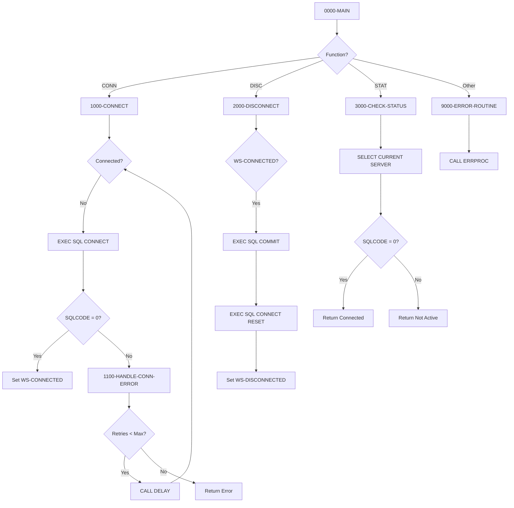

## Overview

DB2CONN is a callable COBOL subprogram that provides centralized DB2 database connection management services. It abstracts the complexities of DB2 connection handling, including automatic retry logic with configurable attempts and error classification.

The program is designed to be called by other COBOL programs that need to establish, terminate, or verify DB2 database connections. By centralizing connection logic, it ensures consistent connection handling, proper error reporting, and standardized retry behavior across the application.

**Key Features:**
- **Connection with Retry Logic**: Automatically retries failed connections up to 3 times with delays between attempts
- **Graceful Disconnection**: Commits pending work before disconnecting
- **Status Checking**: Verifies active connections by querying `SYSIBM.SYSDUMMY1`
- **Error Classification**: Translates SQLCODE values into meaningful error messages

## Program Structure



## Data Structures

### Working Storage

#### SQL Host Variables

| Level | Name | Picture | Description |
|-------|------|---------|-------------|
| 01 | WS-DB-NAME | X(8) | Database name for connection |
| 01 | WS-PLAN-NAME | X(8) | DB2 plan name |

#### Connection State

| Level | Name | Picture | Values | Description |
|-------|------|---------|--------|-------------|
| 01 | WS-CONNECTION-STATE | X(1) | | Current connection state flag |
| 88 | WS-CONNECTED | | 'Y' | Connection is active |
| 88 | WS-DISCONNECTED | | 'N' | Connection is inactive |

#### Retry Configuration

| Level | Name | Picture | Value | Description |
|-------|------|---------|-------|-------------|
| 01 | WS-RETRY-COUNT | S9(4) COMP | 0 | Current retry attempt counter |
| 01 | WS-MAX-RETRIES | S9(4) COMP | 3 | Maximum connection retry attempts |

### Linkage Section

The program receives a request structure from calling programs:

#### LS-DB2-REQUEST

| Level | Name | Picture | Description |
|-------|------|---------|-------------|
| 01 | LS-DB2-REQUEST | Group | Main parameter block |
| 05 | LS-FUNCTION | X(4) | Function code (see 88-levels below) |
| 88 | FUNC-CONN | 'CONN' | Request database connection |
| 88 | FUNC-DISC | 'DISC' | Request disconnection |
| 88 | FUNC-STAT | 'STAT' | Check connection status |
| 05 | LS-DB-NAME | X(8) | Target database name |
| 05 | LS-PLAN-NAME | X(8) | DB2 plan name |
| 05 | LS-RETURN-CODE | S9(4) COMP | Return code (0=success) |
| 05 | LS-ERROR-INFO | Group | Error details |
| 10 | LS-SQLCODE | S9(9) COMP | DB2 SQLCODE value |
| 10 | LS-ERROR-MSG | X(80) | Descriptive error message |

## File I/O

This program does not perform file I/O operations. All data access is through DB2 SQL statements.

## Control Flow

### Function Dispatch (0000-MAIN)

The main paragraph uses an `EVALUATE TRUE` statement to dispatch to the appropriate processing paragraph based on the function code:

| Function | Value | Action |
|----------|-------|--------|
| FUNC-CONN | 'CONN' | Establish DB2 connection |
| FUNC-DISC | 'DISC' | Disconnect from DB2 |
| FUNC-STAT | 'STAT' | Check if connection is active |
| Other | * | Error - invalid function code |

### Connect Processing (1000-CONNECT)

1. Initialize state to disconnected and reset retry counter
2. Copy database and plan names from linkage to working storage
3. Loop until connected or max retries exceeded:
   - Execute `CONNECT TO :WS-DB-NAME`
   - If successful (SQLCODE = 0), set connected state and return code 0
   - If failed, increment retry counter and classify error
   - If retries remain, call DELAY routine and retry
4. Return with appropriate return code and error information

### Connection Error Handling (1100-HANDLE-CONN-ERROR)

Classifies SQLCODE values into user-friendly messages:

| SQLCODE | Message |
|---------|---------|
| -30081 | "Maximum connections exceeded" |
| -99999 | "Network error connecting to DB2" |
| Other | "General DB2 connection error" |

### Disconnect Processing (2000-DISCONNECT)

1. Check if currently connected
2. Execute `COMMIT WORK` to save pending changes
3. Execute `CONNECT RESET` to release the connection
4. If successful, set disconnected state and return code 0
5. If failed, return error information with return code 8

### Status Check Processing (3000-CHECK-STATUS)

1. Execute `SELECT CURRENT SERVER INTO :WS-DB-NAME FROM SYSIBM.SYSDUMMY1`
2. If successful (SQLCODE = 0):
   - Set connected state
   - Return code 0
3. If failed:
   - Set disconnected state
   - Return code 4 with message "DB2 connection not active"

## SQL Statements

| Paragraph | SQL Statement | Purpose |
|-----------|--------------|---------|
| 1000-CONNECT | `CONNECT TO :WS-DB-NAME` | Establish database connection |
| 2000-DISCONNECT | `COMMIT WORK` | Commit pending transactions |
| 2000-DISCONNECT | `CONNECT RESET` | Release database connection |
| 3000-CHECK-STATUS | `SELECT CURRENT SERVER FROM SYSIBM.SYSDUMMY1` | Verify connection is active |

## Dependencies

### Copybooks

| Copybook | Location | Description |
|----------|----------|-------------|
| SQLCA | db2/ | SQL Communication Area - contains SQLCODE, SQLSTATE, and error info |
| DBPROC | db2/ | DB2 standard procedures including error handling and retry configuration |
| ERRHAND | common/ | Standard error handling definitions and message structures |

### Called Programs

| Program | Purpose |
|---------|---------|
| DELAY | Wait routine called between connection retry attempts |
| ERRPROC | Central error processing routine for logging errors |

### Related Programs

Programs that share the same DB2 copybooks:

| Program | Relationship |
|---------|--------------|
| DB2CMT | Uses SQLCA, DBPROC, ERRHAND - DB2 commit processing |
| DB2ERR | Uses SQLCA, DBPROC, ERRHAND - DB2 error handling |
| DB2STAT | Uses SQLCA, DBPROC, ERRHAND - DB2 statistics collection |
| HISTLD00 | Uses SQLCA, DBPROC - history data loading |

## Return Codes

| Code | Meaning | Context |
|------|---------|---------|
| 0 | Success | Connection established, disconnected, or status confirmed |
| 4 | Warning | Status check found no active connection |
| 8 | Error | Disconnect failed |
| 12 | Severe Error | Connection failed after retries or invalid function |

## Usage Example

To call DB2CONN from another COBOL program:

```cobol
WORKING-STORAGE SECTION.
01  WS-DB2-REQUEST.
    05  WS-FUNCTION         PIC X(4).
    05  WS-DB-NAME          PIC X(8).
    05  WS-PLAN-NAME        PIC X(8).
    05  WS-RETURN-CODE      PIC S9(4) COMP.
    05  WS-ERROR-INFO.
        10  WS-SQLCODE      PIC S9(9) COMP.
        10  WS-ERROR-MSG    PIC X(80).

PROCEDURE DIVISION.
    *> Connect to database
    MOVE 'CONN' TO WS-FUNCTION
    MOVE 'POSMVP' TO WS-DB-NAME
    MOVE 'PORTPLAN' TO WS-PLAN-NAME
    CALL 'DB2CONN' USING WS-DB2-REQUEST
    
    IF WS-RETURN-CODE NOT = 0
        DISPLAY 'Connection failed: ' WS-ERROR-MSG
        STOP RUN
    END-IF
    
    *> ... perform database operations ...
    
    *> Disconnect from database
    MOVE 'DISC' TO WS-FUNCTION
    CALL 'DB2CONN' USING WS-DB2-REQUEST
```

## Design Notes

### Retry Logic

The connection retry mechanism provides resilience against transient connection failures:
- Maximum of 3 retry attempts (configurable via `WS-MAX-RETRIES`)
- Delay between retries using the DELAY subprogram with `DB2-RETRY-WAIT` value (100 centiseconds from DBPROC copybook)
- Each retry logs the error before attempting again

### Connection State Management

The program maintains internal state (`WS-CONNECTION-STATE`) to track whether a connection is active:
- Prevents redundant disconnect attempts
- Enables accurate status reporting
- State is preserved between calls within the same run unit

### Graceful Disconnection

The disconnect function always commits pending work before releasing the connection, ensuring data integrity even if the caller forgets to explicitly commit.
