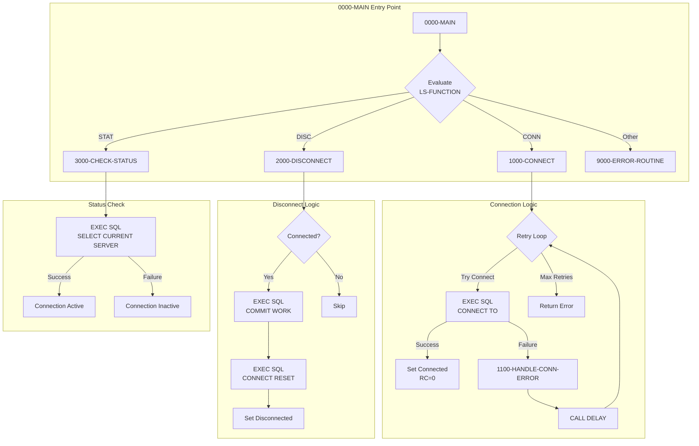
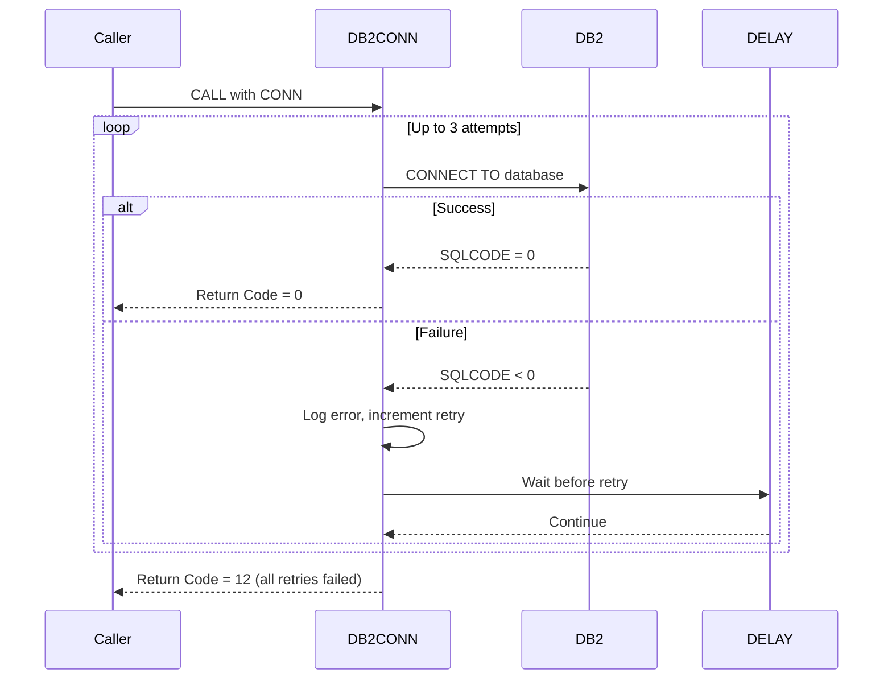

## Overview

DB2CONN is a reusable service program that provides centralized DB2 connection management for the Investment Portfolio Management System. It encapsulates the complexities of establishing, monitoring, and terminating database connections, implementing robust retry logic for transient connection failures.

The program is designed to be called by other COBOL programs that need DB2 database access, providing a consistent interface for:
- Establishing connections with automatic retry on failure
- Gracefully disconnecting with proper commit handling
- Checking connection status to verify database availability

By centralizing connection management, DB2CONN ensures consistent error handling and retry behavior across all programs that access DB2, reducing code duplication and simplifying maintenance.

## Program Structure



## Data Structures

### Working Storage

#### SQL Declare Section

| Level | Name | Picture | Description |
|-------|------|---------|-------------|
| 01 | WS-DB-NAME | X(8) | Target database name for connection |
| 01 | WS-PLAN-NAME | X(8) | DB2 plan name (reserved for future use) |

#### Connection State Management

| Level | Name | Picture | Description |
|-------|------|---------|-------------|
| 01 | WS-CONNECTION-STATE | X(1) | Current connection state flag |
| 88 | WS-CONNECTED | VALUE 'Y' | Condition: Connection is active |
| 88 | WS-DISCONNECTED | VALUE 'N' | Condition: Connection is inactive |
| 01 | WS-RETRY-COUNT | S9(4) COMP | Current retry attempt counter |
| 01 | WS-MAX-RETRIES | S9(4) COMP | Maximum retry attempts (default: 3) |

### Linkage Section (API Interface)

The program receives requests through the `LS-DB2-REQUEST` parameter structure:

| Level | Name | Picture | Description |
|-------|------|---------|-------------|
| 01 | LS-DB2-REQUEST | - | Request parameter block |
| 05 | LS-FUNCTION | X(4) | Function code (see below) |
| 05 | LS-DB-NAME | X(8) | Database name for CONN function |
| 05 | LS-PLAN-NAME | X(8) | DB2 plan name |
| 05 | LS-RETURN-CODE | S9(4) COMP | Return code from operation |
| 05 | LS-ERROR-INFO | - | Error information group |
| 10 | LS-SQLCODE | S9(9) COMP | SQL return code on error |
| 10 | LS-ERROR-MSG | X(80) | Descriptive error message |

#### Function Codes

| Code | 88-Level Name | Description |
|------|---------------|-------------|
| `'CONN'` | FUNC-CONN | Establish database connection |
| `'DISC'` | FUNC-DISC | Disconnect from database |
| `'STAT'` | FUNC-STAT | Check connection status |

## File I/O

This program does not use any file I/O operations. All database interaction is performed through embedded SQL statements.

## Control Flow

### Connection Process (1000-CONNECT)

The connection logic implements a retry pattern for handling transient failures:

1. Initialize state to disconnected and reset retry counter
2. Copy database name and plan name from linkage section
3. Enter retry loop (maximum 3 attempts):
   - Execute `CONNECT TO :WS-DB-NAME`
   - If SQLCODE = 0: Set connected state, return code 0
   - If SQLCODE ≠ 0: Increment retry counter, call error handler
   - If more retries available: Call DELAY routine, continue loop
4. Return final status to caller

```cobol
EXEC SQL
    CONNECT TO :WS-DB-NAME
END-EXEC
```

### Connection Error Handling (1100-HANDLE-CONN-ERROR)

Translates SQL codes into meaningful messages:

| SQLCODE | Message | Meaning |
|---------|---------|---------|
| -30081 | Maximum connections exceeded | DB2 subsystem at connection limit |
| -99999 | Network error connecting to DB2 | Network/communication failure |
| Other | General DB2 connection error | Unclassified connection failure |

### Disconnect Process (2000-DISCONNECT)

Ensures clean disconnection with data integrity:

1. Check if currently connected
2. Execute `COMMIT WORK` to save pending changes
3. Execute `CONNECT RESET` to release connection
4. Update state and return appropriate code

```cobol
EXEC SQL
    COMMIT WORK
END-EXEC

EXEC SQL
    CONNECT RESET
END-EXEC
```

### Status Check (3000-CHECK-STATUS)

Verifies connection is active by executing a simple query:

```cobol
EXEC SQL
    SELECT CURRENT SERVER
    INTO :WS-DB-NAME
    FROM SYSIBM.SYSDUMMY1
END-EXEC
```

This query against the DB2 catalog table `SYSIBM.SYSDUMMY1` is a lightweight way to verify the connection is responsive.

## Dependencies

### Copybooks

| Copybook | Location | Description |
|----------|----------|-------------|
| SQLCA | db2/ | SQL Communication Area - contains SQLCODE, SQLSTATE |
| DBPROC | db2/ | DB2 standard procedures and error handling structures |
| ERRHAND | common/ | Standard error handling definitions and return codes |

### Called Programs

| Program | Purpose |
|---------|---------|
| DELAY | System delay routine for retry wait periods |
| ERRPROC | Standard error processing and logging |

### Related Programs

The DB2CONN program is part of a suite of DB2 infrastructure programs:

| Program | Relationship | Description |
|---------|--------------|-------------|
| DB2CMT | Sibling | DB2 Commit Controller - manages commits, rollbacks, savepoints |
| DB2ERR | Sibling | DB2 Error Handler - logs and diagnoses SQL errors |
| DB2STAT | Sibling | DB2 Statistics Collector - tracks DB2 operation metrics |
| HISTLD00 | Consumer | History load program - uses DB2CONN for connections |

## Usage Examples

### Establishing a Connection

```cobol
WORKING-STORAGE SECTION.
01  WS-DB2-REQUEST.
    05  WS-FUNCTION        PIC X(4).
    05  WS-DB-NAME         PIC X(8).
    05  WS-PLAN-NAME       PIC X(8).
    05  WS-RETURN-CODE     PIC S9(4) COMP.
    05  WS-ERROR-INFO.
        10  WS-SQLCODE     PIC S9(9) COMP.
        10  WS-ERROR-MSG   PIC X(80).

PROCEDURE DIVISION.
    MOVE 'CONN' TO WS-FUNCTION
    MOVE 'POSMVP' TO WS-DB-NAME
    MOVE 'PLANNAME' TO WS-PLAN-NAME
    
    CALL 'DB2CONN' USING WS-DB2-REQUEST
    
    IF WS-RETURN-CODE NOT = 0
        DISPLAY 'Connection failed: ' WS-ERROR-MSG
        PERFORM ERROR-ROUTINE
    END-IF
```

### Checking Connection Status

```cobol
    MOVE 'STAT' TO WS-FUNCTION
    
    CALL 'DB2CONN' USING WS-DB2-REQUEST
    
    IF WS-RETURN-CODE = 0
        DISPLAY 'Connected to: ' WS-DB-NAME
    ELSE
        DISPLAY 'Not connected'
    END-IF
```

### Disconnecting

```cobol
    MOVE 'DISC' TO WS-FUNCTION
    
    CALL 'DB2CONN' USING WS-DB2-REQUEST
    
    IF WS-RETURN-CODE NOT = 0
        DISPLAY 'Disconnect warning: ' WS-ERROR-MSG
    END-IF
```

## Return Codes

| Code | Meaning | Condition |
|------|---------|-----------|
| 0 | Success | Operation completed successfully |
| 4 | Warning | Connection not active (STAT function) |
| 8 | Error | Disconnect failed after commit |
| 12 | Severe Error | Connection failed after all retries, or invalid function |

## COBOL Concepts

### Embedded SQL

DB2CONN uses embedded SQL statements enclosed in `EXEC SQL ... END-EXEC` blocks. These statements are processed by the DB2 precompiler before COBOL compilation, converting them into CALL statements to the DB2 runtime.

### SQLCA (SQL Communication Area)

The SQLCA copybook provides the `SQLCODE` field that indicates the result of each SQL operation:
- `SQLCODE = 0`: Successful execution
- `SQLCODE > 0`: Warning (e.g., +100 = not found)
- `SQLCODE < 0`: Error condition

### Host Variables

Variables prefixed with `:` in SQL statements (e.g., `:WS-DB-NAME`) are host variables that allow data exchange between COBOL and SQL. They must be declared within the SQL DECLARE SECTION.

### Condition Names (88-levels)

The program uses 88-level condition names for readable state management:
```cobol
01  WS-CONNECTION-STATE      PIC X(1).
    88  WS-CONNECTED           VALUE 'Y'.
    88  WS-DISCONNECTED        VALUE 'N'.
```

This allows natural-language conditions like `IF WS-CONNECTED` or `SET WS-DISCONNECTED TO TRUE`.

## Error Handling

### Retry Strategy

The program implements an automatic retry strategy for transient connection failures:



### Error Propagation

On failure, DB2CONN populates the linkage section error fields:
- `LS-SQLCODE`: The actual SQL return code
- `LS-ERROR-MSG`: A human-readable error description
- `LS-RETURN-CODE`: Severity level for caller decision-making

## Issues

:::note Design Considerations
- The `WS-PLAN-NAME` field is accepted but not currently used in the CONNECT statement. Future versions may support plan-specific connections.
- The DELAY routine is called but not defined in this program; it must be available in the runtime environment.
- The retry wait time is defined in DBPROC copybook as `DB2-RETRY-WAIT` (100 units).
:::
