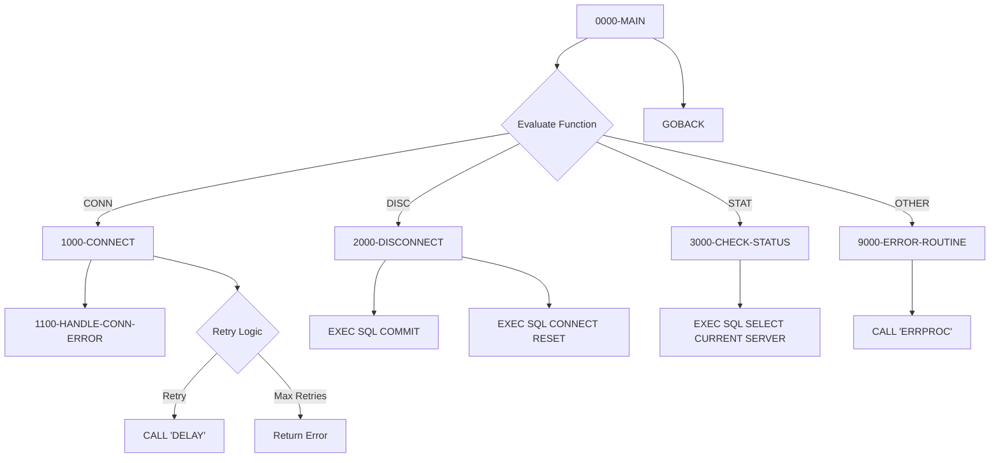

## Overview

DB2CONN is a reusable COBOL subprogram that provides centralized DB2 database connection management services. It acts as a service module that other programs call to establish, terminate, and verify DB2 connections, abstracting the complexity of direct EXEC SQL connection handling.

The program supports three primary functions:
- **CONN** - Establish a connection to a specified DB2 database with automatic retry logic
- **DISC** - Gracefully disconnect from DB2 with commit before disconnection
- **STAT** - Check the current connection status by querying the database

This design pattern promotes code reuse and consistent error handling across all DB2-enabled applications in the system. By centralizing connection logic, changes to connection parameters, retry strategies, or error handling can be made in one place.

## Program Structure



## Data Structures

### Working-Storage Section

#### SQL Host Variables

The program defines host variables within an SQL DECLARE SECTION for use in embedded SQL statements:

| Level | Name | Picture | Description |
|-------|------|---------|-------------|
| 01 | WS-DB-NAME | X(8) | Target database name for connection |
| 01 | WS-PLAN-NAME | X(8) | DB2 plan name (passed but not used in current impl) |

#### Connection State Management

| Level | Name | Picture | Description |
|-------|------|---------|-------------|
| 01 | WS-CONNECTION-STATE | X(1) | Current connection status flag |
| 88 | WS-CONNECTED | VALUE 'Y' | Condition: connected to DB2 |
| 88 | WS-DISCONNECTED | VALUE 'N' | Condition: not connected |

#### Retry Configuration

| Level | Name | Picture | Description |
|-------|------|---------|-------------|
| 01 | WS-RETRY-COUNT | S9(4) COMP | Current retry attempt counter |
| 01 | WS-MAX-RETRIES | S9(4) COMP | Maximum retry attempts (default: 3) |

### Linkage Section

The program receives parameters through the linkage section, allowing callers to specify the operation and receive results:

#### Request Structure (LS-DB2-REQUEST)

| Level | Name | Picture | Description |
|-------|------|---------|-------------|
| 01 | LS-DB2-REQUEST | - | Main parameter block |
| 05 | LS-FUNCTION | X(4) | Function code to execute |
| 88 | FUNC-CONN | VALUE 'CONN' | Connect function |
| 88 | FUNC-DISC | VALUE 'DISC' | Disconnect function |
| 88 | FUNC-STAT | VALUE 'STAT' | Status check function |
| 05 | LS-DB-NAME | X(8) | Database name for connection |
| 05 | LS-PLAN-NAME | X(8) | DB2 plan name |
| 05 | LS-RETURN-CODE | S9(4) COMP | Return code from operation |
| 05 | LS-ERROR-INFO | - | Error information group |
| 10 | LS-SQLCODE | S9(9) COMP | SQL return code |
| 10 | LS-ERROR-MSG | X(80) | Descriptive error message |

## File I/O

This program does not perform any file I/O operations. All data persistence is handled through DB2 database connections.

## Control Flow

### Main Entry Point (0000-MAIN)

The program uses an EVALUATE statement to dispatch to the appropriate processing paragraph based on the function code:

```cobol
EVALUATE TRUE
    WHEN FUNC-CONN    PERFORM 1000-CONNECT
    WHEN FUNC-DISC    PERFORM 2000-DISCONNECT
    WHEN FUNC-STAT    PERFORM 3000-CHECK-STATUS
    WHEN OTHER        PERFORM 9000-ERROR-ROUTINE
END-EVALUATE
```

### Connect Function (1000-CONNECT)

1. **Initialize State**
   - Set connection state to disconnected
   - Reset retry counter to zero
   - Copy database and plan names from linkage to working storage

2. **Connection Loop with Retry**
   - Execute `CONNECT TO :WS-DB-NAME` SQL statement
   - If SQLCODE = 0: Set connected flag, return code 0
   - If SQLCODE ≠ 0: Increment retry counter, call error handler
   - If retries remain and not connected: Call DELAY routine, then retry
   - Loop continues until connected or max retries exceeded

3. **Connection Error Handling (1100-HANDLE-CONN-ERROR)**
   - Captures SQLCODE in linkage area
   - Maps specific SQLCODEs to meaningful messages:
     - `-30081`: "Maximum connections exceeded"
     - `-99999`: "Network error connecting to DB2"
     - Other: "General DB2 connection error"
   - Sets return code to 12 (severe error)

### Disconnect Function (2000-DISCONNECT)

1. **Check Connection State**
   - Only proceeds if currently connected

2. **Graceful Shutdown**
   - Execute `COMMIT WORK` to save pending changes
   - Execute `CONNECT RESET` to release connection

3. **Result Handling**
   - If SQLCODE = 0: Set disconnected flag, return code 0
   - If SQLCODE ≠ 0: Capture error, set return code 8

### Status Check Function (3000-CHECK-STATUS)

1. **Query Current Server**
   ```sql
   SELECT CURRENT SERVER
   INTO :WS-DB-NAME
   FROM SYSIBM.SYSDUMMY1
   ```

2. **Interpret Result**
   - If SQLCODE = 0: Connection is active, return code 0
   - If SQLCODE ≠ 0: Connection lost, return code 4 with error message

### Error Routine (9000-ERROR-ROUTINE)

- Sets program name in error structure
- Sets return code to 12
- Calls ERRPROC for centralized error logging

## Dependencies

### Copybooks

| Copybook | Section | Description |
|----------|---------|-------------|
| SQLCA | Working-Storage | SQL Communication Area - standard DB2 structure containing SQLCODE, SQLSTATE, and diagnostic information |
| DBPROC | Working-Storage | DB2 standard procedures including error handling routines and retry configuration (DB2-RETRY-WAIT) |
| ERRHAND | Working-Storage | Standard error handling definitions including ERR-MESSAGE structure and ERR-TEXT field |

### Called Programs

| Program | Purpose |
|---------|---------|
| DELAY | System delay routine for retry wait periods |
| ERRPROC | Centralized error processing and logging |

### Related Programs

Programs in the DB2 common utilities suite:

- **DB2CMT** - DB2 Commit Manager (uses SQLCA, DBPROC, ERRHAND)
- **DB2ERR** - DB2 Error Handler (uses SQLCA, DBPROC, ERRHAND)
- **DB2STAT** - DB2 Statistics Collector (uses SQLCA, DBPROC, ERRHAND)
- **ERRPROC** - Error Processing utility (called by DB2CONN)

## Embedded SQL Statements

The program uses the following DB2 SQL statements:

| Statement | Paragraph | Purpose |
|-----------|-----------|---------|
| `CONNECT TO :host-var` | 1000-CONNECT | Establish database connection |
| `COMMIT WORK` | 2000-DISCONNECT | Commit pending transactions |
| `CONNECT RESET` | 2000-DISCONNECT | Release database connection |
| `SELECT CURRENT SERVER FROM SYSIBM.SYSDUMMY1` | 3000-CHECK-STATUS | Verify connection is active |

## Return Codes

| Code | Meaning | Returned By |
|------|---------|-------------|
| 0 | Successful operation | All functions on success |
| 4 | Warning - connection not active | 3000-CHECK-STATUS |
| 8 | Error during disconnect | 2000-DISCONNECT |
| 12 | Severe error - connection failed or invalid function | 1000-CONNECT, 9000-ERROR-ROUTINE |

## Usage Example

Calling programs should set up the linkage area and invoke DB2CONN:

```cobol
WORKING-STORAGE SECTION.
01  WS-DB2-REQUEST.
    05  WS-FUNCTION         PIC X(4).
    05  WS-DB-NAME          PIC X(8).
    05  WS-PLAN-NAME        PIC X(8).
    05  WS-RETURN-CODE      PIC S9(4) COMP.
    05  WS-ERROR-INFO.
        10  WS-SQLCODE      PIC S9(9) COMP.
        10  WS-ERROR-MSG    PIC X(80).

PROCEDURE DIVISION.
    * Connect to database
    MOVE 'CONN' TO WS-FUNCTION
    MOVE 'PRODDB' TO WS-DB-NAME
    MOVE 'MYPLAN' TO WS-PLAN-NAME
    CALL 'DB2CONN' USING WS-DB2-REQUEST
    
    IF WS-RETURN-CODE NOT = 0
        DISPLAY 'Connection failed: ' WS-ERROR-MSG
        STOP RUN
    END-IF
    
    * ... perform database operations ...
    
    * Disconnect from database
    MOVE 'DISC' TO WS-FUNCTION
    CALL 'DB2CONN' USING WS-DB2-REQUEST
```

## Technical Notes

### Retry Logic
The program implements automatic retry for connection failures with configurable parameters:
- **Maximum Retries**: 3 attempts (WS-MAX-RETRIES)
- **Retry Delay**: Controlled by DB2-RETRY-WAIT from DBPROC copybook (default 100 ms)

This is particularly useful for handling transient network issues or temporary connection pool exhaustion.

### Host Variables
Variables used in SQL statements must be declared within `EXEC SQL BEGIN DECLARE SECTION` / `END DECLARE SECTION` blocks. The colon prefix (`:WS-DB-NAME`) indicates a host variable to the DB2 precompiler.

### SYSIBM.SYSDUMMY1
This is a standard DB2 catalog table containing exactly one row, commonly used for executing SQL that doesn't require actual data (similar to Oracle's DUAL table). Querying CURRENT SERVER from this table is an efficient way to verify the connection is active.

### Connection Scope
DB2 connections in COBOL are typically scoped to the run unit. Once established, the connection remains active until explicitly reset or the program terminates.

## Compilation Requirements

This program requires:
1. DB2 precompilation to convert EXEC SQL statements
2. COBOL compilation with DB2 precompiler output
3. Bind of the resulting DBRM to a DB2 plan

```jcl
//* DB2 Precompile, Compile, and Bind
//STEP1   EXEC DSNHCOB2,PARM.PC='HOST(COBOL)'
//PC.SYSIN DD DSN=source.library(DB2CONN),DISP=SHR
//LKED.SYSLMOD DD DSN=load.library,DISP=SHR
//LKED.SYSIN DD *
  NAME DB2CONN(R)
/*
```
