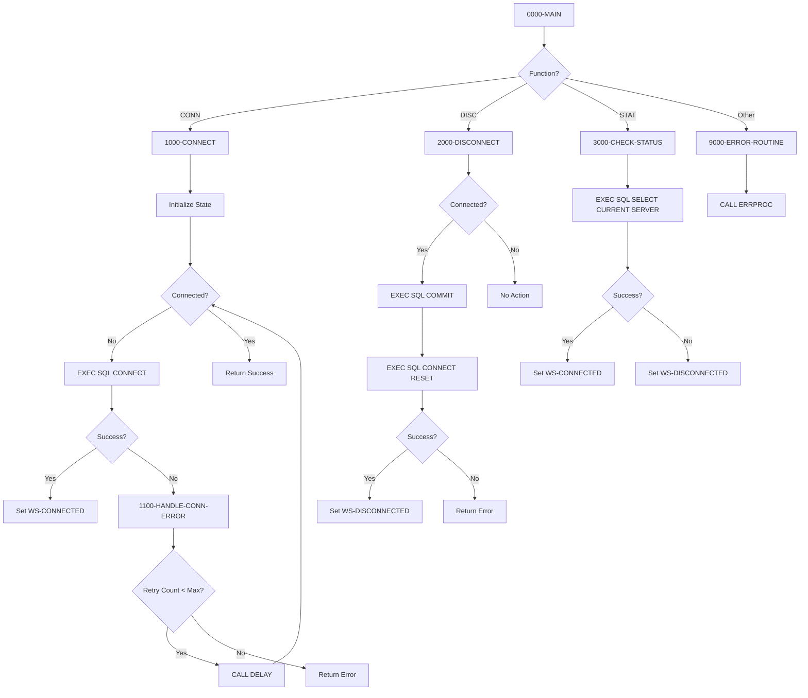

## Overview

DB2CONN is a callable COBOL subprogram that provides centralized DB2 database connection management for the Investment Portfolio Management System. It serves as the standard interface for establishing, terminating, and monitoring DB2 connections across all batch and utility programs.

Key capabilities include:

- **Connection Establishment**: Connects to specified DB2 subsystems with automatic retry logic
- **Graceful Disconnection**: Commits pending work and cleanly releases connections
- **Status Monitoring**: Verifies active connection state on demand
- **Error Handling**: Provides detailed error information for connection failures

This program is part of the DB2 Support Layer, working alongside DB2CMT (Commit Controller), DB2ERR (Error Handler), and DB2STAT (Statistics Collector) to provide comprehensive database services.

## Program Structure



## Calling Interface

DB2CONN is invoked via the COBOL `CALL` statement with a parameter block:

```cobol
CALL 'DB2CONN' USING LS-DB2-REQUEST
```

### Request Structure (LS-DB2-REQUEST)

| Level | Name | Picture | Description |
|-------|------|---------|-------------|
| 01 | LS-DB2-REQUEST | - | Request parameter block |
| 05 | LS-FUNCTION | X(4) | Function code (see below) |
| 05 | LS-DB-NAME | X(8) | Target database name |
| 05 | LS-PLAN-NAME | X(8) | DB2 plan name |
| 05 | LS-RETURN-CODE | S9(4) COMP | Return code (output) |
| 05 | LS-ERROR-INFO | - | Error details (output) |
| 10 | LS-SQLCODE | S9(9) COMP | SQL return code |
| 10 | LS-ERROR-MSG | X(80) | Error message text |

### Function Codes

| Code | 88-Level Name | Description |
|------|---------------|-------------|
| `CONN` | FUNC-CONN | Establish DB2 connection |
| `DISC` | FUNC-DISC | Disconnect from DB2 |
| `STAT` | FUNC-STAT | Check connection status |

### Return Codes

| Code | Meaning | Description |
|------|---------|-------------|
| 0 | Success | Operation completed successfully |
| 4 | Warning | Connection not active (STAT function only) |
| 8 | Error | Disconnect failed |
| 12 | Severe | Connection failed or invalid function |

## Data Structures

### Working Storage

#### SQL Host Variables

| Level | Name | Picture | Description |
|-------|------|---------|-------------|
| 01 | WS-DB-NAME | X(8) | Database name for SQL CONNECT |
| 01 | WS-PLAN-NAME | X(8) | Plan name (reserved for future use) |

#### Connection State

| Level | Name | Picture | Description |
|-------|------|---------|-------------|
| 01 | WS-CONNECTION-STATE | X(1) | Current connection state |
| 88 | WS-CONNECTED | VALUE 'Y' | Connection is active |
| 88 | WS-DISCONNECTED | VALUE 'N' | Connection is not active |

#### Retry Control

| Level | Name | Picture | Description |
|-------|------|---------|-------------|
| 01 | WS-RETRY-COUNT | S9(4) COMP | Current retry attempt |
| 01 | WS-MAX-RETRIES | S9(4) COMP | Maximum retry attempts (default: 3) |

## Control Flow

### Connect Function (CONN)

1. **Initialization**: Sets state to disconnected, zeros retry counter
2. **Connection Loop**: Attempts connection up to `WS-MAX-RETRIES` times
3. **SQL CONNECT**: Issues `EXEC SQL CONNECT TO :WS-DB-NAME`
4. **Success Handling**: Sets `WS-CONNECTED`, returns code 0
5. **Failure Handling**: 
   - Increments retry counter
   - Calls `1100-HANDLE-CONN-ERROR` to categorize error
   - Calls external `DELAY` routine for wait period (from `DB2-RETRY-WAIT` in DBPROC copybook)
6. **Exhausted Retries**: Returns code 12 with error details

### Disconnect Function (DISC)

1. **State Check**: Only proceeds if currently connected
2. **Commit Work**: Issues `EXEC SQL COMMIT WORK` to save pending changes
3. **Connection Reset**: Issues `EXEC SQL CONNECT RESET` to release connection
4. **Result**: Sets `WS-DISCONNECTED` on success, returns appropriate code

### Status Function (STAT)

1. **Probe Query**: Executes `SELECT CURRENT SERVER FROM SYSIBM.SYSDUMMY1`
2. **Active Connection**: SQLCODE 0 indicates connection is alive
3. **Inactive Connection**: Non-zero SQLCODE indicates connection lost
4. **State Update**: Sets 88-level condition based on result

## Error Handling

### Connection Error Categories

The program handles specific SQLCODE values in `1100-HANDLE-CONN-ERROR`:

| SQLCODE | Error Message | Description |
|---------|---------------|-------------|
| -30081 | Maximum connections exceeded | DB2 connection pool exhausted |
| -99999 | Network error connecting to DB2 | Network/communication failure |
| Other | General DB2 connection error | Unrecognized error condition |

### Error Propagation

- All errors populate `LS-SQLCODE` with the actual SQLCODE
- `LS-ERROR-MSG` contains a descriptive message
- `LS-RETURN-CODE` indicates severity
- Callers should check return code and handle appropriately

### Error Routine (9000-ERROR-ROUTINE)

For invalid function codes or unexpected errors:
1. Sets `ERR-PROGRAM` to 'DB2CONN'
2. Sets return code to 12 (severe)
3. Calls `ERRPROC` for centralized error logging

## Dependencies

### Copybooks

| Copybook | Purpose | Key Contents |
|----------|---------|--------------|
| SQLCA | SQL Communication Area | SQLCODE, SQLSTATE, error info |
| DBPROC | DB2 Procedures | DB2-RETRY-WAIT, error handling routines |
| ERRHAND | Error Handling | ERR-MESSAGE, ERR-PROGRAM, ERR-TEXT |

### Called Programs

| Program | Purpose | When Called |
|---------|---------|-------------|
| DELAY | Wait routine | Between connection retry attempts |
| ERRPROC | Error processor | On invalid function or fatal error |

### Related Programs

The DB2 Support Layer consists of four interconnected programs:

| Program | Relationship | Description |
|---------|--------------|-------------|
| DB2CONN | This program | Connection management |
| DB2CMT | Sibling | Commit/rollback control, savepoints |
| DB2ERR | Sibling | Error logging and diagnostics |
| DB2STAT | Sibling | Performance statistics collection |

### Programs That Use DB2CONN

Programs requiring DB2 access typically call DB2CONN for connection management:

- HISTLD00 - History loader (batch)
- Other batch programs requiring DB2 access

## Usage Examples

### Establishing a Connection

```cobol
WORKING-STORAGE SECTION.
01  WS-DB2-REQUEST.
    05  WS-FUNCTION         PIC X(4).
    05  WS-DB-NAME          PIC X(8).
    05  WS-PLAN-NAME        PIC X(8).
    05  WS-RETURN-CODE      PIC S9(4) COMP.
    05  WS-ERROR-INFO.
        10  WS-SQLCODE      PIC S9(9) COMP.
        10  WS-ERROR-MSG    PIC X(80).

PROCEDURE DIVISION.
    MOVE 'CONN' TO WS-FUNCTION
    MOVE 'POSMVP' TO WS-DB-NAME
    MOVE 'PLANNAME' TO WS-PLAN-NAME
    
    CALL 'DB2CONN' USING WS-DB2-REQUEST
    
    IF WS-RETURN-CODE NOT = 0
        DISPLAY 'Connection failed: ' WS-ERROR-MSG
        PERFORM ERROR-HANDLING
    END-IF
```

### Disconnecting

```cobol
    MOVE 'DISC' TO WS-FUNCTION
    
    CALL 'DB2CONN' USING WS-DB2-REQUEST
    
    IF WS-RETURN-CODE NOT = 0
        DISPLAY 'Disconnect warning: ' WS-ERROR-MSG
    END-IF
```

### Checking Connection Status

```cobol
    MOVE 'STAT' TO WS-FUNCTION
    
    CALL 'DB2CONN' USING WS-DB2-REQUEST
    
    IF WS-RETURN-CODE = 0
        DISPLAY 'DB2 connection is active'
    ELSE
        DISPLAY 'DB2 connection lost - reconnecting'
        MOVE 'CONN' TO WS-FUNCTION
        CALL 'DB2CONN' USING WS-DB2-REQUEST
    END-IF
```

## Technical Notes

### SQL Statements Used

| Statement | Purpose | Paragraph |
|-----------|---------|-----------|
| `CONNECT TO :host-var` | Establish connection | 1000-CONNECT |
| `COMMIT WORK` | Commit pending changes | 2000-DISCONNECT |
| `CONNECT RESET` | Release connection | 2000-DISCONNECT |
| `SELECT CURRENT SERVER FROM SYSIBM.SYSDUMMY1` | Test connection | 3000-CHECK-STATUS |

### Connection Retry Logic

The retry mechanism provides resilience against transient failures:

1. **Retry Count**: Default maximum of 3 attempts
2. **Wait Interval**: Uses `DB2-RETRY-WAIT` from DBPROC (default: 100 time units)
3. **External DELAY**: Calls system routine for wait period
4. **Failure Modes**: Distinguishes between retryable and terminal errors

### Thread Safety Considerations

- Each program instance maintains its own `WS-CONNECTION-STATE`
- In batch environments, typically one connection per job step
- Connection state is not shared across CALL invocations

### DB2 Subsystem

The program connects to the database name passed in `LS-DB-NAME`. The default database for this system is `POSMVP` (Portfolio Management MVP).
