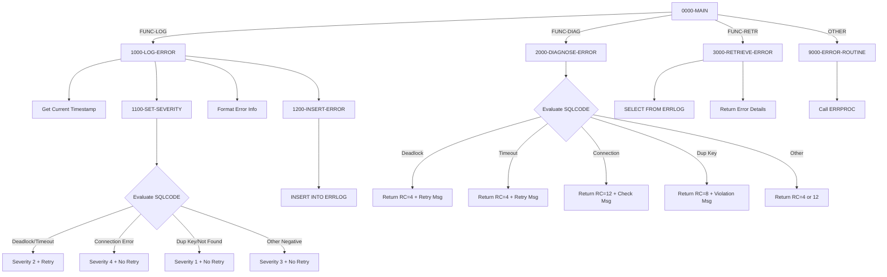

## Overview

DB2ERR is a common utility program that provides centralized DB2 error handling services for the application. It offers three primary functions:

- **LOG** - Records DB2 errors to the ERRLOG database table with full diagnostic information
- **DIAG** - Diagnoses SQL errors and provides human-readable error messages with retry recommendations
- **RETR** - Retrieves the most recent error history for a specified program

This program acts as a standardized error handling layer between application programs and DB2, ensuring consistent error logging, categorization, and diagnosis across the system. It intelligently categorizes errors by severity and determines whether operations should be retried (e.g., for deadlocks and timeouts).

## Program Structure



## Data Structures

### Linkage Section - Request Interface

The program receives requests through the `LS-ERROR-REQUEST` structure:

| Field | Picture | Description |
|-------|---------|-------------|
| LS-FUNCTION | X(4) | Function code: `'LOG '`, `'DIAG'`, or `'RETR'` |
| LS-PROGRAM-ID | X(8) | Calling program identifier |
| LS-SQLCODE | S9(9) COMP | SQL return code from failed operation |
| LS-SQLSTATE | X(5) | 5-character SQL state code |
| LS-ERROR-TEXT | X(80) | Error message text (input/output) |
| LS-ADDITIONAL-INFO | X(100) | Additional context information |
| LS-RETURN-CODE | S9(4) COMP | Return status code |
| LS-RETRY-FLAG | X(1) | `'Y'` = should retry, `'N'` = no retry |

**Condition Names:**

| Level-88 | Value | Description |
|----------|-------|-------------|
| FUNC-LOG | 'LOG ' | Log error to database |
| FUNC-DIAG | 'DIAG' | Diagnose error condition |
| FUNC-RETR | 'RETR' | Retrieve error history |
| LS-SHOULD-RETRY | 'Y' | Operation can be retried |
| LS-NO-RETRY | 'N' | Operation should not be retried |

### Working Storage

#### Error Category Constants

| Field | Value | Description |
|-------|-------|-------------|
| WS-DEADLOCK | -911 | DB2 deadlock SQLCODE |
| WS-TIMEOUT | -913 | DB2 timeout SQLCODE |
| WS-CONNECTION-ERROR | -30081 | DB2 connection failure SQLCODE |
| WS-DUP-KEY | -803 | Duplicate key SQLCODE |
| WS-NOT-FOUND | +100 | Row not found SQLCODE |

#### Formatting Fields

| Field | Picture | Description |
|-------|---------|-------------|
| WS-CURRENT-TIMESTAMP | X(26) | Current timestamp from system |
| WS-FORMATTED-SQLCODE | -Z(8)9 | Edited SQLCODE for display |

### ERRLOG Record Structure (from DBTBLS copybook)

| Field | Picture | Description |
|-------|---------|-------------|
| EL-ERROR-TIMESTAMP | X(26) | When error occurred |
| EL-PROGRAM-ID | X(8) | Program that encountered error |
| EL-ERROR-TYPE | X(1) | S=System, A=Application, D=Data |
| EL-ERROR-SEVERITY | S9(4) COMP | 1=Info, 2=Warn, 3=Error, 4=Severe |
| EL-ERROR-CODE | X(8) | Formatted SQLCODE and state |
| EL-ERROR-MESSAGE | X(200) | Error description |
| EL-PROCESS-DATE | X(10) | Processing date |
| EL-PROCESS-TIME | X(8) | Processing time |
| EL-USER-ID | X(8) | User identifier |
| EL-ADDITIONAL-INFO | X(500) | Extended error context |

## Database Operations

### ERRLOG Table

The program interacts with the ERRLOG table for error persistence.

**INSERT Operation (1200-INSERT-ERROR):**
```sql
INSERT INTO ERRLOG
VALUES (:WS-ERRLOG-REC)
```

**SELECT Operation (3000-RETRIEVE-ERROR):**
```sql
SELECT ERROR_MESSAGE,
       ERROR_SEVERITY,
       ADDITIONAL_INFO
INTO :EL-ERROR-MESSAGE,
     :EL-ERROR-SEVERITY,
     :EL-ADDITIONAL-INFO
FROM ERRLOG
WHERE PROGRAM_ID = :LS-PROGRAM-ID
AND ERROR_TIMESTAMP = 
    (SELECT MAX(ERROR_TIMESTAMP)
     FROM ERRLOG
     WHERE PROGRAM_ID = :LS-PROGRAM-ID)
```

This query retrieves the most recent error for a given program using a correlated subquery.

## Control Flow

### 1000-LOG-ERROR - Error Logging

1. Initializes the error log record
2. Captures current timestamp using `ACCEPT FROM TIME STAMP`
3. Populates error record fields:
   - Timestamp and program ID
   - Error type set to 'D' (Data/DB2 error)
4. Calls 1100-SET-SEVERITY to determine severity and retry flag
5. Formats SQLCODE and SQLSTATE into error code field using STRING
6. Sets process date/time using `FUNCTION CURRENT-DATE`
7. Calls 1200-INSERT-ERROR to persist the record

### 1100-SET-SEVERITY - Severity Classification

Evaluates the SQLCODE and sets appropriate severity and retry flag:

| SQLCODE | Severity | Retry? | Rationale |
|---------|----------|--------|-----------|
| -911 (Deadlock) | 2 (Warn) | Yes | Transient - retry may succeed |
| -913 (Timeout) | 2 (Warn) | Yes | Transient - retry may succeed |
| -30081 (Connection) | 4 (Severe) | No | Infrastructure issue |
| -803 (Dup Key) | 1 (Info) | No | Data issue - retry won't help |
| +100 (Not Found) | 1 (Info) | No | Expected condition |
| Other Negative | 3 (Error) | No | Unknown error |
| Other Positive | 1 (Info) | No | Warning condition |

### 2000-DIAGNOSE-ERROR - Error Diagnosis

Provides human-readable error messages and return codes:

| SQLCODE | Message | Return Code |
|---------|---------|-------------|
| -911 | "Deadlock detected - retry transaction" | 4 |
| -913 | "Timeout occurred - retry transaction" | 4 |
| -30081 | "DB2 connection error - check availability" | 12 |
| -803 | "Duplicate key violation" | 8 |
| Other < 0 | "Unhandled DB2 error" | 12 |
| Other >= 0 | "DB2 warning condition" | 4 |

### 3000-RETRIEVE-ERROR - Error History Retrieval

1. Executes SELECT to find the most recent error for the specified program
2. If found (SQLCODE = 0):
   - Returns error message in LS-ERROR-TEXT
   - Returns severity as return code
3. If not found:
   - Returns "No error history found"
   - Sets return code to 4

### 9000-ERROR-ROUTINE - Internal Error Handler

Handles errors within DB2ERR itself:
1. Sets program name to 'DB2ERR'
2. Sets return code to 12 (severe)
3. Calls ERRPROC for error processing

## Dependencies

### Copybooks

- **SQLCA** - SQL Communication Area for DB2 status codes and SQLSTATE values
- **DBPROC** - Standard DB2 procedures including error handling routines
- **ERRHAND** - Standard error handling structures (ERR-MESSAGE, ERR-TEXT, ERR-PROGRAM)
- **DBTBLS** - DB2 table record definitions (ERRLOG-RECORD via REPLACING clause)

### Called Programs

- **ERRPROC** - Standard error processing utility for internal errors

### Database Objects

- **ERRLOG** - Error log table storing historical error information

### Related Programs

Programs that use common copybooks:

| Program | Shared Copybooks |
|---------|------------------|
| DB2CMT | SQLCA, DBPROC, ERRHAND |
| DB2CONN | SQLCA, DBPROC, ERRHAND |
| DB2STAT | SQLCA, DBPROC, ERRHAND |
| HISTLD00 | SQLCA, DBPROC, ERRHAND |

Many other programs use ERRHAND for error handling.

## Return Codes

### From LOG Function

| Code | Description |
|------|-------------|
| 0 | Error logged successfully |
| 12 | Failed to insert error record |

### From DIAG Function

| Code | Description |
|------|-------------|
| 4 | Warning - deadlock, timeout, or positive SQLCODE |
| 8 | Error - duplicate key violation |
| 12 | Severe - connection error or unhandled negative SQLCODE |

### From RETR Function

| Code | Description |
|------|-------------|
| 1-4 | Severity level of retrieved error |
| 4 | No error history found |

## Usage Examples

### Logging a DB2 Error

```cobol
MOVE 'LOG '        TO LS-FUNCTION
MOVE 'MYPROGRAM'   TO LS-PROGRAM-ID
MOVE SQLCODE       TO LS-SQLCODE
MOVE SQLSTATE      TO LS-SQLSTATE
MOVE 'Insert failed on CUSTOMER table' TO LS-ERROR-TEXT
MOVE 'Customer ID: 12345' TO LS-ADDITIONAL-INFO
CALL 'DB2ERR' USING LS-ERROR-REQUEST
IF LS-SHOULD-RETRY
    PERFORM RETRY-LOGIC
END-IF
```

### Diagnosing an Error

```cobol
MOVE 'DIAG'        TO LS-FUNCTION
MOVE SQLCODE       TO LS-SQLCODE
CALL 'DB2ERR' USING LS-ERROR-REQUEST
DISPLAY 'Error: ' LS-ERROR-TEXT
IF LS-RETURN-CODE = 12
    PERFORM ABORT-PROCESSING
END-IF
```

### Retrieving Error History

```cobol
MOVE 'RETR'        TO LS-FUNCTION
MOVE 'BATCHJOB1'   TO LS-PROGRAM-ID
CALL 'DB2ERR' USING LS-ERROR-REQUEST
IF LS-RETURN-CODE NOT = 4
    DISPLAY 'Last error: ' LS-ERROR-TEXT
END-IF
```

## Technical Notes

1. **SQL DECLARE SECTION**: The program uses `EXEC SQL BEGIN/END DECLARE SECTION` to define host variables for DB2 interaction, which is required for precompiler processing.

2. **COPY REPLACING**: The DBTBLS copybook is included with REPLACING clause to rename record definitions, allowing multiple table records to coexist in the same program.

3. **Retry Logic**: The program intelligently identifies transient errors (deadlock, timeout) that can be retried vs. permanent errors (duplicate key, connection failure) that cannot. Callers should check LS-RETRY-FLAG before implementing retry logic.

4. **Severity Levels**:
   - 1 (Info) - Expected conditions like not-found or data violations
   - 2 (Warning) - Transient issues that may resolve with retry
   - 3 (Error) - Unexpected errors requiring investigation
   - 4 (Severe) - Infrastructure failures requiring immediate attention

5. **FUNCTION CURRENT-DATE**: Uses the COBOL intrinsic function to extract date (positions 1-10) and time (positions 12-19) components separately for the error log record.

6. **STRING Statement**: Used to concatenate SQLCODE and SQLSTATE into a single error code field for compact storage and display.

7. **Correlated Subquery**: The RETR function uses a correlated subquery with MAX() to find the most recent error, which is efficient when ERROR_TIMESTAMP is indexed.
