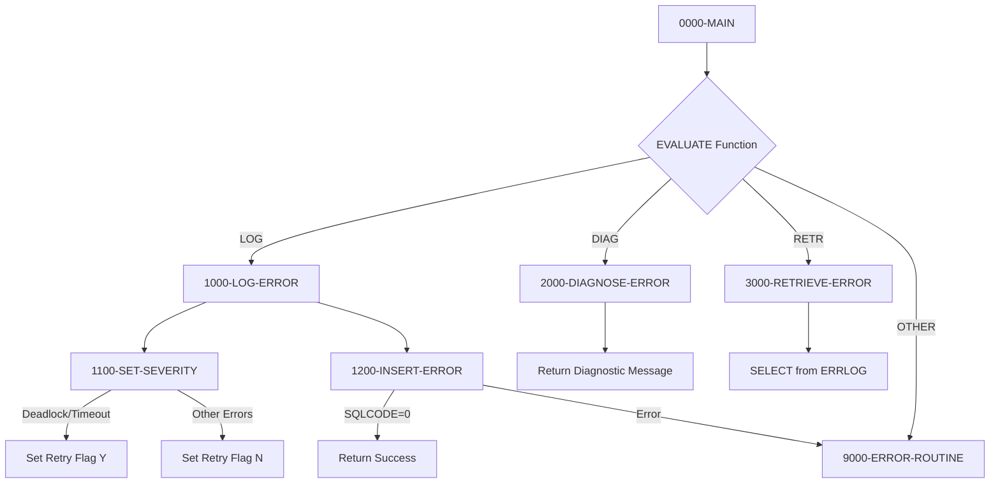

## Overview

DB2ERR is a common utility program that provides centralized DB2 error handling services for the application. It serves as a reusable component that can be called by any program needing to log SQL errors, diagnose error conditions, or retrieve error history from the database.

The program implements three key functions:
- **LOG** - Records SQL errors to the ERRLOG database table with full diagnostic information
- **DIAG** - Analyzes SQLCODE values and provides human-readable error descriptions with retry guidance
- **RETR** - Retrieves the most recent error for a given program from the error log

By centralizing error handling logic, DB2ERR ensures consistent error categorization, severity assignment, and logging across all DB2-enabled programs in the system. It also provides intelligent retry recommendations for transient errors like deadlocks and timeouts.

## Program Structure



## Data Structures

### Linkage Section Interface

The program receives control through a standardized error request structure:

| Level | Name | Picture | Description |
|-------|------|---------|-------------|
| 01 | LS-ERROR-REQUEST | - | Main linkage area for caller communication |
| 05 | LS-FUNCTION | X(4) | Function code: `LOG `, `DIAG`, or `RETR` |
| 05 | LS-PROGRAM-ID | X(8) | Calling program identifier |
| 10 | LS-SQLCODE | S9(9) COMP | SQL return code to process |
| 10 | LS-SQLSTATE | X(5) | SQL state code |
| 10 | LS-ERROR-TEXT | X(80) | Error message text |
| 05 | LS-ADDITIONAL-INFO | X(100) | Additional context information |
| 05 | LS-RETURN-CODE | S9(4) COMP | Return code from operation |
| 05 | LS-RETRY-FLAG | X(1) | `Y` = should retry, `N` = no retry |

### Working Storage

| Level | Name | Picture | Description |
|-------|------|---------|-------------|
| 01 | WS-CURRENT-TIMESTAMP | X(26) | Current system timestamp |
| 01 | WS-FORMATTED-SQLCODE | -Z(8)9 | Edited SQLCODE for display |

### Error Categories (Known SQLCODEs)

| Field | Value | Description |
|-------|-------|-------------|
| WS-DEADLOCK | -911 | Deadlock or timeout with rollback |
| WS-TIMEOUT | -913 | Unsuccessful execution due to deadlock/timeout |
| WS-CONNECTION-ERROR | -30081 | Communication error |
| WS-DUP-KEY | -803 | Duplicate key on insert/update |
| WS-NOT-FOUND | +100 | Row not found (end of data) |

### ERRLOG Record Structure (from DBTBLS copybook)

| Level | Name | Picture | Description |
|-------|------|---------|-------------|
| 05 | EL-ERROR-TIMESTAMP | X(26) | When the error occurred |
| 05 | EL-PROGRAM-ID | X(8) | Program that encountered the error |
| 05 | EL-ERROR-TYPE | X(1) | S=System, A=Application, D=Data |
| 05 | EL-ERROR-SEVERITY | S9(4) COMP | 1=Info, 2=Warning, 3=Error, 4=Severe |
| 05 | EL-ERROR-CODE | X(8) | Formatted SQLCODE and SQLSTATE |
| 05 | EL-ERROR-MESSAGE | X(200) | Error description |
| 05 | EL-PROCESS-DATE | X(10) | Processing date |
| 05 | EL-PROCESS-TIME | X(8) | Processing time |
| 05 | EL-USER-ID | X(8) | User ID (if available) |
| 05 | EL-ADDITIONAL-INFO | X(500) | Additional context |

## Database Access

### ERRLOG Table

The program interacts with the ERRLOG table for error persistence and retrieval.

**Table Structure:**

| Column | Type | Description |
|--------|------|-------------|
| ERROR_TIMESTAMP | TIMESTAMP | When the error occurred (PK) |
| PROGRAM_ID | CHAR(8) | Program identifier (PK) |
| ERROR_TYPE | CHAR(1) | S=System, A=Application, D=Data |
| ERROR_SEVERITY | INTEGER | 1=Info, 2=Warning, 3=Error, 4=Severe |
| ERROR_CODE | CHAR(8) | Formatted error code |
| ERROR_MESSAGE | VARCHAR(200) | Error description |
| PROCESS_DATE | DATE | Processing date |
| PROCESS_TIME | TIME | Processing time |
| USER_ID | CHAR(8) | User ID |
| ADDITIONAL_INFO | VARCHAR(500) | Additional context |

**Indexes:**
- Primary Key: (ERROR_TIMESTAMP, PROGRAM_ID)
- Secondary Index: (PROCESS_DATE, ERROR_SEVERITY DESC)

### SQL Operations

**Insert (LOG function):**
```sql
INSERT INTO ERRLOG
VALUES (:WS-ERRLOG-REC)
```

**Select (RETR function):**
```sql
SELECT ERROR_MESSAGE, ERROR_SEVERITY, ADDITIONAL_INFO
INTO :EL-ERROR-MESSAGE, :EL-ERROR-SEVERITY, :EL-ADDITIONAL-INFO
FROM ERRLOG
WHERE PROGRAM_ID = :LS-PROGRAM-ID
AND ERROR_TIMESTAMP = 
    (SELECT MAX(ERROR_TIMESTAMP)
     FROM ERRLOG
     WHERE PROGRAM_ID = :LS-PROGRAM-ID)
```

## Control Flow

### 1000-LOG-ERROR (Function: LOG)

1. Initializes the error log record structure
2. Accepts current timestamp from system
3. Populates error record fields:
   - Timestamp, program ID, error type (`D` for DB2)
   - Calls 1100-SET-SEVERITY to determine severity and retry flag
   - Formats SQLCODE and SQLSTATE into error code field using STRING
   - Captures error text and additional info
4. Calls 1200-INSERT-ERROR to persist the record

### 1100-SET-SEVERITY

Evaluates SQLCODE to determine appropriate severity and retry guidance:

| SQLCODE | Severity | Retry? | Rationale |
|---------|----------|--------|-----------|
| -911 (Deadlock) | 2 (Warning) | Yes | Transient condition, retry likely to succeed |
| -913 (Timeout) | 2 (Warning) | Yes | Transient condition, retry likely to succeed |
| -30081 (Connection) | 4 (Severe) | No | Infrastructure issue, manual intervention needed |
| -803 (Duplicate Key) | 1 (Info) | No | Application logic issue, not transient |
| +100 (Not Found) | 1 (Info) | No | Normal condition, not an error |
| Other negative | 3 (Error) | No | Unhandled DB2 error |
| Other positive | 1 (Info) | No | Warning condition |

### 2000-DIAGNOSE-ERROR (Function: DIAG)

Provides human-readable diagnostic messages based on SQLCODE:

| SQLCODE | Message | Return Code |
|---------|---------|-------------|
| -911 | "Deadlock detected - retry transaction" | 4 |
| -913 | "Timeout occurred - retry transaction" | 4 |
| -30081 | "DB2 connection error - check availability" | 12 |
| -803 | "Duplicate key violation" | 8 |
| Other negative | "Unhandled DB2 error" | 12 |
| Other positive | "DB2 warning condition" | 4 |

### 3000-RETRIEVE-ERROR (Function: RETR)

1. Executes SELECT to find the most recent error for the specified program
2. Uses a correlated subquery to find MAX(ERROR_TIMESTAMP)
3. Returns error message, severity, and additional info to caller
4. If no error found, returns "No error history found" with RC=4

### 9000-ERROR-ROUTINE

Handles internal errors within DB2ERR itself:
1. Sets program name to 'DB2ERR' in error structure
2. Sets return code to 12 (severe)
3. Calls ERRPROC for standard error processing

## Return Codes

| Code | Meaning |
|------|---------|
| 0 | Successful completion |
| 4 | Warning condition or retry recommended |
| 8 | Error condition (e.g., duplicate key) |
| 12 | Severe error (connection failure, unhandled error) |

## Dependencies

### Copybooks

- **SQLCA** - SQL Communication Area for DB2 status checking
- **DBPROC** - DB2 standard procedures and error handling structures
- **ERRHAND** - Standard error handling definitions and message structure
- **DBTBLS** - DB2 table record definitions (included via COPY REPLACING)

### Called Programs

- **ERRPROC** - Error processing routine for logging internal errors

### Database Objects

- **ERRLOG** - DB2 table for error persistence

### Related Programs

Programs that may call DB2ERR for error handling:
- HISTLD00 - History loader (uses SQLCA, DBPROC, ERRHAND)
- DB2CMT - DB2 commit processing (uses SQLCA, DBPROC, ERRHAND)
- DB2CONN - DB2 connection handling (uses SQLCA, DBPROC, ERRHAND)
- DB2STAT - DB2 statistics (uses SQLCA, DBPROC, ERRHAND)

## Usage Example

```cobol
*---------------------------------------------------------*
* Log a DB2 error after a failed SQL operation
*---------------------------------------------------------*
    IF SQLCODE NOT = 0
        MOVE 'LOG ' TO LS-FUNCTION
        MOVE 'MYPROG00' TO LS-PROGRAM-ID
        MOVE SQLCODE TO LS-SQLCODE
        MOVE SQLSTATE TO LS-SQLSTATE
        MOVE 'Error updating customer record' TO LS-ERROR-TEXT
        MOVE WS-CUSTOMER-ID TO LS-ADDITIONAL-INFO
        CALL 'DB2ERR' USING LS-ERROR-REQUEST
        
        IF LS-SHOULD-RETRY
            PERFORM RETRY-TRANSACTION
        END-IF
    END-IF

*---------------------------------------------------------*
* Get diagnostic message for an error
*---------------------------------------------------------*
    MOVE 'DIAG' TO LS-FUNCTION
    MOVE SQLCODE TO LS-SQLCODE
    CALL 'DB2ERR' USING LS-ERROR-REQUEST
    DISPLAY 'Error: ' LS-ERROR-TEXT

*---------------------------------------------------------*
* Retrieve last error for a program
*---------------------------------------------------------*
    MOVE 'RETR' TO LS-FUNCTION
    MOVE 'BATCHPGM' TO LS-PROGRAM-ID
    CALL 'DB2ERR' USING LS-ERROR-REQUEST
    DISPLAY 'Last error: ' LS-ERROR-TEXT
```

## Technical Notes

1. **COPY REPLACING**: Uses COBOL's COPY REPLACING directive to include DBTBLS copybook while renaming record structures to avoid conflicts

2. **EXEC SQL DECLARE SECTION**: Host variables used in SQL statements are declared within BEGIN/END DECLARE SECTION

3. **STRING Statement**: Formats SQLCODE and SQLSTATE into a single error code field for readability

4. **Correlated Subquery**: The RETR function uses a correlated subquery to find the most recent error timestamp

5. **88-Level Conditions**: Uses condition names for function codes (`FUNC-LOG`, `FUNC-DIAG`, `FUNC-RETR`) and retry flags (`LS-SHOULD-RETRY`, `LS-NO-RETRY`)

6. **FUNCTION CURRENT-DATE**: Uses COBOL intrinsic function to capture process date and time

7. **Severity Mapping**: Maps DB2 SQLCODEs to application-specific severity levels for consistent error categorization across the system
