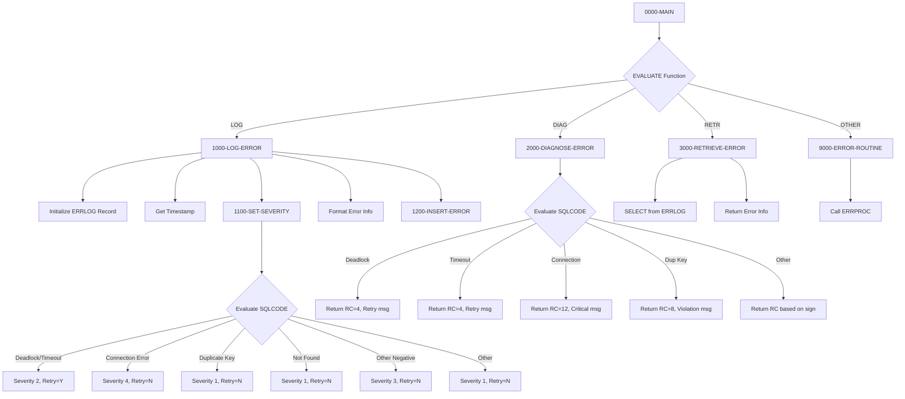

## Overview

DB2ERR is a callable DB2 SQL Error Handler that provides centralized error management services for programs interacting with DB2 databases. It offers three key functions: logging errors to a persistent error log table (LOG), diagnosing SQL errors to provide human-readable explanations and retry guidance (DIAG), and retrieving the most recent error for a given program (RETR).

The program categorizes SQL errors by type and severity, determining whether operations should be retried (such as deadlocks and timeouts) or if they represent permanent failures (such as connection errors or duplicate key violations). This centralized approach ensures consistent error handling across all DB2-enabled programs in the system.

DB2ERR integrates with the ERRLOG table to maintain a persistent record of all database errors, including timestamps, program identifiers, error codes, and additional diagnostic information. This error history supports troubleshooting, trend analysis, and operational monitoring.

## Program Structure



## Data Structures

### Linkage Section (Input/Output Parameters)

| Level | Name | Picture | Description |
|-------|------|---------|-------------|
| 01 | LS-ERROR-REQUEST | - | Main parameter block passed by caller |
| 05 | LS-FUNCTION | X(4) | Function code: `'LOG '`, `'DIAG'`, or `'RETR'` |
| 05 | LS-PROGRAM-ID | X(8) | Calling program identifier |
| 05 | LS-ERROR-INFO | - | Error details group |
| 10 | LS-SQLCODE | S9(9) COMP | SQL return code from failed operation |
| 10 | LS-SQLSTATE | X(5) | SQL state code |
| 10 | LS-ERROR-TEXT | X(80) | Error message text (input or output) |
| 05 | LS-ADDITIONAL-INFO | X(100) | Additional context from caller |
| 05 | LS-RETURN-CODE | S9(4) COMP | Return code to caller |
| 05 | LS-RETRY-FLAG | X(1) | Retry indicator: 'Y' = should retry, 'N' = no retry |

### Working Storage - Error Categories

| Level | Name | Picture | Value | Description |
|-------|------|---------|-------|-------------|
| 05 | WS-DEADLOCK | S9(8) | -911 | DB2 deadlock condition |
| 05 | WS-TIMEOUT | S9(8) | -913 | DB2 timeout condition |
| 05 | WS-CONNECTION-ERROR | S9(8) | -30081 | DB2 connection failure |
| 05 | WS-DUP-KEY | S9(8) | -803 | Duplicate key violation |
| 05 | WS-NOT-FOUND | S9(8) | +100 | Row not found (end of data) |

### Working Storage - Work Fields

| Level | Name | Picture | Description |
|-------|------|---------|-------------|
| 01 | WS-CURRENT-TIMESTAMP | X(26) | Current system timestamp |
| 01 | WS-FORMATTED-SQLCODE | -Z(8)9 | Edited SQLCODE for display |

### ERRLOG Record Structure (from DBTBLS copybook)

| Level | Name | Picture | Description |
|-------|------|---------|-------------|
| 01 | ERRLOG-RECORD | - | Error log table record |
| 05 | EL-ERROR-TIMESTAMP | X(26) | When error occurred |
| 05 | EL-PROGRAM-ID | X(8) | Program that had the error |
| 05 | EL-ERROR-TYPE | X(1) | S=System, A=Application, D=Database |
| 05 | EL-ERROR-SEVERITY | S9(4) COMP | 1=Info, 2=Warn, 3=Error, 4=Severe |
| 05 | EL-ERROR-CODE | X(8) | Formatted SQLCODE and SQLSTATE |
| 05 | EL-ERROR-MESSAGE | X(200) | Error message text |
| 05 | EL-PROCESS-DATE | X(10) | Processing date |
| 05 | EL-PROCESS-TIME | X(8) | Processing time |
| 05 | EL-USER-ID | X(8) | User identifier |
| 05 | EL-ADDITIONAL-INFO | X(500) | Additional diagnostic information |

## Database Access

### DB2 Table: ERRLOG

The ERRLOG table stores persistent error history for all DB2-related errors across the system.

#### INSERT Operation (1200-INSERT-ERROR)

```sql
INSERT INTO ERRLOG
VALUES (:WS-ERRLOG-REC)
```

Used by the LOG function to persist error records.

#### SELECT Operation (3000-RETRIEVE-ERROR)

```sql
SELECT ERROR_MESSAGE,
       ERROR_SEVERITY,
       ADDITIONAL_INFO
INTO :EL-ERROR-MESSAGE,
     :EL-ERROR-SEVERITY,
     :EL-ADDITIONAL-INFO
FROM ERRLOG
WHERE PROGRAM_ID = :LS-PROGRAM-ID
AND ERROR_TIMESTAMP = 
    (SELECT MAX(ERROR_TIMESTAMP)
     FROM ERRLOG
     WHERE PROGRAM_ID = :LS-PROGRAM-ID)
```

Used by the RETR function to retrieve the most recent error for a program using a correlated subquery.

## Control Flow

### 0000-MAIN - Entry Point

Evaluates the function code in LS-FUNCTION and routes to the appropriate processing paragraph:
- `'LOG '` → 1000-LOG-ERROR
- `'DIAG'` → 2000-DIAGNOSE-ERROR
- `'RETR'` → 3000-RETRIEVE-ERROR
- Other → 9000-ERROR-ROUTINE

Returns control via GOBACK after processing.

### 1000-LOG-ERROR - Error Logging Function

Records a DB2 error to the ERRLOG table:

1. **Initialize**: Clears the ERRLOG record work area
2. **Get Timestamp**: Accepts current system timestamp using `ACCEPT ... FROM TIME STAMP`
3. **Populate Fields**:
   - Moves timestamp to EL-ERROR-TIMESTAMP
   - Moves program ID from linkage to EL-PROGRAM-ID
   - Sets error type to 'D' (Database error)
4. **Set Severity**: Calls 1100-SET-SEVERITY to determine error severity and retry flag
5. **Format Error Code**: Uses STRING to combine SQLCODE and SQLSTATE into EL-ERROR-CODE
6. **Set Dates**: Uses `FUNCTION CURRENT-DATE` to populate process date and time
7. **Insert Record**: Calls 1200-INSERT-ERROR to persist the record

### 1100-SET-SEVERITY - Severity Classification

Evaluates the SQLCODE to determine appropriate severity level and retry recommendation:

| SQLCODE | Severity | Retry? | Rationale |
|---------|----------|--------|-----------|
| -911 (Deadlock) | 2 (Warning) | Yes | Transient condition, retry likely to succeed |
| -913 (Timeout) | 2 (Warning) | Yes | Transient condition, retry likely to succeed |
| -30081 (Connection) | 4 (Severe) | No | Infrastructure issue, requires intervention |
| -803 (Duplicate Key) | 1 (Info) | No | Data issue, retry would fail again |
| +100 (Not Found) | 1 (Info) | No | Expected condition, not a true error |
| Other negative | 3 (Error) | No | Unknown error, don't retry |
| Other positive | 1 (Info) | No | Warning condition |

### 1200-INSERT-ERROR - Database Insert

Executes the INSERT statement to add the error record to ERRLOG:
- On success (SQLCODE = 0): Sets LS-RETURN-CODE to 0
- On failure: Calls 9000-ERROR-ROUTINE (error logging the error)

### 2000-DIAGNOSE-ERROR - Error Diagnosis Function

Provides human-readable error descriptions and recommended return codes without logging:

| SQLCODE | Message | Return Code |
|---------|---------|-------------|
| -911 | "Deadlock detected - retry transaction" | 4 |
| -913 | "Timeout occurred - retry transaction" | 4 |
| -30081 | "DB2 connection error - check availability" | 12 |
| -803 | "Duplicate key violation" | 8 |
| Other negative | "Unhandled DB2 error" | 12 |
| Other positive | "DB2 warning condition" | 4 |

### 3000-RETRIEVE-ERROR - Error Retrieval Function

Retrieves the most recent error for a given program:
1. Executes SELECT with correlated subquery to find the latest error by timestamp
2. On success: Returns error message, severity, and additional info to caller
3. On failure: Returns "No error history found" with return code 4

### 9000-ERROR-ROUTINE - Internal Error Handler

Handles errors within DB2ERR itself:
1. Sets ERR-PROGRAM to 'DB2ERR'
2. Sets LS-RETURN-CODE to 12
3. Calls ERRPROC for error logging

## Dependencies

### Copybooks

| Copybook | Section | Description |
|----------|---------|-------------|
| SQLCA | WORKING-STORAGE | SQL Communication Area - provides SQLCODE, SQLSTATE |
| DBPROC | WORKING-STORAGE | DB2 Standard Procedures - error handling templates |
| ERRHAND | WORKING-STORAGE | Error Handling definitions - ERR-MESSAGE structure |
| DBTBLS | WORKING-STORAGE | DB2 Table Definitions - ERRLOG-RECORD layout (via REPLACING) |

### Called Programs

| Program | Purpose |
|---------|---------|
| ERRPROC | General error logging utility |

### Related Programs

Programs that use the same DB2 copybooks and may call DB2ERR:

- **DB2CMT** - DB2 Commit handler (uses SQLCA, DBPROC, ERRHAND)
- **DB2CONN** - DB2 Connection handler (uses SQLCA, DBPROC, ERRHAND)
- **DB2STAT** - DB2 Status checker (uses SQLCA, DBPROC, ERRHAND)
- **HISTLD00** - History loader batch program (uses SQLCA, DBPROC, ERRHAND)

## Return Codes

### From LOG Function

| Code | Meaning |
|------|---------|
| 0 | Error successfully logged |
| 12 | Failed to insert error record |

### From DIAG Function

| Code | Meaning |
|------|---------|
| 4 | Retryable error (deadlock, timeout) or warning |
| 8 | Data error (duplicate key) |
| 12 | Severe error (connection, unhandled) |

### From RETR Function

| Code | Meaning |
|------|---------|
| 1-4 | Severity of retrieved error |
| 4 | No error history found |

## Usage Examples

### Logging a DB2 Error

```cobol
MOVE 'LOG '    TO LS-FUNCTION
MOVE 'MYPROG01' TO LS-PROGRAM-ID
MOVE SQLCODE   TO LS-SQLCODE
MOVE SQLSTATE  TO LS-SQLSTATE
MOVE 'Insert failed on CUSTOMER table' TO LS-ERROR-TEXT
MOVE 'Customer ID: 12345' TO LS-ADDITIONAL-INFO
CALL 'DB2ERR' USING LS-ERROR-REQUEST
```

### Diagnosing an Error

```cobol
MOVE 'DIAG'    TO LS-FUNCTION
MOVE SQLCODE   TO LS-SQLCODE
CALL 'DB2ERR' USING LS-ERROR-REQUEST
IF LS-SHOULD-RETRY
    PERFORM RETRY-LOGIC
ELSE
    PERFORM ABORT-TRANSACTION
END-IF
```

### Retrieving Last Error

```cobol
MOVE 'RETR'    TO LS-FUNCTION
MOVE 'MYPROG01' TO LS-PROGRAM-ID
CALL 'DB2ERR' USING LS-ERROR-REQUEST
DISPLAY 'Last error: ' LS-ERROR-TEXT
```

## Technical Notes

- **COPY REPLACING**: Uses COPY ... REPLACING to rename ERRLOG-RECORD to WS-ERRLOG-REC within the SQL DECLARE section
- **EXEC SQL BEGIN/END DECLARE SECTION**: Required for host variables used in SQL statements
- **Edited Picture `-Z(8)9`**: Formats SQLCODE with sign and zero suppression for readable display
- **STRING Statement**: Concatenates SQLCODE and SQLSTATE into a single error code field
- **FUNCTION CURRENT-DATE**: Intrinsic function returns system date/time in YYYYMMDDHHMMSSCC format
- **Correlated Subquery**: The RETR function uses MAX(ERROR_TIMESTAMP) in a subquery to find the most recent error
- **88-Level Conditions**: Uses condition names (FUNC-LOG, LS-SHOULD-RETRY, etc.) for readable logic
- **Severity Levels**: 1=Info, 2=Warning, 3=Error, 4=Severe - aligns with standard batch return code conventions
