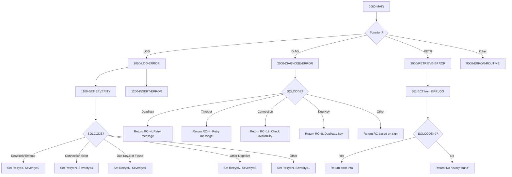

## Overview

DB2ERR is a reusable utility program that provides centralized DB2 error handling services for the application. It serves as a common error management component that can be called by any program experiencing DB2-related errors, ensuring consistent error handling, logging, and diagnosis across the system.

The program supports three main functions: logging errors to a database error log table, diagnosing SQLCODEs to provide human-readable explanations, and retrieving the most recent error for a given program. This centralized approach simplifies error handling in calling programs and creates a comprehensive audit trail of database errors.

A key feature of DB2ERR is its intelligent retry logic. When it encounters transient errors like deadlocks or timeouts, it sets a retry flag to inform the caller that the operation may succeed if retried. For permanent errors like connection failures or duplicate key violations, it indicates that retry would not be appropriate.

## Program Structure



## Data Structures

### Linkage Section - Input/Output Parameters

| Level | Name | Picture | Description |
|-------|------|---------|-------------|
| 01 | LS-ERROR-REQUEST | - | Main communication area |
| 05 | LS-FUNCTION | X(4) | Function code: `'LOG '`, `'DIAG'`, or `'RETR'` |
| 05 | LS-PROGRAM-ID | X(8) | Calling program identifier |
| 05 | LS-ERROR-INFO | - | Error details group |
| 10 | LS-SQLCODE | S9(9) COMP | SQL return code from failed operation |
| 10 | LS-SQLSTATE | X(5) | SQL state code |
| 10 | LS-ERROR-TEXT | X(80) | Error message text (input or output) |
| 05 | LS-ADDITIONAL-INFO | X(100) | Additional context information |
| 05 | LS-RETURN-CODE | S9(4) COMP | Return code from this program |
| 05 | LS-RETRY-FLAG | X(1) | Retry indicator: 'Y' or 'N' |

### Working Storage

| Level | Name | Picture | Description |
|-------|------|---------|-------------|
| 01 | WS-CURRENT-TIMESTAMP | X(26) | Current system timestamp |
| 01 | WS-FORMATTED-SQLCODE | -Z(8)9 | Edited SQLCODE for display |

### Error Category Constants

| Level | Name | Picture | Value | Description |
|-------|------|---------|-------|-------------|
| 05 | WS-DEADLOCK | S9(8) | -911 | DB2 deadlock detected |
| 05 | WS-TIMEOUT | S9(8) | -913 | Lock timeout occurred |
| 05 | WS-CONNECTION-ERROR | S9(8) | -30081 | TCP/IP connection error |
| 05 | WS-DUP-KEY | S9(8) | -803 | Duplicate key on insert/update |
| 05 | WS-NOT-FOUND | S9(8) | +100 | Row not found |

### ERRLOG Record Structure (from DBTBLS copybook)

| Level | Name | Picture | Description |
|-------|------|---------|-------------|
| 01 | ERRLOG-RECORD | - | Error log table record |
| 05 | EL-ERROR-TIMESTAMP | X(26) | When error occurred |
| 05 | EL-PROGRAM-ID | X(8) | Program that encountered error |
| 05 | EL-ERROR-TYPE | X(1) | 'S'=System, 'A'=Application, 'D'=Data |
| 05 | EL-ERROR-SEVERITY | S9(4) COMP | 1=Info, 2=Warning, 3=Error, 4=Severe |
| 05 | EL-ERROR-CODE | X(8) | Formatted error code |
| 05 | EL-ERROR-MESSAGE | X(200) | Detailed error message |
| 05 | EL-PROCESS-DATE | X(10) | Processing date |
| 05 | EL-PROCESS-TIME | X(8) | Processing time |
| 05 | EL-USER-ID | X(8) | User identifier |
| 05 | EL-ADDITIONAL-INFO | X(500) | Extended error context |

## Database Access

### Tables Used

| Table Name | Operation | Purpose |
|------------|-----------|---------|
| ERRLOG | INSERT | Log error records |
| ERRLOG | SELECT | Retrieve most recent error for a program |

### SQL Operations

#### Insert Error (1200-INSERT-ERROR)

```sql
INSERT INTO ERRLOG
VALUES (:WS-ERRLOG-REC)
```

Inserts a complete error record using the host variable structure.

#### Retrieve Error (3000-RETRIEVE-ERROR)

```sql
SELECT ERROR_MESSAGE,
       ERROR_SEVERITY,
       ADDITIONAL_INFO
INTO :EL-ERROR-MESSAGE,
     :EL-ERROR-SEVERITY,
     :EL-ADDITIONAL-INFO
FROM ERRLOG
WHERE PROGRAM_ID = :LS-PROGRAM-ID
AND ERROR_TIMESTAMP = 
    (SELECT MAX(ERROR_TIMESTAMP)
     FROM ERRLOG
     WHERE PROGRAM_ID = :LS-PROGRAM-ID)
```

Retrieves the most recent error for the specified program using a correlated subquery.

## Control Flow

### Function: LOG (Log Error)

The LOG function records a DB2 error to the ERRLOG table for audit and troubleshooting purposes.

1. **1000-LOG-ERROR**: Main logging routine
   - Initializes the error log record
   - Captures the current timestamp using `ACCEPT FROM TIME STAMP`
   - Populates the error record fields from linkage section inputs
   - Sets error type to 'D' (Data/DB2 error)
   - Calls 1100-SET-SEVERITY to determine severity and retry flag
   - Formats SQLCODE and SQLSTATE into EL-ERROR-CODE using STRING
   - Calls 1200-INSERT-ERROR to write the record

2. **1100-SET-SEVERITY**: Severity classification
   - Evaluates the SQLCODE to determine appropriate severity level:
     - Deadlock (-911) or Timeout (-913): Severity 2, retry recommended
     - Connection error (-30081): Severity 4, no retry
     - Duplicate key (-803): Severity 1, no retry
     - Not found (+100): Severity 1, no retry
     - Other negative codes: Severity 3, no retry
     - Other positive codes: Severity 1, no retry

3. **1200-INSERT-ERROR**: Database insert
   - Executes the INSERT statement
   - Sets return code to 0 on success
   - Calls 9000-ERROR-ROUTINE if insert fails

### Function: DIAG (Diagnose Error)

The DIAG function provides human-readable diagnostic information for a given SQLCODE.

1. **2000-DIAGNOSE-ERROR**: Diagnosis routine
   - Evaluates the SQLCODE and provides appropriate message and return code:

| SQLCODE | Message | Return Code |
|---------|---------|-------------|
| -911 | Deadlock detected - retry transaction | 4 |
| -913 | Timeout occurred - retry transaction | 4 |
| -30081 | DB2 connection error - check availability | 12 |
| -803 | Duplicate key violation | 8 |
| Other < 0 | Unhandled DB2 error | 12 |
| Other >= 0 | DB2 warning condition | 4 |

### Function: RETR (Retrieve Error)

The RETR function retrieves the most recent error logged for a specific program.

1. **3000-RETRIEVE-ERROR**: Retrieval routine
   - Executes SELECT to find the most recent error for LS-PROGRAM-ID
   - If found (SQLCODE = 0):
     - Copies error message to LS-ERROR-TEXT
     - Sets return code to the stored severity
   - If not found:
     - Sets error text to "No error history found"
     - Sets return code to 4

### Error Handling

**9000-ERROR-ROUTINE**: Called when DB2ERR itself encounters an error
- Sets ERR-PROGRAM to 'DB2ERR'
- Sets return code to 12
- Calls ERRPROC for error processing

## Dependencies

### Copybooks

- **SQLCA** - SQL Communication Area for DB2 operations, includes standard SQL status codes
- **DBPROC** - DB2 standard procedures including error handling routines and retry logic
- **ERRHAND** - Standard error handling definitions, error categories, and return codes
- **DBTBLS** - DB2 table definitions including ERRLOG-RECORD structure (included via REPLACING)

### Called Programs

- **ERRPROC** - Error processing routine for handling errors within DB2ERR itself

### Related Programs

Programs that share the same copybooks and may call DB2ERR:

- **DB2CMT** - DB2 commit handler (uses SQLCA, DBPROC, ERRHAND)
- **DB2CONN** - DB2 connection manager (uses SQLCA, DBPROC, ERRHAND)
- **DB2STAT** - DB2 statistics collector (uses SQLCA, DBPROC, ERRHAND)
- **HISTLD00** - History load program (uses SQLCA, DBPROC, ERRHAND)

## Technical Notes

### Return Codes

| Code | Meaning |
|------|---------|
| 0 | Success |
| 4 | Warning - may indicate retry possible |
| 8 | Error - data issue like duplicate key |
| 12 | Severe - connection or unhandled error |

### Retry Logic

The retry flag (LS-RETRY-FLAG) helps callers decide whether to retry a failed operation:

| Value | Meaning | When Set |
|-------|---------|----------|
| 'Y' | Retry recommended | Deadlock (-911), Timeout (-913) |
| 'N' | Do not retry | All other errors |

Deadlocks and timeouts are transient conditions that often resolve on retry. Other errors like duplicate keys or connection failures require corrective action rather than simple retry.

### Severity Levels

| Level | Meaning | Example Conditions |
|-------|---------|-------------------|
| 1 | Informational | Not found, duplicate key |
| 2 | Warning | Deadlock, timeout |
| 3 | Error | Unhandled negative SQLCODE |
| 4 | Severe | Connection error |

### Common SQLCODEs Handled

| SQLCODE | SQLSTATE | Description |
|---------|----------|-------------|
| +100 | 02000 | Row not found |
| -803 | 23505 | Duplicate key violation |
| -911 | 40001 | Deadlock or timeout with rollback |
| -913 | 40003 | Deadlock or timeout, no rollback |
| -30081 | 08001 | TCP/IP communication error |

### Usage Example

```cobol
* After a DB2 error occurs...
MOVE 'LOG ' TO LS-FUNCTION
MOVE 'MYPROG01' TO LS-PROGRAM-ID
MOVE SQLCODE TO LS-SQLCODE
MOVE SQLSTATE TO LS-SQLSTATE
MOVE 'Insert to CUSTOMER failed' TO LS-ERROR-TEXT
MOVE 'Customer ID: 12345' TO LS-ADDITIONAL-INFO
CALL 'DB2ERR' USING LS-ERROR-REQUEST

IF LS-SHOULD-RETRY
    PERFORM RETRY-LOGIC
END-IF
```

### COBOL Features Used

- **COPY REPLACING**: Used to include DBTBLS copybook with renamed record structures
- **EXEC SQL BEGIN/END DECLARE SECTION**: Defines host variables for DB2
- **ACCEPT FROM TIME STAMP**: Retrieves current system timestamp
- **FUNCTION CURRENT-DATE**: Intrinsic function for formatted date/time
- **STRING DELIMITED BY SIZE**: Concatenates SQLCODE and SQLSTATE into error code field
- **88-level condition names**: Used for function codes and retry flag values
