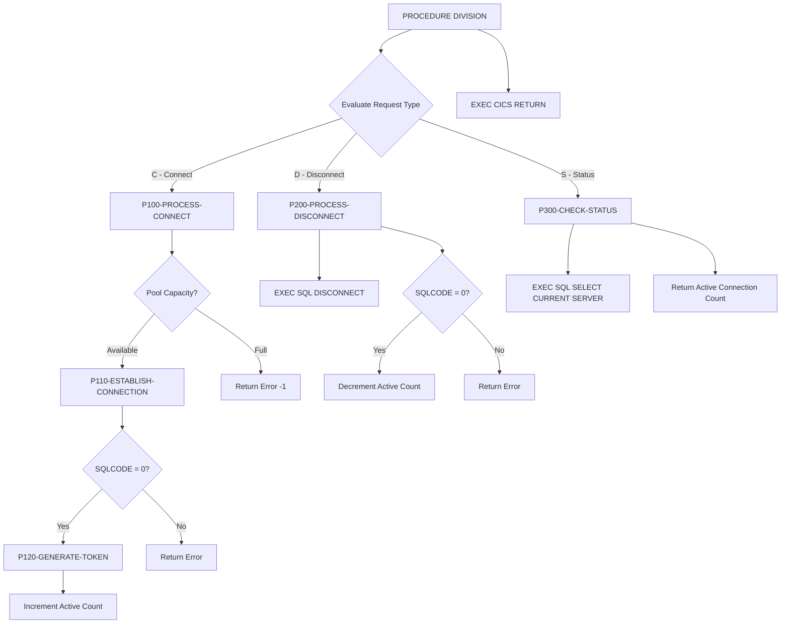

## Overview

DB2ONLN is a CICS COBOL program that provides centralized DB2 connection management services for online transaction processing. It operates as a service program within the CICS environment, managing a pool of DB2 connections to optimize resource utilization and improve transaction throughput.

The program provides three primary services:
- **Connect (C)** - Establish a new DB2 connection from the pool with capacity checking
- **Disconnect (D)** - Release a DB2 connection back to the pool
- **Status (S)** - Check DB2 connection status and return pool statistics

Key features include:
- Connection pool management with configurable maximum connections (default: 100)
- Active connection tracking and statistics
- Unique connection token generation for tracking
- Error handling with SQLCODE and message propagation

This program is designed to be called by other CICS transactions that require DB2 database access, providing a consistent interface for connection lifecycle management.

## Program Structure



## Data Structures

### Working-Storage Section

#### DB2 Communication Area

| Level | Name | Picture | Description |
|-------|------|---------|-------------|
| 01 | WS-DB2-AREA | - | Container for SQLCA include |
| - | SQLCA | (included) | SQL Communication Area with SQLCODE, SQLERRMC, etc. |

#### Connection Pool Statistics

| Level | Name | Picture | Value | Description |
|-------|------|---------|-------|-------------|
| 01 | WS-POOL-STATS | - | - | Pool management statistics |
| 05 | WS-TOTAL-CONNECTIONS | S9(8) COMP | 0 | Total connections created |
| 05 | WS-ACTIVE-CONNECTIONS | S9(8) COMP | 0 | Currently active connections |
| 05 | WS-AVAILABLE-CONNECTIONS | S9(8) COMP | 0 | Available pool slots |
| 05 | WS-MAX-CONNECTIONS | S9(8) COMP | 100 | Maximum allowed connections |

#### Error Area

| Level | Name | Picture | Description |
|-------|------|---------|-------------|
| 01 | WS-ERROR-AREA | - | Container for error handling copybook |
| - | ERROR-HANDLING | (from ERRHND) | Standard error handling structure |

### Linkage Section

The program receives a request area from calling programs:

#### DB2 Request Area (DB2-REQUEST-AREA)

| Level | Name | Picture | Description |
|-------|------|---------|-------------|
| 01 | DB2-REQUEST-AREA | - | Main communication block |
| 05 | DB2-REQUEST-TYPE | X | Single-character function code |
| 88 | DB2-CONNECT | VALUE 'C' | Request connection |
| 88 | DB2-DISCONNECT | VALUE 'D' | Request disconnection |
| 88 | DB2-STATUS | VALUE 'S' | Request status check |
| 05 | DB2-RESPONSE-CODE | S9(8) COMP | Operation result code |
| 05 | DB2-CONNECTION-TOKEN | X(16) | Unique connection identifier |
| 05 | DB2-ERROR-INFO | - | Error details group |
| 10 | DB2-SQLCODE | S9(9) COMP | DB2 SQL return code |
| 10 | DB2-ERROR-MSG | X(80) | Descriptive error message |

## File I/O

This program does not perform any file I/O operations. All data access is through DB2 database connections.

## Control Flow

### Main Entry Point

The program uses EVALUATE to dispatch based on the request type in the linkage section:

```cobol
EVALUATE TRUE
    WHEN DB2-CONNECT    PERFORM P100-PROCESS-CONNECT THRU P100-EXIT
    WHEN DB2-DISCONNECT PERFORM P200-PROCESS-DISCONNECT THRU P200-EXIT
    WHEN DB2-STATUS     PERFORM P300-CHECK-STATUS THRU P300-EXIT
END-EVALUATE
```

After processing, control returns to CICS via `EXEC CICS RETURN`.

### Connect Processing (P100-PROCESS-CONNECT)

1. **Capacity Check**
   - Compare WS-ACTIVE-CONNECTIONS against WS-MAX-CONNECTIONS
   - If pool is full: Return error message "Maximum connections reached" with response code -1
   - If capacity available: Proceed to establish connection

2. **Establish Connection (P110-ESTABLISH-CONNECTION)**
   - Execute `CONNECT TO POSMVP` (hardcoded database name)
   - If SQLCODE = 0:
     - Increment WS-ACTIVE-CONNECTIONS
     - Copy SQLCODE to response
     - Set response code to 0
     - Generate connection token
   - If SQLCODE ≠ 0:
     - Copy SQLCODE and SQLERRMC to error fields
     - Set response code to -1

3. **Generate Token (P120-GENERATE-TOKEN)**
   - Uses `FUNCTION CURRENT-DATE` to create timestamp
   - Concatenates timestamp with active connection count
   - Stores result in DB2-CONNECTION-TOKEN for tracking

### Disconnect Processing (P200-PROCESS-DISCONNECT)

1. **Execute Disconnect**
   - Execute `EXEC SQL DISCONNECT END-EXEC`

2. **Handle Result**
   - If SQLCODE = 0:
     - Decrement WS-ACTIVE-CONNECTIONS
     - Set response code to 0
   - If SQLCODE ≠ 0:
     - Copy SQLCODE and SQLERRMC to error fields
     - Set response code to -1

### Status Check (P300-CHECK-STATUS)

1. **Query Current Server**
   ```sql
   SELECT CURRENT SERVER INTO :DB2-ERROR-MSG
   ```
   
2. **Set Response**
   - If SQLCODE = 0: Connection is active
   - If SQLCODE ≠ 0: Connection is not active
   - Return active connection count in DB2-RESPONSE-CODE

## Dependencies

### Copybooks

| Copybook | Location | Description |
|----------|----------|-------------|
| ERRHND | Working-Storage (WS-ERROR-AREA) | Online error handling structure with severity levels, CICS response codes, and trace information |

### Called Programs

This program does not call any external programs. It uses embedded SQL and CICS commands.

### Related Programs

Programs that share the ERRHND copybook:

- **DB2RECV** - DB2 Recovery Handler
- **ERRHNDL** - Error Handler Program  
- **INQONLN** - Online Inquiry Program
- **SECMGR** - Security Manager

Other online DB2-related programs:

- **CURSMGR** - Cursor Manager
- **INQHIST** - History Inquiry
- **INQPORT** - Portfolio Inquiry

## Embedded SQL Statements

| Statement | Paragraph | Purpose |
|-----------|-----------|---------|
| `INCLUDE SQLCA` | Working-Storage | Include SQL Communication Area |
| `CONNECT TO POSMVP` | P110-ESTABLISH-CONNECTION | Connect to POSMVP database |
| `DISCONNECT` | P200-PROCESS-DISCONNECT | Release database connection |
| `SELECT CURRENT SERVER INTO :host-var` | P300-CHECK-STATUS | Verify connection and get server name |

## CICS Commands

| Command | Location | Purpose |
|---------|----------|---------|
| `EXEC CICS RETURN` | Main procedure | Return control to CICS |

## Response Codes

| Code | Meaning | Context |
|------|---------|---------|
| 0 | Success | Connection, disconnect, or status check succeeded |
| -1 | Error | Operation failed (check DB2-SQLCODE and DB2-ERROR-MSG) |
| n > 0 | Active count | Returned by status check - number of active connections |

## Usage Example

Calling programs link to DB2ONLN with a properly formatted request area:

```cobol
WORKING-STORAGE SECTION.
01  WS-DB2-REQUEST.
    05 WS-REQUEST-TYPE        PIC X.
    05 WS-RESPONSE-CODE       PIC S9(8) COMP.
    05 WS-CONNECTION-TOKEN    PIC X(16).
    05 WS-ERROR-INFO.
       10 WS-SQLCODE          PIC S9(9) COMP.
       10 WS-ERROR-MSG        PIC X(80).

PROCEDURE DIVISION.
    * Request a DB2 connection
    MOVE 'C' TO WS-REQUEST-TYPE
    
    EXEC CICS LINK
         PROGRAM('DB2ONLN')
         COMMAREA(WS-DB2-REQUEST)
         LENGTH(LENGTH OF WS-DB2-REQUEST)
    END-EXEC
    
    IF WS-RESPONSE-CODE = 0
        * Connection successful - token in WS-CONNECTION-TOKEN
        PERFORM DATABASE-OPERATIONS
    ELSE
        * Connection failed
        DISPLAY 'DB2 Error: ' WS-ERROR-MSG
    END-IF
    
    * Disconnect when done
    MOVE 'D' TO WS-REQUEST-TYPE
    EXEC CICS LINK
         PROGRAM('DB2ONLN')
         COMMAREA(WS-DB2-REQUEST)
         LENGTH(LENGTH OF WS-DB2-REQUEST)
    END-EXEC
```

## Technical Notes

### Connection Pool Behavior
The program tracks connections using WS-ACTIVE-CONNECTIONS as a simple counter. Note that this is stored in working-storage, which in a CICS environment is typically per-task. For true connection pooling across tasks, integration with CICS DB2 attachment facility or external pool management would be required.

### Database Name
The database name `POSMVP` is hardcoded in the CONNECT statement. In a production environment, this might be parameterized via configuration or passed in the request area.

### Connection Token Generation
The connection token is generated using:
1. `FUNCTION CURRENT-DATE` - Returns a 21-character timestamp (YYYYMMDDHHMMSSFFFFFFF format)
2. Concatenation with active connection count

This provides a reasonably unique identifier for tracking purposes.

### PERFORM THRU Pattern
The program uses `PERFORM paragraph-name THRU paragraph-EXIT` pattern, which is common in CICS programs. Each paragraph has a corresponding EXIT paragraph that contains only `EXIT` statement, providing a clean exit point.

### Error Message Source
When SQL errors occur, the program copies `SQLERRMC` (from SQLCA) to DB2-ERROR-MSG. SQLERRMC contains the error message tokens from DB2, providing diagnostic information about the failure.

## CICS Resource Definitions

This program requires the following CICS definitions:

```
DEFINE PROGRAM(DB2ONLN)
       GROUP(DB2GRP)
       LANGUAGE(COBOL)
       DATALOCATION(ANY)
       EXECKEY(CICS)
```

## DB2 Plan Requirements

The program must be bound to a DB2 plan that includes:
- Authority to connect to the POSMVP database
- Authority to execute CONNECT, DISCONNECT statements
- Authority to query CURRENT SERVER special register
