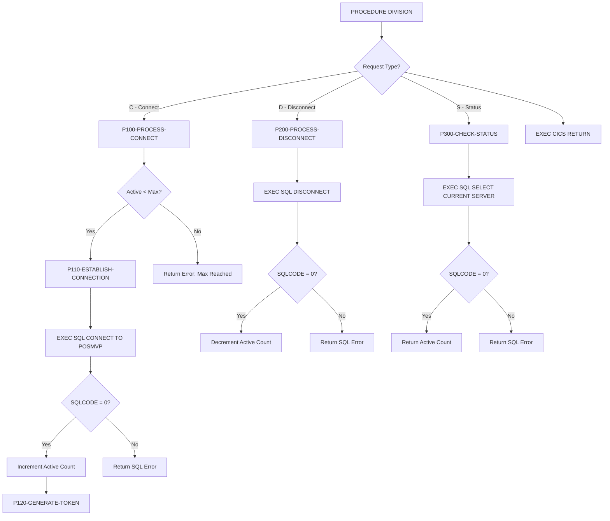
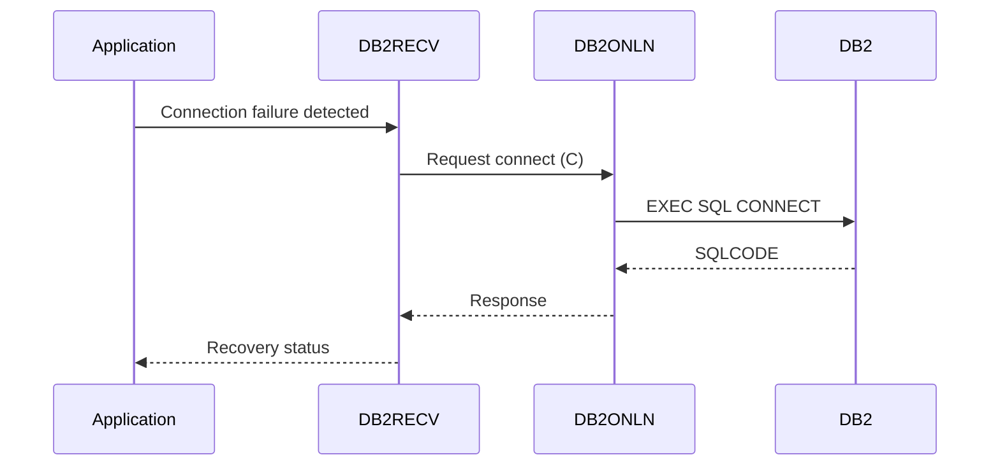

## Overview

DB2ONLN is a CICS-based COBOL program that provides centralized DB2 connection management for online transactions in the Investment Portfolio Management System. It implements a connection pool pattern to optimize database resource usage in the CICS environment.

Key capabilities include:

- **Connection Pool Management**: Maintains a pool of DB2 connections with configurable limits
- **Connection Lifecycle**: Handles connect, disconnect, and status checking operations
- **Token Generation**: Creates unique connection tokens for tracking
- **Pool Monitoring**: Tracks active, available, and total connections
- **Error Handling**: Provides detailed error information for connection failures

This program is part of the Online DB2 Components layer, working alongside DB2RECV (Recovery Manager) to provide reliable database access for CICS transactions.

## Program Structure



## Calling Interface

DB2ONLN is invoked via CICS LINK with a COMMAREA parameter:

```cobol
EXEC CICS LINK PROGRAM('DB2ONLN')
          COMMAREA(DB2-REQUEST-AREA)
          LENGTH(LENGTH OF DB2-REQUEST-AREA)
END-EXEC
```

### Request Structure (DB2-REQUEST-AREA)

| Level | Name | Picture | Description |
|-------|------|---------|-------------|
| 01 | DB2-REQUEST-AREA | - | Request/response parameter block |
| 05 | DB2-REQUEST-TYPE | X | Function code (C/D/S) |
| 05 | DB2-RESPONSE-CODE | S9(8) COMP | Return code (output) |
| 05 | DB2-CONNECTION-TOKEN | X(16) | Unique connection identifier (output) |
| 05 | DB2-ERROR-INFO | - | Error details (output) |
| 10 | DB2-SQLCODE | S9(9) COMP | SQL return code |
| 10 | DB2-ERROR-MSG | X(80) | Error message text |

### Request Type Codes

| Code | 88-Level Name | Description |
|------|---------------|-------------|
| `C` | DB2-CONNECT | Establish a new DB2 connection |
| `D` | DB2-DISCONNECT | Release an existing connection |
| `S` | DB2-STATUS | Check connection pool status |

### Response Codes

| Code | Meaning | Description |
|------|---------|-------------|
| 0 | Success | Operation completed successfully |
| -1 | Error | Operation failed (check DB2-ERROR-INFO) |
| n (positive) | Status | Active connection count (STATUS function only) |

## Data Structures

### Working Storage

#### SQL Communication Area

```cobol
01  WS-DB2-AREA.
    EXEC SQL INCLUDE SQLCA END-EXEC.
```

The SQLCA provides access to SQLCODE, SQLERRMC, and other DB2 diagnostic information.

#### Connection Pool Statistics

| Level | Name | Picture | Value | Description |
|-------|------|---------|-------|-------------|
| 01 | WS-POOL-STATS | - | - | Pool statistics area |
| 05 | WS-TOTAL-CONNECTIONS | S9(8) COMP | 0 | Total connections created |
| 05 | WS-ACTIVE-CONNECTIONS | S9(8) COMP | 0 | Currently active connections |
| 05 | WS-AVAILABLE-CONNECTIONS | S9(8) COMP | 0 | Available in pool |
| 05 | WS-MAX-CONNECTIONS | S9(8) COMP | 100 | Maximum allowed connections |

#### Error Handling Area

```cobol
01  WS-ERROR-AREA.
    COPY ERRHND.
```

Includes online error handling structures from the ERRHND copybook.

## Control Flow

### Connect Function (P100-PROCESS-CONNECT)

1. **Pool Capacity Check**: Verifies `WS-ACTIVE-CONNECTIONS < WS-MAX-CONNECTIONS`
2. **Connection Establishment** (P110): Issues `EXEC SQL CONNECT TO POSMVP`
3. **Success Handling**:
   - Increments `WS-ACTIVE-CONNECTIONS`
   - Generates unique connection token
   - Returns response code 0
4. **Failure Handling**:
   - Captures SQLCODE and SQLERRMC
   - Returns response code -1

### Token Generation (P120-GENERATE-TOKEN)

Creates a unique connection token by combining:
- Current timestamp (`FUNCTION CURRENT-DATE`)
- Active connection count

This token can be used by calling programs to track and manage their connections.

### Disconnect Function (P200-PROCESS-DISCONNECT)

1. **SQL Disconnect**: Issues `EXEC SQL DISCONNECT`
2. **Success Handling**:
   - Decrements `WS-ACTIVE-CONNECTIONS`
   - Returns response code 0
3. **Failure Handling**:
   - Captures SQLCODE and SQLERRMC
   - Returns response code -1

### Status Function (P300-CHECK-STATUS)

1. **Connection Test**: Issues `SELECT CURRENT SERVER INTO :DB2-ERROR-MSG`
2. **Status Return**: Sets `DB2-RESPONSE-CODE` to current active connection count
3. **Error Handling**: Returns SQLCODE if query fails

## Dependencies

### Copybooks

| Copybook | Location | Purpose |
|----------|----------|---------|
| ERRHND | online | Online error handling structures |
| SQLCA | (included) | SQL Communication Area |

### Related Programs

| Program | Relationship | Description |
|---------|--------------|-------------|
| DB2RECV | Consumer | Calls DB2ONLN for connection recovery |
| INQONLN | Related | Main online inquiry handler |
| INQHIST | Related | History inquiry (uses DB2 access) |
| ERRHNDL | Support | Error handler for online programs |
| SECMGR | Support | Security manager for online access |

### Programs Sharing ERRHND Copybook

- DB2RECV - DB2 Recovery Manager
- ERRHNDL - Online Error Handler
- INQONLN - Online Inquiry Handler
- SECMGR - Security Manager

## Usage Examples

### Establishing a Connection

```cobol
WORKING-STORAGE SECTION.
01  WS-DB2-REQUEST.
    COPY DB2REQ.

PROCEDURE DIVISION.
    MOVE 'C' TO DB2-REQUEST-TYPE
    
    EXEC CICS LINK PROGRAM('DB2ONLN')
              COMMAREA(WS-DB2-REQUEST)
              LENGTH(LENGTH OF WS-DB2-REQUEST)
    END-EXEC
    
    IF DB2-RESPONSE-CODE = 0
        DISPLAY 'Connected - Token: ' DB2-CONNECTION-TOKEN
    ELSE
        DISPLAY 'Connection failed: ' DB2-ERROR-MSG
    END-IF
```

### Disconnecting

```cobol
    MOVE 'D' TO DB2-REQUEST-TYPE
    
    EXEC CICS LINK PROGRAM('DB2ONLN')
              COMMAREA(WS-DB2-REQUEST)
              LENGTH(LENGTH OF WS-DB2-REQUEST)
    END-EXEC
    
    IF DB2-RESPONSE-CODE NOT = 0
        DISPLAY 'Disconnect warning: ' DB2-ERROR-MSG
    END-IF
```

### Checking Pool Status

```cobol
    MOVE 'S' TO DB2-REQUEST-TYPE
    
    EXEC CICS LINK PROGRAM('DB2ONLN')
              COMMAREA(WS-DB2-REQUEST)
              LENGTH(LENGTH OF WS-DB2-REQUEST)
    END-EXEC
    
    DISPLAY 'Active connections: ' DB2-RESPONSE-CODE
```

## CICS Integration

### CICS Commands Used

| Command | Purpose | Location |
|---------|---------|----------|
| `EXEC CICS RETURN` | Return control to CICS | End of PROCEDURE DIVISION |

### SQL Statements Used

| Statement | Purpose | Paragraph |
|-----------|---------|-----------|
| `CONNECT TO POSMVP` | Establish DB2 connection | P110-ESTABLISH-CONNECTION |
| `DISCONNECT` | Release DB2 connection | P200-PROCESS-DISCONNECT |
| `SELECT CURRENT SERVER` | Test connection / get server name | P300-CHECK-STATUS |

### Transaction Context

- DB2ONLN operates within the calling program's CICS transaction
- Connections are managed at the task level
- The pool statistics are maintained in working storage

## Technical Notes

### Connection Pool Design

The connection pool implementation tracks:
- **Active Connections**: Currently in use by online transactions
- **Maximum Connections**: Hard limit of 100 (configurable via `WS-MAX-CONNECTIONS`)
- **Connection Tokens**: Unique identifiers for tracking individual connections

### DB2 Subsystem

The program connects to the `POSMVP` (Portfolio Management MVP) DB2 subsystem. This is hardcoded in the `CONNECT` statement.

### Error Information

When errors occur:
- `DB2-SQLCODE` contains the actual SQL return code
- `DB2-ERROR-MSG` contains either:
  - `SQLERRMC` (SQL error message text) for SQL errors
  - Custom messages like "Maximum connections reached" for application errors

### Recovery Integration

DB2ONLN is designed to work with DB2RECV for connection recovery:



### PERFORM THRU Pattern

This program uses the `PERFORM ... THRU` pattern with explicit EXIT paragraphs:

```cobol
PERFORM P100-PROCESS-CONNECT
   THRU P100-EXIT
```

This mainframe COBOL pattern ensures clean paragraph boundaries and supports structured error handling.

### Thread Safety in CICS

- Each CICS task gets its own copy of working storage
- Pool statistics in `WS-POOL-STATS` are task-local
- For true connection pooling across tasks, consider using CICS DB2CONN resources

## Configuration

### Pool Limits

| Parameter | Default | Description |
|-----------|---------|-------------|
| WS-MAX-CONNECTIONS | 100 | Maximum concurrent connections |

To modify pool limits, change the VALUE clause in working storage:

```cobol
05 WS-MAX-CONNECTIONS PIC S9(8) COMP VALUE 100.
```

### Target Database

The target DB2 subsystem is currently hardcoded as `POSMVP`. To connect to a different subsystem, modify:

```cobol
EXEC SQL CONNECT TO POSMVP END-EXEC.
```
