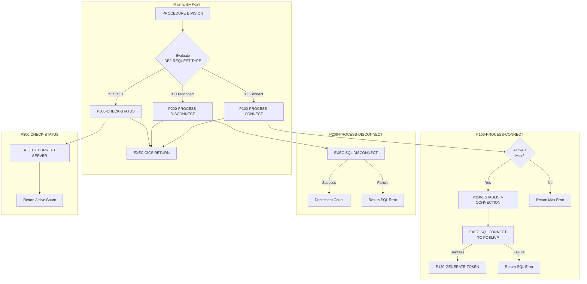
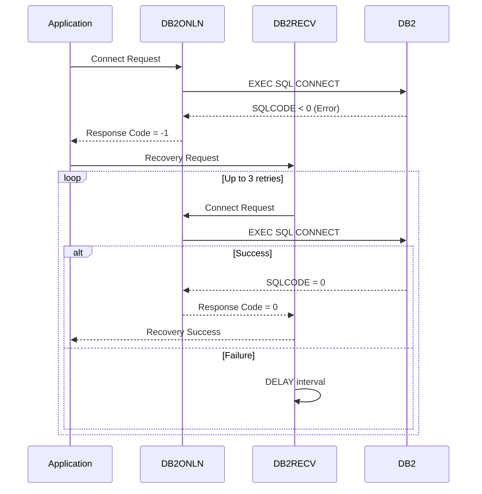

## Overview

DB2ONLN is a CICS online program that provides centralized DB2 connection management for the Investment Portfolio Management System's online components. It implements a connection pool pattern optimized for the CICS environment, managing connection lifecycle, tracking active connections, and enforcing connection limits.

The program serves as a critical infrastructure component for all online DB2 access, providing:
- Connection pooling with configurable maximum connections
- Connection token generation for tracking
- Connection status monitoring
- Graceful error handling with meaningful error messages

Unlike batch programs that typically establish dedicated connections, online programs benefit from connection pooling to handle high transaction volumes efficiently. DB2ONLN abstracts this complexity from application programs like INQONLN and INQPORT.

## Program Structure



## Data Structures

### Working Storage

#### SQL Communication Area

| Level | Name | Description |
|-------|------|-------------|
| 01 | WS-DB2-AREA | Container for SQLCA |
| - | SQLCA | SQL Communication Area (included via EXEC SQL INCLUDE) |

#### Connection Pool Statistics

| Level | Name | Picture | Description |
|-------|------|---------|-------------|
| 01 | WS-POOL-STATS | - | Connection pool tracking group |
| 05 | WS-TOTAL-CONNECTIONS | S9(8) COMP | Lifetime total connections made |
| 05 | WS-ACTIVE-CONNECTIONS | S9(8) COMP | Currently active connection count |
| 05 | WS-AVAILABLE-CONNECTIONS | S9(8) COMP | Available connection slots |
| 05 | WS-MAX-CONNECTIONS | S9(8) COMP | Maximum allowed connections (default: 100) |

#### Error Handling Area

| Level | Name | Description |
|-------|------|-------------|
| 01 | WS-ERROR-AREA | Container for error handling copybook |
| - | ERRHND | Online error handling structure (from copybook) |

### Linkage Section (API Interface)

The program receives requests through the `DB2-REQUEST-AREA` communication area:

| Level | Name | Picture | Description |
|-------|------|---------|-------------|
| 01 | DB2-REQUEST-AREA | - | CICS COMMAREA for requests |
| 05 | DB2-REQUEST-TYPE | X | Function code (see below) |
| 05 | DB2-RESPONSE-CODE | S9(8) COMP | Return code from operation |
| 05 | DB2-CONNECTION-TOKEN | X(16) | Unique connection identifier |
| 05 | DB2-ERROR-INFO | - | Error information group |
| 10 | DB2-SQLCODE | S9(9) COMP | SQL return code on error |
| 10 | DB2-ERROR-MSG | X(80) | Descriptive error message |

#### Request Type Codes

| Code | 88-Level Name | Description |
|------|---------------|-------------|
| `'C'` | DB2-CONNECT | Request a new DB2 connection |
| `'D'` | DB2-DISCONNECT | Release an existing connection |
| `'S'` | DB2-STATUS | Check connection pool status |

## File I/O

This program does not use any file I/O operations. All database interaction is performed through embedded SQL statements within the CICS environment.

## Control Flow

### Connection Request (P100-PROCESS-CONNECT)

The connection process enforces pool limits before establishing connections:

1. Check if `WS-ACTIVE-CONNECTIONS < WS-MAX-CONNECTIONS`
2. If at maximum: Return error "Maximum connections reached"
3. If available: Call P110-ESTABLISH-CONNECTION

```cobol
IF WS-ACTIVE-CONNECTIONS < WS-MAX-CONNECTIONS
   PERFORM P110-ESTABLISH-CONNECTION
      THRU P110-EXIT
ELSE
   MOVE 'Maximum connections reached' 
     TO DB2-ERROR-MSG
   MOVE -1 TO DB2-RESPONSE-CODE
END-IF
```

### Establishing Connection (P110-ESTABLISH-CONNECTION)

Executes the actual DB2 connection to the POSMVP database:

```cobol
EXEC SQL CONNECT TO POSMVP END-EXEC
```

On success:
- Increments `WS-ACTIVE-CONNECTIONS`
- Sets response code to 0
- Generates a unique connection token

On failure:
- Copies SQLCODE and SQLERRMC to response area
- Sets response code to -1

### Token Generation (P120-GENERATE-TOKEN)

Creates a unique connection token by combining the current timestamp with the connection count:

```cobol
MOVE FUNCTION CURRENT-DATE TO DB2-CONNECTION-TOKEN
STRING DB2-CONNECTION-TOKEN DELIMITED BY SIZE
       WS-ACTIVE-CONNECTIONS DELIMITED BY SIZE
       INTO DB2-CONNECTION-TOKEN
```

This token can be used by callers to track and manage their connections.

### Disconnect Request (P200-PROCESS-DISCONNECT)

Releases a DB2 connection and updates pool statistics:

```cobol
EXEC SQL DISCONNECT END-EXEC

IF SQLCODE = 0
   SUBTRACT 1 FROM WS-ACTIVE-CONNECTIONS
   MOVE 0 TO DB2-RESPONSE-CODE
ELSE
   MOVE SQLCODE TO DB2-SQLCODE
   MOVE SQLERRMC TO DB2-ERROR-MSG
   MOVE -1 TO DB2-RESPONSE-CODE
END-IF
```

### Status Check (P300-CHECK-STATUS)

Verifies DB2 connectivity and returns pool statistics:

```cobol
EXEC SQL SELECT CURRENT SERVER 
         INTO :DB2-ERROR-MSG
END-EXEC

MOVE WS-ACTIVE-CONNECTIONS TO DB2-RESPONSE-CODE
```

The status check serves dual purposes:
1. Validates that DB2 is responding (via SELECT CURRENT SERVER)
2. Returns the active connection count in the response code

## Dependencies

### Copybooks

| Copybook | Location | Description |
|----------|----------|-------------|
| ERRHND | online/ | Online error handling structure with severity levels and trace info |

### CICS Commands Used

| Command | Purpose |
|---------|---------|
| `EXEC CICS RETURN` | Return control to CICS after processing |

### Related Programs

| Program | Relationship | Description |
|---------|--------------|-------------|
| DB2RECV | Recovery Partner | DB2 Recovery Manager - handles connection failures and retry logic |
| INQONLN | Consumer | Main online inquiry handler - uses DB2 for data access |
| INQPORT | Consumer | Portfolio inquiry program - requires DB2 connection |
| INQHIST | Consumer | History inquiry program - accesses DB2 history tables |
| ERRHNDL | Support | Online error handler - processes errors from DB2ONLN |
| SECMGR | Support | Security manager - validates access to DB2 resources |

## Usage Examples

### Requesting a Connection from CICS Program

```cobol
WORKING-STORAGE SECTION.
01  WS-DB2-REQUEST.
    05 WS-REQUEST-TYPE         PIC X.
    05 WS-RESPONSE-CODE        PIC S9(8) COMP.
    05 WS-CONNECTION-TOKEN     PIC X(16).
    05 WS-ERROR-INFO.
       10 WS-SQLCODE           PIC S9(9) COMP.
       10 WS-ERROR-MSG         PIC X(80).

PROCEDURE DIVISION.
    MOVE 'C' TO WS-REQUEST-TYPE
    
    EXEC CICS LINK PROGRAM('DB2ONLN')
              COMMAREA(WS-DB2-REQUEST)
              LENGTH(LENGTH OF WS-DB2-REQUEST)
    END-EXEC
    
    IF WS-RESPONSE-CODE = 0
       DISPLAY 'Connected, token: ' WS-CONNECTION-TOKEN
    ELSE
       DISPLAY 'Connection failed: ' WS-ERROR-MSG
    END-IF
```

### Checking Pool Status

```cobol
    MOVE 'S' TO WS-REQUEST-TYPE
    
    EXEC CICS LINK PROGRAM('DB2ONLN')
              COMMAREA(WS-DB2-REQUEST)
              LENGTH(LENGTH OF WS-DB2-REQUEST)
    END-EXEC
    
    DISPLAY 'Active connections: ' WS-RESPONSE-CODE
```

### Releasing a Connection

```cobol
    MOVE 'D' TO WS-REQUEST-TYPE
    
    EXEC CICS LINK PROGRAM('DB2ONLN')
              COMMAREA(WS-DB2-REQUEST)
              LENGTH(LENGTH OF WS-DB2-REQUEST)
    END-EXEC
    
    IF WS-RESPONSE-CODE NOT = 0
       DISPLAY 'Disconnect warning: ' WS-ERROR-MSG
    END-IF
```

## Return Codes

| Code | Meaning | Condition |
|------|---------|-----------|
| 0 | Success | Connection/disconnect completed successfully |
| -1 | Error | SQL error or maximum connections reached |
| n | Active Count | For STATUS requests, returns active connection count |

## COBOL/CICS Concepts

### EXEC SQL INCLUDE SQLCA

The `EXEC SQL INCLUDE SQLCA END-EXEC` statement includes the SQL Communication Area, which provides:
- `SQLCODE`: Numeric return code from SQL operations
- `SQLERRMC`: Error message text from DB2
- `SQLSTATE`: 5-character SQL state code

### EXEC CICS RETURN

The `EXEC CICS RETURN` statement returns control to CICS. In a linked program like DB2ONLN, this returns to the calling program with the modified COMMAREA.

### FUNCTION CURRENT-DATE

The intrinsic function `FUNCTION CURRENT-DATE` returns a 21-character string containing the current date and time in the format: `YYYYMMDDHHMMSSFFFFZZHHMM` where:
- YYYY = Year
- MM = Month  
- DD = Day
- HH = Hours
- MM = Minutes
- SS = Seconds
- FFFF = Hundredths of seconds
- ZZ = Time zone direction
- HHMM = Time zone offset

### Connection Pooling in CICS

Unlike batch programs where each job establishes its own connection, CICS online programs benefit from connection pooling:
- Connections are expensive to establish
- Multiple transactions can share connections
- Pool limits prevent DB2 resource exhaustion
- Token tracking enables connection management

## Error Handling

### Connection Limit Enforcement

When the pool is at capacity:
```
DB2-ERROR-MSG: "Maximum connections reached"
DB2-RESPONSE-CODE: -1
```

### SQL Error Propagation

On DB2 errors, the program captures:
- `DB2-SQLCODE`: The actual SQLCODE from the failed operation
- `DB2-ERROR-MSG`: The SQLERRMC message text from DB2

### Integration with DB2RECV

For connection failures, callers should use DB2RECV for automatic retry logic:



## Issues

:::note Design Considerations
- The `WS-TOTAL-CONNECTIONS` and `WS-AVAILABLE-CONNECTIONS` fields are defined but not currently updated. Future versions may track these metrics.
- Connection tokens are generated but the program doesn't validate tokens on disconnect. Token validation could be added for enhanced security.
- The pool statistics are stored in working storage, meaning they are not shared across CICS regions. For true connection pooling across regions, consider using CICS shared data facilities.
- The `POSMVP` database name is hardcoded. Consider parameterizing for flexibility across environments.
:::
