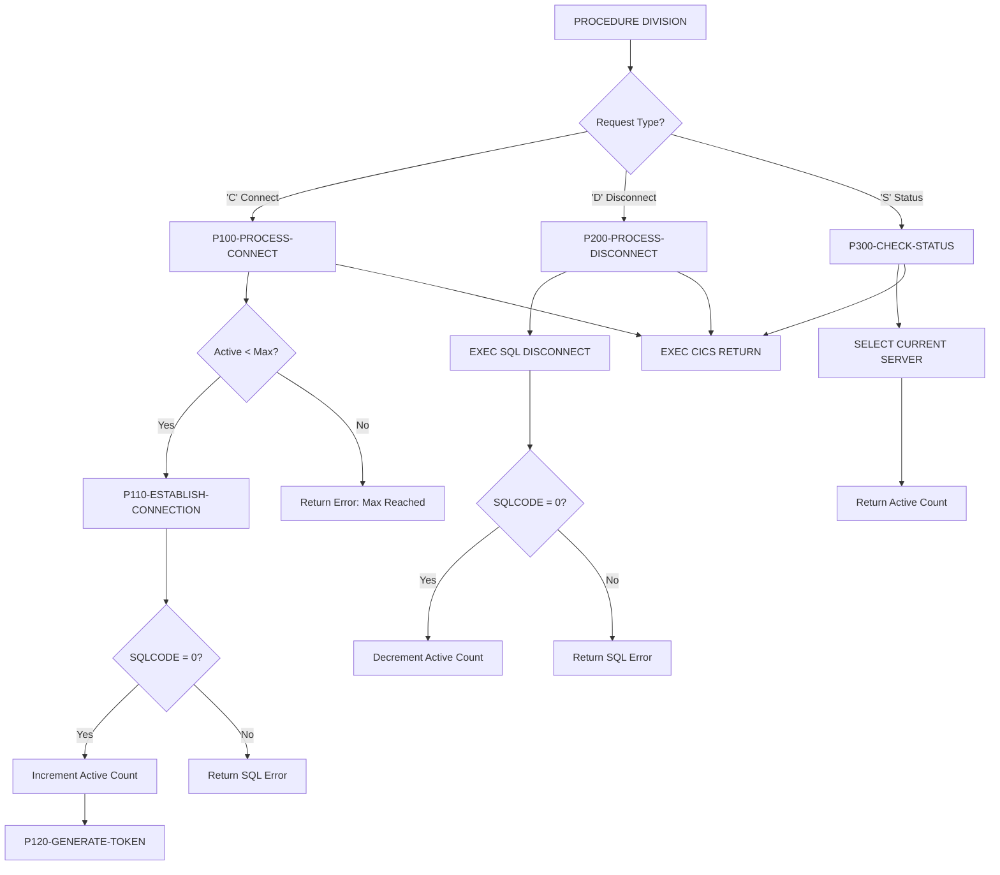

## Overview

DB2ONLN is a CICS-based COBOL program that provides centralized DB2 connection management for online transactions. It implements a connection pooling strategy to optimize database resource utilization and improve response times for CICS applications.

The program acts as a service layer between CICS transactions and DB2, handling:
- **Connection pooling**: Tracks active connections against a configurable maximum (default 100)
- **Connection establishment**: Creates new DB2 connections with token generation for tracking
- **Connection release**: Gracefully disconnects and updates pool statistics
- **Status monitoring**: Checks connection health and reports pool utilization

This design pattern reduces the overhead of establishing new database connections for each transaction by managing a pool of reusable connections.

## Program Structure



## Data Structures

### Working Storage

#### SQL Communication Area

| Level | Name | Description |
|-------|------|-------------|
| 01 | WS-DB2-AREA | Container for SQLCA include |
| | SQLCA | Standard SQL Communication Area (included via EXEC SQL INCLUDE) |

The SQLCA provides:
- `SQLCODE` - Return code from SQL operations
- `SQLERRMC` - Error message text from DB2
- `SQLSTATE` - SQL state code

#### Connection Pool Statistics

| Level | Name | Picture | Initial Value | Description |
|-------|------|---------|---------------|-------------|
| 01 | WS-POOL-STATS | Group | | Pool management counters |
| 05 | WS-TOTAL-CONNECTIONS | S9(8) COMP | 0 | Cumulative connections made |
| 05 | WS-ACTIVE-CONNECTIONS | S9(8) COMP | 0 | Currently active connections |
| 05 | WS-AVAILABLE-CONNECTIONS | S9(8) COMP | 0 | Available pool slots |
| 05 | WS-MAX-CONNECTIONS | S9(8) COMP | 100 | Maximum allowed connections |

#### Error Handling Area

| Level | Name | Picture | Description |
|-------|------|---------|-------------|
| 01 | WS-ERROR-AREA | Group | Container for ERRHND copybook |

From ERRHND copybook:

| Level | Name | Picture | Description |
|-------|------|---------|-------------|
| 05 | ERR-PROGRAM | X(8) | Program name for error tracking |
| 05 | ERR-PARAGRAPH | X(30) | Paragraph where error occurred |
| 05 | ERR-SQLCODE | S9(9) COMP | DB2 SQLCODE value |
| 05 | ERR-CICS-RESP | S9(8) COMP | CICS EIBRESP value |
| 05 | ERR-CICS-RESP2 | S9(8) COMP | CICS EIBRESP2 value |
| 05 | ERR-SEVERITY | X | Error severity flag |
| 88 | ERR-FATAL | 'F' | Fatal error - must terminate |
| 88 | ERR-WARNING | 'W' | Warning - can continue |
| 88 | ERR-INFO | 'I' | Informational message |
| 05 | ERR-MESSAGE | X(80) | Error description text |
| 05 | ERR-ACTION | X | Recommended action |
| 88 | ERR-RETURN | 'R' | Return to caller |
| 88 | ERR-CONTINUE | 'C' | Continue processing |
| 88 | ERR-ABEND | 'A' | Abend the transaction |
| 05 | ERR-TRACE | Group | Trace information |
| 10 | ERR-TRACE-ID | X(16) | Unique trace identifier |
| 10 | ERR-TIMESTAMP | X(26) | Error timestamp |

### Linkage Section

#### DB2-REQUEST-AREA

This is the interface used by calling programs to request DB2 connection services:

| Level | Name | Picture | Description |
|-------|------|---------|-------------|
| 01 | DB2-REQUEST-AREA | Group | Main request/response block |
| 05 | DB2-REQUEST-TYPE | X | Function code |
| 88 | DB2-CONNECT | 'C' | Request new connection |
| 88 | DB2-DISCONNECT | 'D' | Release connection |
| 88 | DB2-STATUS | 'S' | Check pool status |
| 05 | DB2-RESPONSE-CODE | S9(8) COMP | Return code (0=success, -1=error) |
| 05 | DB2-CONNECTION-TOKEN | X(16) | Unique connection identifier |
| 05 | DB2-ERROR-INFO | Group | Error details |
| 10 | DB2-SQLCODE | S9(9) COMP | DB2 SQLCODE if error |
| 10 | DB2-ERROR-MSG | X(80) | Error message text |

## File I/O

This program does not perform traditional file I/O. All data persistence is through DB2 database connections and CICS facilities.

## Control Flow

### Main Entry Point

The program is invoked via CICS `LINK` or `XCTL` with the `DB2-REQUEST-AREA` passed as a COMMAREA. The main procedure uses `EVALUATE TRUE` to dispatch based on the request type:

```cobol
EVALUATE TRUE
    WHEN DB2-CONNECT
         PERFORM P100-PROCESS-CONNECT THRU P100-EXIT
    WHEN DB2-DISCONNECT
         PERFORM P200-PROCESS-DISCONNECT THRU P200-EXIT
    WHEN DB2-STATUS
         PERFORM P300-CHECK-STATUS THRU P300-EXIT
END-EVALUATE
```

After processing, control returns to CICS via `EXEC CICS RETURN`.

### Connect Processing (P100-PROCESS-CONNECT)

1. **Check pool capacity**: Compare `WS-ACTIVE-CONNECTIONS` against `WS-MAX-CONNECTIONS`
2. **If pool full**: Set error message "Maximum connections reached" and response code -1
3. **If capacity available**: Call P110-ESTABLISH-CONNECTION

#### Connection Establishment (P110-ESTABLISH-CONNECTION)

1. Execute `CONNECT TO POSMVP` to establish DB2 connection
2. **On success (SQLCODE = 0)**:
   - Increment `WS-ACTIVE-CONNECTIONS`
   - Set response code to 0
   - Generate connection token via P120-GENERATE-TOKEN
3. **On failure**:
   - Copy SQLCODE to response
   - Copy SQLERRMC error message
   - Set response code to -1

#### Token Generation (P120-GENERATE-TOKEN)

Creates a unique connection token by combining:
- Current date/time from `FUNCTION CURRENT-DATE`
- Active connection count

This token can be used by callers to track and manage their specific connection.

### Disconnect Processing (P200-PROCESS-DISCONNECT)

1. Execute `EXEC SQL DISCONNECT`
2. **On success (SQLCODE = 0)**:
   - Decrement `WS-ACTIVE-CONNECTIONS`
   - Set response code to 0
3. **On failure**:
   - Copy SQLCODE and SQLERRMC to response
   - Set response code to -1

### Status Check (P300-CHECK-STATUS)

1. Execute `SELECT CURRENT SERVER INTO :DB2-ERROR-MSG` to verify connection
2. **On success**: Set response code to 0
3. **On failure**: Copy SQLCODE, set response code to -1
4. Return active connection count in `DB2-RESPONSE-CODE`

## SQL Statements

| Paragraph | SQL Statement | Purpose |
|-----------|--------------|---------|
| P110-ESTABLISH-CONNECTION | `CONNECT TO POSMVP` | Establish connection to POSMVP database |
| P200-PROCESS-DISCONNECT | `DISCONNECT` | Release the current connection |
| P300-CHECK-STATUS | `SELECT CURRENT SERVER INTO :DB2-ERROR-MSG` | Verify connection is active |

## CICS Commands

| Location | Command | Purpose |
|----------|---------|---------|
| Main procedure | `EXEC CICS RETURN END-EXEC` | Return control to CICS |

## Dependencies

### Copybooks

| Copybook | Location | Description |
|----------|----------|-------------|
| SQLCA | (DB2 system) | SQL Communication Area - included via EXEC SQL INCLUDE |
| ERRHND | online/ | Online error handling structure with severity levels and trace info |

### Called Programs

*None* - This program is a CICS service that returns to CICS after processing.

### Related Programs

Programs that also use the ERRHND copybook for consistent error handling:

| Program | Relationship |
|---------|--------------|
| DB2RECV | DB2 recovery processing - uses same error handling |
| ERRHNDL | Error handler - uses same error structure |
| INQONLN | Online inquiry - uses same error handling |
| SECMGR | Security manager - uses same error handling |

## Return Codes

| Code | Meaning | Context |
|------|---------|---------|
| 0 | Success | Connection established, released, or status checked |
| -1 | Error | Connection failed, disconnect failed, or max connections reached |
| *n* | Active count | For STATUS requests, returns current active connection count |

## Usage Example

To call DB2ONLN from a CICS program:

```cobol
WORKING-STORAGE SECTION.
01  WS-DB2-REQUEST.
    05 WS-REQUEST-TYPE        PIC X.
    05 WS-RESPONSE-CODE       PIC S9(8) COMP.
    05 WS-CONNECTION-TOKEN    PIC X(16).
    05 WS-ERROR-INFO.
       10 WS-SQLCODE          PIC S9(9) COMP.
       10 WS-ERROR-MSG        PIC X(80).

PROCEDURE DIVISION.
    *> Request a connection
    MOVE 'C' TO WS-REQUEST-TYPE
    
    EXEC CICS LINK
         PROGRAM('DB2ONLN')
         COMMAREA(WS-DB2-REQUEST)
         LENGTH(LENGTH OF WS-DB2-REQUEST)
    END-EXEC
    
    IF WS-RESPONSE-CODE = 0
        DISPLAY 'Connected with token: ' WS-CONNECTION-TOKEN
        *> ... perform database operations ...
        
        *> Release connection when done
        MOVE 'D' TO WS-REQUEST-TYPE
        EXEC CICS LINK
             PROGRAM('DB2ONLN')
             COMMAREA(WS-DB2-REQUEST)
             LENGTH(LENGTH OF WS-DB2-REQUEST)
        END-EXEC
    ELSE
        DISPLAY 'Connection failed: ' WS-ERROR-MSG
    END-IF
```

## Design Considerations

### Connection Pool Limits

The program enforces a maximum of 100 concurrent connections (`WS-MAX-CONNECTIONS`). This limit:
- Prevents DB2 thread exhaustion
- Ensures fair resource allocation across transactions
- Can be adjusted based on DB2 subsystem capacity

### Connection Tokens

The token generation mechanism creates unique identifiers by combining timestamp and connection count. This allows:
- Connection tracking across transaction boundaries
- Debugging and audit trail capabilities
- Potential future connection affinity features

### CICS Integration

The program uses `EXEC CICS RETURN` rather than `GOBACK` or `STOP RUN`, which is appropriate for CICS programs. It:
- Returns control to CICS transaction manager
- Preserves the COMMAREA for the calling program
- Allows CICS to manage transaction completion

### Limitations

:::note Working Storage State
The `WS-ACTIVE-CONNECTIONS` counter in working storage is reset each time the program is loaded. In a production environment, connection pool state should be maintained in:
- CICS Temporary Storage (TS) queues
- Shared memory areas
- DB2 tables

This implementation provides the framework but would need enhancement for true connection pooling across multiple program invocations.
:::
