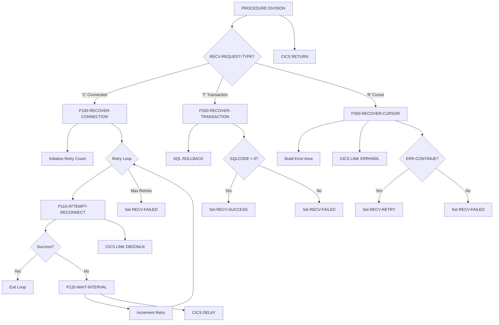

## Overview

DB2RECV is a CICS online utility program that provides DB2 recovery services for online applications. It acts as a centralized recovery manager that handles three types of DB2 failure scenarios:

- **Connection Recovery** - Re-establishes lost DB2 connections with configurable retry logic
- **Transaction Recovery** - Performs transaction rollback to restore database consistency
- **Cursor Recovery** - Handles cursor-related errors with error logging and retry coordination

This program is designed to be called by other CICS programs when they encounter DB2 errors, providing a standardized approach to error recovery that includes automatic retries with configurable intervals and comprehensive status reporting back to the caller.

## Program Structure



## Data Structures

### Linkage Section - Recovery Request Interface

The program receives requests through the `RECOVERY-REQUEST-AREA` structure:

| Field | Picture | Description |
|-------|---------|-------------|
| RECV-REQUEST-TYPE | X | Recovery type: `'C'`, `'T'`, or `'R'` |
| RECV-RESPONSE-CODE | S9(8) COMP | Response code (0=success, -1=failure) |
| RECV-SQLCODE | S9(9) COMP | SQL code from the error |
| RECV-PROGRAM | X(8) | Calling program name |
| RECV-CURSOR | X(18) | Cursor name (for cursor recovery) |
| RECV-MESSAGE | X(80) | Error/status message |
| RECV-STATUS | X | Status flag: `'S'`, `'F'`, or `'R'` |

**Request Type Condition Names:**

| Level-88 | Value | Description |
|----------|-------|-------------|
| RECV-CONNECTION | 'C' | Connection recovery request |
| RECV-TRANSACTION | 'T' | Transaction rollback request |
| RECV-CURSOR | 'R' | Cursor recovery request |

**Status Condition Names:**

| Level-88 | Value | Description |
|----------|-------|-------------|
| RECV-SUCCESS | 'S' | Recovery completed successfully |
| RECV-FAILED | 'F' | Recovery failed after all attempts |
| RECV-RETRY | 'R' | Retry recommended |

### Working Storage

#### Recovery Statistics

| Field | Picture | Initial Value | Description |
|-------|---------|---------------|-------------|
| WS-RETRY-COUNT | S9(4) COMP | 0 | Current retry attempt number |
| WS-MAX-RETRIES | S9(4) COMP | 3 | Maximum retry attempts allowed |
| WS-RETRY-INTERVAL | S9(8) COMP | 2 | Seconds between retry attempts |
| WS-LAST-ERROR | S9(9) COMP | 0 | Last error code encountered |

#### DB2 Request Area (DB2REQ copybook)

| Field | Picture | Description |
|-------|---------|-------------|
| DB2-REQUEST-TYPE | X | Request type: C=Connect, D=Disconnect, S=Status |
| DB2-RESPONSE-CODE | S9(8) COMP | Response from DB2ONLN |
| DB2-CONNECTION-TOKEN | X(16) | Connection identifier token |
| DB2-SQLCODE | S9(9) COMP | SQL code from operation |
| DB2-ERROR-MSG | X(80) | Error message text |

#### Error Handling Area (ERRHND copybook)

| Field | Picture | Description |
|-------|---------|-------------|
| ERR-PROGRAM | X(8) | Program that encountered error |
| ERR-PARAGRAPH | X(30) | Paragraph/cursor name |
| ERR-SQLCODE | S9(9) COMP | SQL code |
| ERR-CICS-RESP | S9(8) COMP | CICS response code |
| ERR-CICS-RESP2 | S9(8) COMP | CICS response code 2 |
| ERR-SEVERITY | X | F=Fatal, W=Warning, I=Info |
| ERR-MESSAGE | X(80) | Error message |
| ERR-ACTION | X | R=Return, C=Continue, A=Abend |
| ERR-TRACE-ID | X(16) | Trace identifier |
| ERR-TIMESTAMP | X(26) | Error timestamp |

## Control Flow

### P100-RECOVER-CONNECTION - Connection Recovery

This paragraph implements retry logic to re-establish a lost DB2 connection.

**Algorithm:**
1. Initialize retry counter to 0
2. Loop until retry count reaches maximum (3 attempts):
   - Call P110-ATTEMPT-RECONNECT to try connecting
   - If successful, exit loop immediately
   - If failed, call P120-WAIT-INTERVAL to wait, then increment retry counter
3. If all retries exhausted, set RECV-FAILED and response code to -1

**Retry Configuration:**
- Maximum retries: 3 attempts
- Wait interval: 2 seconds between attempts
- Total maximum wait: 6 seconds (3 × 2)

### P110-ATTEMPT-RECONNECT - Single Reconnection Attempt

1. Sets request type to 'C' (Connect) in DB2 request area
2. Uses `EXEC CICS LINK` to call DB2ONLN program with the request
3. Evaluates response:
   - If DB2-RESPONSE-CODE = 0: Sets RECV-SUCCESS, response code to 0
   - Otherwise: Sets RECV-RETRY, copies SQLCODE to caller's area

### P120-WAIT-INTERVAL - Delay Between Retries

Uses `EXEC CICS DELAY INTERVAL` to pause execution for the configured retry interval (2 seconds). This prevents rapid-fire reconnection attempts that could overwhelm the system.

### P200-RECOVER-TRANSACTION - Transaction Rollback

Performs a simple transaction rollback to restore database consistency.

**Algorithm:**
1. Executes `EXEC SQL ROLLBACK END-EXEC`
2. Checks SQLCODE:
   - If SQLCODE = 0: Sets RECV-SUCCESS, response code to 0
   - Otherwise: Sets RECV-FAILED, copies SQLCODE, response code to -1

This is typically called when a transaction has partially completed and needs to be rolled back due to an error in subsequent processing.

### P300-RECOVER-CURSOR - Cursor Error Recovery

Handles cursor-related errors by logging them and coordinating with the error handler.

**Algorithm:**
1. Initializes error handling area (clears to spaces)
2. Populates error information:
   - ERR-PROGRAM from caller's program ID
   - ERR-PARAGRAPH from cursor name
   - ERR-SQLCODE from caller's SQL code
   - ERR-SEVERITY set to Warning ('W')
3. Calls ERRHNDL program via `EXEC CICS LINK` with error area
4. Checks error handler's response:
   - If ERR-CONTINUE: Sets RECV-RETRY (caller should retry)
   - Otherwise: Sets RECV-FAILED
5. Returns error message from handler to caller

## CICS Commands Used

| Command | Paragraph | Purpose |
|---------|-----------|---------|
| `EXEC CICS LINK PROGRAM('DB2ONLN')` | P110-ATTEMPT-RECONNECT | Calls DB2 connection manager |
| `EXEC CICS DELAY INTERVAL()` | P120-WAIT-INTERVAL | Pauses between retry attempts |
| `EXEC CICS LINK PROGRAM('ERRHNDL')` | P300-RECOVER-CURSOR | Calls error handler |
| `EXEC CICS RETURN` | Main | Returns to calling program |

## Database Operations

| Operation | Paragraph | Purpose |
|-----------|-----------|---------|
| `EXEC SQL ROLLBACK END-EXEC` | P200-RECOVER-TRANSACTION | Rolls back current transaction |

The SQLCA (SQL Communication Area) is included via `EXEC SQL INCLUDE SQLCA` for access to SQLCODE after the rollback.

## Dependencies

### Copybooks

- **ERRHND** - Online error handling structure for communicating with ERRHNDL
- **DB2REQ** - DB2 request area structure for communicating with DB2ONLN

### Called Programs

| Program | Purpose | Called From |
|---------|---------|-------------|
| **DB2ONLN** | DB2 connection manager | P110-ATTEMPT-RECONNECT |
| **ERRHNDL** | Online error handler | P300-RECOVER-CURSOR |

### Related Programs

Programs sharing the same copybooks:

| Program | Shared Copybooks |
|---------|------------------|
| DB2ONLN | ERRHND, DB2REQ |
| ERRHNDL | ERRHND |
| INQONLN | ERRHND |
| SECMGR | ERRHND |

## Return Values

### RECV-RESPONSE-CODE

| Value | Description |
|-------|-------------|
| 0 | Operation completed successfully |
| -1 | Operation failed |

### RECV-STATUS

| Value | Condition | Description |
|-------|-----------|-------------|
| 'S' | RECV-SUCCESS | Recovery successful |
| 'F' | RECV-FAILED | Recovery failed after all attempts |
| 'R' | RECV-RETRY | Caller should retry the operation |

### RECV-SQLCODE

Contains the SQLCODE from the failed operation, allowing the caller to take specific action based on the error type.

## Usage Example

```cobol
* Connection recovery example
MOVE 'C' TO RECV-REQUEST-TYPE
MOVE SQLCODE TO RECV-SQLCODE
MOVE 'MYPROGRAM' TO RECV-PROGRAM

EXEC CICS LINK PROGRAM('DB2RECV')
          COMMAREA(RECOVERY-REQUEST-AREA)
          LENGTH(LENGTH OF RECOVERY-REQUEST-AREA)
END-EXEC

EVALUATE TRUE
    WHEN RECV-SUCCESS
        CONTINUE
    WHEN RECV-RETRY
        PERFORM RETRY-OPERATION
    WHEN RECV-FAILED
        PERFORM HANDLE-FATAL-ERROR
END-EVALUATE
```

```cobol
* Transaction rollback example
MOVE 'T' TO RECV-REQUEST-TYPE
MOVE SQLCODE TO RECV-SQLCODE

EXEC CICS LINK PROGRAM('DB2RECV')
          COMMAREA(RECOVERY-REQUEST-AREA)
          LENGTH(LENGTH OF RECOVERY-REQUEST-AREA)
END-EXEC

IF RECV-FAILED
    DISPLAY 'Rollback failed: ' RECV-MESSAGE
END-IF
```

## Technical Notes

1. **CICS LINK vs CALL**: The program uses `EXEC CICS LINK` rather than COBOL CALL statements because it runs in a CICS environment. LINK transfers control to another CICS program and returns when that program issues RETURN.

2. **COMMAREA Communication**: Data is passed between programs using the CICS COMMAREA (communication area). The LENGTH parameter ensures the correct amount of data is transferred.

3. **CICS DELAY**: The retry interval uses `EXEC CICS DELAY INTERVAL` which suspends the task for the specified number of seconds without consuming CPU resources. This is more efficient than a busy-wait loop.

4. **EXEC CICS RETURN**: The program ends with RETURN rather than GOBACK or STOP RUN because it's a CICS program that must return control to CICS.

5. **Retry Strategy**: The exponential backoff pattern (fixed 2-second intervals) is simple but effective for transient failures. For production systems, consider implementing exponential backoff with jitter.

6. **SQL ROLLBACK**: The rollback operation uses embedded SQL (`EXEC SQL ... END-EXEC`) and checks SQLCODE directly. The SQLCA must be included for this to work.

7. **Error Severity**: Cursor errors are logged as warnings ('W') because they often represent recoverable conditions. The error handler (ERRHNDL) determines whether to continue or abort based on the specific error.

8. **Stateless Design**: The program doesn't maintain state between calls - each invocation is independent. Recovery statistics (retry count, etc.) are reset on each call.
