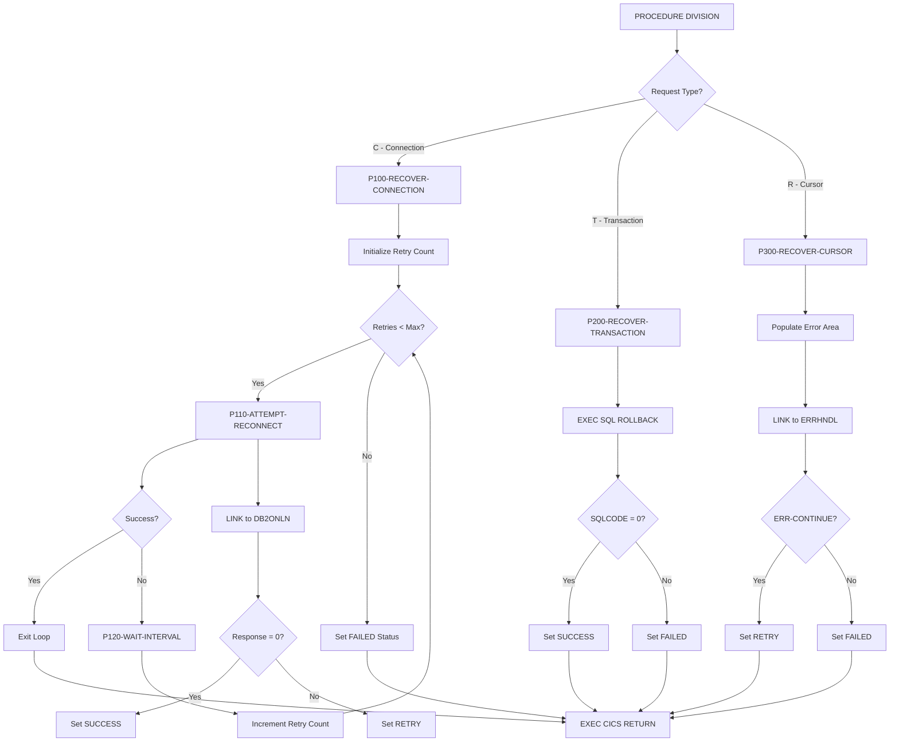

## Overview

DB2RECV is a CICS-based recovery manager that handles DB2 failures in online transaction processing environments. It provides automated recovery services for three types of DB2 problems: connection failures, transaction errors requiring rollback, and cursor-related issues.

The program implements a robust retry mechanism for connection recovery, attempting to reconnect up to three times with configurable wait intervals between attempts. This approach helps applications survive transient network issues or brief DB2 unavailability without immediately failing the user's transaction.

DB2RECV is designed to be called by other CICS programs when they encounter DB2 errors. It centralizes recovery logic, ensuring consistent error handling across the application and simplifying the error recovery code in individual programs.

## Program Structure



## Data Structures

### Linkage Section - Recovery Request Area

| Level | Name | Picture | Description |
|-------|------|---------|-------------|
| 01 | RECOVERY-REQUEST-AREA | - | Main communication area |
| 05 | RECV-REQUEST-TYPE | X | Recovery type: 'C', 'T', or 'R' |
| 05 | RECV-RESPONSE-CODE | S9(8) COMP | Response code (0=success, -1=failure) |
| 05 | RECV-SQLCODE | S9(9) COMP | DB2 SQLCODE from failed operation |
| 05 | RECV-ERROR-INFO | - | Error details group |
| 10 | RECV-PROGRAM | X(8) | Program that encountered error |
| 10 | RECV-CURSOR | X(18) | Cursor name (for cursor recovery) |
| 10 | RECV-MESSAGE | X(80) | Error message text |
| 05 | RECV-STATUS | X | Recovery outcome: 'S', 'F', or 'R' |

### Request Type Values

| Value | Condition Name | Description |
|-------|---------------|-------------|
| 'C' | RECV-CONNECTION | Recover from connection failure |
| 'T' | RECV-TRANSACTION | Rollback failed transaction |
| 'R' | RECV-CURSOR | Recover from cursor error |

### Status Values

| Value | Condition Name | Description |
|-------|---------------|-------------|
| 'S' | RECV-SUCCESS | Recovery completed successfully |
| 'F' | RECV-FAILED | Recovery failed, cannot continue |
| 'R' | RECV-RETRY | Caller should retry the operation |

### Working Storage - Recovery Statistics

| Level | Name | Picture | Value | Description |
|-------|------|---------|-------|-------------|
| 05 | WS-RETRY-COUNT | S9(4) COMP | 0 | Current retry attempt number |
| 05 | WS-MAX-RETRIES | S9(4) COMP | 3 | Maximum retry attempts |
| 05 | WS-RETRY-INTERVAL | S9(8) COMP | 2 | Seconds between retries |
| 05 | WS-LAST-ERROR | S9(9) COMP | 0 | Last SQLCODE encountered |

### DB2 Request Area (from DB2REQ copybook)

| Level | Name | Picture | Description |
|-------|------|---------|-------------|
| 01 | DB2-REQUEST-AREA | - | Request area for DB2ONLN |
| 05 | DB2-REQUEST-TYPE | X | 'C'=Connect, 'D'=Disconnect, 'S'=Status |
| 05 | DB2-RESPONSE-CODE | S9(8) COMP | Response from DB2ONLN |
| 05 | DB2-CONNECTION-TOKEN | X(16) | Connection identifier |
| 05 | DB2-SQLCODE | S9(9) COMP | SQLCODE from DB2 operation |
| 05 | DB2-ERROR-MSG | X(80) | Error message |

### Error Handling Area (from ERRHND copybook)

| Level | Name | Picture | Description |
|-------|------|---------|-------------|
| 01 | ERROR-HANDLING | - | Error area for ERRHNDL |
| 05 | ERR-PROGRAM | X(8) | Program name |
| 05 | ERR-PARAGRAPH | X(30) | Paragraph/cursor name |
| 05 | ERR-SQLCODE | S9(9) COMP | SQLCODE |
| 05 | ERR-CICS-RESP | S9(8) COMP | CICS EIBRESP |
| 05 | ERR-CICS-RESP2 | S9(8) COMP | CICS EIBRESP2 |
| 05 | ERR-SEVERITY | X | 'F'=Fatal, 'W'=Warning, 'I'=Info |
| 05 | ERR-MESSAGE | X(80) | Error message |
| 05 | ERR-ACTION | X | 'R'=Return, 'C'=Continue, 'A'=Abend |

## Control Flow

### Connection Recovery (RECV-REQUEST-TYPE = 'C')

The connection recovery function implements a retry loop to reestablish DB2 connectivity:

1. **P100-RECOVER-CONNECTION**: Main connection recovery routine
   - Initializes retry count to zero
   - Enters retry loop (up to WS-MAX-RETRIES attempts)
   - On each iteration:
     - Calls P110-ATTEMPT-RECONNECT to try connecting
     - If successful, exits the loop
     - If not successful, calls P120-WAIT-INTERVAL and increments retry count
   - If all retries exhausted, sets RECV-FAILED and response code to -1

2. **P110-ATTEMPT-RECONNECT**: Single reconnection attempt
   - Sets DB2-REQUEST-TYPE to 'C' (Connect)
   - Uses `EXEC CICS LINK` to call DB2ONLN program
   - If DB2ONLN returns response code 0:
     - Sets RECV-SUCCESS
     - Sets response code to 0
   - Otherwise:
     - Sets RECV-RETRY status
     - Copies the SQLCODE to RECV-SQLCODE

3. **P120-WAIT-INTERVAL**: Delay between retries
   - Uses `EXEC CICS DELAY INTERVAL` to pause for WS-RETRY-INTERVAL seconds
   - Default wait is 2 seconds

### Transaction Recovery (RECV-REQUEST-TYPE = 'T')

The transaction recovery function performs a database rollback:

1. **P200-RECOVER-TRANSACTION**: Rollback routine
   - Executes `EXEC SQL ROLLBACK` to undo uncommitted changes
   - If SQLCODE = 0:
     - Sets RECV-SUCCESS
     - Sets response code to 0
   - If SQLCODE ≠ 0:
     - Sets RECV-FAILED
     - Copies SQLCODE to RECV-SQLCODE
     - Sets response code to -1

### Cursor Recovery (RECV-REQUEST-TYPE = 'R')

The cursor recovery function delegates to the error handler for guidance:

1. **P300-RECOVER-CURSOR**: Cursor error handling
   - Initializes WS-ERROR-AREA with spaces
   - Populates error fields from linkage section:
     - RECV-PROGRAM → ERR-PROGRAM
     - RECV-CURSOR → ERR-PARAGRAPH
     - RECV-SQLCODE → ERR-SQLCODE
   - Sets ERR-WARNING severity
   - Uses `EXEC CICS LINK` to call ERRHNDL program
   - Checks error handler's recommendation:
     - If ERR-CONTINUE: Sets RECV-RETRY (caller can retry)
     - Otherwise: Sets RECV-FAILED
   - Copies ERR-MESSAGE to RECV-MESSAGE for caller

## CICS Commands Used

| Command | Paragraph | Purpose |
|---------|-----------|---------|
| EXEC CICS LINK | P110-ATTEMPT-RECONNECT | Call DB2ONLN for connection |
| EXEC CICS LINK | P300-RECOVER-CURSOR | Call ERRHNDL for error handling |
| EXEC CICS DELAY | P120-WAIT-INTERVAL | Wait between retry attempts |
| EXEC CICS RETURN | Main procedure | Return to calling program |

## Database Access

### SQL Operations

| Operation | Paragraph | Purpose |
|-----------|-----------|---------|
| ROLLBACK | P200-RECOVER-TRANSACTION | Undo uncommitted database changes |

The SQLCA is included for access to SQLCODE after the ROLLBACK operation.

## Dependencies

### Copybooks

- **ERRHND** - Online error handling structure with severity levels and action codes
- **DB2REQ** - DB2 request area for communicating with DB2ONLN connection manager

### Called Programs

| Program | Command | Purpose |
|---------|---------|---------|
| DB2ONLN | EXEC CICS LINK | DB2 connection manager for online programs |
| ERRHNDL | EXEC CICS LINK | Online error handler for determining recovery action |

### Related Programs

Programs that share copybooks and may call DB2RECV:

- **DB2ONLN** - DB2 online connection manager (uses ERRHND)
- **ERRHNDL** - Error handler (uses ERRHND)
- **INQONLN** - Online inquiry program (uses ERRHND)
- **SECMGR** - Security manager (uses ERRHND)

## Technical Notes

### Response Codes

| Code | Meaning |
|------|---------|
| 0 | Recovery successful |
| -1 | Recovery failed after all attempts |

### Retry Configuration

The retry behavior is controlled by working storage constants:

| Parameter | Default | Description |
|-----------|---------|-------------|
| WS-MAX-RETRIES | 3 | Maximum connection retry attempts |
| WS-RETRY-INTERVAL | 2 | Seconds to wait between retries |

These values can be modified to tune recovery behavior for different environments.

### Recovery Decision Matrix

| Request Type | Outcome | Status | Action for Caller |
|--------------|---------|--------|-------------------|
| Connection | DB2ONLN returns 0 | SUCCESS | Proceed with operation |
| Connection | All retries fail | FAILED | Display error, end transaction |
| Transaction | ROLLBACK succeeds | SUCCESS | Transaction cleanly rolled back |
| Transaction | ROLLBACK fails | FAILED | Serious DB2 issue, escalate |
| Cursor | ERRHNDL says continue | RETRY | Close and reopen cursor |
| Cursor | ERRHNDL says stop | FAILED | Cannot recover, end operation |

### Usage Example

```cobol
* After encountering a DB2 connection error...
MOVE 'C' TO RECV-REQUEST-TYPE
MOVE SQLCODE TO RECV-SQLCODE
MOVE 'MYPROG01' TO RECV-PROGRAM
MOVE 'Connection lost during update' TO RECV-MESSAGE

EXEC CICS LINK PROGRAM('DB2RECV')
              COMMAREA(RECOVERY-REQUEST-AREA)
              LENGTH(LENGTH OF RECOVERY-REQUEST-AREA)
END-EXEC

EVALUATE TRUE
    WHEN RECV-SUCCESS
        CONTINUE WITH OPERATION
    WHEN RECV-RETRY
        PERFORM RETRY-OPERATION
    WHEN RECV-FAILED
        PERFORM ERROR-HANDLING
END-EVALUATE
```

### CICS Considerations

- **EXEC CICS LINK**: Used instead of CALL for CICS program invocation, providing proper resource management
- **EXEC CICS DELAY**: Implements the wait interval without busy-waiting, allowing CICS to manage resources efficiently
- **EXEC CICS RETURN**: Returns control to the calling program; DB2RECV does not set TRANSID, so the caller remains in control

### Error Severity Mapping

When calling ERRHNDL for cursor recovery, the severity is set to WARNING ('W'). The error handler then determines whether:
- **ERR-CONTINUE ('C')**: The error is recoverable, caller should retry
- **ERR-RETURN ('R')**: Return to caller without retry
- **ERR-ABEND ('A')**: Fatal error, transaction should abend

### COBOL Features Used

- **88-level condition names**: Used extensively for request types, status values, and action codes
- **EXEC SQL INCLUDE SQLCA**: Includes the SQL Communication Area for SQLCODE access
- **PERFORM THRU**: Executes from a starting paragraph through an exit paragraph
- **EXEC CICS commands**: LINK, DELAY, and RETURN for CICS integration
- **LENGTH OF**: Special register to get the length of a data item for COMMAREA
