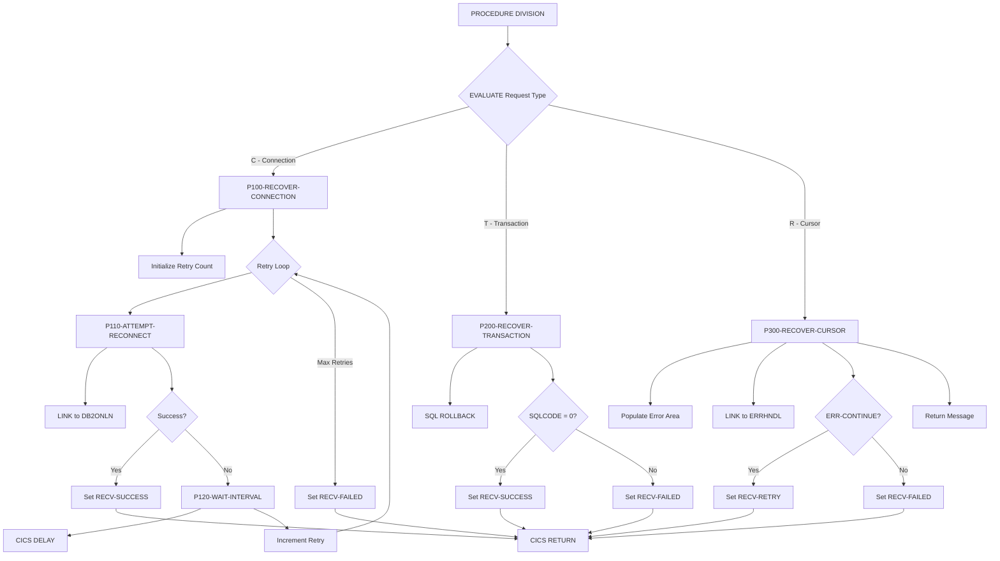

## Overview

DB2RECV is a CICS-based DB2 Recovery Manager that provides centralized recovery services for online programs experiencing DB2 failures. It handles three types of recovery scenarios: connection failures, transaction rollbacks, and cursor recovery operations.

The program implements an intelligent retry mechanism for connection failures, attempting to reconnect up to three times with configurable intervals between attempts. For transaction failures, it performs a clean ROLLBACK to restore database consistency. For cursor-related issues, it integrates with the error handling subsystem to determine whether processing should continue or abort.

DB2RECV is designed to be called via CICS LINK from any online program that encounters a DB2 error, providing a consistent recovery approach across the CICS region. It returns status information to the caller indicating whether recovery succeeded, failed, or should be retried.

## Program Structure



## Data Structures

### Linkage Section (Input/Output Parameters)

| Level | Name | Picture | Description |
|-------|------|---------|-------------|
| 01 | RECOVERY-REQUEST-AREA | - | Main parameter block passed by caller |
| 05 | RECV-REQUEST-TYPE | X | Recovery type: 'C'=Connection, 'T'=Transaction, 'R'=Cursor |
| 05 | RECV-RESPONSE-CODE | S9(8) COMP | Response code (0=success, -1=failure) |
| 05 | RECV-SQLCODE | S9(9) COMP | SQL code from failed operation |
| 05 | RECV-ERROR-INFO | - | Error context group |
| 10 | RECV-PROGRAM | X(8) | Program that encountered the error |
| 10 | RECV-CURSOR | X(18) | Cursor name (for cursor recovery) |
| 10 | RECV-MESSAGE | X(80) | Error/status message returned |
| 05 | RECV-STATUS | X | Recovery status: 'S'=Success, 'F'=Failed, 'R'=Retry |

### Working Storage - Recovery Statistics

| Level | Name | Picture | Value | Description |
|-------|------|---------|-------|-------------|
| 05 | WS-RETRY-COUNT | S9(4) COMP | 0 | Current retry attempt counter |
| 05 | WS-MAX-RETRIES | S9(4) COMP | 3 | Maximum reconnection attempts |
| 05 | WS-RETRY-INTERVAL | S9(8) COMP | 2 | Seconds between retry attempts |
| 05 | WS-LAST-ERROR | S9(9) COMP | 0 | Last SQLCODE encountered |

### Working Storage - DB2 Request Area (from DB2REQ copybook)

| Level | Name | Picture | Description |
|-------|------|---------|-------------|
| 01 | DB2-REQUEST-AREA | - | Request area for DB2ONLN calls |
| 05 | DB2-REQUEST-TYPE | X | Request type: 'C'=Connect, 'D'=Disconnect, 'S'=Status |
| 05 | DB2-RESPONSE-CODE | S9(8) COMP | Response from DB2ONLN |
| 05 | DB2-CONNECTION-TOKEN | X(16) | Connection token |
| 05 | DB2-SQLCODE | S9(9) COMP | SQLCODE from DB2 operation |
| 05 | DB2-ERROR-MSG | X(80) | Error message text |

### Working Storage - Error Handling Area (from ERRHND copybook)

| Level | Name | Picture | Description |
|-------|------|---------|-------------|
| 01 | ERROR-HANDLING | - | Error handling communication area |
| 05 | ERR-PROGRAM | X(8) | Program name |
| 05 | ERR-PARAGRAPH | X(30) | Paragraph/cursor name |
| 05 | ERR-SQLCODE | S9(9) COMP | SQL code |
| 05 | ERR-CICS-RESP | S9(8) COMP | CICS RESP value |
| 05 | ERR-CICS-RESP2 | S9(8) COMP | CICS RESP2 value |
| 05 | ERR-SEVERITY | X | Severity: 'F'=Fatal, 'W'=Warning, 'I'=Info |
| 05 | ERR-MESSAGE | X(80) | Error message |
| 05 | ERR-ACTION | X | Action: 'R'=Return, 'C'=Continue, 'A'=Abend |
| 05 | ERR-TRACE | - | Trace information |
| 10 | ERR-TRACE-ID | X(16) | Trace identifier |
| 10 | ERR-TIMESTAMP | X(26) | Error timestamp |

## Control Flow

### Entry Point - Request Routing

The PROCEDURE DIVISION evaluates the RECV-REQUEST-TYPE to determine which recovery operation to perform:
- **'C' (Connection)**: Routes to P100-RECOVER-CONNECTION for connection retry logic
- **'T' (Transaction)**: Routes to P200-RECOVER-TRANSACTION for rollback
- **'R' (Cursor)**: Routes to P300-RECOVER-CURSOR for cursor error handling

After processing, executes `EXEC CICS RETURN` to return control to the caller.

### P100-RECOVER-CONNECTION - Connection Recovery

Implements a retry loop to re-establish DB2 connectivity:

1. **Initialize**: Sets WS-RETRY-COUNT to 0
2. **Retry Loop**: Continues until max retries reached or success:
   - Calls P110-ATTEMPT-RECONNECT to try connecting
   - If successful, exits loop immediately
   - If failed, calls P120-WAIT-INTERVAL and increments retry counter
3. **Final Status**: If all retries exhausted, sets RECV-FAILED and RECV-RESPONSE-CODE to -1

### P110-ATTEMPT-RECONNECT - Connection Attempt

Attempts to reconnect to DB2:

1. Sets DB2-REQUEST-TYPE to 'C' (Connect)
2. Executes `EXEC CICS LINK PROGRAM('DB2ONLN')` with DB2 request COMMAREA
3. Evaluates response:
   - If DB2-RESPONSE-CODE = 0: Sets RECV-SUCCESS, RECV-RESPONSE-CODE = 0
   - Otherwise: Sets RECV-RETRY, copies SQLCODE to RECV-SQLCODE

### P120-WAIT-INTERVAL - Delay Between Retries

Pauses execution before the next retry attempt:
- Executes `EXEC CICS DELAY INTERVAL(WS-RETRY-INTERVAL)`
- Default interval is 2 seconds

### P200-RECOVER-TRANSACTION - Transaction Rollback

Performs a database rollback to undo uncommitted changes:

1. Executes `EXEC SQL ROLLBACK END-EXEC`
2. Evaluates SQLCODE:
   - If SQLCODE = 0: Sets RECV-SUCCESS, RECV-RESPONSE-CODE = 0
   - Otherwise: Sets RECV-FAILED, copies SQLCODE to RECV-SQLCODE, sets RECV-RESPONSE-CODE = -1

### P300-RECOVER-CURSOR - Cursor Error Recovery

Handles cursor-related errors by consulting the error handling subsystem:

1. **Prepare Error Area**:
   - Clears WS-ERROR-AREA
   - Populates ERR-PROGRAM from RECV-PROGRAM
   - Populates ERR-PARAGRAPH from RECV-CURSOR
   - Populates ERR-SQLCODE from RECV-SQLCODE
   - Sets ERR-WARNING severity

2. **Call Error Handler**: Executes `EXEC CICS LINK PROGRAM('ERRHNDL')` with error COMMAREA

3. **Evaluate Response**:
   - If ERR-CONTINUE: Sets RECV-RETRY (caller can retry the cursor operation)
   - Otherwise: Sets RECV-FAILED

4. **Return Message**: Moves ERR-MESSAGE to RECV-MESSAGE for caller information

## CICS Commands

| Command | Paragraph | Description |
|---------|-----------|-------------|
| LINK PROGRAM('DB2ONLN') | P110-ATTEMPT-RECONNECT | Calls DB2 online connection manager |
| DELAY INTERVAL | P120-WAIT-INTERVAL | Pauses between retry attempts |
| LINK PROGRAM('ERRHNDL') | P300-RECOVER-CURSOR | Calls error handling program |
| RETURN | Main | Returns control to calling program |

## Database Access

### SQL ROLLBACK (P200-RECOVER-TRANSACTION)

```sql
EXEC SQL ROLLBACK END-EXEC
```

Issues a rollback to undo all database changes since the last commit point. Used when transaction recovery is requested to restore database consistency after a failure.

## Dependencies

### Copybooks

| Copybook | Section | Description |
|----------|---------|-------------|
| SQLCA | WORKING-STORAGE | SQL Communication Area (included via EXEC SQL INCLUDE) |
| ERRHND | WORKING-STORAGE | Online Error Handling structure for ERRHNDL calls |
| DB2REQ | WORKING-STORAGE | DB2 Request Area structure for DB2ONLN calls |

### Called Programs (via CICS LINK)

| Program | Purpose |
|---------|---------|
| DB2ONLN | DB2 Online Connection Manager - handles connect/disconnect/status |
| ERRHNDL | Error Handler - evaluates errors and determines action |

### Related Programs

Programs that share copybooks or may call DB2RECV:

- **DB2ONLN** - DB2 Online connection manager (uses ERRHND)
- **ERRHNDL** - Error handler (uses ERRHND)
- **INQONLN** - Online inquiry program (uses ERRHND)
- **SECMGR** - Security manager (uses ERRHND)

## Return Values

### RECV-STATUS Values

| Value | Condition Name | Meaning |
|-------|----------------|---------|
| 'S' | RECV-SUCCESS | Recovery completed successfully |
| 'F' | RECV-FAILED | Recovery failed, cannot continue |
| 'R' | RECV-RETRY | Caller should retry the failed operation |

### RECV-RESPONSE-CODE Values

| Code | Meaning |
|------|---------|
| 0 | Successful recovery |
| -1 | Recovery failed |

## Usage Example

```cobol
* Handle DB2 connection failure
MOVE 'C' TO RECV-REQUEST-TYPE
MOVE SQLCODE TO RECV-SQLCODE
MOVE 'MYPROG01' TO RECV-PROGRAM

EXEC CICS LINK PROGRAM('DB2RECV')
              COMMAREA(RECOVERY-REQUEST-AREA)
              LENGTH(LENGTH OF RECOVERY-REQUEST-AREA)
END-EXEC

EVALUATE TRUE
    WHEN RECV-SUCCESS
        CONTINUE
    WHEN RECV-RETRY
        PERFORM RETRY-OPERATION
    WHEN RECV-FAILED
        PERFORM HANDLE-FAILURE
END-EVALUATE
```

## Recovery Scenarios

### Connection Recovery ('C')

**When to use**: When a DB2 connection is lost (e.g., SQLCODE -30081)

**Behavior**:
1. Attempts reconnection up to 3 times
2. Waits 2 seconds between attempts
3. Returns SUCCESS if reconnected, FAILED if all attempts fail

**Caller action**: If SUCCESS, retry the failed DB2 operation. If FAILED, perform graceful degradation or display error to user.

### Transaction Recovery ('T')

**When to use**: When a transaction must be abandoned due to an unrecoverable error

**Behavior**:
1. Issues SQL ROLLBACK
2. Returns SUCCESS if rollback completes, FAILED if rollback fails

**Caller action**: If SUCCESS, transaction is cleanly aborted and can be restarted. If FAILED, may need to escalate to CICS SYNCPOINT ROLLBACK.

### Cursor Recovery ('R')

**When to use**: When a cursor operation fails and you need guidance on whether to retry

**Behavior**:
1. Logs error information to error handler
2. Error handler determines if error is recoverable
3. Returns RETRY if recoverable, FAILED if not

**Caller action**: If RETRY, close and reopen the cursor, then retry. If FAILED, abort the operation and report to user.

## Technical Notes

- **CICS LINK**: Uses LINK rather than XCTL to allow return to the calling program with status information
- **COMMAREA**: All communication uses COMMAREA for data exchange between programs
- **COMP Fields**: Uses COMP (binary) for numeric fields for efficient CICS/DB2 processing
- **SQLCA Include**: SQL Communication Area is included via EXEC SQL INCLUDE rather than COPY for proper precompiler handling
- **88-Level Conditions**: Extensive use of condition names for readable status checking
- **Retry Interval**: The 2-second delay prevents rapid-fire reconnection attempts that could overwhelm DB2
- **Max Retries**: Limited to 3 attempts to avoid indefinite hangs in case of persistent failures
- **PERFORM THRU**: Uses paragraph exit points (P100-EXIT, etc.) for structured flow with clean exit paths
