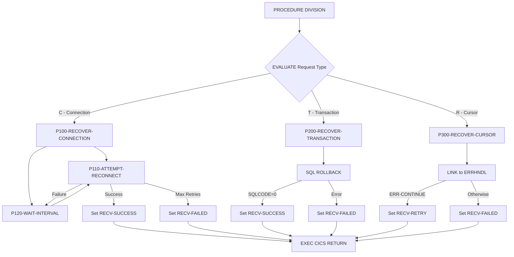

## Overview

DB2RECV is a CICS online program that provides DB2 recovery services for other online applications. It handles three types of recovery scenarios: connection failures, transaction rollbacks, and cursor recovery. The program implements intelligent retry logic with configurable intervals and maximum attempts.

This program serves as a centralized recovery component that can be called by any CICS program experiencing DB2 issues. By standardizing recovery procedures, it ensures consistent behavior across the application suite and reduces code duplication in individual programs.

Key capabilities include:
- **Connection Recovery**: Attempts to re-establish DB2 connections with configurable retry intervals
- **Transaction Recovery**: Performs SQL ROLLBACK to undo uncommitted changes
- **Cursor Recovery**: Logs cursor errors and determines whether processing can continue

## Program Structure



## Data Structures

### Linkage Section - Recovery Request Area

| Level | Name | Picture | Description |
|-------|------|---------|-------------|
| 05 | RECV-REQUEST-TYPE | X | Recovery type: `C`=Connection, `T`=Transaction, `R`=Cursor |
| 05 | RECV-RESPONSE-CODE | S9(8) COMP | Return code (0=success, -1=failure) |
| 05 | RECV-SQLCODE | S9(9) COMP | SQL code from failed operation |
| 10 | RECV-PROGRAM | X(8) | Program that encountered the error |
| 10 | RECV-CURSOR | X(18) | Cursor name (for cursor recovery) |
| 10 | RECV-MESSAGE | X(80) | Error message text |
| 05 | RECV-STATUS | X | Status: `S`=Success, `F`=Failed, `R`=Retry |

### Working Storage - Recovery Statistics

| Level | Name | Picture | Value | Description |
|-------|------|---------|-------|-------------|
| 05 | WS-RETRY-COUNT | S9(4) COMP | 0 | Current retry attempt counter |
| 05 | WS-MAX-RETRIES | S9(4) COMP | 3 | Maximum retry attempts |
| 05 | WS-RETRY-INTERVAL | S9(8) COMP | 2 | Seconds to wait between retries |
| 05 | WS-LAST-ERROR | S9(9) COMP | 0 | Last SQLCODE encountered |

### DB2 Request Area (from DB2REQ copybook)

| Level | Name | Picture | Description |
|-------|------|---------|-------------|
| 05 | DB2-REQUEST-TYPE | X | `C`=Connect, `D`=Disconnect, `S`=Status |
| 05 | DB2-RESPONSE-CODE | S9(8) COMP | Response from DB2ONLN |
| 05 | DB2-CONNECTION-TOKEN | X(16) | DB2 connection identifier |
| 10 | DB2-SQLCODE | S9(9) COMP | SQL return code |
| 10 | DB2-ERROR-MSG | X(80) | Error message |

### Error Handling Area (from ERRHND copybook)

| Level | Name | Picture | Description |
|-------|------|---------|-------------|
| 05 | ERR-PROGRAM | X(8) | Program name |
| 05 | ERR-PARAGRAPH | X(30) | Paragraph/cursor name |
| 05 | ERR-SQLCODE | S9(9) COMP | SQL code |
| 05 | ERR-CICS-RESP | S9(8) COMP | CICS RESP code |
| 05 | ERR-CICS-RESP2 | S9(8) COMP | CICS RESP2 code |
| 05 | ERR-SEVERITY | X | `F`=Fatal, `W`=Warning, `I`=Info |
| 05 | ERR-MESSAGE | X(80) | Error message |
| 05 | ERR-ACTION | X | `R`=Return, `C`=Continue, `A`=Abend |
| 10 | ERR-TRACE-ID | X(16) | Trace identifier |
| 10 | ERR-TIMESTAMP | X(26) | Error timestamp |

## Control Flow

### P100-RECOVER-CONNECTION (Request Type: C)

Handles DB2 connection recovery with retry logic:

1. **Initialize**: Sets retry counter to zero
2. **Retry Loop**: Executes up to WS-MAX-RETRIES (3) times:
   - Calls P110-ATTEMPT-RECONNECT to try re-establishing connection
   - If successful, exits loop with RECV-SUCCESS status
   - If failed, calls P120-WAIT-INTERVAL and increments retry counter
3. **Final Status**: If max retries exceeded, sets RECV-FAILED with response code -1

### P110-ATTEMPT-RECONNECT

Attempts to re-establish DB2 connection:

1. Sets request type to `C` (Connect) in DB2 request area
2. Issues `EXEC CICS LINK` to program DB2ONLN
3. Evaluates response:
   - If DB2-RESPONSE-CODE = 0: Sets RECV-SUCCESS, response code 0
   - Otherwise: Sets RECV-RETRY, copies SQLCODE to response area

### P120-WAIT-INTERVAL

Implements delay between retry attempts:

1. Issues `EXEC CICS DELAY INTERVAL(WS-RETRY-INTERVAL)`
2. Default wait time is 2 seconds

### P200-RECOVER-TRANSACTION (Request Type: T)

Handles transaction rollback:

1. Issues `EXEC SQL ROLLBACK`
2. Evaluates SQLCODE:
   - If SQLCODE = 0: Sets RECV-SUCCESS, response code 0
   - Otherwise: Sets RECV-FAILED, copies SQLCODE, response code -1

### P300-RECOVER-CURSOR (Request Type: R)

Handles cursor error recovery:

1. Initializes error handling area
2. Populates error details from request:
   - Program name, cursor name, SQLCODE
   - Sets severity to Warning
3. Issues `EXEC CICS LINK` to program ERRHNDL
4. Evaluates error handler response:
   - If ERR-CONTINUE: Sets RECV-RETRY (caller should retry cursor operation)
   - Otherwise: Sets RECV-FAILED
5. Returns error message to caller

## CICS Commands Used

| Command | Purpose |
|---------|---------|
| `EXEC CICS LINK PROGRAM('DB2ONLN')` | Calls DB2 connection manager |
| `EXEC CICS LINK PROGRAM('ERRHNDL')` | Calls error handler for logging |
| `EXEC CICS DELAY INTERVAL(n)` | Waits between retry attempts |
| `EXEC CICS RETURN` | Returns control to calling program |

## Return Codes

| RECV-STATUS | RECV-RESPONSE-CODE | Meaning |
|-------------|-------------------|---------|
| `S` (Success) | 0 | Recovery operation successful |
| `F` (Failed) | -1 | Recovery failed after all attempts |
| `R` (Retry) | varies | Caller should retry the operation |

## Dependencies

### Copybooks

- **SQLCA** - SQL Communication Area (included via EXEC SQL INCLUDE)
- **ERRHND** - Online error handling structure for CICS programs
- **DB2REQ** - DB2 request area for communication with DB2ONLN

### Called Programs

- **DB2ONLN** - DB2 connection manager for online programs (via CICS LINK)
- **ERRHNDL** - Error handler for logging and determining recovery action (via CICS LINK)

### Related Programs

Programs that may call DB2RECV for recovery:
- DB2ONLN - DB2 online connection manager (uses ERRHND)
- ERRHNDL - Error handler (uses ERRHND)
- INQONLN - Online inquiry program (uses ERRHND)
- SECMGR - Security manager (uses ERRHND)

## Usage Example

```cobol
*---------------------------------------------------------*
* Recover from a DB2 connection failure
*---------------------------------------------------------*
    MOVE 'C' TO RECV-REQUEST-TYPE
    MOVE SQLCODE TO RECV-SQLCODE
    MOVE 'MYPROG00' TO RECV-PROGRAM
    
    EXEC CICS LINK PROGRAM('DB2RECV')
              COMMAREA(RECOVERY-REQUEST-AREA)
              LENGTH(LENGTH OF RECOVERY-REQUEST-AREA)
    END-EXEC
    
    IF RECV-SUCCESS
        CONTINUE
    ELSE
        PERFORM HANDLE-UNRECOVERABLE-ERROR
    END-IF

*---------------------------------------------------------*
* Rollback a failed transaction
*---------------------------------------------------------*
    MOVE 'T' TO RECV-REQUEST-TYPE
    MOVE SQLCODE TO RECV-SQLCODE
    
    EXEC CICS LINK PROGRAM('DB2RECV')
              COMMAREA(RECOVERY-REQUEST-AREA)
              LENGTH(LENGTH OF RECOVERY-REQUEST-AREA)
    END-EXEC

*---------------------------------------------------------*
* Handle cursor error with possible retry
*---------------------------------------------------------*
    MOVE 'R' TO RECV-REQUEST-TYPE
    MOVE SQLCODE TO RECV-SQLCODE
    MOVE 'MYPROG00' TO RECV-PROGRAM
    MOVE 'CUSTOMER-CURSOR' TO RECV-CURSOR
    
    EXEC CICS LINK PROGRAM('DB2RECV')
              COMMAREA(RECOVERY-REQUEST-AREA)
              LENGTH(LENGTH OF RECOVERY-REQUEST-AREA)
    END-EXEC
    
    IF RECV-RETRY
        PERFORM REOPEN-AND-REPOSITION-CURSOR
    END-IF
```

## Technical Notes

1. **CICS LINK vs XCTL**: Uses LINK (not XCTL) to call subprograms, allowing control to return to DB2RECV after the linked program completes

2. **COMMAREA Communication**: Passes data to linked programs via COMMAREA, the standard CICS mechanism for inter-program communication

3. **EXEC CICS DELAY**: Implements non-blocking waits that release the CICS task while waiting, allowing other transactions to execute

4. **88-Level Conditions**: Extensively uses condition names for request types (`RECV-CONNECTION`, `RECV-TRANSACTION`, `RECV-CURSOR`) and status flags (`RECV-SUCCESS`, `RECV-FAILED`, `RECV-RETRY`)

5. **Embedded SQL in CICS**: Uses `EXEC SQL ROLLBACK` directly within CICS, which is valid when the program is bound to a DB2 plan

6. **Retry Pattern**: Implements the classic retry pattern with:
   - Maximum retry count (3 attempts)
   - Fixed interval delay (2 seconds)
   - Clear success/failure indication

7. **SQLCA Include**: Uses `EXEC SQL INCLUDE SQLCA` instead of COPY to include the SQL Communication Area, which is the standard approach for DB2/COBOL programs

8. **Program Qualification**: When referencing fields from copybooks that may have duplicate names (like DB2-REQUEST-TYPE), uses OF qualification (e.g., `DB2-REQUEST-TYPE OF WS-DB2-REQUEST`)
