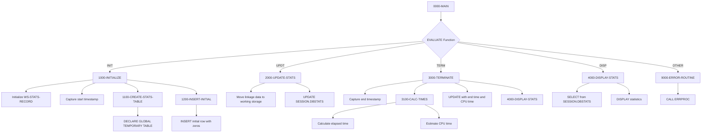

## Overview

DB2STAT is a DB2 statistics collector utility that tracks database operation metrics for batch programs. It monitors row-level operations (reads, inserts, updates, deletes), transaction counts (commits and rollbacks), and calculates CPU and elapsed time for performance analysis.

The program uses a DB2 Global Temporary Table (GTT) to store statistics during program execution. This approach ensures statistics are isolated per session and automatically cleaned up when the connection ends. The temporary table persists across commits within the session, allowing incremental updates throughout processing.

This utility is designed to be called by other programs at key points: initialization (before processing), periodic updates (during processing), and termination (after processing). It integrates with the DB2 infrastructure shared by programs like HISTLD00, DB2CMT, DB2CONN, and DB2ERR.

## Program Structure



## Data Structures

### Linkage Section (Statistics Request)

The program receives statistics data through the linkage section:

| Level | Name | Picture | Description |
|-------|------|---------|-------------|
| 01 | LS-STAT-REQUEST | - | Statistics request parameter block |
| 05 | LS-FUNCTION | X(4) | Function code: INIT, UPDT, TERM, DISP |
| 05 | LS-PROGRAM-ID | X(8) | Program being monitored |
| 10 | LS-ROWS-READ | S9(9) COMP | Rows read count |
| 10 | LS-ROWS-INSRT | S9(9) COMP | Rows inserted count |
| 10 | LS-ROWS-UPDT | S9(9) COMP | Rows updated count |
| 10 | LS-ROWS-DELT | S9(9) COMP | Rows deleted count |
| 10 | LS-COMMITS | S9(9) COMP | Commit count |
| 10 | LS-ROLLBACKS | S9(9) COMP | Rollback count |
| 05 | LS-RETURN-CODE | S9(4) COMP | Return code (0=success, 12=error) |

### Working Storage - Statistics Record

The SQL declare section defines host variables for DB2 operations:

| Level | Name | Picture | Description |
|-------|------|---------|-------------|
| 01 | WS-STATS-RECORD | - | DB2 host variable structure |
| 05 | WS-PROGRAM-ID | X(8) | Program identifier |
| 05 | WS-START-TIME | X(26) | Processing start timestamp |
| 05 | WS-END-TIME | X(26) | Processing end timestamp |
| 05 | WS-ROWS-READ | S9(9) COMP | Total rows read |
| 05 | WS-ROWS-INSERTED | S9(9) COMP | Total rows inserted |
| 05 | WS-ROWS-UPDATED | S9(9) COMP | Total rows updated |
| 05 | WS-ROWS-DELETED | S9(9) COMP | Total rows deleted |
| 05 | WS-COMMITS | S9(9) COMP | Total commits |
| 05 | WS-ROLLBACKS | S9(9) COMP | Total rollbacks |
| 05 | WS-CPU-TIME | S9(9)V99 COMP-3 | Estimated CPU time in seconds |
| 05 | WS-ELAPSED-TIME | S9(9)V99 COMP-3 | Elapsed wall-clock time in seconds |

### Working Storage - Other Fields

| Level | Name | Picture | Description |
|-------|------|---------|-------------|
| 01 | WS-CURRENT-TIMESTAMP | X(26) | Current system timestamp |
| 01 | WS-START-TIMESTAMP | X(26) | Saved start timestamp for elapsed calculation |
| 01 | WS-FORMATTED-TIME | ZZ,ZZ9.99 | Formatted time for display |

## Database Operations

### SESSION.DBSTATS Global Temporary Table

The program creates and uses a session-scoped temporary table:

| Column | Type | Description |
|--------|------|-------------|
| PROGRAM_ID | CHAR(8) | Program identifier (NOT NULL) |
| START_TIME | TIMESTAMP | Processing start time (NOT NULL) |
| END_TIME | TIMESTAMP | Processing end time |
| ROWS_READ | INTEGER | Count of rows read (NOT NULL) |
| ROWS_INSERTED | INTEGER | Count of rows inserted (NOT NULL) |
| ROWS_UPDATED | INTEGER | Count of rows updated (NOT NULL) |
| ROWS_DELETED | INTEGER | Count of rows deleted (NOT NULL) |
| COMMITS | INTEGER | Count of commits (NOT NULL) |
| ROLLBACKS | INTEGER | Count of rollbacks (NOT NULL) |
| CPU_TIME | DECIMAL(11,2) | CPU time in seconds |
| ELAPSED_TIME | DECIMAL(11,2) | Elapsed time in seconds |

### SQL Statements

**Create Temporary Table (1100-CREATE-STATS-TABLE)**:
```sql
DECLARE GLOBAL TEMPORARY TABLE SESSION.DBSTATS
  (PROGRAM_ID      CHAR(8)      NOT NULL,
   START_TIME      TIMESTAMP    NOT NULL,
   END_TIME        TIMESTAMP,
   ROWS_READ       INTEGER      NOT NULL,
   ROWS_INSERTED   INTEGER      NOT NULL,
   ROWS_UPDATED    INTEGER      NOT NULL,
   ROWS_DELETED    INTEGER      NOT NULL,
   COMMITS         INTEGER      NOT NULL,
   ROLLBACKS       INTEGER      NOT NULL,
   CPU_TIME        DECIMAL(11,2),
   ELAPSED_TIME    DECIMAL(11,2))
  ON COMMIT PRESERVE ROWS
```

**Insert Initial Record (1200-INSERT-INITIAL)**:
```sql
INSERT INTO SESSION.DBSTATS
  (PROGRAM_ID, START_TIME, ROWS_READ, ROWS_INSERTED, 
   ROWS_UPDATED, ROWS_DELETED, COMMITS, ROLLBACKS)
VALUES
  (:WS-PROGRAM-ID, CURRENT TIMESTAMP, 0, 0, 0, 0, 0, 0)
```

**Update Statistics (2000-UPDATE-STATS)**:
```sql
UPDATE SESSION.DBSTATS
SET ROWS_READ = :WS-ROWS-READ,
    ROWS_INSERTED = :WS-ROWS-INSERTED,
    ROWS_UPDATED = :WS-ROWS-UPDATED,
    ROWS_DELETED = :WS-ROWS-DELETED,
    COMMITS = :WS-COMMITS,
    ROLLBACKS = :WS-ROLLBACKS
WHERE PROGRAM_ID = :WS-PROGRAM-ID
```

**Finalize Statistics (3000-TERMINATE)**:
```sql
UPDATE SESSION.DBSTATS
SET END_TIME = :WS-END-TIME,
    CPU_TIME = :WS-CPU-TIME,
    ELAPSED_TIME = :WS-ELAPSED-TIME
WHERE PROGRAM_ID = :WS-PROGRAM-ID
```

**Retrieve Statistics (4000-DISPLAY-STATS)**:
```sql
SELECT ROWS_READ, ROWS_INSERTED, ROWS_UPDATED, ROWS_DELETED,
       COMMITS, ROLLBACKS, CPU_TIME, ELAPSED_TIME
INTO :WS-STATS-RECORD
FROM SESSION.DBSTATS
WHERE PROGRAM_ID = :WS-PROGRAM-ID
```

## Control Flow

### Initialize (FUNC-INIT)

**1000-INITIALIZE** sets up statistics tracking:
1. Initializes WS-STATS-RECORD to zeros
2. Captures LS-PROGRAM-ID into WS-PROGRAM-ID
3. Gets current timestamp via `ACCEPT FROM TIME STAMP`
4. Saves start timestamp for elapsed time calculation
5. Calls 1100-CREATE-STATS-TABLE to create the temporary table
6. Calls 1200-INSERT-INITIAL to insert the baseline record

**Note**: SQLCODE -601 (table already exists) is ignored during table creation, allowing the program to be called multiple times in a session.

### Update Statistics (FUNC-UPDT)

**2000-UPDATE-STATS** refreshes current statistics:
1. Moves all linkage statistics fields to working storage
2. Executes UPDATE to refresh SESSION.DBSTATS
3. Sets LS-RETURN-CODE based on SQLCODE

### Terminate (FUNC-TERM)

**3000-TERMINATE** finalizes and reports statistics:
1. Captures end timestamp
2. Calls 3100-CALC-TIMES to calculate timing metrics
3. Updates SESSION.DBSTATS with end time and timing data
4. Automatically calls 4000-DISPLAY-STATS to output results

**3100-CALC-TIMES** calculates timing:
- Computes elapsed time by subtracting start from end timestamp
- Estimates CPU time as 65% of elapsed time (approximation)

### Display Statistics (FUNC-DISP)

**4000-DISPLAY-STATS** outputs formatted statistics:
1. Retrieves statistics from SESSION.DBSTATS
2. Displays formatted output to SYSOUT:

```
DB2 Statistics for PROGNAME
  Records Read:     123456
  Records Inserted: 1000
  Records Updated:  500
  Records Deleted:  50
  Commits:          10
  Rollbacks:        0
  CPU Time:         12.35 seconds
  Elapsed Time:     19.00 seconds
```

## Return Codes

| Code | Meaning |
|------|---------|
| 0 | Operation completed successfully |
| 12 | Error occurred (SQL error or invalid function) |

## Dependencies

### Copybooks

- **SQLCA** - SQL Communication Area for DB2 status
- **DBPROC** - Standard DB2 procedures and error handling
- **ERRHAND** - Standard error handling definitions

### Called Programs

- **ERRPROC** - Error processing and logging routine

### Related Programs

Programs that share the DB2 infrastructure:

- **HISTLD00** - History load (uses same copybooks)
- **DB2CMT** - DB2 commit handler
- **DB2CONN** - DB2 connection manager
- **DB2ERR** - DB2 error handler

## Technical Notes

1. **Global Temporary Tables (GTT)**: The `DECLARE GLOBAL TEMPORARY TABLE` statement creates a session-scoped table in the SESSION schema. The `ON COMMIT PRESERVE ROWS` clause ensures data survives commits, essential for tracking statistics across multiple commit points.

2. **COMP-3 (Packed Decimal)**: The timing fields use `COMP-3` (packed decimal) format, which stores two digits per byte plus a sign nibble. This is efficient for decimal arithmetic and is compatible with DB2 DECIMAL columns.

3. **ACCEPT FROM TIME STAMP**: This IBM extension retrieves a 26-character timestamp in format `YYYY-MM-DD-HH.MM.SS.NNNNNN`. Used for capturing start and end times.

4. **FUNCTION NUMVAL**: The intrinsic function converts a numeric string to a number for arithmetic. Used in 3100-CALC-TIMES to parse timestamps for elapsed time calculation.

5. **CPU Time Estimation**: The program estimates CPU time as 65% of elapsed time. This is an approximation; actual CPU time would require system-level monitoring or DB2 accounting data.

6. **SQLCODE -601**: This code means "table already exists." The program ignores this during table creation, making it safe to call INIT multiple times in a session.

7. **Host Variables**: Fields in the SQL DECLARE SECTION become host variables that can be referenced in SQL statements with a colon prefix (`:WS-PROGRAM-ID`).

8. **Edited Picture (ZZ,ZZ9.99)**: The WS-FORMATTED-TIME field uses an edited picture with zero suppression and comma insertion for readable time display.

## Usage Example

A calling program would typically:

```cobol
* At program start
MOVE 'INIT' TO LS-FUNCTION
MOVE 'MYPROG00' TO LS-PROGRAM-ID
CALL 'DB2STAT' USING LS-STAT-REQUEST

* During processing (periodic update)
MOVE 'UPDT' TO LS-FUNCTION
MOVE WS-READ-COUNT TO LS-ROWS-READ
MOVE WS-INSERT-COUNT TO LS-ROWS-INSRT
MOVE WS-UPDATE-COUNT TO LS-ROWS-UPDT
MOVE WS-DELETE-COUNT TO LS-ROWS-DELT
MOVE WS-COMMIT-COUNT TO LS-COMMITS
MOVE WS-ROLLBACK-COUNT TO LS-ROLLBACKS
CALL 'DB2STAT' USING LS-STAT-REQUEST

* At program end
MOVE 'TERM' TO LS-FUNCTION
CALL 'DB2STAT' USING LS-STAT-REQUEST
```
