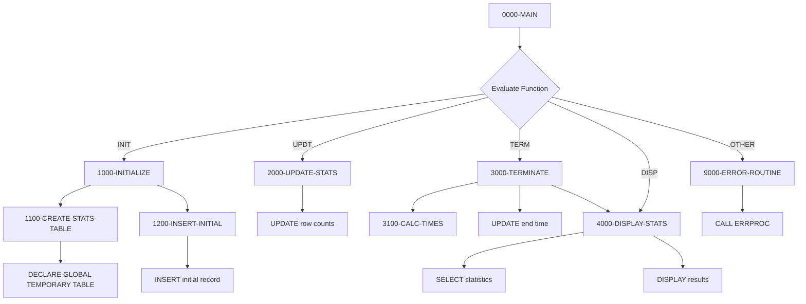

## Overview

DB2STAT is a DB2 statistics collector that provides centralized tracking of database operation metrics for COBOL programs. It captures key performance indicators including row counts for read, insert, update, and delete operations, as well as commit/rollback counts and timing information.

The program uses a DB2 Global Temporary Table (GTT) to store statistics during program execution, ensuring that statistics are isolated per session and automatically cleaned up when the session ends. This design eliminates the need for permanent storage while providing real-time statistics tracking.

DB2STAT is designed to be called as a subprogram at key points during batch or online processing: at initialization to begin tracking, periodically during processing to update counters, and at termination to finalize timing calculations and display results.

## Program Structure



## Data Structures

### Working Storage - SQL Declare Section

| Level | Name | Picture | Description |
|-------|------|---------|-------------|
| 01 | WS-STATS-RECORD | - | Statistics record for DB2 operations |
| 05 | WS-PROGRAM-ID | X(8) | Program being tracked |
| 05 | WS-START-TIME | X(26) | Processing start timestamp |
| 05 | WS-END-TIME | X(26) | Processing end timestamp |
| 05 | WS-ROWS-READ | S9(9) COMP | Count of rows read |
| 05 | WS-ROWS-INSERTED | S9(9) COMP | Count of rows inserted |
| 05 | WS-ROWS-UPDATED | S9(9) COMP | Count of rows updated |
| 05 | WS-ROWS-DELETED | S9(9) COMP | Count of rows deleted |
| 05 | WS-COMMITS | S9(9) COMP | Count of commits |
| 05 | WS-ROLLBACKS | S9(9) COMP | Count of rollbacks |
| 05 | WS-CPU-TIME | S9(9)V99 COMP-3 | CPU time in seconds |
| 05 | WS-ELAPSED-TIME | S9(9)V99 COMP-3 | Elapsed time in seconds |

### Working Storage - Other Fields

| Level | Name | Picture | Description |
|-------|------|---------|-------------|
| 01 | WS-CURRENT-TIMESTAMP | X(26) | Current timestamp holder |
| 01 | WS-START-TIMESTAMP | X(26) | Saved start time for calculations |
| 01 | WS-FORMATTED-TIME | ZZ,ZZ9.99 | Formatted time for display |

### Linkage Section

| Level | Name | Picture | Description |
|-------|------|---------|-------------|
| 01 | LS-STAT-REQUEST | - | Statistics request from caller |
| 05 | LS-FUNCTION | X(4) | Function code |
| 05 | LS-PROGRAM-ID | X(8) | Program identifier |
| 05 | LS-STAT-DATA | - | Statistics data group |
| 10 | LS-ROWS-READ | S9(9) COMP | Rows read count |
| 10 | LS-ROWS-INSRT | S9(9) COMP | Rows inserted count |
| 10 | LS-ROWS-UPDT | S9(9) COMP | Rows updated count |
| 10 | LS-ROWS-DELT | S9(9) COMP | Rows deleted count |
| 10 | LS-COMMITS | S9(9) COMP | Commit count |
| 10 | LS-ROLLBACKS | S9(9) COMP | Rollback count |
| 05 | LS-RETURN-CODE | S9(4) COMP | Return code |

#### LS-FUNCTION Condition Names

| Condition | Value | Description |
|-----------|-------|-------------|
| FUNC-INIT | 'INIT' | Initialize statistics tracking |
| FUNC-UPDT | 'UPDT' | Update statistics counters |
| FUNC-TERM | 'TERM' | Terminate and finalize statistics |
| FUNC-DISP | 'DISP' | Display current statistics |

## Database Operations

### SESSION.DBSTATS Global Temporary Table

The program creates and uses a DB2 Global Temporary Table (GTT) to store statistics.

#### Table Definition

```sql
DECLARE GLOBAL TEMPORARY TABLE SESSION.DBSTATS
    (PROGRAM_ID      CHAR(8)      NOT NULL,
     START_TIME      TIMESTAMP    NOT NULL,
     END_TIME        TIMESTAMP,
     ROWS_READ       INTEGER      NOT NULL,
     ROWS_INSERTED   INTEGER      NOT NULL,
     ROWS_UPDATED    INTEGER      NOT NULL,
     ROWS_DELETED    INTEGER      NOT NULL,
     COMMITS         INTEGER      NOT NULL,
     ROLLBACKS       INTEGER      NOT NULL,
     CPU_TIME        DECIMAL(11,2),
     ELAPSED_TIME    DECIMAL(11,2))
    ON COMMIT PRESERVE ROWS
```

**Key Characteristics:**
- `SESSION.` qualifier indicates a session-scoped temporary table
- `ON COMMIT PRESERVE ROWS` keeps data across commits within the session
- Table is automatically dropped when the DB2 session ends
- Each session gets its own isolated instance

#### SQL Operations

| Operation | Paragraph | Description |
|-----------|-----------|-------------|
| DECLARE GTT | 1100-CREATE-STATS-TABLE | Creates the temporary table |
| INSERT | 1200-INSERT-INITIAL | Inserts initial record with zeros |
| UPDATE | 2000-UPDATE-STATS | Updates row counts |
| UPDATE | 3000-TERMINATE | Updates end time and timing |
| SELECT | 4000-DISPLAY-STATS | Retrieves statistics for display |

## Control Flow

### Main Processing Logic (0000-MAIN)

Dispatches to the appropriate paragraph based on function code:
- INIT → Initialize tracking
- UPDT → Update counters
- TERM → Finalize and display
- DISP → Display only
- Other → Error handling

### Initialize (1000-INITIALIZE)

Sets up statistics tracking for a program:

1. Initializes WS-STATS-RECORD to zeros
2. Captures program ID from linkage
3. Records start timestamp using `ACCEPT ... FROM TIME STAMP`
4. **1100-CREATE-STATS-TABLE**: Creates GTT (ignores SQLCODE -601 if already exists)
5. **1200-INSERT-INITIAL**: Inserts initial record with zero counters

### Update Statistics (2000-UPDATE-STATS)

Updates the running statistics counters:

1. Copies all counter values from linkage to working storage
2. Executes UPDATE to persist current values to GTT
3. Sets return code based on SQL success/failure

### Terminate (3000-TERMINATE)

Finalizes statistics and displays results:

1. Captures end timestamp
2. **3100-CALC-TIMES**: Calculates elapsed and CPU times
3. Updates GTT with final timing information
4. Automatically calls 4000-DISPLAY-STATS to show results

### Calculate Times (3100-CALC-TIMES)

Computes timing metrics:

1. Uses `FUNCTION NUMVAL` to extract numeric portions of timestamps
2. Calculates elapsed time as difference between end and start
3. Estimates CPU time as 65% of elapsed time (simplified approximation)

### Display Statistics (4000-DISPLAY-STATS)

Retrieves and displays formatted statistics:

1. SELECTs current statistics from GTT
2. Displays formatted output including:
   - Program ID
   - Row counts (read, inserted, updated, deleted)
   - Transaction counts (commits, rollbacks)
   - Timing (CPU time, elapsed time in seconds)

#### Sample Output

```
DB2 Statistics for MYPROG01
  Records Read:     000012345
  Records Inserted: 000001234
  Records Updated:  000000567
  Records Deleted:  000000089
  Commits:          000000012
  Rollbacks:        000000000
  CPU Time:            123.45 seconds
  Elapsed Time:        189.92 seconds
```

## Dependencies

### Copybooks

- **SQLCA** - SQL Communication Area (includes standard SQLCA via EXEC SQL INCLUDE)
- **DBPROC** - DB2 standard procedures and error handling structures
- **ERRHAND** - Standard error handling definitions

### Called Programs

- **ERRPROC** - External error processing routine

### Related Programs

Any program requiring DB2 operation statistics tracking can call DB2STAT.

## Usage Example

A typical batch program would integrate DB2STAT as follows:

```cobol
WORKING-STORAGE SECTION.
01  WS-STAT-REQUEST.
    05  WS-FUNCTION         PIC X(4).
    05  WS-PROGRAM-ID       PIC X(8).
    05  WS-STAT-DATA.
        10  WS-ROWS-READ    PIC S9(9) COMP VALUE 0.
        10  WS-ROWS-INSRT   PIC S9(9) COMP VALUE 0.
        10  WS-ROWS-UPDT    PIC S9(9) COMP VALUE 0.
        10  WS-ROWS-DELT    PIC S9(9) COMP VALUE 0.
        10  WS-COMMITS      PIC S9(9) COMP VALUE 0.
        10  WS-ROLLBACKS    PIC S9(9) COMP VALUE 0.
    05  WS-RETURN-CODE      PIC S9(4) COMP.

01  WS-READ-COUNT           PIC S9(9) COMP VALUE 0.
01  WS-INSERT-COUNT         PIC S9(9) COMP VALUE 0.

PROCEDURE DIVISION.
*  Initialize statistics at program start
   MOVE 'INIT' TO WS-FUNCTION
   MOVE 'BATCHPGM' TO WS-PROGRAM-ID
   CALL 'DB2STAT' USING WS-STAT-REQUEST

*  ... perform database processing ...
*  (increment WS-READ-COUNT, WS-INSERT-COUNT as needed)

*  Periodically update statistics (e.g., every 1000 records)
   MOVE 'UPDT' TO WS-FUNCTION
   MOVE WS-READ-COUNT TO WS-ROWS-READ
   MOVE WS-INSERT-COUNT TO WS-ROWS-INSRT
   CALL 'DB2STAT' USING WS-STAT-REQUEST

*  Finalize at program end
   MOVE 'TERM' TO WS-FUNCTION
   CALL 'DB2STAT' USING WS-STAT-REQUEST
   
   GOBACK.
```

## Technical Notes

### Data Types

- **COMP (COMPUTATIONAL)**: Binary integers for efficient counter storage
- **COMP-3 (PACKED-DECIMAL)**: Used for timing values requiring decimal precision (S9(9)V99)
- **X(26)**: Timestamp format compatible with DB2 TIMESTAMP columns

### SQLCODE Handling

| SQLCODE | Meaning | Handling |
|---------|---------|----------|
| 0 | Success | Continue normally |
| -601 | Table already exists | Ignored in 1100 (expected on retry) |
| Other | Error | Routes to 9000-ERROR-ROUTINE |

### Global Temporary Table Benefits

1. **Session isolation**: Each program session has its own statistics
2. **No cleanup required**: DB2 automatically drops the table when session ends
3. **No contention**: No locking issues with other sessions
4. **ON COMMIT PRESERVE ROWS**: Statistics survive commits during processing

### CPU Time Estimation

The program estimates CPU time as 65% of elapsed time. This is a simplified approximation; actual CPU time would require system-level instrumentation or SMF record analysis.

### Timestamp Processing

The `FUNCTION NUMVAL` intrinsic function is used to convert timestamp strings to numeric values for time difference calculations. This extracts the numeric portion for arithmetic operations.

## Error Handling

| Condition | Return Code | Description |
|-----------|-------------|-------------|
| Success | 0 | Operation completed normally |
| Any SQL error | 12 | Database operation failed |
| Invalid function | 12 | Unknown function code |

All errors route through 9000-ERROR-ROUTINE, which:
1. Sets ERR-PROGRAM to 'DB2STAT'
2. Sets return code to 12
3. Calls ERRPROC for centralized error logging
