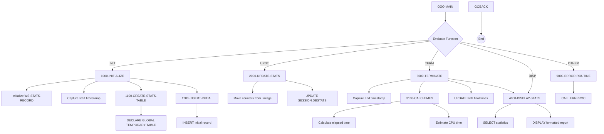

## Overview

DB2STAT is a DB2 statistics collector that provides centralized tracking and reporting of database operation metrics for batch programs. It operates as a callable subprogram that programs can use to monitor their DB2 activity throughout execution.

The program creates a Global Temporary Table to store statistics for the current session, tracking key metrics such as rows read, inserted, updated, and deleted, as well as commit and rollback counts. Upon termination, it calculates CPU and elapsed time and produces a formatted statistics report.

This utility is essential for performance monitoring, capacity planning, and troubleshooting database-intensive batch processes by providing visibility into DB2 resource utilization.

## Program Structure



## Data Structures

### Linkage Section (Input/Output Parameters)

The program receives a statistics request structure through the linkage section:

| Level | Name | Picture | Description |
|-------|------|---------|-------------|
| 01 | LS-STAT-REQUEST | - | Main request structure |
| 05 | LS-FUNCTION | X(4) | Function code: `INIT`, `UPDT`, `TERM`, `DISP` |
| 05 | LS-PROGRAM-ID | X(8) | Program identifier being tracked |
| 05 | LS-STAT-DATA | - | Statistics data area |
| 10 | LS-ROWS-READ | S9(9) COMP | Count of rows read |
| 10 | LS-ROWS-INSRT | S9(9) COMP | Count of rows inserted |
| 10 | LS-ROWS-UPDT | S9(9) COMP | Count of rows updated |
| 10 | LS-ROWS-DELT | S9(9) COMP | Count of rows deleted |
| 10 | LS-COMMITS | S9(9) COMP | Count of commits |
| 10 | LS-ROLLBACKS | S9(9) COMP | Count of rollbacks |
| 05 | LS-RETURN-CODE | S9(4) COMP | Return code from operation |

### Function Codes

| Value | 88-Level Condition | Description |
|-------|-------------------|-------------|
| `INIT` | FUNC-INIT | Initialize statistics collection |
| `UPDT` | FUNC-UPDT | Update statistics counters |
| `TERM` | FUNC-TERM | Terminate and finalize with timing |
| `DISP` | FUNC-DISP | Display statistics report |

### Working Storage - Statistics Record

The WS-STATS-RECORD is defined within a SQL DECLARE SECTION for use in DB2 statements:

| Level | Name | Picture | Description |
|-------|------|---------|-------------|
| 05 | WS-PROGRAM-ID | X(8) | Program identifier |
| 05 | WS-START-TIME | X(26) | Start timestamp |
| 05 | WS-END-TIME | X(26) | End timestamp |
| 05 | WS-ROWS-READ | S9(9) COMP | Rows read counter |
| 05 | WS-ROWS-INSERTED | S9(9) COMP | Rows inserted counter |
| 05 | WS-ROWS-UPDATED | S9(9) COMP | Rows updated counter |
| 05 | WS-ROWS-DELETED | S9(9) COMP | Rows deleted counter |
| 05 | WS-COMMITS | S9(9) COMP | Commits counter |
| 05 | WS-ROLLBACKS | S9(9) COMP | Rollbacks counter |
| 05 | WS-CPU-TIME | S9(9)V99 COMP-3 | CPU time in seconds |
| 05 | WS-ELAPSED-TIME | S9(9)V99 COMP-3 | Elapsed time in seconds |

### Additional Working Storage

| Level | Name | Picture | Description |
|-------|------|---------|-------------|
| 01 | WS-CURRENT-TIMESTAMP | X(26) | Current timestamp holder |
| 01 | WS-START-TIMESTAMP | X(26) | Saved start timestamp for calculation |
| 01 | WS-FORMATTED-TIME | ZZ,ZZ9.99 | Formatted time for display |

## Control Flow

### Main Dispatch (0000-MAIN)

The program uses an `EVALUATE TRUE` statement to route requests based on the function code. After processing, it returns control via `GOBACK`.

### Initialize (1000-INITIALIZE)

Sets up statistics collection for a program:

1. Initializes WS-STATS-RECORD to zeros/spaces
2. Stores the program ID from linkage section
3. Captures the current timestamp as start time
4. Calls **1100-CREATE-STATS-TABLE** to create the temporary table
5. Calls **1200-INSERT-INITIAL** to create the initial statistics record

#### Create Stats Table (1100-CREATE-STATS-TABLE)

Creates a Global Temporary Table for the session:

```sql
DECLARE GLOBAL TEMPORARY TABLE SESSION.DBSTATS
    (PROGRAM_ID      CHAR(8)      NOT NULL,
     START_TIME      TIMESTAMP    NOT NULL,
     END_TIME        TIMESTAMP,
     ROWS_READ       INTEGER      NOT NULL,
     ROWS_INSERTED   INTEGER      NOT NULL,
     ROWS_UPDATED    INTEGER      NOT NULL,
     ROWS_DELETED    INTEGER      NOT NULL,
     COMMITS         INTEGER      NOT NULL,
     ROLLBACKS       INTEGER      NOT NULL,
     CPU_TIME        DECIMAL(11,2),
     ELAPSED_TIME    DECIMAL(11,2))
    ON COMMIT PRESERVE ROWS
```

**Note:** SQLCODE -601 (table already exists) is ignored, allowing multiple programs to share the same session table.

#### Insert Initial (1200-INSERT-INITIAL)

Inserts the initial record with all counters set to zero.

### Update Stats (2000-UPDATE-STATS)

Updates the statistics counters during program execution:

1. Copies counter values from linkage section to working storage
2. Executes UPDATE to set the current values in SESSION.DBSTATS
3. Sets return code based on SQLCODE

### Terminate (3000-TERMINATE)

Finalizes statistics collection:

1. Captures the end timestamp
2. Calls **3100-CALC-TIMES** to calculate timing metrics
3. Updates the record with END_TIME, CPU_TIME, and ELAPSED_TIME
4. Automatically calls **4000-DISPLAY-STATS** to show the report

#### Calculate Times (3100-CALC-TIMES)

Calculates timing metrics:

1. **Elapsed Time**: Computed using `FUNCTION NUMVAL` on timestamp substrings
2. **CPU Time**: Estimated as 65% of elapsed time (a rough approximation)

### Display Stats (4000-DISPLAY-STATS)

Retrieves and displays a formatted statistics report:

1. Executes SELECT to retrieve all statistics
2. Displays formatted output to SYSOUT:

```
DB2 Statistics for PROGRAMX
  Records Read:     nnnnnnnnn
  Records Inserted: nnnnnnnnn
  Records Updated:  nnnnnnnnn
  Records Deleted:  nnnnnnnnn
  Commits:          nnnnnnnnn
  Rollbacks:        nnnnnnnnn
  CPU Time:         nn,nnn.nn seconds
  Elapsed Time:     nn,nnn.nn seconds
```

### Error Handling (9000-ERROR-ROUTINE)

Handles errors by:
1. Setting program name to 'DB2STAT'
2. Setting return code to 12 (severe error)
3. Calling ERRPROC for error logging

## Database Integration

### Global Temporary Table

The program uses `DECLARE GLOBAL TEMPORARY TABLE` to create a session-scoped table:

- **Table Name**: SESSION.DBSTATS
- **Scope**: Current DB2 session only
- **Persistence**: `ON COMMIT PRESERVE ROWS` keeps data across commits
- **Cleanup**: Automatically dropped when the session ends

### SQL Operations

| Operation | Paragraph | Purpose |
|-----------|-----------|---------|
| DECLARE GTT | 1100 | Create session table |
| INSERT | 1200 | Create initial statistics record |
| UPDATE | 2000 | Update counter values |
| UPDATE | 3000 | Set final timestamps and times |
| SELECT | 4000 | Retrieve statistics for display |

### SQLCODE Handling

| SQLCODE | Meaning | Action |
|---------|---------|--------|
| 0 | Success | Continue processing |
| -601 | Table already exists | Ignored (expected on re-initialization) |
| Other | Error | Call error routine |

## Return Codes

| Code | Description |
|------|-------------|
| 0 | Operation completed successfully |
| 12 | Error occurred (severe) |

## Statistics Metrics

| Metric | Description | Updated By |
|--------|-------------|------------|
| ROWS_READ | Number of SELECT operations returning rows | Caller |
| ROWS_INSERTED | Number of INSERT operations | Caller |
| ROWS_UPDATED | Number of UPDATE operations | Caller |
| ROWS_DELETED | Number of DELETE operations | Caller |
| COMMITS | Number of COMMIT operations | Caller |
| ROLLBACKS | Number of ROLLBACK operations | Caller |
| CPU_TIME | Estimated CPU time (65% of elapsed) | DB2STAT |
| ELAPSED_TIME | Wall clock time from INIT to TERM | DB2STAT |

## Dependencies

### Copybooks

- **SQLCA** - SQL Communication Area with standard status codes
- **DBPROC** - DB2 standard procedures and error handling
- **ERRHAND** - Standard error handling definitions

### Called Programs

- **ERRPROC** - Error processing routine for logging

### Related Programs

Programs that share the SQLCA and DBPROC copybooks (DB2 infrastructure):
- HISTLD00 - History load processing
- DB2CMT - DB2 commit handler
- DB2CONN - DB2 connection handler
- DB2ERR - DB2 error handler

## Usage Example

To track statistics for a batch program:

```cobol
* Initialize statistics at program start
MOVE 'INIT'     TO LS-FUNCTION
MOVE 'MYPGM001' TO LS-PROGRAM-ID
CALL 'DB2STAT' USING LS-STAT-REQUEST

* During processing, update counters periodically
MOVE 'UPDT'     TO LS-FUNCTION
MOVE WS-READ-COUNT    TO LS-ROWS-READ
MOVE WS-INSERT-COUNT  TO LS-ROWS-INSRT
MOVE WS-UPDATE-COUNT  TO LS-ROWS-UPDT
MOVE WS-DELETE-COUNT  TO LS-ROWS-DELT
MOVE WS-COMMIT-COUNT  TO LS-COMMITS
MOVE WS-ROLLBACK-COUNT TO LS-ROLLBACKS
CALL 'DB2STAT' USING LS-STAT-REQUEST

* At program end, finalize and display
MOVE 'TERM'     TO LS-FUNCTION
CALL 'DB2STAT' USING LS-STAT-REQUEST
```

To display statistics without terminating:

```cobol
MOVE 'DISP'     TO LS-FUNCTION
CALL 'DB2STAT' USING LS-STAT-REQUEST
```

## Technical Notes

- The program uses **EXEC SQL BEGIN/END DECLARE SECTION** to define host variables for DB2, required for variables used in SQL statements
- **COMP-3** (packed decimal) format is used for time values, providing efficient storage and decimal precision
- **FUNCTION NUMVAL** converts string timestamp portions to numeric values for time calculations
- The CPU time estimate (65% of elapsed) is a rough approximation; actual CPU time would require system-level instrumentation
- **Global Temporary Tables** are ideal for session-scoped data that doesn't need to persist beyond the current connection
- The `ON COMMIT PRESERVE ROWS` clause ensures statistics survive commit operations during the session
- **ACCEPT ... FROM TIME STAMP** retrieves the system timestamp in ISO format (YYYY-MM-DD-HH.MM.SS.FFFFFF)
- Multiple programs can track statistics in the same session by using different PROGRAM_ID values
