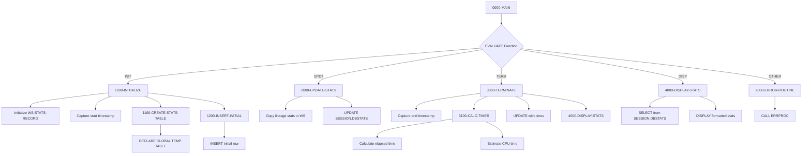
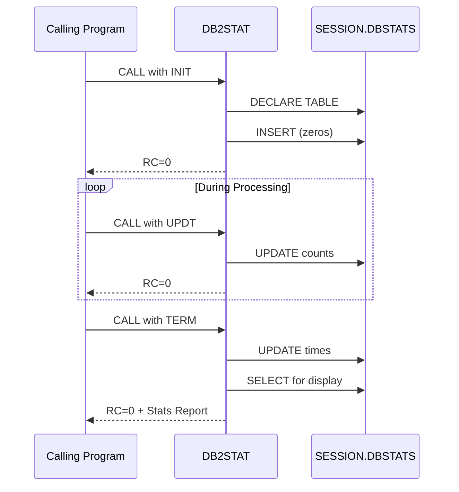

## Overview

DB2STAT is a DB2 Statistics Collector that provides comprehensive tracking of database operations for batch programs. It captures metrics such as rows read, inserted, updated, and deleted, along with commit/rollback counts and timing information.

The program uses a DB2 Global Temporary Table (GTT) to store statistics during program execution. This approach ensures that statistics are session-specific and automatically cleaned up when the session ends, without affecting permanent database objects. The GTT is created with `ON COMMIT PRESERVE ROWS` to maintain data across commits within the session.

DB2STAT is designed to be called as a subprogram at key points during batch processing: initialization at program start, periodic updates during processing, and termination at program end. The terminate function automatically calculates elapsed time and estimates CPU time, then displays a formatted statistics report.

## Program Structure



## Data Structures

### Linkage Section

The program receives statistics requests via the linkage section:

| Level | Name | Picture | Description |
|-------|------|---------|-------------|
| 01 | LS-STAT-REQUEST | | Statistics request structure |
| 05 | LS-FUNCTION | X(4) | Function: `INIT`, `UPDT`, `TERM`, or `DISP` |
| 05 | LS-PROGRAM-ID | X(8) | Program being monitored |
| 10 | LS-ROWS-READ | S9(9) COMP | Count of rows read |
| 10 | LS-ROWS-INSRT | S9(9) COMP | Count of rows inserted |
| 10 | LS-ROWS-UPDT | S9(9) COMP | Count of rows updated |
| 10 | LS-ROWS-DELT | S9(9) COMP | Count of rows deleted |
| 10 | LS-COMMITS | S9(9) COMP | Count of commits |
| 10 | LS-ROLLBACKS | S9(9) COMP | Count of rollbacks |
| 05 | LS-RETURN-CODE | S9(4) COMP | Return code (0=success, 12=error) |

### Function Values

| Value | Condition Name | Description |
|-------|----------------|-------------|
| `INIT` | FUNC-INIT | Initialize statistics tracking |
| `UPDT` | FUNC-UPDT | Update statistics counts |
| `TERM` | FUNC-TERM | Finalize and display statistics |
| `DISP` | FUNC-DISP | Display current statistics |

### Working Storage - Statistics Record

| Level | Name | Picture | Description |
|-------|------|---------|-------------|
| 01 | WS-STATS-RECORD | | SQL host variable structure |
| 05 | WS-PROGRAM-ID | X(8) | Program identifier |
| 05 | WS-START-TIME | X(26) | Processing start timestamp |
| 05 | WS-END-TIME | X(26) | Processing end timestamp |
| 05 | WS-ROWS-READ | S9(9) COMP | Rows read counter |
| 05 | WS-ROWS-INSERTED | S9(9) COMP | Rows inserted counter |
| 05 | WS-ROWS-UPDATED | S9(9) COMP | Rows updated counter |
| 05 | WS-ROWS-DELETED | S9(9) COMP | Rows deleted counter |
| 05 | WS-COMMITS | S9(9) COMP | Commit counter |
| 05 | WS-ROLLBACKS | S9(9) COMP | Rollback counter |
| 05 | WS-CPU-TIME | S9(9)V99 COMP-3 | Estimated CPU time (seconds) |
| 05 | WS-ELAPSED-TIME | S9(9)V99 COMP-3 | Elapsed time (seconds) |

### Working Storage - Other Fields

| Level | Name | Picture | Description |
|-------|------|---------|-------------|
| 01 | WS-CURRENT-TIMESTAMP | X(26) | Current system timestamp |
| 01 | WS-START-TIMESTAMP | X(26) | Saved start timestamp for calculations |
| 01 | WS-FORMATTED-TIME | ZZ,ZZ9.99 | Edited time for display |

## Database Operations

### SESSION.DBSTATS Global Temporary Table

The program creates and uses a session-scoped temporary table:

| Column | Type | Nullable | Description |
|--------|------|----------|-------------|
| PROGRAM_ID | CHAR(8) | NOT NULL | Program identifier |
| START_TIME | TIMESTAMP | NOT NULL | Processing start time |
| END_TIME | TIMESTAMP | YES | Processing end time |
| ROWS_READ | INTEGER | NOT NULL | Count of rows read |
| ROWS_INSERTED | INTEGER | NOT NULL | Count of rows inserted |
| ROWS_UPDATED | INTEGER | NOT NULL | Count of rows updated |
| ROWS_DELETED | INTEGER | NOT NULL | Count of rows deleted |
| COMMITS | INTEGER | NOT NULL | Count of commits |
| ROLLBACKS | INTEGER | NOT NULL | Count of rollbacks |
| CPU_TIME | DECIMAL(11,2) | YES | CPU time in seconds |
| ELAPSED_TIME | DECIMAL(11,2) | YES | Elapsed time in seconds |

### SQL Operations

**1100-CREATE-STATS-TABLE:**
```sql
DECLARE GLOBAL TEMPORARY TABLE SESSION.DBSTATS
  (PROGRAM_ID      CHAR(8)      NOT NULL,
   START_TIME      TIMESTAMP    NOT NULL,
   END_TIME        TIMESTAMP,
   ROWS_READ       INTEGER      NOT NULL,
   ROWS_INSERTED   INTEGER      NOT NULL,
   ROWS_UPDATED    INTEGER      NOT NULL,
   ROWS_DELETED    INTEGER      NOT NULL,
   COMMITS         INTEGER      NOT NULL,
   ROLLBACKS       INTEGER      NOT NULL,
   CPU_TIME        DECIMAL(11,2),
   ELAPSED_TIME    DECIMAL(11,2))
  ON COMMIT PRESERVE ROWS
```

**1200-INSERT-INITIAL:**
```sql
INSERT INTO SESSION.DBSTATS
  (PROGRAM_ID, START_TIME, ROWS_READ, ROWS_INSERTED, 
   ROWS_UPDATED, ROWS_DELETED, COMMITS, ROLLBACKS)
VALUES (:WS-PROGRAM-ID, CURRENT TIMESTAMP, 0, 0, 0, 0, 0, 0)
```

**2000-UPDATE-STATS:**
```sql
UPDATE SESSION.DBSTATS
SET ROWS_READ = :WS-ROWS-READ,
    ROWS_INSERTED = :WS-ROWS-INSERTED,
    ROWS_UPDATED = :WS-ROWS-UPDATED,
    ROWS_DELETED = :WS-ROWS-DELETED,
    COMMITS = :WS-COMMITS,
    ROLLBACKS = :WS-ROLLBACKS
WHERE PROGRAM_ID = :WS-PROGRAM-ID
```

**3000-TERMINATE:**
```sql
UPDATE SESSION.DBSTATS
SET END_TIME = :WS-END-TIME,
    CPU_TIME = :WS-CPU-TIME,
    ELAPSED_TIME = :WS-ELAPSED-TIME
WHERE PROGRAM_ID = :WS-PROGRAM-ID
```

**4000-DISPLAY-STATS:**
```sql
SELECT ROWS_READ, ROWS_INSERTED, ROWS_UPDATED, ROWS_DELETED,
       COMMITS, ROLLBACKS, CPU_TIME, ELAPSED_TIME
INTO :WS-STATS-RECORD
FROM SESSION.DBSTATS
WHERE PROGRAM_ID = :WS-PROGRAM-ID
```

## Control Flow

### Function: INIT (Initialize)

**1000-INITIALIZE:**
1. Initializes WS-STATS-RECORD to zeros/spaces
2. Copies LS-PROGRAM-ID to WS-PROGRAM-ID
3. Captures current timestamp as start time
4. Calls 1100-CREATE-STATS-TABLE to declare the GTT
5. Calls 1200-INSERT-INITIAL to create the initial statistics row

**Note:** SQLCODE -601 (table already exists) is ignored in 1100-CREATE-STATS-TABLE, allowing the program to be called multiple times in a session.

### Function: UPDT (Update Statistics)

**2000-UPDATE-STATS:**
1. Copies all statistics from linkage section to working storage
2. Updates the SESSION.DBSTATS row with current counts
3. Sets LS-RETURN-CODE to 0 on success

### Function: TERM (Terminate)

**3000-TERMINATE:**
1. Captures current timestamp as end time
2. Calls 3100-CALC-TIMES to calculate timing metrics
3. Updates SESSION.DBSTATS with end time and calculated times
4. Automatically calls 4000-DISPLAY-STATS to show final report

**3100-CALC-TIMES:**
- Calculates elapsed time by subtracting start from end timestamp
- Estimates CPU time as 65% of elapsed time (using factor 0.65)

### Function: DISP (Display Statistics)

**4000-DISPLAY-STATS:**
1. Retrieves statistics from SESSION.DBSTATS
2. Displays formatted report to SYSOUT:

```
DB2 Statistics for PROGNAME
  Records Read:     nnnnnnnnn
  Records Inserted: nnnnnnnnn
  Records Updated:  nnnnnnnnn
  Records Deleted:  nnnnnnnnn
  Commits:          nnnnnnnnn
  Rollbacks:        nnnnnnnnn
  CPU Time:         ZZ,ZZ9.99 seconds
  Elapsed Time:     ZZ,ZZ9.99 seconds
```

### Error Handling

**9000-ERROR-ROUTINE:**
- Sets ERR-PROGRAM to 'DB2STAT'
- Sets LS-RETURN-CODE to 12
- Calls ERRPROC for centralized error logging

## Statistics Flow



## Dependencies

### Copybooks

- **SQLCA** - SQL Communication Area with standard status codes
- **DBPROC** - DB2 standard procedures including error handling routines
- **ERRHAND** - Standard error handling definitions

### Called Programs

- **ERRPROC** - Error processing routine for centralized error logging

### Related Programs

Programs that share DB2-related copybooks:

| Program | Shared Copybooks | Description |
|---------|-----------------|-------------|
| DB2CONN | SQLCA, DBPROC, ERRHAND | DB2 connection management |
| DB2CMT | SQLCA, DBPROC, ERRHAND | DB2 commit processing |
| DB2ERR | SQLCA, DBPROC, ERRHAND | DB2 error handling |
| HISTLD00 | SQLCA, DBPROC, ERRHAND | History data loading |

## Usage Example

```cobol
WORKING-STORAGE SECTION.
01  WS-STAT-REQUEST.
    05  WS-FUNCTION         PIC X(4).
    05  WS-PROGRAM-ID       PIC X(8).
    05  WS-STAT-DATA.
        10  WS-ROWS-READ    PIC S9(9) COMP.
        10  WS-ROWS-INSRT   PIC S9(9) COMP.
        10  WS-ROWS-UPDT    PIC S9(9) COMP.
        10  WS-ROWS-DELT    PIC S9(9) COMP.
        10  WS-COMMITS      PIC S9(9) COMP.
        10  WS-ROLLBACKS    PIC S9(9) COMP.
    05  WS-RETURN-CODE      PIC S9(4) COMP.

PROCEDURE DIVISION.
* Initialize statistics at program start
    MOVE 'INIT' TO WS-FUNCTION
    MOVE 'MYPROG01' TO WS-PROGRAM-ID
    CALL 'DB2STAT' USING WS-STAT-REQUEST

* ... perform database operations ...

* Update statistics periodically
    MOVE 'UPDT' TO WS-FUNCTION
    MOVE 1000 TO WS-ROWS-READ
    MOVE 500 TO WS-ROWS-INSRT
    MOVE 0 TO WS-ROWS-UPDT
    MOVE 0 TO WS-ROWS-DELT
    MOVE 10 TO WS-COMMITS
    MOVE 0 TO WS-ROLLBACKS
    CALL 'DB2STAT' USING WS-STAT-REQUEST

* Terminate and display final statistics
    MOVE 'TERM' TO WS-FUNCTION
    CALL 'DB2STAT' USING WS-STAT-REQUEST
```

## Technical Notes

1. **Global Temporary Table**: The SESSION.DBSTATS table is session-scoped and automatically dropped when the DB2 connection ends. The `ON COMMIT PRESERVE ROWS` clause ensures statistics survive commit operations.

2. **SQLCODE -601 Handling**: The program tolerates SQLCODE -601 (object already exists) when creating the GTT, allowing reinitialization within the same session.

3. **CPU Time Estimation**: CPU time is estimated as 65% of elapsed time. This is an approximation; actual CPU time would require system-specific instrumentation.

4. **COMP-3 Fields**: CPU and elapsed time use `S9(9)V99 COMP-3` (packed decimal) format, providing 2 decimal places for sub-second precision.

5. **Timestamp Format**: The program uses the COBOL `ACCEPT FROM TIME STAMP` statement to capture timestamps in a 26-character format suitable for DB2 TIMESTAMP columns.

6. **Host Variables**: The WS-STATS-RECORD structure is declared within `EXEC SQL BEGIN/END DECLARE SECTION` to enable use as DB2 host variables.
