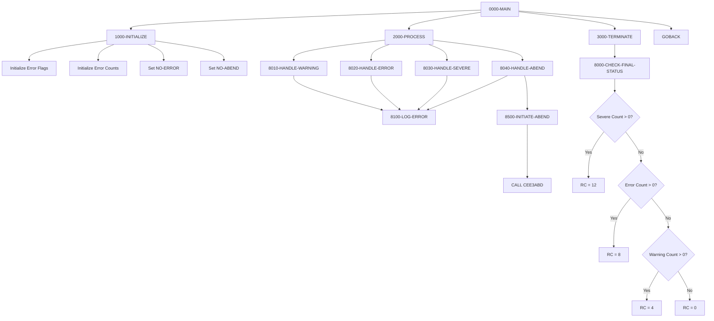

:::info Template Program
This is a **template program** designed to demonstrate standard error handling patterns. It is not intended to be executed directly but rather to be used as a reference when implementing error handling in new COBOL programs. Copy and adapt the relevant paragraphs to your specific needs.
:::

## Overview

ERRHANDL is a template program that provides standardized error handling patterns for COBOL batch programs. It demonstrates best practices for handling different severity levels of errors: warnings, errors, severe errors, and unrecoverable conditions requiring abnormal termination (abend).

The template establishes a consistent approach to error management that includes:
- Standard return code constants aligned with mainframe conventions (0, 4, 8, 12, 16)
- Error counting and tracking by severity level
- A structured error message format for logging
- Hierarchical final return code determination based on highest severity encountered
- Controlled abend initiation for unrecoverable situations

By using this template as a starting point, developers ensure consistent error handling behavior across the application portfolio.

## Program Structure



## Data Structures

### Return Code Constants

| Level | Name | Picture | Value | Description |
|-------|------|---------|-------|-------------|
| 01 | WS-RETURN-CODES | - | - | Standard return code values |
| 05 | RC-SUCCESS | S9(4) COMP | +0 | Successful completion |
| 05 | RC-WARNING | S9(4) COMP | +4 | Warning condition |
| 05 | RC-ERROR | S9(4) COMP | +8 | Error condition |
| 05 | RC-SEVERE | S9(4) COMP | +12 | Severe error |
| 05 | RC-CRITICAL | S9(4) COMP | +16 | Critical/abend condition |

### Error Message Structure

| Level | Name | Picture | Value | Description |
|-------|------|---------|-------|-------------|
| 01 | WS-ERROR-MSG | - | - | Formatted error message |
| 05 | WS-ERROR-PREFIX | X(8) | 'ERH' | Program/module prefix |
| 05 | WS-ERROR-NUMBER | 9(4) | ZEROS | Error number |
| 05 | FILLER | X | '-' | Separator |
| 05 | WS-ERROR-TEXT | X(50) | SPACES | Error description |
| 05 | FILLER | X | SPACES | Separator |
| 05 | WS-ERROR-SEVERITY | X(8) | SPACES | Severity level text |

### Error Tracking Flags

| Level | Name | Picture | Description |
|-------|------|---------|-------------|
| 01 | WS-ERROR-FLAGS | - | Error state flags |
| 05 | WS-PROCESSING-ERROR | X | Error occurred indicator |
| - | NO-ERROR | 88 ('N') | No error has occurred |
| - | ERROR-OCCURRED | 88 ('Y') | An error has occurred |
| 05 | WS-ABEND-FLAG | X | Abend required indicator |
| - | PERFORM-ABEND | 88 ('Y') | Abend should be initiated |
| - | NO-ABEND | 88 ('N') | Normal termination |

### Error Counts

| Level | Name | Picture | Value | Description |
|-------|------|---------|-------|-------------|
| 01 | WS-ERROR-COUNTS | - | - | Error counters by severity |
| 05 | WS-WARNING-COUNT | S9(4) COMP | ZEROS | Count of warnings |
| 05 | WS-ERROR-COUNT | S9(4) COMP | ZEROS | Count of errors |
| 05 | WS-SEVERE-COUNT | S9(4) COMP | ZEROS | Count of severe errors |

### Predefined Error Messages

| Level | Name | Message Text |
|-------|------|--------------|
| 05 | ERR-001 | 'INVALID INPUT PARAMETER RECEIVED' |
| 05 | ERR-002 | 'REQUIRED FIELD IS MISSING' |
| 05 | ERR-003 | 'FILE OPERATION FAILED' |

## Control Flow

### 0000-MAIN - Main Entry Point

Orchestrates the standard program flow:
1. Calls 1000-INITIALIZE for setup
2. Calls 2000-PROCESS for main processing (demonstrates error handling)
3. Calls 3000-TERMINATE for cleanup and final return code
4. Returns via GOBACK

### 1000-INITIALIZE - Initialization

Prepares error handling structures:
1. Initializes WS-ERROR-FLAGS and WS-ERROR-COUNTS to default values
2. Sets NO-ERROR to TRUE (no errors yet)
3. Sets NO-ABEND to TRUE (normal termination expected)

### 2000-PROCESS - Processing Examples

Demonstrates all four error handling patterns:
1. Calls 8010-HANDLE-WARNING (warning example)
2. Calls 8020-HANDLE-ERROR (error example)
3. Calls 8030-HANDLE-SEVERE (severe error example)
4. Calls 8040-HANDLE-ABEND (abend example)

:::note Template Usage
In actual programs, these PERFORM statements would be conditionally executed based on the processing logic, not called sequentially as shown here.
:::

### 3000-TERMINATE - Termination

Finalizes program execution:
1. Calls 8000-CHECK-FINAL-STATUS to set the appropriate return code

## Error Handling Patterns

### 8000-CHECK-FINAL-STATUS - Return Code Determination

Determines the final return code based on the highest severity encountered:

```
IF WS-SEVERE-COUNT > ZERO
    MOVE RC-SEVERE TO RETURN-CODE      (12)
ELSE IF WS-ERROR-COUNT > ZERO
    MOVE RC-ERROR TO RETURN-CODE       (8)
ELSE IF WS-WARNING-COUNT > ZERO
    MOVE RC-WARNING TO RETURN-CODE     (4)
ELSE
    MOVE RC-SUCCESS TO RETURN-CODE     (0)
```

This hierarchical approach ensures the return code reflects the worst condition encountered during processing.

### 8010-HANDLE-WARNING - Warning Pattern

Handles recoverable warning conditions:
1. Increments WS-WARNING-COUNT
2. Sets WS-ERROR-SEVERITY to 'WARNING'
3. Sets error number and message
4. Calls 8100-LOG-ERROR to record the warning
5. **Processing continues** after a warning

**When to use**: Data quality issues that don't prevent processing, optional fields missing, minor validation failures.

### 8020-HANDLE-ERROR - Error Pattern

Handles significant errors:
1. Increments WS-ERROR-COUNT
2. Sets ERROR-OCCURRED flag to TRUE
3. Sets WS-ERROR-SEVERITY to 'ERROR'
4. Sets error number and message
5. Calls 8100-LOG-ERROR to record the error
6. **Processing may continue** but final RC will be non-zero

**When to use**: Business rule violations, data validation failures, expected exceptions.

### 8030-HANDLE-SEVERE - Severe Error Pattern

Handles critical errors:
1. Increments WS-SEVERE-COUNT
2. Sets ERROR-OCCURRED flag to TRUE
3. Sets WS-ERROR-SEVERITY to 'SEVERE'
4. Sets error number and message
5. Calls 8100-LOG-ERROR to record the error
6. **Consider stopping processing** when severe errors occur

**When to use**: File access failures, database errors, system resource issues.

### 8040-HANDLE-ABEND - Abend Pattern

Handles unrecoverable conditions requiring abnormal termination:
1. Sets PERFORM-ABEND flag to TRUE
2. Sets WS-ERROR-SEVERITY to 'CRITICAL'
3. Sets error number (999) and message
4. Calls 8100-LOG-ERROR to record the condition
5. Calls 8500-INITIATE-ABEND to terminate the program

**When to use**: Data corruption detected, security violations, unrecoverable system errors.

### 8100-LOG-ERROR - Error Logging

Common logging routine used by all handlers:
```cobol
DISPLAY WS-ERROR-PREFIX '-' WS-ERROR-NUMBER ': '
        WS-ERROR-SEVERITY
DISPLAY WS-ERROR-TEXT
```

Produces output like:
```
ERH-0001: WARNING
INVALID INPUT PARAMETER RECEIVED
```

### 8500-INITIATE-ABEND - Controlled Abend

Initiates a controlled abnormal termination:
1. Displays 'ABNORMAL TERMINATION INITIATED'
2. Calls LE routine `CEE3ABD` with RC-CRITICAL (16) and option 3

The `CEE3ABD` call terminates the program with:
- Return code 16
- Option 3: Produces a dump for debugging

## Dependencies

### Copybooks

This template program does not use external copybooks. All data structures are defined inline to serve as copy-ready examples.

### Called Programs

| Program | Purpose |
|---------|---------|
| CEE3ABD | Language Environment abend routine |

### Related Programs

Programs that could benefit from these error handling patterns:
- All batch programs in the portfolio system
- Utility programs
- Report generators
- Data validation programs

## Return Codes

| Code | Constant | Meaning |
|------|----------|---------|
| 0 | RC-SUCCESS | No errors or warnings |
| 4 | RC-WARNING | Warnings occurred but processing completed |
| 8 | RC-ERROR | Errors occurred |
| 12 | RC-SEVERE | Severe errors occurred |
| 16 | RC-CRITICAL | Critical error, abnormal termination |

## Usage Guidelines

### Adapting for New Programs

1. **Copy Return Code Constants**: Use the WS-RETURN-CODES structure in all programs
2. **Copy Error Message Structure**: Adapt WS-ERROR-MSG with your program's prefix
3. **Copy Error Tracking**: Use WS-ERROR-FLAGS and WS-ERROR-COUNTS
4. **Add Program-Specific Messages**: Extend ERROR-MESSAGES with your error texts
5. **Implement Handlers**: Copy the 8xxx paragraphs and customize as needed
6. **Use CHECK-FINAL-STATUS**: Always call 8000-CHECK-FINAL-STATUS before GOBACK

### Best Practices

1. **Always log errors** before taking action
2. **Count errors by severity** for metrics and final return code
3. **Use meaningful error numbers** for troubleshooting
4. **Include context** in error messages (file names, record keys, etc.)
5. **Only abend for truly unrecoverable conditions**
6. **Test all error paths** during development

### Example: Integrating with File Processing

```cobol
READ INPUT-FILE
    AT END
        SET END-OF-FILE TO TRUE
    NOT AT END
        PERFORM VALIDATE-RECORD
        IF VALIDATION-ERROR
            PERFORM 8020-HANDLE-ERROR
        END-IF
END-READ
```

### Example: Integrating with DB2

```cobol
EXEC SQL
    SELECT ...
END-EXEC

EVALUATE SQLCODE
    WHEN 0
        CONTINUE
    WHEN 100
        PERFORM 8010-HANDLE-WARNING
    WHEN -803
        PERFORM 8020-HANDLE-ERROR
    WHEN OTHER
        IF SQLCODE < -900
            PERFORM 8040-HANDLE-ABEND
        ELSE
            PERFORM 8030-HANDLE-SEVERE
        END-IF
END-EVALUATE
```

## Technical Notes

- **COMP (Binary)**: Return code constants use COMP for efficient comparison and assignment to RETURN-CODE
- **88-Level Conditions**: Provides readable flag testing with SET verb
- **CEE3ABD**: IBM Language Environment routine for controlled abend; option 3 produces a formatted dump
- **Hierarchical RC Logic**: Ensures the highest severity determines the final return code
- **DISPLAY for Logging**: Uses DISPLAY for simplicity; production programs should use a logging utility or write to a log file
- **Error Number Convention**: Use ranges (e.g., 1-99 warnings, 100-199 errors, 200+ severe) for easy classification

## Template Customization Checklist

- [ ] Change WS-ERROR-PREFIX to your program ID
- [ ] Define program-specific error messages
- [ ] Adjust error number ranges for your needs
- [ ] Replace DISPLAY with your logging mechanism
- [ ] Add additional context fields to WS-ERROR-MSG if needed
- [ ] Consider adding timestamps to error messages
- [ ] Integrate with enterprise logging/monitoring systems
