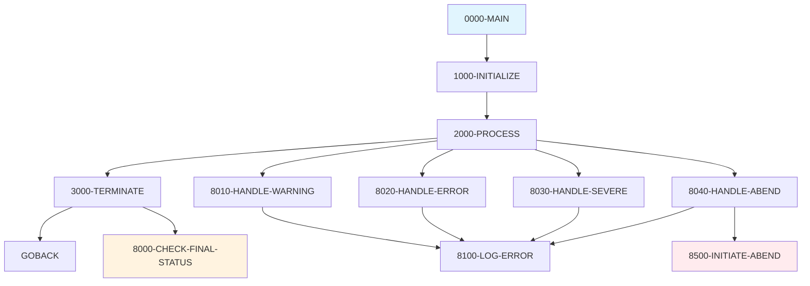
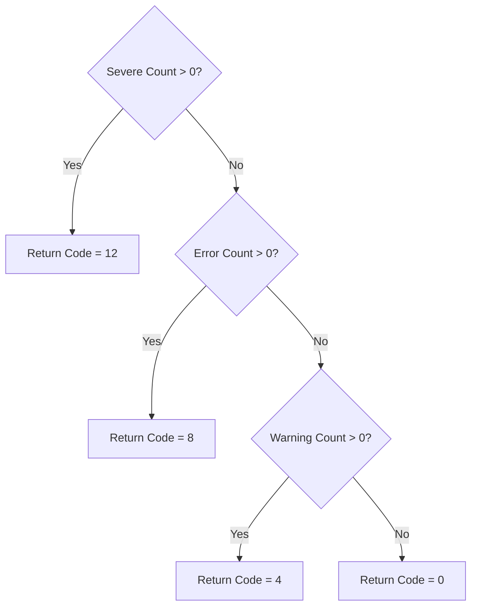

# ERRHANDL - Error Handling Template

## Overview

**ERRHANDL** is a template program located in `src/templates/error/` that demonstrates standard error handling patterns for COBOL batch programs. It provides examples of handling warnings, errors, severe errors, and abend conditions with proper logging and return code management.

:::info Template Program
This is a **template program** intended as a reference implementation. Copy and customize this code when creating new programs that require error handling.
:::

## Program Structure



## Data Structures

### Return Codes

| Field | Picture | Value | Description |
|-------|---------|-------|-------------|
| RC-SUCCESS | S9(4) COMP | 0 | Successful completion |
| RC-WARNING | S9(4) COMP | 4 | Warning(s) occurred |
| RC-ERROR | S9(4) COMP | 8 | Error(s) occurred |
| RC-SEVERE | S9(4) COMP | 12 | Severe error(s) occurred |
| RC-CRITICAL | S9(4) COMP | 16 | Critical/abend condition |

### Error Message Structure

| Field | Picture | Description |
|-------|---------|-------------|
| WS-ERROR-PREFIX | X(8) | Error prefix (default: `'ERH'`) |
| WS-ERROR-NUMBER | 9(4) | Error number |
| WS-ERROR-TEXT | X(50) | Error description |
| WS-ERROR-SEVERITY | X(8) | Severity level text |

### Error Tracking Flags

| Field | Picture | 88-Level Conditions |
|-------|---------|---------------------|
| WS-PROCESSING-ERROR | X | NO-ERROR (`'N'`), ERROR-OCCURRED (`'Y'`) |
| WS-ABEND-FLAG | X | NO-ABEND (`'N'`), PERFORM-ABEND (`'Y'`) |

### Error Counts

| Field | Picture | Description |
|-------|---------|-------------|
| WS-WARNING-COUNT | S9(4) COMP | Number of warnings |
| WS-ERROR-COUNT | S9(4) COMP | Number of errors |
| WS-SEVERE-COUNT | S9(4) COMP | Number of severe errors |

### Predefined Error Messages

| Constant | Message |
|----------|---------|
| ERR-001 | `'INVALID INPUT PARAMETER RECEIVED'` |
| ERR-002 | `'REQUIRED FIELD IS MISSING'` |
| ERR-003 | `'FILE OPERATION FAILED'` |

## Control Flow

### Error Handling Patterns

#### 1. Warning Pattern (`8010-HANDLE-WARNING`)
```cobol
       8010-HANDLE-WARNING.
           ADD 1 TO WS-WARNING-COUNT
           MOVE 'WARNING' TO WS-ERROR-SEVERITY
           MOVE 1 TO WS-ERROR-NUMBER
           MOVE ERR-001 TO WS-ERROR-TEXT
           PERFORM 8100-LOG-ERROR
           .
```
- Increments warning count
- Logs the warning
- Processing **continues**

#### 2. Error Pattern (`8020-HANDLE-ERROR`)
```cobol
       8020-HANDLE-ERROR.
           ADD 1 TO WS-ERROR-COUNT
           SET ERROR-OCCURRED TO TRUE
           MOVE 'ERROR' TO WS-ERROR-SEVERITY
           MOVE 2 TO WS-ERROR-NUMBER
           MOVE ERR-002 TO WS-ERROR-TEXT
           PERFORM 8100-LOG-ERROR
           .
```
- Increments error count
- Sets error flag
- Logs the error
- Processing **continues** (caller decides whether to stop)

#### 3. Severe Error Pattern (`8030-HANDLE-SEVERE`)
```cobol
       8030-HANDLE-SEVERE.
           ADD 1 TO WS-SEVERE-COUNT
           SET ERROR-OCCURRED TO TRUE
           MOVE 'SEVERE' TO WS-ERROR-SEVERITY
           MOVE 3 TO WS-ERROR-NUMBER
           MOVE ERR-003 TO WS-ERROR-TEXT
           PERFORM 8100-LOG-ERROR
           .
```
- Increments severe count
- Sets error flag
- Logs the error
- Processing typically **stops**

#### 4. Abend Pattern (`8040-HANDLE-ABEND`)
```cobol
       8040-HANDLE-ABEND.
           SET PERFORM-ABEND TO TRUE
           MOVE 'CRITICAL' TO WS-ERROR-SEVERITY
           MOVE 999 TO WS-ERROR-NUMBER
           MOVE 'UNRECOVERABLE ERROR - INITIATING ABEND' 
             TO WS-ERROR-TEXT
           PERFORM 8100-LOG-ERROR
           PERFORM 8500-INITIATE-ABEND
           .
```
- Sets abend flag
- Logs the critical error
- Calls `CEE3ABD` to initiate controlled abend

### Final Status Determination (`8000-CHECK-FINAL-STATUS`)



## Usage Examples

### Basic Error Handling

```cobol
       WORKING-STORAGE SECTION.
      * Copy the return codes and structures from ERRHANDL
       COPY ERRHANDL-WS.  *> Or copy the fields directly
       
       PROCEDURE DIVISION.
       PROCESS-RECORD.
           IF WS-INPUT-FIELD = SPACES
               MOVE 'REQUIRED FIELD IS MISSING' TO WS-ERROR-TEXT
               PERFORM 8020-HANDLE-ERROR
               GO TO PROCESS-RECORD-EXIT
           END-IF
           ...
       PROCESS-RECORD-EXIT.
           EXIT.
```

### Customizing Error Messages

```cobol
      * Add your own error messages
       01  MY-ERROR-MESSAGES.
           05  ERR-100.
               10  FILLER    PIC X(50) VALUE
                   'CUSTOMER NOT FOUND IN DATABASE'.
           05  ERR-101.
               10  FILLER    PIC X(50) VALUE
                   'INVALID ACCOUNT STATUS'.
                   
      * Use in error handling
           MOVE ERR-100 TO WS-ERROR-TEXT
           MOVE 100 TO WS-ERROR-NUMBER
           PERFORM 8020-HANDLE-ERROR.
```

### Checking for Errors Before Continuing

```cobol
       PROCESS-ALL-RECORDS.
           PERFORM UNTIL END-OF-FILE
               PERFORM PROCESS-ONE-RECORD
               IF ERROR-OCCURRED
                   IF WS-ERROR-COUNT > 100
                       DISPLAY 'TOO MANY ERRORS - STOPPING'
                       PERFORM 3000-TERMINATE
                       GO TO PROCESS-ALL-RECORDS-EXIT
                   END-IF
               END-IF
           END-PERFORM.
       PROCESS-ALL-RECORDS-EXIT.
           EXIT.
```

## Technical Notes

### CEE3ABD Abend Routine
The program uses `CEE3ABD` to initiate a controlled abend:
```cobol
       CALL 'CEE3ABD' USING RC-CRITICAL, 3
```
- First parameter: Abend code (user code)
- Second parameter: Options (3 = produce dump)

### Return Code Hierarchy
The highest severity error determines the final return code:
1. Severe (12) takes precedence over Error (8)
2. Error (8) takes precedence over Warning (4)
3. Warning (4) takes precedence over Success (0)

### Best Practices
1. Always initialize error flags in `1000-INITIALIZE`
2. Use consistent error number ranges (1-99 for warnings, 100-199 for errors, etc.)
3. Always check `8000-CHECK-FINAL-STATUS` before program termination
4. Consider adding timestamp to error messages for debugging

## Dependencies

This is a standalone template with no copybook dependencies.

## Related Components

- [ERRPROC](/docs/programs/ERRPROC) - Production error processor
- [ERRHAND](/docs/copybooks/ERRHAND) - Error handling copybook for batch programs
- [ERRHNDL](/docs/programs/ERRHNDL) - Online (CICS) error handler
