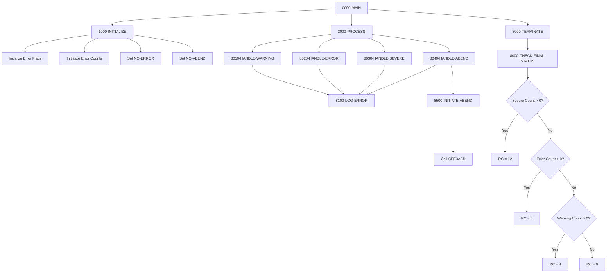

## Overview

ERRHANDL is a template program that demonstrates standard error handling patterns for COBOL applications. It provides a reference implementation showing how to:

- **Handle Warnings** - Log non-critical issues that allow processing to continue
- **Handle Errors** - Process recoverable errors while tracking their occurrence
- **Handle Severe Errors** - Manage serious errors that may require special handling
- **Handle Abends** - Initiate controlled abnormal termination for unrecoverable conditions

This template serves as a foundation that developers can copy and adapt when implementing error handling in their programs. It establishes consistent patterns for error classification, tracking, logging, and return code management.

## Program Structure



## Data Structures

### Return Code Constants

| Field | Picture | Value | Description |
|-------|---------|-------|-------------|
| RC-SUCCESS | S9(4) COMP | +0 | Successful completion |
| RC-WARNING | S9(4) COMP | +4 | Completed with warnings |
| RC-ERROR | S9(4) COMP | +8 | Errors occurred |
| RC-SEVERE | S9(4) COMP | +12 | Severe errors occurred |
| RC-CRITICAL | S9(4) COMP | +16 | Critical failure - abend |

### Error Message Structure

| Field | Picture | Initial Value | Description |
|-------|---------|---------------|-------------|
| WS-ERROR-PREFIX | X(8) | 'ERH' | Error message prefix |
| WS-ERROR-NUMBER | 9(4) | ZEROS | Numeric error code |
| WS-ERROR-TEXT | X(50) | SPACES | Error description text |
| WS-ERROR-SEVERITY | X(8) | SPACES | Severity level text |

### Error Tracking Flags

| Field | Picture | Level-88 Values | Description |
|-------|---------|-----------------|-------------|
| WS-PROCESSING-ERROR | X | NO-ERROR='N', ERROR-OCCURRED='Y' | Error state flag |
| WS-ABEND-FLAG | X | NO-ABEND='N', PERFORM-ABEND='Y' | Abend pending flag |

### Error Counts

| Field | Picture | Initial | Description |
|-------|---------|---------|-------------|
| WS-WARNING-COUNT | S9(4) COMP | ZEROS | Count of warnings |
| WS-ERROR-COUNT | S9(4) COMP | ZEROS | Count of errors |
| WS-SEVERE-COUNT | S9(4) COMP | ZEROS | Count of severe errors |

### Predefined Error Messages

| Constant | Message Text |
|----------|--------------|
| ERR-001 | 'INVALID INPUT PARAMETER RECEIVED' |
| ERR-002 | 'REQUIRED FIELD IS MISSING' |
| ERR-003 | 'FILE OPERATION FAILED' |

## Control Flow

### 0000-MAIN - Main Control

Standard three-phase program structure:
1. PERFORM 1000-INITIALIZE - Setup error tracking
2. PERFORM 2000-PROCESS - Execute with error handling
3. PERFORM 3000-TERMINATE - Set final return code
4. GOBACK - Return to caller

### 1000-INITIALIZE - Setup

Prepares the error handling environment:
1. Initializes WS-ERROR-FLAGS and WS-ERROR-COUNTS
2. Sets NO-ERROR to TRUE (no error state)
3. Sets NO-ABEND to TRUE (no abend pending)

### 2000-PROCESS - Processing Examples

Demonstrates the four error handling patterns:
1. Calls 8010-HANDLE-WARNING (warning example)
2. Calls 8020-HANDLE-ERROR (error example)
3. Calls 8030-HANDLE-SEVERE (severe error example)
4. Calls 8040-HANDLE-ABEND (abend example)

*Note: In actual programs, these would be called conditionally based on error conditions, not sequentially.*

### 3000-TERMINATE - Final Status

Calls 8000-CHECK-FINAL-STATUS to determine and set the program return code.

## Error Handling Routines

### 8000-CHECK-FINAL-STATUS - Return Code Determination

Evaluates error counts to set the appropriate return code using a priority hierarchy:

| Priority | Condition | Return Code | Value |
|----------|-----------|-------------|-------|
| 1 (Highest) | WS-SEVERE-COUNT > 0 | RC-SEVERE | 12 |
| 2 | WS-ERROR-COUNT > 0 | RC-ERROR | 8 |
| 3 | WS-WARNING-COUNT > 0 | RC-WARNING | 4 |
| 4 (Lowest) | No errors | RC-SUCCESS | 0 |

### 8010-HANDLE-WARNING - Warning Pattern

For non-critical issues that don't prevent processing:

```cobol
ADD 1 TO WS-WARNING-COUNT
MOVE 'WARNING' TO WS-ERROR-SEVERITY
MOVE 1 TO WS-ERROR-NUMBER
MOVE ERR-001 TO WS-ERROR-TEXT
PERFORM 8100-LOG-ERROR
```

**Characteristics:**
- Increments warning count
- Does NOT set ERROR-OCCURRED flag
- Logs the warning
- Processing continues normally

### 8020-HANDLE-ERROR - Error Pattern

For recoverable errors that affect processing quality:

```cobol
ADD 1 TO WS-ERROR-COUNT
SET ERROR-OCCURRED TO TRUE
MOVE 'ERROR' TO WS-ERROR-SEVERITY
MOVE 2 TO WS-ERROR-NUMBER
MOVE ERR-002 TO WS-ERROR-TEXT
PERFORM 8100-LOG-ERROR
```

**Characteristics:**
- Increments error count
- Sets ERROR-OCCURRED flag
- Logs the error
- Processing may continue with degraded results

### 8030-HANDLE-SEVERE - Severe Error Pattern

For serious errors that may require special recovery:

```cobol
ADD 1 TO WS-SEVERE-COUNT
SET ERROR-OCCURRED TO TRUE
MOVE 'SEVERE' TO WS-ERROR-SEVERITY
MOVE 3 TO WS-ERROR-NUMBER
MOVE ERR-003 TO WS-ERROR-TEXT
PERFORM 8100-LOG-ERROR
```

**Characteristics:**
- Increments severe error count
- Sets ERROR-OCCURRED flag
- Logs the error
- Processing may need to halt or skip sections

### 8040-HANDLE-ABEND - Abend Pattern

For unrecoverable conditions requiring immediate termination:

```cobol
SET PERFORM-ABEND TO TRUE
MOVE 'CRITICAL' TO WS-ERROR-SEVERITY
MOVE 999 TO WS-ERROR-NUMBER
MOVE 'UNRECOVERABLE ERROR - INITIATING ABEND' TO WS-ERROR-TEXT
PERFORM 8100-LOG-ERROR
PERFORM 8500-INITIATE-ABEND
```

**Characteristics:**
- Sets PERFORM-ABEND flag
- Uses error number 999 (reserved for abends)
- Logs the critical error
- Initiates controlled abend

### 8100-LOG-ERROR - Error Logging

Common logging routine used by all error handlers:

```cobol
DISPLAY WS-ERROR-PREFIX '-' WS-ERROR-NUMBER ': ' WS-ERROR-SEVERITY
DISPLAY WS-ERROR-TEXT
```

**Output Format:**
```
ERH-0001: WARNING
INVALID INPUT PARAMETER RECEIVED
```

### 8500-INITIATE-ABEND - Controlled Abend

Initiates a controlled abnormal termination:

```cobol
DISPLAY 'ABNORMAL TERMINATION INITIATED'
CALL 'CEE3ABD' USING RC-CRITICAL, 3
```

**CEE3ABD Parameters:**
- First parameter: Abend code (RC-CRITICAL = 16)
- Second parameter: Dump options (3 = produce dump)

## Dependencies

### Copybooks

This template does not use external copybooks - all structures are defined inline for portability.

### Called Programs

| Program | Purpose |
|---------|---------|
| **CEE3ABD** | Language Environment abend service |

CEE3ABD is an IBM Language Environment routine that provides controlled abnormal termination. It allows specifying an abend code and whether to produce a system dump.

### Related Programs

This template can be adapted for use with:
- Any batch program requiring standardized error handling
- Programs using the ERRHAND copybook (which provides similar structures)

## Return Codes

| Code | Constant | Description |
|------|----------|-------------|
| 0 | RC-SUCCESS | No errors - successful completion |
| 4 | RC-WARNING | Warnings occurred but processing completed |
| 8 | RC-ERROR | Errors occurred, results may be incomplete |
| 12 | RC-SEVERE | Severe errors, significant processing failures |
| 16 | RC-CRITICAL | Critical failure, program abended |

## Usage Guidelines

### Adapting This Template

1. **Copy the working storage structures** to your program
2. **Customize error messages** in the ERROR-MESSAGES group
3. **Add your specific error handlers** following the patterns shown
4. **Call handlers conditionally** based on your error conditions
5. **Ensure 8000-CHECK-FINAL-STATUS** is called before program exit

### Example: File Error Handling

```cobol
READ INPUT-FILE
    AT END
        SET END-OF-FILE TO TRUE
    NOT AT END
        IF WS-FILE-STATUS NOT = '00'
            MOVE 3 TO WS-ERROR-NUMBER
            MOVE ERR-003 TO WS-ERROR-TEXT
            PERFORM 8020-HANDLE-ERROR
        END-IF
END-READ
```

### Example: Validation Error

```cobol
IF CUSTOMER-ID = SPACES
    MOVE 2 TO WS-ERROR-NUMBER
    MOVE ERR-002 TO WS-ERROR-TEXT
    PERFORM 8010-HANDLE-WARNING
END-IF
```

### Example: Abend Condition

```cobol
IF WS-SEVERE-COUNT > MAX-SEVERE-ERRORS
    PERFORM 8040-HANDLE-ABEND
END-IF
```

## Technical Notes

1. **COMP Fields**: Return codes and counters use `S9(4) COMP` (binary halfword) for efficient arithmetic and compatibility with system return codes.

2. **Level-88 Conditions**: Error flags use level-88 condition names for readable code. Using `SET ERROR-OCCURRED TO TRUE` is clearer than `MOVE 'Y' TO WS-PROCESSING-ERROR`.

3. **Error Message Format**: The error message structure creates formatted output like `ERH-0001: WARNING` which is easy to parse in logs and can be matched by automation tools.

4. **CEE3ABD vs ABEND Macro**: CEE3ABD is the Language Environment service for abends. It provides more control than the ABEND macro and is preferred for programs running under LE.

5. **Return Code Hierarchy**: The cascading IF structure in 8000-CHECK-FINAL-STATUS ensures the highest-severity return code is always returned, even if multiple error levels occurred.

6. **Count-Based Tracking**: Using counts rather than simple flags allows programs to:
   - Know how many errors occurred
   - Implement thresholds (e.g., abort after 10 errors)
   - Report statistics in output

7. **Template Pattern**: This is intentionally structured as a template:
   - 2000-PROCESS shows examples, not production logic
   - Error numbers and messages should be customized
   - Additional error handlers can be added following the patterns

8. **Display for Logging**: The template uses DISPLAY for logging. Production programs might replace this with calls to a logging service or writes to a log file.
