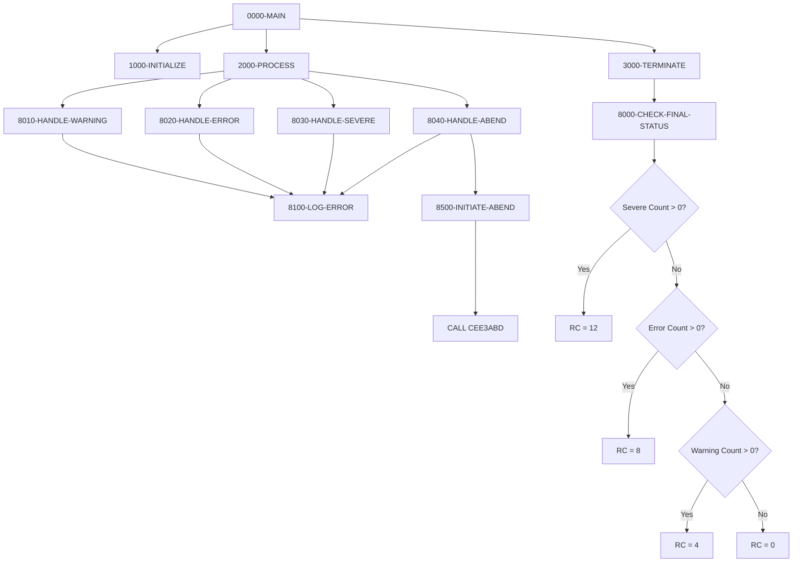

## Overview

ERRHANDL is a template program that demonstrates standard error handling patterns for COBOL applications on IBM z/OS. It provides a reference implementation showing how to properly handle different severity levels of errors, from warnings through critical abends.

This program is not intended to be executed directly in production but serves as a coding template and educational resource. Developers can copy these patterns into their own programs to ensure consistent error handling across the application suite.

Key patterns demonstrated:
- **Warning Handling**: Non-critical issues that allow processing to continue
- **Error Handling**: Significant problems that may affect results but don't stop processing
- **Severe Handling**: Major errors that compromise processing integrity
- **Abend Handling**: Unrecoverable conditions requiring controlled program termination

The template also shows how to track error counts by severity and determine an appropriate final return code based on the worst condition encountered.

## Program Structure



## Data Structures

### Standard Return Codes

| Level | Name | Picture | Value | Description |
|-------|------|---------|-------|-------------|
| 05 | RC-SUCCESS | S9(4) COMP | +0 | Successful completion |
| 05 | RC-WARNING | S9(4) COMP | +4 | Warning conditions occurred |
| 05 | RC-ERROR | S9(4) COMP | +8 | Error conditions occurred |
| 05 | RC-SEVERE | S9(4) COMP | +12 | Severe errors occurred |
| 05 | RC-CRITICAL | S9(4) COMP | +16 | Critical/abend condition |

### Error Message Structure

| Level | Name | Picture | Value | Description |
|-------|------|---------|-------|-------------|
| 05 | WS-ERROR-PREFIX | X(8) | 'ERH' | Program/error prefix identifier |
| 05 | WS-ERROR-NUMBER | 9(4) | ZEROS | Numeric error code |
| 05 | FILLER | X | '-' | Separator |
| 05 | WS-ERROR-TEXT | X(50) | SPACES | Error description |
| 05 | FILLER | X | SPACES | Separator |
| 05 | WS-ERROR-SEVERITY | X(8) | SPACES | Severity level text |

### Error Tracking Flags

| Level | Name | Picture | 88-Levels | Description |
|-------|------|---------|-----------|-------------|
| 05 | WS-PROCESSING-ERROR | X | NO-ERROR='N', ERROR-OCCURRED='Y' | Error occurred indicator |
| 05 | WS-ABEND-FLAG | X | PERFORM-ABEND='Y', NO-ABEND='N' | Abend required indicator |

### Error Counts

| Level | Name | Picture | Value | Description |
|-------|------|---------|-------|-------------|
| 05 | WS-WARNING-COUNT | S9(4) COMP | ZEROS | Count of warning conditions |
| 05 | WS-ERROR-COUNT | S9(4) COMP | ZEROS | Count of error conditions |
| 05 | WS-SEVERE-COUNT | S9(4) COMP | ZEROS | Count of severe conditions |

### Predefined Error Messages

| Name | Code | Message |
|------|------|---------|
| ERR-001 | 1 | INVALID INPUT PARAMETER RECEIVED |
| ERR-002 | 2 | REQUIRED FIELD IS MISSING |
| ERR-003 | 3 | FILE OPERATION FAILED |

## Control Flow

### 0000-MAIN

Main control paragraph demonstrating standard program structure:
1. Performs 1000-INITIALIZE to set up error tracking
2. Performs 2000-PROCESS to demonstrate error scenarios
3. Performs 3000-TERMINATE to set final return code
4. Returns via GOBACK

### 1000-INITIALIZE

Initializes error handling structures:
1. Initializes WS-ERROR-FLAGS and WS-ERROR-COUNTS to starting values
2. Sets NO-ERROR flag to TRUE
3. Sets NO-ABEND flag to TRUE

### 2000-PROCESS

Demonstrates all four error handling patterns:
1. Calls 8010-HANDLE-WARNING for warning example
2. Calls 8020-HANDLE-ERROR for error example
3. Calls 8030-HANDLE-SEVERE for severe example
4. Calls 8040-HANDLE-ABEND for abend example

:::note
In production code, these would be conditionally invoked based on actual error conditions, not called sequentially.
:::

### 3000-TERMINATE

Performs final status determination:
1. Calls 8000-CHECK-FINAL-STATUS to set appropriate return code

### 8000-CHECK-FINAL-STATUS

Determines final return code using hierarchical severity checking:

```
IF WS-SEVERE-COUNT > ZERO
    RETURN-CODE = 12 (RC-SEVERE)
ELSE IF WS-ERROR-COUNT > ZERO
    RETURN-CODE = 8 (RC-ERROR)
ELSE IF WS-WARNING-COUNT > ZERO
    RETURN-CODE = 4 (RC-WARNING)
ELSE
    RETURN-CODE = 0 (RC-SUCCESS)
```

This ensures the return code reflects the most severe condition encountered.

### 8010-HANDLE-WARNING

Pattern for handling warning conditions:
1. Increments WS-WARNING-COUNT
2. Sets WS-ERROR-SEVERITY to 'WARNING'
3. Sets error number and text
4. Calls 8100-LOG-ERROR to output message

**Use Case**: Data quality issues, soft validation failures, deprecated feature usage.

### 8020-HANDLE-ERROR

Pattern for handling error conditions:
1. Increments WS-ERROR-COUNT
2. Sets ERROR-OCCURRED flag to TRUE
3. Sets WS-ERROR-SEVERITY to 'ERROR'
4. Sets error number and text
5. Calls 8100-LOG-ERROR to output message

**Use Case**: Record validation failures, missing required data, business rule violations.

### 8030-HANDLE-SEVERE

Pattern for handling severe errors:
1. Increments WS-SEVERE-COUNT
2. Sets ERROR-OCCURRED flag to TRUE
3. Sets WS-ERROR-SEVERITY to 'SEVERE'
4. Sets error number and text
5. Calls 8100-LOG-ERROR to output message

**Use Case**: File I/O failures, database errors, resource exhaustion.

### 8040-HANDLE-ABEND

Pattern for handling critical/abend conditions:
1. Sets PERFORM-ABEND flag to TRUE
2. Sets WS-ERROR-SEVERITY to 'CRITICAL'
3. Sets error number to 999
4. Sets error text to indicate unrecoverable condition
5. Calls 8100-LOG-ERROR to output message
6. Calls 8500-INITIATE-ABEND to terminate program

**Use Case**: Unrecoverable system errors, data corruption detection, security violations.

### 8100-LOG-ERROR

Common error logging routine:
1. Displays error prefix, number, and severity
2. Displays error text

Output format:
```
ERH-0001: WARNING
INVALID INPUT PARAMETER RECEIVED
```

### 8500-INITIATE-ABEND

Controlled abend routine:
1. Displays "ABNORMAL TERMINATION INITIATED" message
2. Calls Language Environment routine CEE3ABD to force controlled abend

## CEE3ABD - Language Environment Abend

The program uses IBM's Language Environment callable service for controlled abnormal termination:

```cobol
CALL 'CEE3ABD' USING RC-CRITICAL, 3
```

| Parameter | Value | Description |
|-----------|-------|-------------|
| Abend Code | RC-CRITICAL (16) | User abend code |
| Cleanup | 3 | Perform full cleanup before abend |

This provides a cleaner termination than STOP RUN with an abend, ensuring proper resource cleanup.

## Return Codes

| Code | Constant | Meaning |
|------|----------|---------|
| 0 | RC-SUCCESS | No errors or warnings |
| 4 | RC-WARNING | One or more warnings occurred |
| 8 | RC-ERROR | One or more errors occurred |
| 12 | RC-SEVERE | One or more severe errors occurred |
| 16 | RC-CRITICAL | Critical error requiring abend |

## Dependencies

### Copybooks

None - this is a self-contained template.

### Called Programs

- **CEE3ABD** - IBM Language Environment routine for controlled program termination

### Related Programs

This template provides patterns that can be incorporated into any COBOL program. Similar error handling structures exist in:
- ERRPROC - Error processing utility
- ERRHAND copybook - Error handling definitions
- DB2ERR - DB2 error handler

## Usage Pattern

To use these patterns in your program:

### 1. Copy Return Code Definitions

```cobol
01  WS-RETURN-CODES.
    05  RC-SUCCESS     PIC S9(4) COMP VALUE +0.
    05  RC-WARNING     PIC S9(4) COMP VALUE +4.
    05  RC-ERROR       PIC S9(4) COMP VALUE +8.
    05  RC-SEVERE      PIC S9(4) COMP VALUE +12.
    05  RC-CRITICAL    PIC S9(4) COMP VALUE +16.
```

### 2. Add Error Tracking

```cobol
01  WS-ERROR-FLAGS.
    05  WS-PROCESSING-ERROR    PIC X VALUE 'N'.
        88  NO-ERROR           VALUE 'N'.
        88  ERROR-OCCURRED     VALUE 'Y'.
        
01  WS-ERROR-COUNTS.
    05  WS-WARNING-COUNT  PIC S9(4) COMP VALUE ZEROS.
    05  WS-ERROR-COUNT    PIC S9(4) COMP VALUE ZEROS.
    05  WS-SEVERE-COUNT   PIC S9(4) COMP VALUE ZEROS.
```

### 3. Handle Errors at Point of Detection

```cobol
READ CUSTOMER-FILE
    AT END
        SET END-OF-FILE TO TRUE
    NOT AT END
        IF CUST-STATUS NOT = 'A'
            ADD 1 TO WS-WARNING-COUNT
            DISPLAY 'Warning: Inactive customer ' CUST-ID
        END-IF
END-READ

IF WS-FILE-STATUS NOT = '00'
    ADD 1 TO WS-ERROR-COUNT
    SET ERROR-OCCURRED TO TRUE
    DISPLAY 'Error: File status ' WS-FILE-STATUS
END-IF
```

### 4. Set Final Return Code

```cobol
3000-TERMINATE.
    EVALUATE TRUE
        WHEN WS-SEVERE-COUNT > 0
            MOVE RC-SEVERE TO RETURN-CODE
        WHEN WS-ERROR-COUNT > 0
            MOVE RC-ERROR TO RETURN-CODE
        WHEN WS-WARNING-COUNT > 0
            MOVE RC-WARNING TO RETURN-CODE
        WHEN OTHER
            MOVE RC-SUCCESS TO RETURN-CODE
    END-EVALUATE.
```

## Technical Notes

1. **COMP Fields for Return Codes**: Uses S9(4) COMP for efficient storage and compatibility with the RETURN-CODE special register

2. **88-Level Conditions**: Uses condition names (ERROR-OCCURRED, PERFORM-ABEND) for readable IF statements and SET operations

3. **Hierarchical Error Checking**: The 8000-CHECK-FINAL-STATUS paragraph uses nested IFs to ensure the highest severity determines the final return code

4. **CEE3ABD vs STOP RUN**: CEE3ABD provides controlled termination with proper Language Environment cleanup, preferable to STOP RUN for abend scenarios

5. **Error Counting Pattern**: Separate counters by severity allow for detailed error reporting and analysis

6. **DISPLAY for Logging**: Uses DISPLAY statements for simplicity; production systems may use WTO (Write to Operator) or logging APIs

7. **Template Structure**: The 8xxx paragraph numbering convention reserves this range for error handling, keeping error logic separate from business logic

8. **Error Message Table**: Predefined messages (ERR-001, ERR-002, ERR-003) provide consistency; extend as needed for application-specific errors
