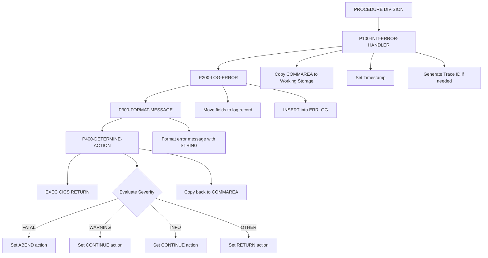
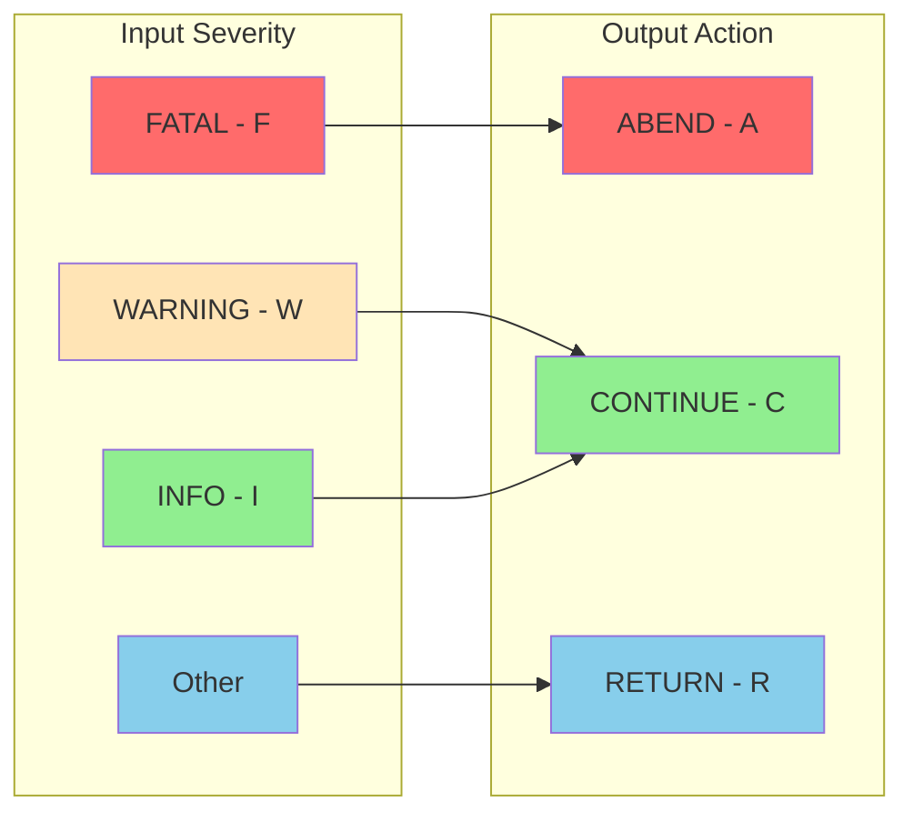

## Overview

ERRHNDL is a centralized error handler for CICS online transactions. It provides a standardized approach to error processing across all online programs by logging errors to a DB2 table, formatting user-friendly error messages, and determining the appropriate recovery action based on error severity.

The program operates as a CICS-linked program that receives error information through the COMMAREA. When an error occurs in any online program, that program populates the error communication area and links to ERRHNDL for centralized processing. This design ensures consistent error handling, comprehensive error logging, and traceable error recovery across the entire online application suite.

Each error is assigned a unique trace ID for correlation, enabling operations staff to track errors from user screens through to the error log database for troubleshooting and root cause analysis.

## Program Structure



## Data Structures

### Working Storage

#### WS-ERROR-AREA (from ERRHND copybook)

| Level | Name | Picture | Description |
|-------|------|---------|-------------|
| 01 | ERROR-HANDLING | - | Main error data structure |
| 05 | ERR-PROGRAM | X(8) | Program where error occurred |
| 05 | ERR-PARAGRAPH | X(30) | Paragraph where error occurred |
| 05 | ERR-SQLCODE | S9(9) COMP | DB2 SQLCODE value |
| 05 | ERR-CICS-RESP | S9(8) COMP | CICS EIBRESP value |
| 05 | ERR-CICS-RESP2 | S9(8) COMP | CICS EIBRESP2 value |
| 05 | ERR-SEVERITY | X | Error severity level |
| 05 | ERR-MESSAGE | X(80) | Error message text |
| 05 | ERR-ACTION | X | Determined recovery action |
| 05 | ERR-TRACE | - | Trace information group |
| 10 | ERR-TRACE-ID | X(16) | Unique trace identifier |
| 10 | ERR-TIMESTAMP | X(26) | Error timestamp |

#### ERR-SEVERITY Condition Names

| Condition | Value | Description |
|-----------|-------|-------------|
| ERR-FATAL | 'F' | Fatal error - processing cannot continue |
| ERR-WARNING | 'W' | Warning - processing can continue with caution |
| ERR-INFO | 'I' | Informational - no impact on processing |

#### ERR-ACTION Condition Names

| Condition | Value | Description |
|-----------|-------|-------------|
| ERR-RETURN | 'R' | Return to calling program normally |
| ERR-CONTINUE | 'C' | Continue processing |
| ERR-ABEND | 'A' | Abend the transaction |

#### WS-ERRLOG-RECORD (SQL Declare Section)

| Level | Name | Picture | Description |
|-------|------|---------|-------------|
| 05 | LOG-TIMESTAMP | X(26) | When error occurred |
| 05 | LOG-PROGRAM | X(8) | Source program |
| 05 | LOG-PARAGRAPH | X(30) | Source paragraph |
| 05 | LOG-SQLCODE | S9(9) COMP | DB2 error code |
| 05 | LOG-CICS-RESP | S9(8) COMP | CICS response code |
| 05 | LOG-SEVERITY | X | Severity indicator |
| 05 | LOG-MESSAGE | X(80) | Error message |
| 05 | LOG-TRACE-ID | X(16) | Trace identifier |

### Linkage Section (DFHCOMMAREA)

The DFHCOMMAREA uses the same ERRHND copybook structure as working storage, enabling bidirectional communication with calling programs.

## Database Operations

### ERRLOG Table

The program logs all errors to the ERRLOG DB2 table.

#### Table Structure (inferred from INSERT)

| Column | Type | Description |
|--------|------|-------------|
| TIMESTAMP | CHAR(26) | When the error was logged |
| PROGRAM | CHAR(8) | Program that generated the error |
| PARAGRAPH | CHAR(30) | Paragraph where error occurred |
| SQLCODE | INTEGER | DB2 SQLCODE (0 if not DB2 error) |
| CICS_RESP | INTEGER | CICS response code |
| SEVERITY | CHAR(1) | Error severity (F/W/I) |
| MESSAGE | CHAR(80) | Error message text |
| TRACE_ID | CHAR(16) | Unique trace identifier |

#### SQL Operations

| Operation | Paragraph | Description |
|-----------|-----------|-------------|
| INSERT | P200-LOG-ERROR | Logs error details to ERRLOG table |

## CICS Integration

### CICS Commands Used

| Command | Purpose |
|---------|---------|
| `EXEC CICS RETURN` | Returns control to CICS after processing |

### Communication Mechanism

The program uses the standard CICS COMMAREA (DFHCOMMAREA) for receiving error information from calling programs and returning the determined action.

**Flow:**
1. Calling program detects error
2. Calling program populates ERRHND structure
3. Calling program executes `EXEC CICS LINK PROGRAM('ERRHNDL') COMMAREA(...)`
4. ERRHNDL processes error and sets ERR-ACTION
5. ERRHNDL returns via `EXEC CICS RETURN`
6. Calling program checks ERR-ACTION and responds accordingly

## Control Flow

### P100-INIT-ERROR-HANDLER

Initializes the error handler:

1. Copies DFHCOMMAREA to WS-ERROR-AREA for processing
2. Sets ERR-TIMESTAMP using `FUNCTION CURRENT-DATE`
3. Generates ERR-TRACE-ID using `FUNCTION RANDOM` if not already set
   - This allows calling programs to pre-set trace IDs for correlation

### P200-LOG-ERROR

Persists error information to DB2:

1. Moves all error fields to the SQL host variable structure
2. Inserts record into ERRLOG table
3. If INSERT fails (SQLCODE ≠ 0):
   - Sets ERR-MESSAGE to 'Error logging failed'
   - Escalates severity to FATAL

**Note:** The program handles logging failures gracefully by escalating severity rather than aborting, ensuring the calling program receives notification of the logging issue.

### P300-FORMAT-MESSAGE

Formats a user-friendly error message using STRING:

**Format:** `Error in {PROGRAM} - {MESSAGE} ({TRACE-ID})`

This provides:
- Context (which program failed)
- Description (what went wrong)
- Traceability (unique ID for support reference)

### P400-DETERMINE-ACTION

Determines recovery action based on severity:

| Severity | Action Set | Meaning |
|----------|------------|---------|
| FATAL (F) | ERR-ABEND | Transaction should abend |
| WARNING (W) | ERR-CONTINUE | Processing can continue |
| INFO (I) | ERR-CONTINUE | Processing can continue |
| Other | ERR-RETURN | Default: return normally |

After determining action, copies WS-ERROR-AREA back to DFHCOMMAREA so the calling program receives the updated information.

## Error Severity and Action Matrix



## Dependencies

### Copybooks

- **ERRHND** - Online error handling data structure (used in both working storage and linkage)

### DB2 Includes

- **SQLCA** - SQL Communication Area (via EXEC SQL INCLUDE)

### Called Programs

None - this program is called by other programs.

### Related Programs

All CICS online programs that require centralized error handling can link to ERRHNDL.

## Usage Example

A calling CICS program would use ERRHNDL as follows:

```cobol
WORKING-STORAGE SECTION.
01  WS-ERROR-AREA.
    COPY ERRHND.

PROCEDURE DIVISION.
*  ... perform database operation ...
   EXEC SQL
       SELECT ... INTO ...
       FROM CUSTOMER
       WHERE CUST-ID = :WS-CUST-ID
   END-EXEC
   
   IF SQLCODE NOT = 0
*     Populate error information
      MOVE 'CUSTINQ' TO ERR-PROGRAM
      MOVE 'READ-CUSTOMER' TO ERR-PARAGRAPH
      MOVE SQLCODE TO ERR-SQLCODE
      MOVE EIBRESP TO ERR-CICS-RESP
      MOVE EIBRESP2 TO ERR-CICS-RESP2
      SET ERR-FATAL TO TRUE
      MOVE 'Customer record not found' TO ERR-MESSAGE
      MOVE SPACES TO ERR-TRACE-ID
      
*     Call centralized error handler
      EXEC CICS LINK
           PROGRAM('ERRHNDL')
           COMMAREA(WS-ERROR-AREA)
           LENGTH(LENGTH OF WS-ERROR-AREA)
      END-EXEC
      
*     Check determined action
      EVALUATE TRUE
          WHEN ERR-ABEND
               EXEC CICS ABEND ABCODE('UERR') END-EXEC
          WHEN ERR-CONTINUE
               CONTINUE
          WHEN ERR-RETURN
               EXEC CICS RETURN END-EXEC
      END-EVALUATE
   END-IF.
```

### Using Pre-set Trace IDs

For correlated error tracking across multiple operations:

```cobol
*  Generate trace ID at transaction start
   MOVE FUNCTION RANDOM TO WS-TRANSACTION-TRACE-ID

*  ... later, when error occurs ...
   MOVE WS-TRANSACTION-TRACE-ID TO ERR-TRACE-ID
   EXEC CICS LINK PROGRAM('ERRHNDL') ... END-EXEC
```

## Technical Notes

### Intrinsic Functions Used

| Function | Usage | Description |
|----------|-------|-------------|
| `FUNCTION CURRENT-DATE` | P100 | Gets current date/time for timestamp |
| `FUNCTION RANDOM` | P100 | Generates pseudo-random trace ID |

### STRING Statement

The STRING statement in P300 concatenates multiple fields with delimiters:
- `DELIMITED BY SIZE` - Uses entire field length
- `DELIMITED BY SPACE` - Truncates at first space (for program name)
- `INTO` - Target field for concatenated result

### PERFORM...THRU Pattern

The program uses the PERFORM...THRU pattern with explicit EXIT paragraphs for clear paragraph boundaries and consistent structure.

### Error Logging Resilience

If the INSERT to ERRLOG fails, the program:
1. Does NOT abend or fail
2. Sets a descriptive message
3. Escalates to FATAL severity
4. Continues to return to caller

This ensures the calling program always receives a response, even if logging infrastructure fails.

## Error Handling

| Condition | Response | Description |
|-----------|----------|-------------|
| Normal processing | As determined | Action based on input severity |
| ERRLOG INSERT fails | Escalate to FATAL | Logging failure is critical |
| Missing trace ID | Generate new | Ensures traceability |

## Operational Considerations

### Error Log Queries

Sample query to find errors by trace ID:
```sql
SELECT * FROM ERRLOG
WHERE TRACE_ID = 'ABC123...'
ORDER BY TIMESTAMP;
```

Sample query to find recent fatal errors:
```sql
SELECT * FROM ERRLOG
WHERE SEVERITY = 'F'
  AND TIMESTAMP >= CURRENT TIMESTAMP - 1 HOUR
ORDER BY TIMESTAMP DESC;
```

### Monitoring Recommendations

- Monitor ERRLOG table for FATAL severity entries
- Alert on high volume of errors from specific programs
- Track error patterns by paragraph for targeted code review
- Use trace IDs to correlate user-reported issues with log entries
