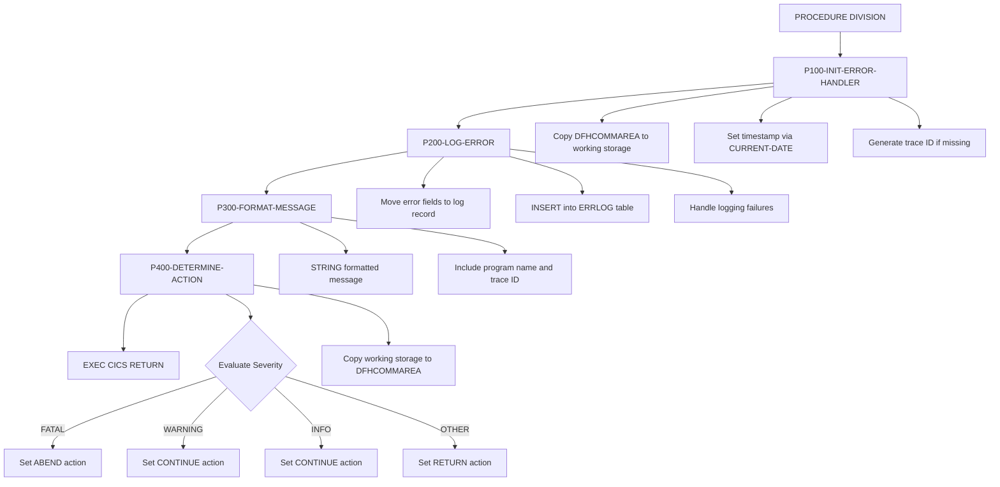

## Overview

ERRHNDL is a centralized error handler for online CICS transactions that provides a standardized approach to error processing across the system. It operates as a CICS program that receives error information through the DFHCOMMAREA and performs comprehensive error handling.

The program executes a four-step error handling process: initializing the error context with timestamps and trace IDs, logging the error to a DB2 audit table, formatting a user-friendly error message, and determining the appropriate recovery action based on error severity.

This utility is essential for maintaining consistent error handling in the online environment, providing error traceability through unique trace IDs, and enabling centralized error logging for troubleshooting and audit purposes.

## Program Structure



## Data Structures

### DFHCOMMAREA (Input/Output)

The program communicates with calling programs through the CICS DFHCOMMAREA, using the ERRHND copybook structure:

| Level | Name | Picture | Description |
|-------|------|---------|-------------|
| 01 | ERROR-HANDLING | - | Main error structure |
| 05 | ERR-PROGRAM | X(8) | Program where error occurred |
| 05 | ERR-PARAGRAPH | X(30) | Paragraph where error occurred |
| 05 | ERR-SQLCODE | S9(9) COMP | DB2 SQLCODE (if applicable) |
| 05 | ERR-CICS-RESP | S9(8) COMP | CICS EIBRESP value |
| 05 | ERR-CICS-RESP2 | S9(8) COMP | CICS EIBRESP2 value |
| 05 | ERR-SEVERITY | X | Error severity level |
| 05 | ERR-MESSAGE | X(80) | Error message text |
| 05 | ERR-ACTION | X | Recovery action (output) |
| 05 | ERR-TRACE | - | Trace information |
| 10 | ERR-TRACE-ID | X(16) | Unique trace identifier |
| 10 | ERR-TIMESTAMP | X(26) | Error timestamp |

### Error Severity Levels

| Value | 88-Level Condition | Description |
|-------|-------------------|-------------|
| `F` | ERR-FATAL | Fatal error - requires transaction abend |
| `W` | ERR-WARNING | Warning - processing can continue |
| `I` | ERR-INFO | Informational - no action required |

### Error Actions (Output)

| Value | 88-Level Condition | Description |
|-------|-------------------|-------------|
| `R` | ERR-RETURN | Return to caller with error |
| `C` | ERR-CONTINUE | Continue processing |
| `A` | ERR-ABEND | Abend the transaction |

### Working Storage - Error Log Record

Host variables for DB2 logging (within SQL DECLARE SECTION):

| Level | Name | Picture | Description |
|-------|------|---------|-------------|
| 05 | LOG-TIMESTAMP | X(26) | When the error occurred |
| 05 | LOG-PROGRAM | X(8) | Source program |
| 05 | LOG-PARAGRAPH | X(30) | Source paragraph |
| 05 | LOG-SQLCODE | S9(9) COMP | DB2 error code |
| 05 | LOG-CICS-RESP | S9(8) COMP | CICS response code |
| 05 | LOG-SEVERITY | X | Error severity |
| 05 | LOG-MESSAGE | X(80) | Error message |
| 05 | LOG-TRACE-ID | X(16) | Trace identifier |

## Control Flow

### Initialize Error Handler (P100-INIT-ERROR-HANDLER)

Prepares the error context:

1. Copies DFHCOMMAREA to WS-ERROR-AREA for processing
2. Sets ERR-TIMESTAMP using `FUNCTION CURRENT-DATE`
3. Generates ERR-TRACE-ID using `FUNCTION RANDOM` if not already set

The trace ID provides a unique identifier for tracking errors across the system, useful for correlating log entries with user-reported issues.

### Log Error (P200-LOG-ERROR)

Persists error information to DB2:

1. Moves all error fields to the log record structure
2. Executes INSERT into the ERRLOG table with all fields
3. If logging fails (SQLCODE ≠ 0):
   - Sets ERR-MESSAGE to 'Error logging failed'
   - Sets severity to FATAL (ERR-FATAL)

This ensures that logging failures don't go unnoticed and escalate appropriately.

### Format Message (P300-FORMAT-MESSAGE)

Creates a user-friendly error message using STRING:

```
Error in PROGRAMX - Original message (TRACE-ID-VALUE)
```

The formatted message includes:
- Literal "Error in "
- Program name (trimmed)
- Separator " - "
- Original error message
- Trace ID in parentheses for reference

### Determine Action (P400-DETERMINE-ACTION)

Maps error severity to recovery action:

| Severity | Action | Behavior |
|----------|--------|----------|
| FATAL | ABEND | Transaction will abend |
| WARNING | CONTINUE | Processing continues |
| INFO | CONTINUE | Processing continues |
| Other | RETURN | Control returns to caller |

After determining the action, copies WS-ERROR-AREA back to DFHCOMMAREA for the calling program.

## Database Integration

### ERRLOG Table

The program logs errors to the ERRLOG DB2 table.

**Table Structure (inferred from INSERT):**

| Column | Type | Description |
|--------|------|-------------|
| TIMESTAMP | CHAR(26) | When the error occurred |
| PROGRAM | CHAR(8) | Source program name |
| PARAGRAPH | CHAR(30) | Source paragraph name |
| SQLCODE | INTEGER | DB2 SQLCODE value |
| CICS_RESP | INTEGER | CICS response code |
| SEVERITY | CHAR(1) | Error severity (F/W/I) |
| MESSAGE | CHAR(80) | Error message text |
| TRACE_ID | CHAR(16) | Unique trace identifier |

### SQLCA

The program includes the SQL Communication Area via `EXEC SQL INCLUDE SQLCA END-EXEC` for DB2 error handling.

## CICS Integration

### Communication

- **Input**: Error information passed via DFHCOMMAREA
- **Output**: Updated DFHCOMMAREA with action code and formatted message
- **Return**: `EXEC CICS RETURN` returns control to calling program

### Response Codes

The program captures and logs CICS response codes:
- **ERR-CICS-RESP**: Maps to EIBRESP (primary response)
- **ERR-CICS-RESP2**: Maps to EIBRESP2 (secondary response)

## Error Recovery Matrix

| Severity | Logging Fails? | Final Action | Result |
|----------|---------------|--------------|--------|
| FATAL | No | ABEND | Transaction abends |
| FATAL | Yes | ABEND | Transaction abends |
| WARNING | No | CONTINUE | Processing continues |
| WARNING | Yes | ABEND | Escalated to abend |
| INFO | No | CONTINUE | Processing continues |
| INFO | Yes | ABEND | Escalated to abend |
| Other | No | RETURN | Returns with error |
| Other | Yes | ABEND | Escalated to abend |

**Note:** Logging failures always escalate the error to FATAL, ensuring visibility of infrastructure issues.

## Dependencies

### Copybooks

- **ERRHND** - Online error handling structure (used in both WORKING-STORAGE and LINKAGE)

### DB2 Objects

- **SQLCA** - SQL Communication Area (included via EXEC SQL INCLUDE)
- **ERRLOG** - Error logging table

### Related Programs

Programs that share the ERRHND copybook (online error handling):
- DB2ONLN - DB2 online handler
- DB2RECV - DB2 recovery handler
- INQONLN - Online inquiry program
- SECMGR - Security manager

## Usage Example

To invoke ERRHNDL from a CICS program:

```cobol
* Set up error information
MOVE 'MYPROG01' TO ERR-PROGRAM
MOVE 'P500-PROCESS-DATA' TO ERR-PARAGRAPH
MOVE SQLCODE TO ERR-SQLCODE
MOVE EIBRESP TO ERR-CICS-RESP
MOVE EIBRESP2 TO ERR-CICS-RESP2
SET ERR-WARNING TO TRUE
MOVE 'Database read failed for account' TO ERR-MESSAGE
MOVE SPACES TO ERR-TRACE-ID

* Link to error handler
EXEC CICS LINK
    PROGRAM('ERRHNDL')
    COMMAREA(ERROR-HANDLING)
    LENGTH(LENGTH OF ERROR-HANDLING)
END-EXEC

* Check recommended action
EVALUATE TRUE
    WHEN ERR-ABEND
        EXEC CICS ABEND ABCODE('DERR') END-EXEC
    WHEN ERR-RETURN
        PERFORM ERROR-RETURN-LOGIC
    WHEN ERR-CONTINUE
        CONTINUE
END-EVALUATE
```

## Message Format Example

Given:
- ERR-PROGRAM: `'INQONLN '`
- ERR-MESSAGE: `'Account not found'`
- ERR-TRACE-ID: `'A1B2C3D4E5F67890'`

Formatted output:
```
Error in INQONLN - Account not found (A1B2C3D4E5F67890)
```

## Technical Notes

- The program uses **PERFORM ... THRU** to execute paragraphs with corresponding EXIT paragraphs, ensuring proper structured programming flow
- **FUNCTION CURRENT-DATE** returns a 21-character timestamp in YYYYMMDDHHMMSSFF±HHMM format
- **FUNCTION RANDOM** generates a pseudo-random number used as a trace ID when one isn't provided
- The **STRING** statement concatenates multiple fields with delimiters into the formatted message
- **EXEC CICS RETURN** returns control to the calling program (not to CICS directly)
- The DFHCOMMAREA is used bidirectionally: input for error details, output for action and formatted message
- All severity levels except FATAL result in CONTINUE, making FATAL the only "hard stop" condition
- Logging failures automatically escalate any error to FATAL, preventing silent failures
