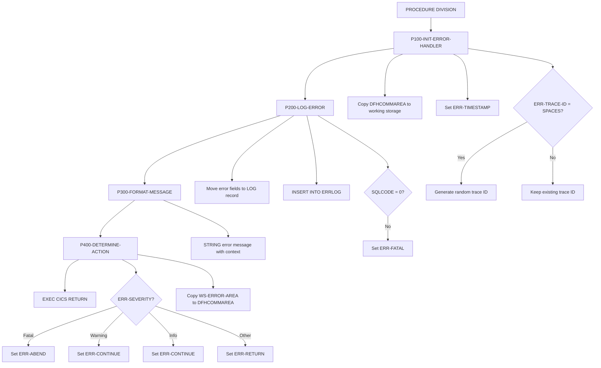
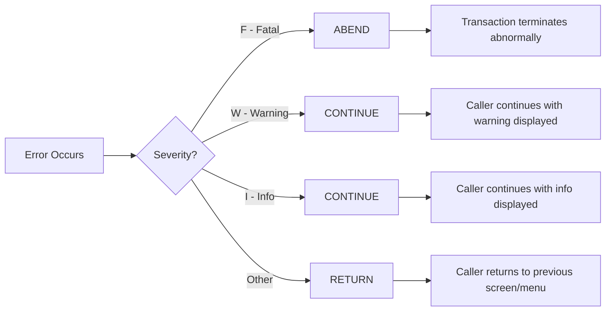

## Overview

ERRHNDL is a centralized error handling program for CICS online applications. It provides a standardized approach to error processing across the online system by logging errors to a DB2 table, formatting user-friendly error messages, and determining the appropriate recovery action based on error severity.

The program is designed to be called via CICS LINK from any online program that encounters an error. It receives error details through the DFHCOMMAREA, processes the error, and returns with an action code indicating how the calling program should proceed (continue, return to menu, or abend).

This error handler integrates with other online programs including DB2ONLN, DB2RECV, INQONLN, and SECMGR, providing consistent error handling and traceability across the online subsystem through unique trace IDs.

## Program Structure



## Data Structures

### DFHCOMMAREA (ERRHND Copybook)

The error information is passed through the CICS communication area:

| Level | Name | Picture | Description |
|-------|------|---------|-------------|
| 01 | ERROR-HANDLING | - | Error handling data structure |
| 05 | ERR-PROGRAM | X(8) | Program that encountered the error |
| 05 | ERR-PARAGRAPH | X(30) | Paragraph or section where error occurred |
| 05 | ERR-SQLCODE | S9(9) COMP | DB2 SQLCODE (0 if not DB2 error) |
| 05 | ERR-CICS-RESP | S9(8) COMP | CICS EIBRESP value |
| 05 | ERR-CICS-RESP2 | S9(8) COMP | CICS EIBRESP2 value |
| 05 | ERR-SEVERITY | X | Severity: F=Fatal, W=Warning, I=Info |
| 05 | ERR-MESSAGE | X(80) | Error message text |
| 05 | ERR-ACTION | X | Action: R=Return, C=Continue, A=Abend |
| 10 | ERR-TRACE-ID | X(16) | Unique trace identifier |
| 10 | ERR-TIMESTAMP | X(26) | Error timestamp |

### Working Storage - Error Log Record

DB2 host variables for the ERRLOG table:

| Level | Name | Picture | Description |
|-------|------|---------|-------------|
| 01 | WS-ERRLOG-RECORD | - | DB2 host variable structure |
| 05 | LOG-TIMESTAMP | X(26) | When error occurred |
| 05 | LOG-PROGRAM | X(8) | Originating program |
| 05 | LOG-PARAGRAPH | X(30) | Location in program |
| 05 | LOG-SQLCODE | S9(9) COMP | DB2 return code |
| 05 | LOG-CICS-RESP | S9(8) COMP | CICS response code |
| 05 | LOG-SEVERITY | X | Error severity level |
| 05 | LOG-MESSAGE | X(80) | Error description |
| 05 | LOG-TRACE-ID | X(16) | Trace ID for correlation |

## Database Operations

### ERRLOG Table

The program logs all errors to the ERRLOG DB2 table:

| Column | Type | Source Field | Description |
|--------|------|--------------|-------------|
| TIMESTAMP | CHAR(26) | LOG-TIMESTAMP | Error occurrence time |
| PROGRAM | CHAR(8) | LOG-PROGRAM | Program name |
| PARAGRAPH | CHAR(30) | LOG-PARAGRAPH | Code location |
| SQLCODE | INTEGER | LOG-SQLCODE | DB2 error code |
| CICS_RESP | INTEGER | LOG-CICS-RESP | CICS response |
| SEVERITY | CHAR(1) | LOG-SEVERITY | F/W/I severity |
| MESSAGE | CHAR(80) | LOG-MESSAGE | Error message |
| TRACE_ID | CHAR(16) | LOG-TRACE-ID | Correlation ID |

### SQL Statement

**Insert Error Log (P200-LOG-ERROR)**:
```sql
INSERT INTO ERRLOG
VALUES (:LOG-TIMESTAMP,
        :LOG-PROGRAM,
        :LOG-PARAGRAPH,
        :LOG-SQLCODE,
        :LOG-CICS-RESP,
        :LOG-SEVERITY,
        :LOG-MESSAGE,
        :LOG-TRACE-ID)
```

## Control Flow

### P100-INIT-ERROR-HANDLER

Initializes the error handler:
1. Copies DFHCOMMAREA to WS-ERROR-AREA for processing
2. Sets ERR-TIMESTAMP using `FUNCTION CURRENT-DATE`
3. Generates a random trace ID if not already provided (using `FUNCTION RANDOM`)

The trace ID allows correlation of errors across multiple program calls in a single transaction.

### P200-LOG-ERROR

Persists the error to DB2:
1. Moves all error fields from working storage to LOG record structure
2. Executes INSERT into ERRLOG table
3. If INSERT fails (SQLCODE ≠ 0), escalates to fatal error

**Note**: If logging itself fails, the error is marked as fatal to prevent silent failures.

### P300-FORMAT-MESSAGE

Formats a user-friendly error message:
1. Uses STRING statement to concatenate:
   - "Error in " prefix
   - Program name (ERR-PROGRAM)
   - " - " separator
   - Original error message (ERR-MESSAGE)
   - Trace ID in parentheses

**Example output**:
```
Error in INQONLN - Record not found (A1B2C3D4E5F6G7H8)
```

The trace ID in the message allows support staff to locate the full error details in the ERRLOG table.

### P400-DETERMINE-ACTION

Determines recovery action based on severity:

| Severity | Condition | Action Set | Meaning |
|----------|-----------|------------|---------|
| Fatal | ERR-FATAL ('F') | ERR-ABEND ('A') | Terminate transaction |
| Warning | ERR-WARNING ('W') | ERR-CONTINUE ('C') | Continue processing |
| Info | ERR-INFO ('I') | ERR-CONTINUE ('C') | Continue processing |
| Other | Default | ERR-RETURN ('R') | Return to calling menu |

After setting the action, copies WS-ERROR-AREA back to DFHCOMMAREA for the calling program.

## Error Severity Levels



## Error Actions

| Action | Code | Description |
|--------|------|-------------|
| ERR-ABEND | 'A' | Transaction should abend immediately |
| ERR-CONTINUE | 'C' | Continue processing, display message to user |
| ERR-RETURN | 'R' | Return to previous screen or main menu |

## CICS Commands

| Command | Purpose |
|---------|---------|
| `EXEC CICS RETURN END-EXEC` | Returns control to CICS after processing |

The program uses `RETURN` without TRANSID, returning control to the program that linked to it.

## Dependencies

### Copybooks

- **ERRHND** - Online error handling data structure with severity and action codes

### DB2 Resources

- **SQLCA** - SQL Communication Area (included via EXEC SQL INCLUDE)
- **ERRLOG** - Error logging table

### Related Programs

Programs that use the ERRHND copybook and call this handler:

- **DB2ONLN** - Online DB2 operations
- **DB2RECV** - DB2 recovery handler
- **INQONLN** - Online inquiry program
- **SECMGR** - Security manager

## Technical Notes

1. **FUNCTION CURRENT-DATE**: Returns a 21-character string (YYYYMMDDHHMMSSHHNNNN) containing the current date and time. Used to timestamp each error.

2. **FUNCTION RANDOM**: Generates a pseudo-random number between 0 and 1. Used here to create unique trace IDs when one isn't already provided. The random value is moved directly to ERR-TRACE-ID.

3. **STRING Statement**: Concatenates multiple source fields into a single destination. The `DELIMITED BY SIZE` clause uses the full field length, while `DELIMITED BY SPACE` trims trailing spaces.

4. **DFHCOMMAREA**: The CICS communication area passed between programs. Both working storage and linkage section contain a copy of the ERRHND structure for data exchange.

5. **Level-88 Conditions**: The copybook defines condition names for severity (ERR-FATAL, ERR-WARNING, ERR-INFO) and action (ERR-RETURN, ERR-CONTINUE, ERR-ABEND) for readable code.

6. **Error Escalation**: If the error logging INSERT fails, the program escalates to ERR-FATAL. This ensures that logging failures don't go unnoticed and the transaction properly abends rather than continuing with unlogged errors.

7. **Trace ID Correlation**: The trace ID enables correlation of errors across a transaction. If a calling program already assigned a trace ID, ERRHNDL preserves it; otherwise, it generates a new one.

8. **No Explicit COMMIT**: The INSERT is not followed by a COMMIT. In CICS, syncpoint (commit) handling is typically managed by the calling program or at transaction end.

## Usage Example

A calling program would typically:

```cobol
* Set up error information
MOVE 'INQONLN' TO ERR-PROGRAM
MOVE '2000-READ-CUSTOMER' TO ERR-PARAGRAPH
MOVE SQLCODE TO ERR-SQLCODE
MOVE EIBRESP TO ERR-CICS-RESP
MOVE EIBRESP2 TO ERR-CICS-RESP2
SET ERR-WARNING TO TRUE
MOVE 'Customer record not found' TO ERR-MESSAGE

* Call error handler
EXEC CICS LINK
    PROGRAM('ERRHNDL')
    COMMAREA(ERROR-HANDLING)
    LENGTH(LENGTH OF ERROR-HANDLING)
END-EXEC

* Check action and respond
EVALUATE TRUE
    WHEN ERR-ABEND
        EXEC CICS ABEND ABCODE('ERRF') END-EXEC
    WHEN ERR-CONTINUE
        PERFORM DISPLAY-WARNING-MESSAGE
    WHEN ERR-RETURN
        EXEC CICS XCTL PROGRAM('MAINMENU') END-EXEC
END-EVALUATE
```
