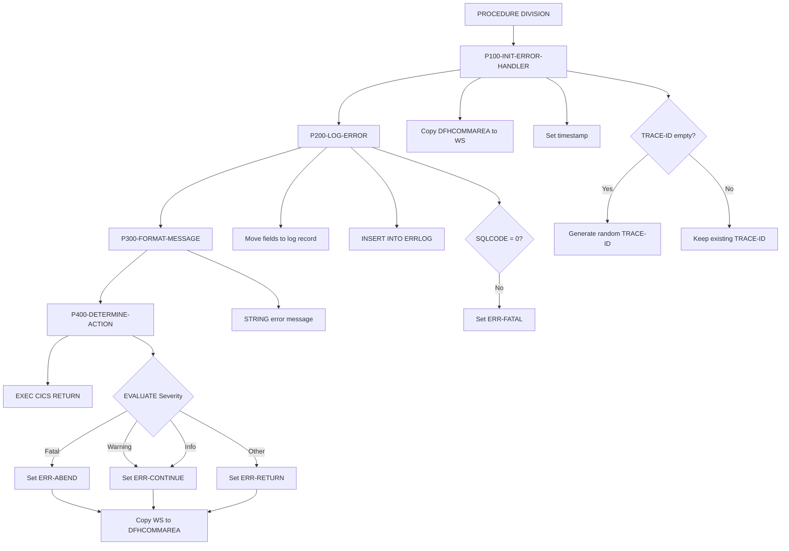
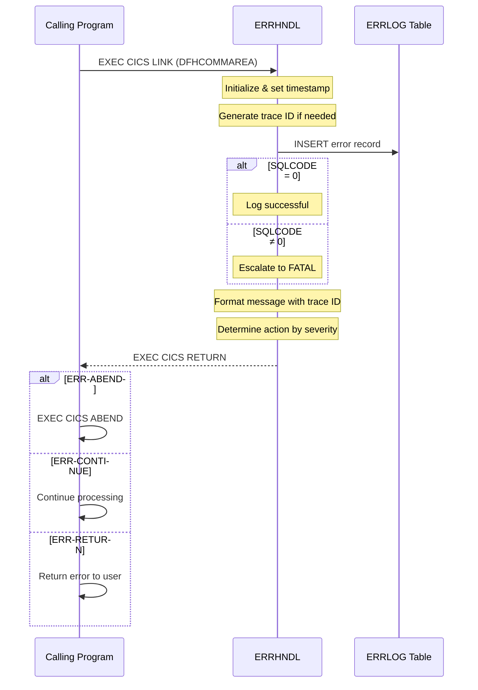

## Overview

ERRHNDL is a centralized error handling program for CICS online applications. It provides a consistent mechanism for processing, logging, and responding to errors across all online programs in the system. When an error occurs, calling programs link to ERRHNDL with error details in the COMMAREA, and ERRHNDL handles the rest.

The program performs four key functions: initializing error context with timestamps and trace IDs, logging error details to a DB2 table for audit and debugging purposes, formatting error messages for display, and determining the appropriate recovery action based on error severity. This centralized approach ensures consistent error handling behavior and creates a comprehensive error audit trail.

ERRHNDL supports three severity levels (Fatal, Warning, Informational) and maps these to three possible actions (Abend, Continue, Return). The calling program can inspect the action recommendation in the returned COMMAREA to decide how to proceed.

## Program Structure



## Data Structures

### DFHCOMMAREA (Linkage Section)

The program uses the ERRHND copybook for CICS communication:

| Level | Name | Picture | Description |
|-------|------|---------|-------------|
| 05 | ERR-PROGRAM | X(8) | Program where error occurred |
| 05 | ERR-PARAGRAPH | X(30) | Paragraph/section where error occurred |
| 05 | ERR-SQLCODE | S9(9) COMP | DB2 SQLCODE if applicable |
| 05 | ERR-CICS-RESP | S9(8) COMP | CICS EIBRESP value |
| 05 | ERR-CICS-RESP2 | S9(8) COMP | CICS EIBRESP2 value |
| 05 | ERR-SEVERITY | X | Error severity code |
| 05 | ERR-MESSAGE | X(80) | Error message text |
| 05 | ERR-ACTION | X | Determined action code |
| 10 | ERR-TRACE-ID | X(16) | Unique trace identifier |
| 10 | ERR-TIMESTAMP | X(26) | Error timestamp |

### Severity Values

| Value | Condition Name | Description |
|-------|----------------|-------------|
| `F` | ERR-FATAL | Fatal error - cannot continue |
| `W` | ERR-WARNING | Warning - processing can continue |
| `I` | ERR-INFO | Informational - no action required |

### Action Values

| Value | Condition Name | Description |
|-------|----------------|-------------|
| `R` | ERR-RETURN | Return to caller with error |
| `C` | ERR-CONTINUE | Continue processing |
| `A` | ERR-ABEND | Abend the transaction |

### Working Storage - Error Log Record

| Level | Name | Picture | Description |
|-------|------|---------|-------------|
| 05 | LOG-TIMESTAMP | X(26) | When error occurred |
| 05 | LOG-PROGRAM | X(8) | Source program |
| 05 | LOG-PARAGRAPH | X(30) | Source paragraph |
| 05 | LOG-SQLCODE | S9(9) COMP | DB2 SQLCODE |
| 05 | LOG-CICS-RESP | S9(8) COMP | CICS response code |
| 05 | LOG-SEVERITY | X | Error severity |
| 05 | LOG-MESSAGE | X(80) | Error message |
| 05 | LOG-TRACE-ID | X(16) | Trace identifier for correlation |

## Database Operations

### ERRLOG Table

The program logs all errors to a DB2 table named ERRLOG:

| Column | Type | Source Field | Description |
|--------|------|--------------|-------------|
| (timestamp) | CHAR(26) | LOG-TIMESTAMP | Error occurrence time |
| (program) | CHAR(8) | LOG-PROGRAM | Program identifier |
| (paragraph) | CHAR(30) | LOG-PARAGRAPH | Paragraph name |
| (sqlcode) | INTEGER | LOG-SQLCODE | DB2 SQL code |
| (cics_resp) | INTEGER | LOG-CICS-RESP | CICS response code |
| (severity) | CHAR(1) | LOG-SEVERITY | Error severity |
| (message) | CHAR(80) | LOG-MESSAGE | Error message text |
| (trace_id) | CHAR(16) | LOG-TRACE-ID | Unique trace ID |

### SQL Operation

**P200-LOG-ERROR:**
```sql
INSERT INTO ERRLOG
VALUES (:LOG-TIMESTAMP,
        :LOG-PROGRAM,
        :LOG-PARAGRAPH,
        :LOG-SQLCODE,
        :LOG-CICS-RESP,
        :LOG-SEVERITY,
        :LOG-MESSAGE,
        :LOG-TRACE-ID)
```

## Control Flow

### P100-INIT-ERROR-HANDLER

1. Copies DFHCOMMAREA to WS-ERROR-AREA for local processing
2. Sets ERR-TIMESTAMP to current date/time using `FUNCTION CURRENT-DATE`
3. If ERR-TRACE-ID is spaces, generates a unique trace ID using `FUNCTION RANDOM`

The trace ID enables support staff to correlate error messages displayed to users with detailed log entries in the ERRLOG table.

### P200-LOG-ERROR

1. Moves all error fields from working storage to the log record structure
2. Executes SQL INSERT to persist the error to the ERRLOG table
3. If the INSERT fails (SQLCODE ≠ 0):
   - Updates ERR-MESSAGE to "Error logging failed"
   - Escalates severity to ERR-FATAL

This escalation ensures that logging failures don't go unnoticed and trigger appropriate abend handling.

### P300-FORMAT-MESSAGE

Constructs a formatted error message using STRING:

```
Error in PROGRAM - MESSAGE (TRACE-ID)
```

Example output:
```
Error in INQONLN - Account not found (A1B2C3D4E5F67890)
```

The trace ID in the message allows users to report issues with a reference that support can use to locate the full error details in DB2.

### P400-DETERMINE-ACTION

Evaluates the error severity and sets the appropriate action:

| Severity | Action Set | Behavior |
|----------|------------|----------|
| ERR-FATAL | ERR-ABEND | Transaction will abend |
| ERR-WARNING | ERR-CONTINUE | Processing continues |
| ERR-INFO | ERR-CONTINUE | Processing continues |
| Other | ERR-RETURN | Return to caller with error |

After setting the action, copies WS-ERROR-AREA back to DFHCOMMAREA so the calling program can access the determined action and formatted message.

### Program Termination

The program returns to CICS with `EXEC CICS RETURN`, passing control back to the calling program which can then check ERR-ACTION to determine how to proceed.

## Error Flow Diagram



## Dependencies

### Copybooks

- **ERRHND** - Online error handling structure with severity codes, action flags, and trace information

### DB2 Objects

- **SQLCA** - SQL Communication Area (included via EXEC SQL INCLUDE)
- **ERRLOG** - Error logging table

### CICS Resources

- Uses DFHCOMMAREA for parameter passing
- Returns to CICS via EXEC CICS RETURN

### Related Programs

Programs that use the ERRHND copybook:

| Program | Description |
|---------|-------------|
| DB2ONLN | Online DB2 operations |
| DB2RECV | DB2 recovery processing |
| INQONLN | Online inquiry transactions |
| SECMGR | Security manager |

## Usage Example

**Calling Program Setup:**
```cobol
WORKING-STORAGE SECTION.
01  WS-ERRHND.
    COPY ERRHND.

PROCEDURE DIVISION.
* ... processing logic ...

    IF SOME-ERROR-CONDITION
        MOVE 'MYPROG01' TO ERR-PROGRAM
        MOVE 'P500-PROCESS-DATA' TO ERR-PARAGRAPH
        MOVE SQLCODE TO ERR-SQLCODE
        MOVE EIBRESP TO ERR-CICS-RESP
        MOVE EIBRESP2 TO ERR-CICS-RESP2
        SET ERR-WARNING TO TRUE
        MOVE 'Data validation failed' TO ERR-MESSAGE
        MOVE SPACES TO ERR-TRACE-ID
        
        EXEC CICS LINK
            PROGRAM('ERRHNDL')
            COMMAREA(WS-ERRHND)
            LENGTH(LENGTH OF WS-ERRHND)
        END-EXEC
        
        EVALUATE TRUE
            WHEN ERR-ABEND
                EXEC CICS ABEND ABCODE('UERR') END-EXEC
            WHEN ERR-RETURN
                PERFORM RETURN-ERROR-TO-USER
            WHEN ERR-CONTINUE
                CONTINUE
        END-EVALUATE
    END-IF
```

**Setting Different Severity Levels:**
```cobol
* Fatal error - will trigger abend
SET ERR-FATAL TO TRUE
MOVE 'Database connection lost' TO ERR-MESSAGE

* Warning - processing continues
SET ERR-WARNING TO TRUE
MOVE 'Optional field missing' TO ERR-MESSAGE

* Informational - no action needed
SET ERR-INFO TO TRUE
MOVE 'Using default value' TO ERR-MESSAGE
```

## Technical Notes

1. **CICS LINK Pattern**: ERRHNDL is designed to be called via EXEC CICS LINK, not CALL. This ensures proper CICS resource management and allows the error handler to participate in CICS syncpoint processing.

2. **Trace ID Generation**: The trace ID is generated using `FUNCTION RANDOM` when not provided. While not cryptographically secure, it provides sufficient uniqueness for error correlation purposes.

3. **DB2 Logging Failure**: If the INSERT to ERRLOG fails, the program escalates to ERR-FATAL. This ensures that infrastructure problems are not silently ignored.

4. **Message Formatting**: The STRING statement concatenates program name, original message, and trace ID into a single message. The trace ID in parentheses allows users to report the exact error reference.

5. **COMMAREA Size**: The ERRHND copybook defines a fixed-size COMMAREA. Calling programs should use `LENGTH OF` to ensure correct length specification.

6. **No HANDLE CONDITION**: The program does not use EXEC CICS HANDLE CONDITION, following modern CICS programming practices that favor RESP/RESP2 checking.

### COBOL Features Used

- **FUNCTION CURRENT-DATE**: Returns system date/time in ISO format for timestamp generation
- **FUNCTION RANDOM**: Generates pseudo-random number for trace ID creation
- **STRING DELIMITED BY**: Concatenates multiple fields with different delimiters for message formatting
- **88-level conditions**: Used for severity (ERR-FATAL, ERR-WARNING, ERR-INFO) and action (ERR-RETURN, ERR-CONTINUE, ERR-ABEND)
- **EXEC SQL BEGIN/END DECLARE SECTION**: Defines DB2 host variables
- **COPY statement**: ERRHND copybook used in both Working Storage and Linkage Section
- **PERFORM THRU**: Executes paragraph ranges for structured processing
